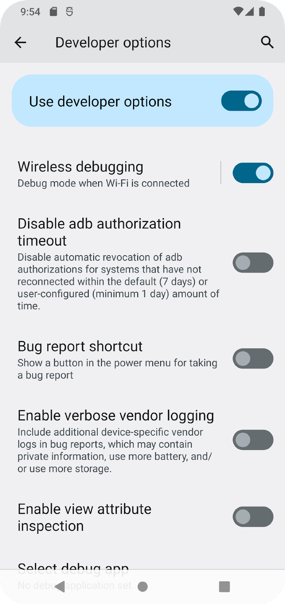

## Содержание

- [Основы Android JetPack](android_jetpack.md)

- [Задачи](incoming_tasks.md)

- [Оформление в стиле Markdown](markdown_styling.md)

- [GITee](gitee.md)

- [Что изучать и как изучать Kotlin/Android](learning_kotlin.md)

- [Android и ESP32](https://www.youtube.com/watch?v=QKGdPJR_tbU&list=PLmjT2NFTgg1c-CQiAdezZpi9RaFmN1n7I).


# Изучаем Kotlin

## Установка

Прежде чем писать программы на языке Kotlin, следует сделать следующие шаги:

1. Устанавить JDK (Java Development Kit) от Oracle по [этой ссылке](https://www.oracle.com/java/technologies/downloads/). Надо будет выбрать дистрибутив JDK в заисимости от системы в которой предполагается писать программы. Установить JDK.

2. Загрузить компилятор для самого языка Kotlin по [этой ссылке](https://github.com/JetBrains/kotlin/releases/latest/). На этой странице в самом низу находим **kotlin-compiler-1.8.22** (цифры могут отличаться) и скачиваем. Дальнейшие действия описаны для систем **Windows**. Разархивируем этот архив. Переносим папку **kotlinc** на диск С:\ - получится адрес **C:\kotlinc**. Далее в системную переменную **PATH** добавляем строку **C:\kotlinc\bin** и перезагружаем компьютер.

Теперь можно начать программировать на языке Kotlin.


```
Пока оставить эти ссылки, позже можно будет удалить, если не понадобятся.
- https://github.com/skeeto/w64devkit/tree/master
- https://www.youtube.com/watch?v=taCJhnBXG_w
- google: --> "mingw minimalist gnu for windows"
```


## Первая программа

Создаём файл с названием **app.kt**. Расширение **kt** - это расширение файлов на языке Kotlin.

В этом файле запишим код:

```
fun main(){
    println("Hello Kotlin")
}
```

Открываем командную строку и вписываем следующую команду:

```
kotlinc app.kt -include-runtime -d app.jar
```

С помощью этой команды компилируем рабочий файл:

- `kotlinc` - запуск компилятора языка Kotlin;
- `app.kt` - имя исходного файла с кодом;
- `-include-runtime` - параметр указывает, что создаваемый файл будет включать среду Kotlin;
- `-d` - параметр указывает, как будет называться создаваесый файл приложения;
- `app.jar` имя выходного файла.

После того, как файл app.jar скомпилировался, запускаем его с помощью следующей команды:

```
java -jar app.jar
```


## Объявление переменных

[Изучайте язык Kotlin](https://developer.android.com/kotlin/learn)

Kotlin использует два разных ключевых слова для объявления переменных: `val` и `var`.

- `val` - используется для переменной, значение которой никогда не меняется (аналог константы). Нельзя переназначить значение переменной, объявленной с помощью `val`.
- `var` - используется для переменной, значение которой может измениться.


```
var count: Int = 10  // присваивание значения переменной count nbgf Int
```
```
var count: Int = 10
count = 15
```

## Диапазоны

[Диапазоны, для прочтения](https://metanit.com/kotlin/tutorial/2.8.php)

Диапазон представляет набор значений или некоторый интервал.

- `..` - диапазон на увеличение;
- `downTo` - диапазон на уменьшение.

```
val range1 =  1..5      // 1 2 3 4 5
val range2 =  5 downTo 1    // 5 4 3 2 1
```

Диапазон необязательно должна представлять числовые данные. Например, это могут быть строки:

```
val range =  "a".."d"
```

Еще одна специальная функция `step` позволяет задать шаг, на который будут изменяться последующие элементы:

```
val range1 = 1..10 step 2           // 1 3 5 7 9
val range2 = 10 downTo 1 step 3     // 10 7 4 1
```

Еще одна функция `until` позволяет не включать верхнюю границу в диапазон:

```
val range1 = 1 until 9          // 1 2 3 4 5 6 7 8
val range2 = 1 until 9 step 2   // 1 3 5 7
```

С помощью специальных операторов можно проверить наличие или отсутствие элементов в диапазоне:

- `in` - возвращает true, если объект имеется в диапазоне

- `!in` - возвращает true, если объект отсутствует в диапазоне

```
fun main() {
 
    val range = 1..5
 
    var isInRange = 5 in range
    println(isInRange)      // true
 
    isInRange = 86 in range
    println(isInRange)      // false
 
    var isNotInRange = 6 !in range
    println(isNotInRange)   // true
 
    isNotInRange = 3 !in range
    println(isNotInRange)   // false
}
```

С помощью цикла `for` можно перебирать диапазон:

```
val range1 = 5 downTo 1 
for(c in range1) print(c)   // 54321
println()
 
val range2 = 'a'..'d'
for(c in range2) print(c)   // abcd
println()
 
for(c in 1..9) print(c)     // 123456789
println()
 
for(c in 1 until 9) print(c)    // 12345678
println()
 
for(c in 1..9 step 2) print(c)  // 13579
```

## Массивы

[Массивы, для прочтения](https://metanit.com/kotlin/tutorial/2.3.php)

В Kotlin **массивы** представлены типом `Array`.

При определении массива после типа `Array` в угловых скобках необходимо указать, объекты какого типа могут храниться в массиве. Например, определим массив целых чисел:

```
val numbers: Array<Int>
```

С помощью встроенной функции `arrayOf()` можно передать набор значений, которые будут составлять массив:

```
val numbers: Array<Int> = arrayOf(1, 2, 3, 4, 5)
```

С помощью индексов мы можем обратиться к определенному элементу в массиве. Индексация начинается с нуля, то есть первый элемент будет иметь индекс 0. Индекс указывается в квадратных скобках:

```
val numbers: Array<Int> = arrayOf(1, 2, 3, 4, 5)
val n = numbers[1]                    // получаем второй элемент  n=2
numbers[2] = 7                        // переустанавливаем третий элемент
println("numbers[2] = ${numbers[2]}") // numbers[2] = 7
```

Также инициализировать массив значениями можно следующим способом:

```
val numbers = Array(3, {5}) // [5, 5, 5]
```


# Работа с Android Studio

- [Создание внешнего вида](creating_appearance.md);

- [Горячие клавиши в Android Studio](#горячие-клавиши)


## Создание проекта

[Создание первого проекта](https://developer.alexanderklimov.ru/android/hellokitty.php).

### Содержание проекта после создания

Проект содержит две основные папки **app** и **Gradle Scripts**:
- папка **app** содержит все необходимые файлы и папки для работы приложения - код, картинки и т.п.
- папка **Gradle Scripts** содержит файлы с различными настройками для управления проектом.

Папка **app** содержит две папки **libs** и **src**.
**libs** должны будут лежать применяемые библиотеки.
**src** содержит три папки: **androidTest**, **main**, **test**. **androidTest** и **test** нужны для тестирования.

Папка **main** содержит файл манифеста **AndroidManifest.xml**, папку с кодом - **java** и папку для ресурсов - **res**. 
Файл манифеста **AndroidManifest.xml** должен содержать все активности, службы, приёмники, контент-провайдеры приложения, разрешения требуемые приложению (доступ к сети и т.д.). **AndroidManifest.xml** можно рассматривать, как описание для развёртывания Android-приложения.
Папка **res** содержит файлы ресурсов, разбытых на отдельные подпапки:
**drawable** и **drawable-v24** - хранят графические ресурсы - картинки и xml-файлы, описывающие цвета и фигуры.
**layout** - содержат xml-файлы, описывающие внешинй вид форм и различных элементов форм. После создания проекта там уже находится файл **activity_main.xml**, который отвечает за внешний вид главного окна приложения.
**mipmap** - папки хранящие значки приложения под разные разрешения экрана.
**values** - тут размещаются строковые ресурсы, цвета, темы, стили и размеры, которые могут использоваться в проекте.

#### AndroidManifest.xml

[Подробное описание про файл AndroidManifest.xml](https://developer.alexanderklimov.ru/android/theory/AndroidManifestXML.php).

**AndroidManifest.xml** предоставляет системе всю основную информацию о программе. Каждое приложение имеет такой файл. Редактировать файл можно как в ручную - изменяя xml-файл, так и через визуальный редактор Manifest Editor (можно редактировать как визуальную так и текстовую часть).

----------

##### Настройки основного графического инструмента

Чтобы показать **системный интерфейс пользователя (Show system UI)** нужно находясь в файле **activity_main.xml** нажать на глаз и выбрать соответствующий пункт

<p align="center">
</p>

##### Добавление картинок в проект.

При разработке програм картинки лучше использовать в формате *.svg (векторные картинки).

Добавить картинку можно найдя в папке **res** папку **drawable** и нажав по ней правой кнопкой мыши и выбрав

<p align="center"></p>

vectorDrawables.useSupportLibrary = true

#### Дизайн основного окна

[Видео по дизайну основного окна](https://www.youtube.com/watch?v=VZDGQ88M5So)

----------

## Горячие клавиши

- `Ctrl + Alt + L` - автоматический рефакторинг кода

- `Ctrl + O` - перезаписать методы (Code -> Override Methods)

- `Ctrl + Alt + O` - оптимизация импорта (Code -> Optimize Imports)

- `Shift + F6` - рефакторинг (замена слова), прежде надо навести на слово, которое нужно редактировать;

- `Alt + Shift + Left/Right arrow` - переклюяение между окнами **Code**, **Split**, **Design** графического редактора **\*.xml** файла.


# Приложения на Android

## Ссылки

- Всё про Android про разработку. [Сайт на Google сайт для разработчика](https://developer.android.com/)

- Как проектировать приложени исходя из дизайна и удобства для пользователя, чтобы он сразу понимал как работает приложение (user friendly). [До разработки приложения под Android](https://developer.android.com/design).

- [Видео курс по теории разработки на Android - Технострим от VK Team](https://www.youtube.com/watch?v=pIj-Gp6COEc).

- Уроки Android Studio с нуля / #1 – Разработка Андроид приложений для начинающих. [Видер курс по Android для начинающих](https://www.youtube.com/watch?v=AfbBTQLxNfE&list=PLDyJYA6aTY1nZqYprT1PKtDFthBcZWAMZ&index=1).

- Краткое описание основ, в том числе про R.*. [Работа с Button и TextView. Обработка событий](https://www.youtube.com/watch?v=BbZCDP6Zs2U&list=PLOjc9X-vV0SE5zvFqIK2fCtyLFzjUYcT7&index=3).

- [Зачем нужен GitHub в Android?](https://www.youtube.com/watch?v=gO38sPL3DMY&list=PLOjc9X-vV0SE5zvFqIK2fCtyLFzjUYcT7&index=4)

- [Зачем нужен Gradle?](https://www.youtube.com/watch?v=yFFGm72wwHQ&list=PLOjc9X-vV0SE5zvFqIK2fCtyLFzjUYcT7&index=6)

- [Service и Exception](https://www.youtube.com/watch?v=LAHheWilKKU&list=PLOjc9X-vV0SE5zvFqIK2fCtyLFzjUYcT7&index=13).

- [AsyncTask. Особенности многопоточности](https://www.youtube.com/watch?v=mVvZiZtJtFc&list=PLOjc9X-vV0SE5zvFqIK2fCtyLFzjUYcT7&index=14).


Все приложения в Android это отдельные процессы.

Приложения на Android состоят из следующих компонентов (записыватются в Manifest.xml):
- Activity
  - Это визуальная часть приложения
  - Точка входа в приложение
- Service
  - Не имеет интерфейса
  - Работает в фоне
- Receiver
  - Системные и пользовательские оповещения
  - Могут быть sticky
- Application
  - Класс приложения чаще всего используется как глобальный синглтон
- Content provider

В Manifest.xml есть ещё такие команды как пермишены (permission), которые нежну для того чтобы выдавать разрешения для работы самого приложения или запрашивать разрешения у системы или пользователя. Например, следующий код запрашивает разрешение на доступ к интернету.
```
    <uses-permission android:name="android.permission.INTERNET" />
```


# Работа с Android

# Содержание

0 [Подключение телефона по безпроводной сети WiFi](#запуск-приложения-на-android-устройстве-с-wi-fi)
1 [Сигналы, сети, частоты. Network](network.md)
2 [Создание первого проекта](#создание-проекта)
2.1 [Содержимое проекта после создания](#содержимое-проекта-после-создания)
3 [Жизненый цикл приложения на Android](#жизненый-цикл-приложения-на-android)
4 [Намерение (Intent)](#намерение-intent)
4.1 [Явные намерения](#явные-намерения)
4.2 [Неявные намерения](#неявные-намерения)
5 [Службы (Service)](#службы-service)
6 [Всплывающие сообщения - Toast](#всплывающие-сообщения---toast)
7 [Работа со string.xml](#работа-со-строками-в-xml-файле-в-android-studio)
8 [Ссылки на статьи и видео](#ссылки-на-статьи-и-видео)


# Запуск приложения на Android-устройстве с Wi-Fi.

Если у вас нет кабеля, вы также можете подключиться и запустить приложение на своем устройстве с помощью Wi-Fi.

### Прежде чем начать

1. Убедитесь, что ваш компьютер и устройство подключены к одной и той же беспроводной сети.
2. Убедитесь, что ваше устройство работает под управлением Android 11 или выше.
3. Убедитесь, что на вашем компьютере установлена ​​последняя версия Android Studio.
4. Убедитесь, что на вашем компьютере установлена ​​последняя версия SDK Platform Tools .

### Соединение устройства

1. В Android Studio выберите **Сопряжение устройств с помощью Wi-Fi** в раскрывающемся меню конфигураций запуска.

<p align="center"></p>

Откроется диалоговое окно **Сопряжение устройств по Wi-Fi**.

<p align="center"></p>

2. Перейдите в **Параметры разработчика**, прокрутите вниз до раздела **Отладка** и включите **Беспроводная отладка**.

<p align="center"></p>

3. В разделе **Разрешить беспроводную отладку в этой сети** во всплывающем окне выберите **Разрешить**.

<p align="center"></p>


4. Если вы хотите связать свое устройство с QR-кодом, выберите **Сопряжение устройства с QR-кодом**, а затем отсканируйте QR-код на своем компьютере. В качестве альтернативы, если вы хотите связать свое устройство с кодом сопряжения, выберите **Сопряжение устройства с кодом сопряжения**, а затем введите 6-значный код.
5. Нажмите **Выполнить**, и вы сможете развернуть приложение на своем устройстве.


## Создание проекта

[Создание первого проекта](https://developer.alexanderklimov.ru/android/hellokitty.php).

### Содержимое проекта после создания

Проект содержит две основные папки **app** и **Gradle Scripts**:
- папка **app** содержит все необходимые файлы и папки для работы приложения - код, картинки и т.п.
- папка **Gradle Scripts** содержит файлы с различными настройками для управления проектом.

Папка **app** содержит две папки **libs** и **src**.
**libs** должны будут лежать применяемые библиотеки.
**src** содержит три папки: **androidTest**, **main**, **test**. **androidTest** и **test** нужны для тестирования.

Папка **main** содержит файл манифеста **AndroidManifest.xml**, папку с кодом - **java** и папку для ресурсов - **res**. 
Файл манифеста **AndroidManifest.xml** должен содержать все активности, службы, приёмники, контент-провайдеры приложения, разрешения требуемые приложению (доступ к сети и т.д.). **AndroidManifest.xml** можно рассматривать, как описание для развёртывания Android-приложения.
Папка **res** содержит файлы ресурсов, разбытых на отдельные подпапки:
**drawable** и **drawable-v24** - хранят графические ресурсы - картинки и xml-файлы, описывающие цвета и фигуры.
**layout** - содержат xml-файлы, описывающие внешинй вид форм и различных элементов форм. После создания проекта там уже находится файл **activity_main.xml**, который отвечает за внешний вид главного окна приложения.
**mipmap** - папки хранящие значки приложения под разные разрешения экрана.
**values** - тут размещаются строковые ресурсы, цвета, темы, стили и размеры, которые могут использоваться в проекте.

#### AndroidManifest.xml

[Подробное описание про файл AndroidManifest.xml](https://developer.alexanderklimov.ru/android/theory/AndroidManifestXML.php).

**AndroidManifest.xml** предоставляет системе всю основную информацию о программе. Каждое приложение имеет такой файл. Редактировать файл можно как в ручную - изменяя xml-файл, так и через визуальный редактор Manifest Editor (можно редактировать как визуальную так и текстовую часть).


Надстрочный <sub>текст</sub> и посдтрочный <sup>текст</sup>.

&nbsp; Просто абзац с коротким отступом

&ensp; Просто абзац с длинным отсутпом


# Жизненый цикл приложения на Android

Почитать подробнее про [жизненный цикл приложения на Android](https://developer.alexanderklimov.ru/android/theory/lifecycle.php?ysclid=liwgy2gn8k734999106 "Сайт Александра Климова: жизненный цикл приложения на Android").

Операции по инициализации, занимающие много времени, **следует выполнять в фоновом процессе**, а не с помощью метода `onCreate()`. В противном случае можно получить диалоговое окно ANR (Application Not Responding, приложение не отвечает).

## Проверка приложения на то, что это первый запуск или оно востановлено

В методе можно сделать проверку, запущено ли приложение впервые или восстановлено из памяти. Если значение переменной `savedInstanceState` будет **null**, приложение запускается первый раз:

```
// Приложение запущено впервые или восстановлено из памяти?
if ( savedInstanceState == null )   // приложение запущено впервые
{
   currentBillTotal = 0.0;    // инициализация суммы счета нулем
   // другой код
} 
else // приложение восстановлено из памяти
{
    // инициализация суммы счета сохранённой в памяти суммой
    currentBillTotal = savedInstanceState.getDouble(BILL_TOTAL);
}
```
А значение переменной `currentBillTotal` можно сохранить в методе `onSaveInstanceState()`:
```
@Override
protected void onSaveInstanceState(Bundle outState) {
	super.onSaveInstanceState(outState);

	outState.putDouble(BILL_TOTAL, currentBillTotal);
}
```

# Намерение (Intent)

Почитать более подробно про [намерение](https://developer.alexanderklimov.ru/android/theory/intent.php).

Намерение (**Intent**) - это механизм для описания одной операции - выбрать фотографию, отправить письмо, сделать звонок, запустить браузер и перейти по указанному адресу. В Android-приложениях многие операции работают через намерения.

Наиболее распространённый сценарий использования намерения - запуск другой активности в своём приложении.

Но это не единственный вариант использования намерения. Также можно использовать для объявления о запуске активности или сервиса, направленных на выполнение каких-либо действий (как правило, речь о работе с определенной частью данных) или для передачи уведомлений о том, что произошло некое событие (или действие).

Намерения могут применяться для трансляции сообщений по системе. Любое приложение способно зарегистрировать широковещательный приёмник и отслеживать эти намерения с возможностью на них реагировать. Это позволяет создавать приложения, использующие событийную модель, в основе которой лежат внутренние, системные или сторонние события, передаваемые внешними программами.

Android транслирует намерения для объявления о системных событиях, например об изменениях в состоянии сетевого подключения или в уровне заряда батареи. Системные приложения в Android, такие как программы дозвона или управления SMS, регистрируют компоненты, отслеживающие заданные намерения, например входящий звонок или получено новое SMS-сообщение, и соответствующим образом реагируют на них.

Сущестуют явные и неявные намерения.

## Явные намерения

```
// Kotlin
val intent = Intent(this@MainActivity, OnStartActivity::class.java)
startActivity(intent)
```
```
// Java
Intent intent = new Intent(MainActivity.this, OnStartActivity.class);
startActivity(intent);
```

Первый параметр – это **Context**. Активность является подклассом **Context**, поэтому мы можем использовать её как `this@MainActivity`(Kotlin), или укороченную запись `this`.

Таким образом, ваше приложение может иметь десять активностей, и вы можете вызвать любую из них, зная её имя класса. Это **явный вызов**, где вы явно указываете имя класса для запуска. После вызова метода создастся новая активность, которая запустится или возобновит свою работу, переместившись на вершину стека активностей.

`startActivity()` - метод используется, когда активность **не возвращает данные** из другой активности.
`startActivityForResult()` - метод используется, когда необходимо **возвращать данные** из другой активности. Этот метод приспособлен для работы с обратными вызовами.

## Неявные намерения

Неявные намерения — это механизм, позволяющий запрашивать анонимные компоненты приложений с помощью действий. Можно попросить систему запустить активность, выполняющую заданное действие, не зная ничего ни о самой активности, ни о её приложении. Например, указывается телефонный номер, но нет понимания того, как будет пользоваться пользователь программой дозвона на своём телефоне. Однако это уже другая проблема, пользователь сам выбирет, как ему звонить по номеру, который ему предоставит разработчик приложения.

Существует также неявный вызов активности. В этом случае при создании намерения используется не имя класса, а указываются параметры **action**, **data**, **category** с определёнными значениями. Система анализирует, что написано и начинает подбирать подходящий вариант для запуска. Например, если в параметрах указан адрес веб-страницы, то следует запустить браузер. Таким образом, комбинация значений в параметрах определяет цель, которую требуется достичь. Это может быть открытие ссылки, отправка письма, набор телефонного номера и т.п.

Создавая новое неявное намерение для передачи в метод `startActivity()`, необходимо назначить действие, которое должно выполниться, а также при желании указать вспомогательный путь **URI** к тем данным, что нужно обработать. Можно также передать дополнительные данные в другую активность, используя параметр намерения **extras**.

При применении этого намерения для запуска активности система во время работы приложения сама найдёт класс компонента, который лучше всего подходит для заданного действия, учитывая указанный тип данных. Это значит, что можно создавать проекты, используя возможности других приложений и не зная при этом, как они называются и какую функциональность предоставляют.

Простой пример создания намерения с предопределённым действием **ACTION_VIEW** для запуска браузера и перехода на нужный адрес:

```
// Kotlin
val address = Uri.parse("http://developer.alexanderklimov.ru")
val openLinkIntent = Intent(Intent.ACTION_VIEW, address)

if (openLinkIntent.resolveActivity(packageManager) != null) {
    startActivity(openlinkIntent)
} else {
    Log.d("Intent", "Не получается обработать намерение!")
}
```
```
// Java
Uri address = Uri.parse("http://developer.alexanderklimov.ru");
Intent openLinkIntent = new Intent(Intent.ACTION_VIEW, address);

if (openLinkIntent.resolveActivity(getPackageManager()) != null) {
    startActivity(openlinkIntent);
} else {
    Log.d("Intent", "Не получается обработать намерение!");
}
```
В данном случае действие **ACTION_VIEW** означает просмотр чего-либо. Здесь указываются нужные данные (адрес), и происходит запуск новой активности (браузера). При этом исходная активность приостанавливается и переходит в фоновый режим. Когда пользователь нажимает на кнопку *Back*, то он возвращается к исходной активности. Обратите внимание, что нигде не указывается конкретная программа-браузер типа Chrome, Opera и т.п.
В каждом случае Android находит соответствующую активность, чтобы ответить на намерение, инициализируя её в случае необходимости.

Приложения могут также создавать свои собственные типы намерений и позволять другим приложениям вызывать


# Службы (Service)

Прочитать подробнее про [службы (service)](https://developer.alexanderklimov.ru/android/theory/services-theory.php "Службы | Service").

Службы (Сервисы) в Android работают как фоновые процессы и представлены классом `android.app.Service`. Они не имеют пользовательского интерфейса и нужны в тех случаях, когда не требуется вмешательства пользователя. Сервисы работают в фоновом режиме, выполняя сетевые запросы к веб-серверу, обрабатывая информацию, запуская уведомления и т.д. Служба может быть запущена и будет продолжать работать до тех пор, пока кто-нибудь не остановит её или пока она не остановит себя сама. Сервисы предназначены для длительного существования, в отличие от активностей. Они могут работать, постоянно перезапускаясь, выполняя постоянные задачи или выполняя задачи, требующие много времени.

Клиентские приложения устанавливают подключение к службам и используют это подключение для взаимодействия со службой. С одной и той же службой могут связываться множество клиентских приложений.

Android даёт службам более высокий приоритет, чем бездействующим активностям, поэтому вероятность того, что они будут завершены из-за нехватки ресурсов, заметно уменьшается. По сути, если система должна преждевременно завершить работу запущенного сервиса, он может быть настроен таким образом, чтобы запускаться повторно, как только станет доступно достаточное количество ресурсов. В крайних случаях прекращение работы сервиса (например, задержка при проигрывании музыки) будет заметно влиять на впечатления пользователя от приложения, и в подобных ситуациях приоритет сервиса может быть повышен до уровня активности, работающей на переднем плане.

Используя сервис, можете быть уверены, что ваши приложения продолжат работать и реагировать на события, даже если они в неактивном состоянии. Для работы службам не нужен отдельный графический интерфейс, как в случае с активностями, но они по-прежнему выполняются в главном потоке хода приложения. Чтобы повысить отзывчивость вашего приложения, нужно уметь переносить трудоёмкие процессы (например, сетевые запросы) в фоновые потоки, используя классы **Thread** и **AsyncTask**.

Службы идеально подходят для проведения постоянных или регулярных операций, а также для обработки событий даже тогда, когда активности вашего приложения невидимы, работают в пассивном режиме или закрыты.

Сервисы запускаются, останавливаются и контролируются из различных компонентов приложения, включая другие сервисы, активности и приёмники широковещательных намерений. Если ваше приложение выполняет задачи, которые не зависят от прямого взаимодействия с пользователем, сервисы могут стать хорошим выбором.

Запущенные сервисы всегда имеют больший приоритет, чем бездействующие или невидимые активности, поэтому менее вероятно, что их работа завершится преждевременно при распределении ресурсов. Единственная причина, почему Android может досрочно остановить Сервис, — выделение дополнительных ресурсов для компонентов, работающих на переднем плане (как правило, для активностей). Если такое случится, ваш сервис автоматически перезапустится, когда будет достаточно доступных ресурсов.

Когда сервис напрямую взаимодействует с пользователем (например, проигрывая музыку), может понадобиться повысить его приоритет до уровня активностей, работающих на переднем плане. Это гарантия того, что сервис завершится только в крайнем случае, но при этом снижается его доступность во время выполнения, мешая управлять ресурсами, что может испортить общее впечатление от приложения.

Приложения, которые регулярно обновляются, но очень редко или нерегулярно взаимодействуют с пользователем, можно назвать первыми кандидатами на реализацию в виде сервисов. Проигрыватели MP3 и приложения, отслеживающие спортивные результаты, — примеры программ, которые должны постоянно работать и обновляться без необходимости отображать активность.


# Всплывающие сообщения - Toast

Прочитать подробнее про [всплывающие сообщения Toast](https://developer.alexanderklimov.ru/android/toast.php).


# Работа со строками в *.xml файле в Android Studio

Здесь можно почитать по подробнее [как работать со string.xml](https://habr.com/ru/articles/133503/ "Работа со строковыми ресурсами Android").

Android позволяет хранить в ресурсах массивы строк. Для этого используется тег string-array, который содержит внутри элементы item с конкретными строками. Вот сокращенный пример из документации Android, который иллюстрирует задание массива.

```
<string-array name="planets_array">
    <item>Earth</item>
    <item>Mars</item>
</string-array>
```

## Символы

& - `&amp;`

< - `&lt;`

' - `\'` или `&apos;`
'' - `\"` или `$quot;`


# Описание методов и классов, сокращения

`ANR` - (Application Not Responding, приложение не отвечает).

`Bundle` - объект, содержащий состояние пользовательского интерфейса, сохранённое в последнем вызове обработчика `onSaveInstanceState`.

`onCreate()` - (при создании) вызывается при создании или при перезапуске активности. Внутри данного метода настраиваются статический интрефейс активности, инициализируют статические данные активности, связывают данные со списками, связывают данные с ресурсами и т.д.

`savedInstanceState` - (сохранённое состояние экземпляра) - переменная в которой содержится значение, указывающее на то, что приложение запущенно впервые или нет. `null` будет означать что это первый запуск приложения.

`setContentView` - (установить вид содержимого)

# CICD для Android

Тут можно почитать про то, [как настроить Gitlab CI/CD для Android и Firebase App Distribution для доставки сборок](https://habr.com/ru/companies/doubletapp/articles/712490/)


-----------

# Входящие задачи:

### 2023-06-08

1. Изучить код написанный на Java и Kotlin.
2. Изучить код MobileSwitcher.
3. Порешать задачки с leetcode (на дом).
4. Жизненный цикл приложения. Сервисы. Потоки.
5. Паттерны проектирования. MVVM.
6. SOLID
7. Внутренний экзамен по сетям:
- Сетевые модели
- Типы сетевого оборудования
- Маршрутизация
- Маски подсетей
- Client-server
  - HTTP
    - типы запросов
    - структура запроса
    - коды и структура ответа
  - json, xml...
  - REST

### 2023-06-09

1. Разобрать следующие темы: намерение (Intent), служба (Service).
2. Поучиться работать с Bluetooth и Wi-Fi технологией с помощью телефона и Arduino, ESP.


# DevOps Ссылки

Обзорная система мониторинга на [Prometheus и Grafana](https://habr.com/ru/companies/doubletapp/articles/736602/).

# Создание шрифта

[Создание шрифта](https://habr.com/ru/companies/doubletapp/articles/728122/)


# Ссылки на статьи и видео:

## Kotlin

- Видео по основам языка Kotlin: 
  - [Курс по Kotlin и Android Studio для начинающих](https://www.youtube.com/watch?v=-V8bDVhob3g&list=PLmjT2NFTgg1fdHN-9Wn4XYr-IOuadxMm5 "Курс по KOTLIN и ANDROID STUDIO для начинающих || Установка Android Studio")

- Видео о том как работать с SQLite на Android:
  - [SQLite для Android](https://www.youtube.com/watch?v=23sm4HSdDfI "Room. SQLite для Android. Часть 1. [Ru, Kotlin\Android]")

## Android

- Видео о том как сделать переключатель включения/выключения для Wi-Fi в Android studio и переключать его, включая/выключая модуль Wi-Fi. [How to Switch Wifi in Android Studio](https://www.youtube.com/watch?v=YstdK1XElbc "How to Switch Wifi in Android Studio | SwitchWifi | Android Coding")

- Видео о том как создавать панель приборов - *dashboard*:
  - [Dashboard UI Design](https://www.youtube.com/watch?v=ZjAxAw0kmrY "Android Dashboard UI Design With Dark Mode | Android Studio")
  - [Create a Crypto App UI Design](https://www.youtube.com/watch?v=xCYS6tO0SLA "Cryptocurrency Android Studio - Create a Crypto App UI Design Tutorial 2023")
  - [Modern Dashboard UI Design Android IOS](https://www.youtube.com/watch?v=IJsEnI4sjZE "Modern UI design | Modern Dashboard UI Design Android IOS | Design with basics for beginners #7")
  - [Android Material Design UI](https://www.youtube.com/watch?v=MTc1cYqI8IM "Android Studio Tutorial - Android Material Design UI no102")

## Внешний вид - красивости

- Видео о том как сделать градиент у фона:
  - [Create Gradient Background](https://www.youtube.com/watch?v=OQ2_SDRdn4M "Android Studio Create Gradient Background For Beginners")

- Видео о том как сделать тёмную тему для приложения:
  - [How to use new Dark them implementation features with android 10 and later](https://www.youtube.com/watch?v=GGNO6SahhS0 "How to use new Dark them implementation features with android 10 and later | Android studio tutorial")

- Видео о том как сделать кнопку - *button*:
  - [Custom Button Design](https://www.youtube.com/watch?v=iuSYfPT2e9o&list=PL1J_hr6JDd0gR1WE_E7aHEH6PdcKHi27F "Custom Button Design || Android studio tutorial")

- Видео о том как сделать нестандартные поля ввода текста - *EditText*:
  - [Create Coustom EditText](https://www.youtube.com/watch?v=LAhMZW8hSIg&list=PL1J_hr6JDd0gR1WE_E7aHEH6PdcKHi27F&index=3 "Create Coustom EditText - Android studio tutorial (2020)")

- Видео о том как сделать радиокнопки - *radiobutton*:
  - [Create Custom Radio Button in android](https://www.youtube.com/watch?v=EyRwTSsFQUo&list=PL1J_hr6JDd0gR1WE_E7aHEH6PdcKHi27F&index=3 "Create Custom Radio Button in android || Android studio tutorial")

- Видео о том как сделать переключатель *switch* в Android studio:
  - [Create Custom Switch in android](https://www.youtube.com/watch?v=xO3NrDMs34g "Create Custom Switch in android || Android studio tutorial")
  - [Customize Switch Buttons in Android Studio](https://www.youtube.com/watch?v=5xMPLe1gnOA "Android Custom Switch Button | Customize Switch Buttons in Android Studio | Background and Thumb")

- Видео о том как сделать слайдер - *seekbar* (как при изменении яркости):
  - [How to control screen brightness using seekbar in android](https://www.youtube.com/watch?v=sdSnKsSksyI "How to control screen brightness using seekbar in android || Android studio tutorial")

- Видео о том как сделать круговой индикатор прогресса - *progressbar*:
  - [Create custom Circular ProgressBar in android studo](https://www.youtube.com/watch?v=Q7w38NdXnoI "Create custom Circular ProgressBar in android studo || Android studio tutorial")
  - [Circular Determinate ProgressBar with Background and Text](https://www.youtube.com/watch?v=YsHHXg1vbcc "Circular Determinate ProgressBar with Background and Text - Android Studio Tutorial")
  - [Android Circular Progress Indicator + Draggable Circular Slider](https://www.youtube.com/watch?v=1xz9zCqVC40 "Android Circular Progress Indicator + Draggable Circular Slider in Jetpack Compose - Android Studio")

- Видео о том как создавать диалоговые окна оповещения - *alert dilog*:
  - [Android Custom Alert Dialog | Android Studio | Java](https://www.youtube.com/watch?v=3cJ9eia49w4 "Android Custom Alert Dialog | Android Studio | Java")


