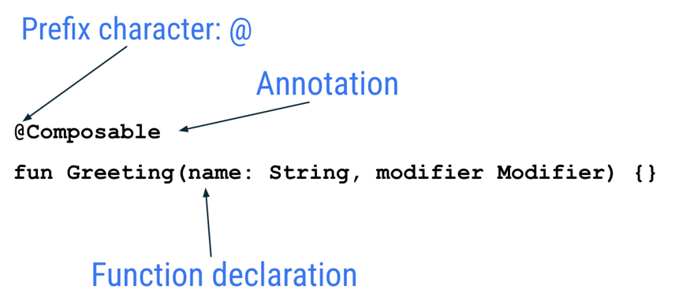

[Основная страница](README.md)

# Основы Jetpack Compose

Jetpack Compose — это современный набор инструментов для создания пользовательского интерфейса Android. Compose упрощает и ускоряет разработку пользовательского интерфейса на Android с меньшим количеством кода, мощными инструментами и интуитивно понятными возможностями Kotlin. С Compose вы можете создать свой пользовательский интерфейс, определив набор функций, называемых составными функциями, которые принимают данные и создают элементы пользовательского интерфейса.

## Составные функции

Составные функции — это основной строительный блок пользовательского интерфейса в Compose. Составная функция:

- Описывает часть вашего пользовательского интерфейса.
- Ничего не возвращает.
- Принимает некоторый ввод и генерирует то, что показано на экране.
- Может создавать несколько элементов пользовательского интерфейса.

## Аннотации
Аннотации — это средства добавления дополнительной информации к коду. Эта информация помогает таким инструментам, как компилятор Jetpack Compose, и другим разработчикам понимать код приложения.

Аннотация применяется путем префикса ее имени (аннотации) с символом @в начале объявления, которое вы аннотируете. Аннотировать можно различные элементы кода, включая свойства, функции и классы. Позже в курсе вы узнаете о классах.

Следующая диаграмма является примером аннотированной функции:

<p align="center">
</p>

В следующем фрагменте кода приведены примеры аннотированных свойств. Вы будете использовать их в следующих лабораториях кода.

```
// Example code, do not copy it over

@Json
val imgSrcUrl: String

@Volatile
private var INSTANCE: AppDatabase? = null
```

Можно передать несколько параметров в аннотацию, как показано здесь.

```
@Preview(
    showBackground = true,
    showSystemUi = true,
    name = "My Preview"
)
@Composable
fun GreetingPreview() {
    HappyBirthdayTheme {
        Greeting("Android")
   }
}
```


Посмотрите на представление кода файла **MainActivity.kt**. Обратите внимание, что в этом коде есть некоторые автоматически сгенерированные функции, в частности функции `onCreate()` и `setContent()`:

```
class MainActivity : ComponentActivity() {
   override fun onCreate(savedInstanceState: Bundle?) {
       super.onCreate(savedInstanceState)
       setContent {
           GreetingCardTheme {
               // A surface container using the 'background' color from the theme
               Surface(
                   modifier = Modifier.fillMaxSize(),
                   color = MaterialTheme.colors.background
               ) {
                   Greeting("Android")
               }
           }
       }
   }
}
```

Функция `onCreate()` является точкой входа в это приложение для Android и вызывает другие функции для создания пользовательского интерфейса. В программах на Kotlin функция `main()` является точкой входа/начала выполнения. В приложениях для Android эту роль выполняет функция `onCreate()`.

Функция `setContent()` внутри `onCreate()` используется для определения вашего макета с помощью компонуемых функций. Все функции, отмеченные аннотацией, `@Composable` могут быть вызваны из функции `setContent()` или из других составных функций. Аннотация сообщает компилятору Kotlin, что эта функция используется Jetpack Compose для создания пользовательского интерфейса.

Далее смотрим на `Greeting()` функцию. Функция `Greeting()` является составной функцией, обратите внимание на аннотацию `@Composable` над ней. Эта функция Composable принимает некоторые входные данные и генерирует то, что отображается на экране.

```
@Composable
fun Greeting(name: String, modifier: Modifier = Modifier) {
    Text(text = "Hello $name!")
}
```

Компонуемые функции отличаются от стандартных функций:

- Добавляется `@Composable` аннотация перед функцией.
- Имена функций `@Composable` пишутся с заглавной буквы.
- `@Composable` функции ничего не возвращают.

`GreetingPreview()` это функция, которая позволяет вам увидеть, как выглядит ваш компонуемый объект, без необходимости создавать всё приложение. Можно включить предварительный просмотр составного объекта, при этом он должен быть аннотирован с помощью `@Composable` и `@Preview`. Аннотация `@Preview` сообщает Android Studio, что этот компонуемый объект должен отображаться в режиме конструктора этого файла.

```
@Preview(showBackground = true)
@Composable
fun GreetingPreview() {
    GreetingCardTheme {
        Greeting("Meghan")
   }
}
```

`@Preview` аннотация принимает параметр с именем `showBackground`. Если `showBackground` установлено значение `true`, он добавит фон к вашему составному предварительному просмотру.

**Установка цвета фона**

Чтобы установить другой цвет фона для вступления, вам нужно окружить текст расширением `Surface`. A `Surface` — это контейнер, представляющий раздел пользовательского интерфейса, внешний вид которого можно изменить, например цвет фона или границу.

```
@Composable
fun Greeting(name: String, modifier: Modifier = Modifier) {
    Surface(color = Color.Cyan) {
        Text(
            text = "Hi, my name is $name!",
            modifier = modifier
        )
    }
}
```

**Установка отступов по краям**

`Modifier` используется для увеличения или украшения составного объекта. Один из модификаторов, который вы можете использовать это `padding` модификатор, который добавляет пространство возле элемента (в данном случае добавляет пространство вокруг текста). Это достигается с помощью функции `Modifier.padding()`.

```
package ru.mech.firstjetpack

import android.os.Bundle
import androidx.activity.ComponentActivity
import androidx.activity.compose.setContent
import androidx.compose.foundation.layout.fillMaxSize
import androidx.compose.foundation.layout.padding
import androidx.compose.material3.MaterialTheme
import androidx.compose.material3.Surface
import androidx.compose.material3.Text
import androidx.compose.runtime.Composable
import androidx.compose.ui.Modifier
import androidx.compose.ui.graphics.Color
import androidx.compose.ui.tooling.preview.Preview
import androidx.compose.ui.unit.dp
import ru.mech.firstjetpack.ui.theme.FirstJetPackTheme

class MainActivity : ComponentActivity() {
    override fun onCreate(savedInstanceState: Bundle?) {
        super.onCreate(savedInstanceState)
        setContent {
            FirstJetPackTheme {
                // A surface container using the 'background' color from the theme
                Surface(
                    modifier = Modifier.fillMaxSize(),
                    color = MaterialTheme.colorScheme.background
                ) {
                    Greeting("Android")
                }
            }
        }
    }
}

@Composable
fun Greeting(name: String, modifier: Modifier = Modifier) {
    Surface(color = Color.Cyan) {
        Text(
            text = "Hi, my name is $name!",
            modifier = modifier.padding(12.dp)
        )
    }
}

@Preview(showBackground = true)
@Composable
fun GreetingPreview() {
    FirstJetPackTheme {
        Greeting("Roman")
    }
}
```


