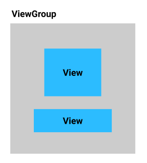
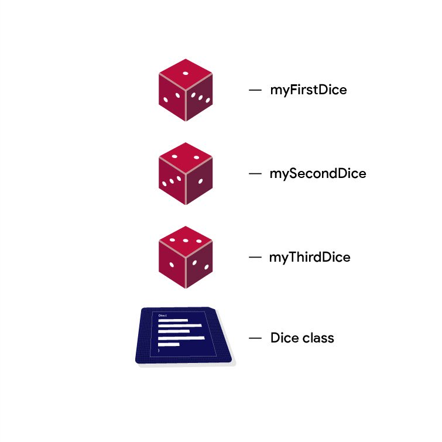
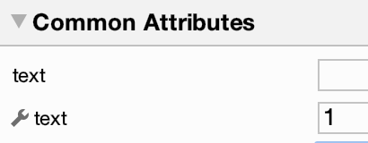
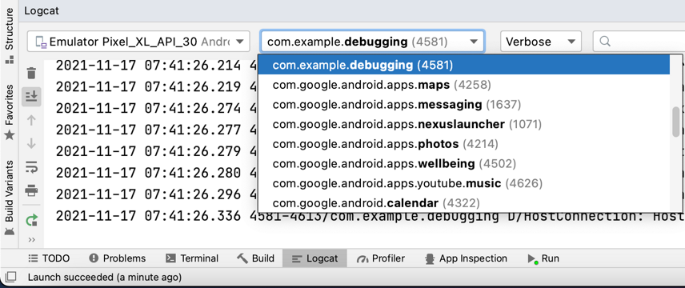

[Основная страница](README.md)

# Теория и практика по Android

[Kotlin style guide](https://developer.android.com/kotlin/style-guide)

[Вся документация здесь:](https://developer.android.com/reference)

- [ConstraintLayout](https://developer.android.com/reference/androidx/constraintlayout/widget/ConstraintLayout)

[О том как работать в Android Studio c Views](https://developer.android.com/studio/write/layout-editor), здесь можно прочитать о том как настраивать интерфейс пользователя приложения.

## О пользовательских интерфейсах

[На основе урока](https://developer.android.com/courses/pathways/android-basics-kotlin-three#codelab-https://developer.android.com/codelabs/basic-android-kotlin-training-birthday-card-app).

**Пользовательский интерфейс** (UI) приложения — это то, что вы видите на экране: текст, изображения, кнопки и многие другие типы элементов. Это то, как приложение показывает что-то пользователю и как пользователь взаимодействует с приложением.

Каждый из этих элементов называется файлом `View`. Почти все, что вы видите на экране своего приложения, является файлом `View`. `Views` может быть интерактивным, например, нажимаемая кнопка или редактируемое поле ввода.

В этой части кода вы будете работать с типом `TextView`, который предназначен для отображения текста.

`Views` не просто плавают на экране сами по себе, они имеют зависимости друг с другу. Например, рядом с текстом может быть изображение, а кнопки могут образовывать ряд. Чтобы правильно организовать `Views`, желательно помещать их в контейнеры. `ViewGroup` — это контейнер, в котором могут находиться объекты `View`, и он отвечает за организацию `Views` внутри него. Расположение или макет может меняться в зависимости от размера и соотношения сторон экрана устройства Android, на котором запущено приложение, а макет может адаптироваться к тому, находится ли устройство в книжной или альбомной ориентации.

Одним из видов `ViewGroup` является `ConstraintLayout`, который помогает организовать `Views` внутри него различными образами.

<p align="center">
</p>

## Размерности пкселей, текста и т.п.

Элементы пользовательского интерфейса в приложениях для Android используют две разные единицы измерения:

- **dp** (density-independent pixels - независимые от плотности пиксели) — это единица измерения расстояний на экране.
- **sp** (scalable pixels - масштабируемые пиксели) — это единица измерения размера шрифта, используются при настройке размера текста. 

По умолчанию **sp** имеет тот же размер, что и **dp**, но изменяется в зависимости от предпочтительного размера текста пользователя.

## Резюме

- Редактор макетов **Layout Editor** поможет вам создать пользовательский интерфейс для вашего приложения для Android, добавить и упорядочить изображения и другие ресурсы.
- Почти всё что вы видите на экране своего приложения, является `View`.
- `TextView` — это элемент пользовательского интерфейса для отображения текста в вашем приложении.
- `ConstraintLayout` — это контейнер для других элементов пользовательского интерфейса.
- `Views` должны быть ограничены по горизонтали и вертикали в пределах контейнера `ConstraintLayout`.
- `View` можно позиционировать с помощью `margin`.
- Поля `margin` говорят, как далеко `View` находится от края контейнера, в котором он находится.
- Можно установить такие атрибуты `TextView` как шрифт, размер текста и цвет.
- `ImageView` — это элемент пользовательского интерфейса для отображения изображений в вашем приложении.
- `ImageViews` должно иметь описание контента, чтобы сделать ваше приложение более доступным.
Текст, который показывается пользователю, должен быть извлечен в строковый ресурс, чтобы упростить перевод вашего приложения на другие языки.

## Создание класса

Здесь создаётся класс который содержит основные свойства игральной кости (класс будет называться **Dice**). 

Класс похож на план(чертёж) архитектора, который не является домом. Класс больше похож на инструкции о том, как построить дом. А сам дом это реальная вещь или **экземпляр объекта**, созданный по чертежу.

Организация всего что касается игральных костей в класс, называется *инкапсуляцией*. Инкапсуляция — это означает, что вы можете заключить функциональность, которая логически связана, в одном месте.

### Определение класса Dice

>- Подобно использованию `fun` ключевого слова в Kotlin для создания новой функции, используйте `class` ключевое слово для создания нового класса.
>- Вы можете выбрать любое имя для `class`, но полезно если имя указывает то что представляет класс. По соглашению имя класса записывается в верхнем верблюжьем регистре. Например: `Car`, `ParkingMeter`, и `CustomerRecord` являются допустимыми именами классов и вы можете догадаться что они представляют.

```
class Dice {
    var sides = 6
}
```

### Создание эеземпляра класса Dice

С этим `Dice` классом у вас есть план того, что такое кости. Чтобы в вашей программе была настоящая игральная кость, вам нужно создать `Dice` **экземпляр объекта**. А если бы вам нужно было три кубика, вы бы создали три экземпляра объекта.

<p align="center">
</p>

Чтобы создать экземпляр объекта `Dice` в `main()` функции, создайте вызываемый объект `myFirstDice` типа  `val` и инициализируйте его как экземпляр класса `Dice`. Обратите внимание на круглые скобки после имени класса, которые означают, что вы создаете новый экземпляр объекта из класса.

```
fun main() {
    val myFirstDice = Dice()
}
```

Теперь, когда у вас есть `myFirstDice` объект, созданный по чертежу `Dice`, вы можете получить доступ к его свойствам. Единственным свойством `Dice` является `sides`. Вы получаете доступ к свойству, используя *точечную нотацию*. Итак, чтобы получить доступ к свойству `sides` объекта `myFirstDice`, нужно вызвать `myFirstDice.sides`, что произносится как «myFirstDice точка sides».

```
println(myFirstDice.sides)
```

> Вы использовали запись через точку ранее при вызове `diceRange.random()`. Обобщенно, вы можете думать о точечной нотации как о выражении «над чем-то - точка - выполнить действие». А здесь например, `myFirstDice.sides` - «в экземпляре `myFirstDice` получить `sides` свойство».

В итоге код должен выглядеть так

```
fun main() {
    val myFirstDice = Dice()
    println(myFirstDice.sides)
}

class Dice {
    var sides = 6
}
```

### Сделать бросок костей

Так как все кости можно бросать, вы можете добавить функцию для этого внутри `Dice` класса. Функция, определенная внутри класса, также называется **методом**.

> Вы можете назвать этот метод как угодно, но полезно дать ему имя, указывающее, какое действие он выполняет. Соглашение об именах функций и методов заключается в том, чтобы начинать со строчной буквы, использовать верблюжий регистр и начинать с глагола действия, если это возможно.

```
fun main() {
    val myFirstDice = Dice()
    println(myFirstDice.sides)
    myFirstDice.roll()
}

class Dice {
    var sides = 6

    fun roll() {
        val randomNumber = (1..6).random()
        println(randomNumber)
    }
}
```

> Изменение кода с целью сделать его короче, эффективнее или легче для чтения и понимания называется рефакторингом . Это похоже на написание документа: вы пишете первый черновик, содержащий всю информацию, а затем редактируете и уточняете свои слова.

```
fun main() {
    val myFirstDice = Dice(6)
    println("Your ${myFirstDice.numSides} sided dice rolled ${myFirstDice.roll()}!")
    
    val mySecondDice = Dice(20)
    println("Your ${mySecondDice.numSides} sided dice rolled ${mySecondDice.roll()}!")
}

class Dice (val numSides: Int) {

    fun roll(): Int {
        return (1..numSides).random()
    }
}
```

## Резюме

- Вызовите `random()` функцию для `IntRange` генерации случайного числа: `(1..6).random()`
- Классы подобны чертежу объекта. Они могут иметь свойства и поведение, реализованные в виде переменных и функций.
- Экземпляр класса представляет объект, часто физический объект, например игральную кость. Вы можете вызывать действия над объектом и изменять его атрибуты.
- Вы можете указать значения для класса при создании экземпляра. Например: `class Dice(val numSides: Int)`, а затем создайте экземпляр с расширением `Dice(6)`.
- Функции могут что-то возвращать. Укажите тип возвращаемых данных в определении функции и используйте инструкцию `return` в теле функции, чтобы что-то вернуть. Например: `fun example(): Int { return 5 }`

### Стиль TextView

Иногда нужно чтобы в начале запуска приложения в поле `TextView` ничего не отображалось, для этого просто можно стереть весь текст в атрибуте `text`. Однако при этом не будет видно где располагается поле `TextView`, а при разработке приложения удобно работать когда в поле есть значение и его видно. Чтобы решить этот вопрос нужно в разделе **Common Attributes** найти текстовый атрибут со значком инструмента. В атрибуте с инструментом можно ввести значение которое будет видно при разработке приложения, но не будет видно в момент запуска приложения.

<p align="center">
</p>

## Введение в активность (Activity)

Ранее вы узнали, что каждая программа на Kotlin должна иметь `main()` функцию. Приложения для Android работают иначе. Вместо вызова функции `main()` система Android вызывает метод `onCreate()` класса `MainActivity`, когда ваше приложение открывается в первый раз.

```
package com.example.diceroller

import androidx.appcompat.app.AppCompatActivity
import android.os.Bundle

class MainActivity : AppCompatActivity() {

   override fun onCreate(savedInstanceState: Bundle?) {
       super.onCreate(savedInstanceState)
       setContentView(R.layout.activity_main)
   }
}
```

Вы узнаете об `override` позже. Остальная часть метода `onCreate()` настраивает `MainActivity` с помощью кода из импорта и установки начального макета с расширением `setContentView()`.

Android предоставляет структуру из многочисленных классов, упрощающих написание приложений для Android, но необходимо точно знать какой класс вы имеете в виду. Вы можете указать, какой класс использовать в вашем коде, используя инструкцию `import`. Например, класс `Button` определен в `android.widget.Button`.

### Отображение сообщения при нажатии кнопки

```
val rollButton: Button = findViewById(R.id.button)
```

Метод `findViewById()` находит `Button` в макете. `R.id.button` — это идентификатор ресурса для `Button`, который является его уникальным идентификатором.

Код сохраняет ссылку на `Button` объект в переменной с именем `rollButton`, а не сам объект `Button`.

> При присвоении объекта переменной Kotlin не копирует каждый раз весь объект, а сохраняет ссылку на объект. Вы можете придумать ссылку, аналогичную ИНН; число относится к человеку, но не к самому человеку. Когда вы копируете номер, вы не копируете человека.

Затем вам нужно связать код с `Button`, чтобы код мог выполняться при нажатии на `Button`. Прослушиватель кликов — это некий код, определяющий, что делать, когда происходит касание или щелчок. Вы можете думать об этом как о коде, который просто сидит «прислушиваясь», когда пользователь щёлкнет, в данном случае, на `Button`.

Используйте объект `rollButton` и установите для него прослушиватель кликов, вызвав метод `setOnClickListener()`. Вместо круглых скобок после имени метода, вы будете использовать фигурные скобки. Это специальный синтаксис для объявления Lambda выражений, о которых вы узнаете в будущей.

```
rollButton.setOnClickListener {

}
```

Что вам нужно знать на данный момент, так это то, что в фигурных скобках вы указываете, что должно произойти при нажатии кнопки. Ваше приложение отобразит всплывающее уведомление, которое представляет собой краткое сообщение на следующем шаге.

Внутри фигурных скобок вы указываете, что должно произойти при нажатии кнопки. На данный момент приложение будет отображать краткое сообщение `Toast`, которое отображается пользователю.

Создём краткое сообщение `Toast` с текстом `"Dice Rolled!"`, вызвав `Toast.makeText()`.

```
val toast = Toast.makeText(this, "Dice Rolled!", Toast.LENGTH_SHORT)
```

Указываем `Toast` отображать себя, вызвав метод `show()`.

```
toast.show()
```

Вот как MainActivity выглядит обновленный класс. Операторы `package` и `import` по-прежнему находятся в верхней части файла:

```
class MainActivity : AppCompatActivity() {

   override fun onCreate(savedInstanceState: Bundle?) {
       super.onCreate(savedInstanceState)
       setContentView(R.layout.activity_main)

       val rollButton: Button = findViewById(R.id.button)
       rollButton.setOnClickListener {
           val toast = Toast.makeText(this, "Dice Rolled!", Toast.LENGTH_SHORT)
           toast.show()
       }
   }
}
```

Вы можете объединить две строки в прослушивателе кликов в одну строку без переменной. Это распространенный шаблон, который вы можете найти в другом коде.

```
Toast.makeText(this, "Dice Rolled!", Toast.LENGTH_SHORT).show()
```

## Условный оператор if-else

```
fun main() {
    val num = 4
    if (num > 4) {
        println("The variable is greater than 4")
    } else if (num == 4) {
        println("The variable is equal to 4")
    } else {
        println("The variable is less than 4")
    }
}

-----------------------------

The variable is equal to 4
```

```
fun main() {
    val myFirstDice = Dice(6)
    val rollResult = myFirstDice.roll()
    val luckyNumber = 4
    if (rollResult == luckyNumber) {
        println("You win!")
    } else if (rollResult == 1) {
        println("So sorry! You rolled a 1. Try again!")
    } else if (rollResult == 2) {
        println("Sadly, you rolled a 2. Try again!")
    } else if (rollResult == 3) {
        println("Unfortunately, you rolled a 3. Try again!")
    } else if (rollResult == 5) {
        println("Don't cry! You rolled a 5. Try again!")
    } else if (rollResult == 6) {
        println("Apologies! You rolled a 6. Try again!")
    }
}

class Dice(val numSides: Int) {
    fun roll(): Int {
        return (1..numSides).random()
    }
}
// Ниже написан аналогичный код с помощью оператора when - аналог switch
```
## Оператор when аналог switch

Можно прочитать как: Если `rollResult` равен `luckyNumber`, то напечатать сообщение `"You win!"`

```
// Выше написан аналогичный код с помощью оператора if-else

fun main() {
    val myFirstDice = Dice(6)
    val rollResult = myFirstDice.roll()
    val luckyNumber = 4

    when (rollResult) {
        luckyNumber -> println("You won!")
        1 -> println("So sorry! You rolled a 1. Try again!")
        2 -> println("Sadly, you rolled a 2. Try again!")
        3 -> println("Unfortunately, you rolled a 3. Try again!")
        5 -> println("Don't cry! You rolled a 5. Try again!")
        6 -> println("Apologies! You rolled a 6. Try again!")
    }
}

class Dice(val numSides: Int) {
    fun roll(): Int {
        return (1..numSides).random()
    }
}
```

## Модульные тесты

**Почему тестирование важно?**

Сначала может показаться, что вам не нужны тесты в вашем приложении. Когда ваше приложение небольшое и имеет ограниченную функциональность, его легко протестировать вручную и определить, все ли работает правильно. Однако по мере роста вашего приложения ручное тестирование требует гораздо больше усилий, чем написание автоматических тестов. Кроме того, когда вы начинаете работать над приложениями профессионального уровня, тестирование становится критически важным, если у вас большая пользовательская база. Вы должны учитывать множество различных типов устройств, работающих под управлением различных версий Android. В конце концов, вы достигаете точки, когда автоматизированные тесты могут учитывать большинство сценариев использования значительно быстрее, чем ручные тесты. Когда вы запускаете тесты перед выпуском нового кода, вы можете внести изменения в существующий код, чтобы избежать выпуска приложения с неожиданным поведением. Помните, что автоматические тесты — это тесты, выполняемые с помощью программного обеспечения, в отличие от ручных тестов, которые выполняются человеком, непосредственно взаимодействующим с устройством. Автоматизированное тестирование и ручное тестирование играют решающую роль в обеспечении приятного опыта пользователей вашего продукта. Однако автоматические тесты могут быть более точными и оптимизируют производительность вашей команды, поскольку для их запуска не требуется человек, и они могут быть выполнены намного быстрее, чем ручное тестирование.

В файле **app -> build.gradle** можно посмотреть все зависимости. Вы увидите некоторые зависимости, отмеченные как `testImplementation` и `androidTestImplementation`, которые соответствуют **модульным** и **инструментальным тестам** соответственно.

```
testImplementation 'junit:junit:4.12'
```

`JUnit` это библиотека, которая управляет вашими модульными тестами и позволяет помечать код как тест, чтобы его можно было скомпилировать и запустить таким образом, чтобы он мог тестировать код приложения.

Модульные тесты лежат в каталоге **app -> src -> test** в файле `ExampleUnitTest.kt`.

```
class ExampleUnitTest {
   @Test
   fun addition_isCorrect() {
       assertEquals(4, 2 + 2)
   }
}
```

Там есть код, который автоматически создается Android Studio. Это произвольный тест, который служит заполнителем для более релевантных тестов, которые, как ожидается, напишет разработчик. В настоящее время этот блок кода только проверяет, что 2 + 2 = 4. Конечно, это всегда верно. Посмотрите внимательнее на происходящее:

- Сначала тестовые функции должны быть аннотированы аннотацией, `@Test` импортированной из библиотеки `org.junit.test`. Вы можете думать об аннотации как о тегах метаданных для части кода, которые могут изменить способ компиляции кода. В этом случае аннотация `@Test` сообщает компилятору, что следующий метод является тестом, что позволяет ему выполняться как таковой.

- После аннотации у вас есть объявление функции, в данном случае функция `addition_isCorrect()`. Внутри функции функция `assertEquals()`, которая утверждает, что ожидаемое значение должно равняться фактическому значению, полученному с помощью бизнес-логики. Методы утверждения являются конечной целью модульного теста. В конечном счёте, вы хотите утверждать, что результат, полученный из вашего кода, находится в определенном состоянии. Если состояние результата соответствует ожидаемому состоянию, тест считается пройденным. Если состояние результата не соответствует ожидаемому состоянию, тест считается неудачным. 

В этом случае код сравнивает два значения, поэтому метод `assertEquals()` принимает два параметра — ожидаемое значение и фактическое значение. Как следует из названия, ожидаемое значение — это то, что вы ожидаете от определенного результата, в данном случае `4`. Фактическое значение представляет собой результат фактического фрагмента кода. Как правило, это тестируемая часть кода из самого приложения. В данном случае это всего лишь произвольный фрагмент кода, например, `2 + 2`.

> В библиотеке много утверждений `JUnit`. Вот некоторые распространенные утверждения, с которыми вы можете столкнуться:
>
>- assertEquals()
>- assertNotEquals()
>- assertThat()
>- assertTrue()
>- assertFalse()
>- assertNull()
>- assertNotNull()
>
>Больше информации смотреть здесь [Assert](https://developer.android.com/reference/junit/framework/Assert "https://developer.android.com/reference/junit/framework/Assert").

## Введение в отладку

На предыдущих уроках вы использовали инструкцию `println()` для вывода текста. В приложении для Android лучше всего вести журнал выходных данных с помощью класса `Log`. Существует несколько функций для протоколирования выходных данных в форме:

- `Log.v()`,
- `Log.d()`,
- `Log.i()`,
- `Log.w()`,
- `Log.e()` - ОШИБКА. 

Эти методы принимают два параметра: 
- первый, называемый «тегом», представляет собой строку, идентифицирующую источник сообщения журнала (например, имя класса, который записал текст).
- второй - это фактическое сообщение журнала.

|Запись в коде|Краткое наименование|Уровень журнала|Описание|
|---|---|---|---|
|`Log.e()`|ERROR|ОШИБКА|Журналы ERROR сообщают, что что-то пошло не так, например, причина сбоя приложения.|
|`Log.w()`|WARN|ПРЕДУПРЕЖДЕНИЕ|Журналы WARN менее серьёзны, чем ошибки, но всё же сообщают о том, что следует исправить, чтобы избежать более серьёзной ошибки. Например, если вы вызываете устаревшую функцию, это означает, что её использование не рекомендуется в пользу более новой альтернативы.|
|`Log.i()`|INFO|ИНФОРМАЦИЯ|Журналы INFO предоставляют полезную информацию, например об успешном завершении операции.|
|`Log.d()`|DEBUG|ОТЛАДКА|Журналы DEBUG содержат информацию, которая может быть полезна при расследовании проблемы. Этих журналов нет в релизных сборках, таких как те, которые вы публикуете в Google Play Store.|
|`Log.v()`|VERBOSE|ПОДРОБНО|Как следует из названия, verbose — это наименее конкретный уровень ведения журнала. Считается журналом отладки, а не подробным журналом, немного субъективно, но, как правило, подробный журнал — это то, что можно удалить после реализации функции, тогда как журнал отладки все ещё может быть полезен для отладки. Эти журналы также не включаются в релизные сборки.|

> **Забавный факт**: на самом деле существует еще один уровень журнала, `Log.wtf()` (какой ужасный сбой), который существует для регистрации событий, которые, как вы уверены, никогда не произойдут, отсюда и название. Эти журналы `ASSERT` уровня, уровень журнала выше `ERROR`.

Выполните следующие шаги, чтобы начать использовать ведение журнала в пустом проекте:

1. В `MainActivity.kt`, перед объявлением класса добавьте константу с именем `TAG` и установите её значение в имя класса, `MainActivity`.

```
private const val TAG = "MainActivity"
```
2. Добавьте новую функцию `logging()` в класс `MainActivity`.

```
fun logging() {
    Log.v(TAG, "Hello, world!")
}
```

3. Вызовите `logging()` в `onCreate()`.

```
override fun onCreate(savedInstanceState: Bundle?) {
    super.onCreate(savedInstanceState)
    setContentView(R.layout.activity_main)
    logging()
}
```

4. Запустите приложение, чтобы увидеть журналы в действии. Журналы отображаются в окне **Logcat** в нижней части экрана. Поскольку Logcat будет отображать выходные данные других процессов на устройстве (или эмуляторе), вы можете выбрать свое приложение `com.example.debugging` в раскрывающемся меню, чтобы отфильтровать все журналы, не относящиеся к вашему приложению.

<p align="center">
</p>

> Тег журнала обычно объявляется вне класса. Несмотря на то, что эта переменная объявлена ​​вне `MainActivity`, она объявлена ​​как частная, поэтому она будет доступна только в `MainActivity.kt`. Это означает, что вы также можете объявить `TAG` переменную для других классов. Чтобы узнать больше, ознакомьтесь с документацией Kotlin по модификаторам видимости.

## Трассировка стека - когда ломается программа

Взято из урока [тут](https://developer.android.com/codelabs/basic-android-kotlin-training-intro-debugging?continue=https%3A%2F%2Fdeveloper.android.com%2Fcourses%2Fpathways%2Fandroid-basics-kotlin-four%23codelab-https%3A%2F%2Fdeveloper.android.com%2Fcodelabs%2Fbasic-android-kotlin-training-intro-debugging#3)

Как примерно выглядит трассировка стека - журнал ошибок, описывающий сбой. Трассировка стека показывает все функции, которые были вызваны до возникновения исключения, начиная с самой последней вызванной

```
Process: com.example.debugging, PID: 14581
    java.lang.RuntimeException: Unable to start activity ComponentInfo{com.example.debugging/com.example.debugging.MainActivity}: java.lang.ArithmeticException: divide by zero
        at android.app.ActivityThread.performLaunchActivity(ActivityThread.java:3449)
        at android.app.ActivityThread.handleLaunchActivity(ActivityThread.java:3601)
        at android.app.servertransaction.LaunchActivityItem.execute(LaunchActivityItem.java:85)
        at android.app.servertransaction.TransactionExecutor.executeCallbacks(TransactionExecutor.java:135)
        at android.app.servertransaction.TransactionExecutor.execute(TransactionExecutor.java:95)
        at android.app.ActivityThread$H.handleMessage(ActivityThread.java:2066)
        at android.os.Handler.dispatchMessage(Handler.java:106)
        at android.os.Looper.loop(Looper.java:223)
        at android.app.ActivityThread.main(ActivityThread.java:7656)
        at java.lang.reflect.Method.invoke(Native Method)
        at com.android.internal.os.RuntimeInit$MethodAndArgsCaller.run(RuntimeInit.java:592)
        at com.android.internal.os.ZygoteInit.main(ZygoteInit.java:947)
     Caused by: java.lang.ArithmeticException: divide by zero
        at com.example.debugging.MainActivity.division(MainActivity.kt:21)
        at com.example.debugging.MainActivity.onCreate(MainActivity.kt:14)
        at android.app.Activity.performCreate(Activity.java:8000)
        at android.app.Activity.performCreate(Activity.java:7984)
        at android.app.Instrumentation.callActivityOnCreate(Instrumentation.java:1309)
        at android.app.ActivityThread.performLaunchActivity(ActivityThread.java:3422)
        at android.app.ActivityThread.handleLaunchActivity(ActivityThread.java:3601) 
        at android.app.servertransaction.LaunchActivityItem.execute(LaunchActivityItem.java:85) 
        at android.app.servertransaction.TransactionExecutor.executeCallbacks(TransactionExecutor.java:135) 
        at android.app.servertransaction.TransactionExecutor.execute(TransactionExecutor.java:95) 
        at android.app.ActivityThread$H.handleMessage(ActivityThread.java:2066) 
        at android.os.Handler.dispatchMessage(Handler.java:106) 
        at android.os.Looper.loop(Looper.java:223) 
        at android.app.ActivityThread.main(ActivityThread.java:7656) 
        at java.lang.reflect.Method.invoke(Native Method) 
        at com.android.internal.os.RuntimeInit$MethodAndArgsCaller.run(RuntimeInit.java:592) 
        at com.android.internal.os.ZygoteInit.main(ZygoteInit.java:947) 
```

**Почему «трассировка стека»?**

Термин «трассировка стека» может показаться странным термином для текстового вывода ошибки. Чтобы лучше понять, как это работает, вам нужно немного больше узнать о стеке функций.

Когда одна функция вызывает другую функцию, устройство не будет запускать код из первой функции, пока не завершится вторая функция. Как только вторая функция завершает выполнение, первая функция возобновляет работу с того места, где она была остановлена. То же самое касается любых функций, вызываемых второй функцией. Вторая функция не возобновит выполнение до тех пор, пока не завершится третья функция (и любые другие вызываемые ею функции), а первая функция не возобновится, пока не завершит выполнение вторая функция. Это похоже на стопку в физическом мире, такую ​​как стопка тарелок или стопка карт. Если хочешь взять тарелку, возьми самую верхнюю. Невозможно опустить тарелку ниже в стопке, не убрав предварительно все тарелки над ней.