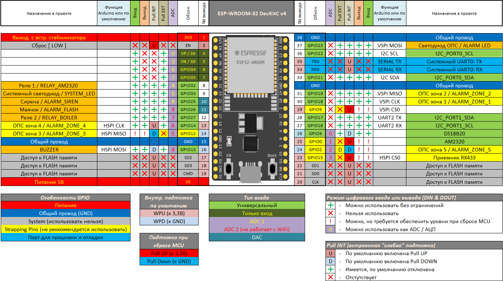
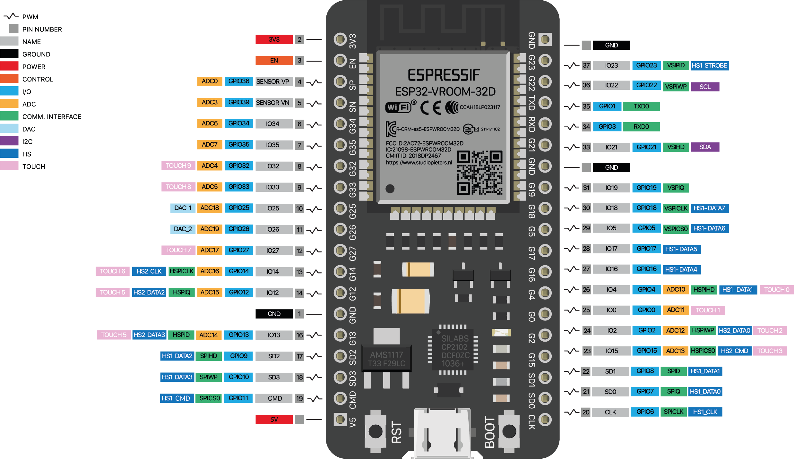

[На главную страницу](README.md)

# Содержание

- [Плата ESP32]()
- [Плата ESP32 как сервер или как точка доступа](electronika_esp32_wifi.md)

# Плата ESP32

## Плата ESP32 с микросхемой мостом USB-UART (CP2102)

Для начала работы с данной платой нужно установить драйвер для работы с микросхемой мостом USB-UART **CP210**.
Для этого переходим по этой [ссылке](https://myrobot.ru/downloads/programs/driver_cp210x_win_10_universal_v10.1.8.zip) и скачиваем файл, котрый затем нужно установить.

## Входы ESP32

Основы про плату можно прочитать [тут](https://www.studiopieters.nl/esp32-pinout/)

Контакты, выделенные зеленым, можно использовать. Те, что выделены желтым, можно использовать, но вам нужно быть внимательными, поскольку они могут вести себя неожиданно, в основном при загрузке. Выводы, выделенные красным, не рекомендуется использовать в качестве входов или выходов.

<figure    class="wp-block-table">
<table>
<tbody>
<tr>
<td><strong>GPIO</strong></td>
<td><strong>Input</strong></td>
<td><strong>Output</strong></td>
<td><strong>Notes</strong></td>
</tr>
<tr><td>0</td><td><strong>pulled up</strong></td><td><strong>OK</strong></td><td>outputs PWM signal at boot</td></tr>
<tr><td>1</td><td><strong>TX Pin</strong></td><td><strong>OK</strong></td><td>debug output at boot</td></tr>
<tr><td>2</td><td><strong>OK</strong></td><td><strong>OK</strong></td><td>connected to on-board LED</td></tr>
<tr><td>3</td><td><strong>OK</strong></td><td><strong>RX Pin</strong></td><td>HIGH at boot</td></tr>
<tr><td>4</td><td><strong>OK</strong></td><td><strong>OK</strong></td><td>&nbsp;</td></tr>
<tr><td>5</td><td><strong>OK</strong></td><td><strong>OK</strong></td><td>outputs PWM signal at boot</td></tr>
<tr><td>6</td><td><strong>X</strong></td><td><strong>X</strong></td><td>connected to the integrated SPI flash</td></tr>
<tr><td>7</td><td><strong>X</strong></td><td><strong>X</strong></td><td>connected to the integrated SPI flash</td></tr>
<tr><td>8</td><td><strong>X</strong></td><td><strong>X</strong></td><td>connected to the integrated SPI flash&nbsp;connected to the integrated SPI flash</td></tr>
<tr><td>9</td><td><strong>X</strong></td><td><strong>X</strong></td><td>connected to the integrated SPI flash</td></tr>
<tr><td>10</td><td><strong>X</strong></td><td><strong>X</strong></td><td>connected to the integrated SPI flash</td></tr>
<tr><td>11</td><td><strong>X</strong></td><td><strong>X</strong></td><td>connected to the integrated SPI flash</td></tr>
<tr><td>12</td><td><strong>OK</strong></td><td><strong>OK</strong></td><td>&nbsp;</td></tr>
<tr><td>13</td><td><strong>OK</strong></td><td><strong>OK</strong></td><td>outputs PWM signal at boot</td></tr>
<tr><td>14</td><td><strong>OK</strong></td><td><strong>OK</strong></td><td>outputs PWM signal at boot</td></tr>
<tr><td>15</td><td><strong>OK</strong></td><td><strong>OK</strong></td><td>&nbsp;</td></tr>
<tr><td>16</td><td><strong>OK</strong></td><td><strong>OK</strong></td><td>&nbsp;</td></tr>
<tr><td>17</td><td><strong>OK</strong></td><td><strong>OK</strong></td><td>&nbsp;</td></tr>
<tr><td>18</td><td><strong>OK</strong></td><td><strong>OK</strong></td><td>&nbsp;</td></tr>
<tr><td>19</td><td><strong>OK</strong></td><td><strong>OK</strong></td><td>&nbsp;</td></tr>
<tr><td>20</td><td><strong>OK</strong></td><td><strong>OK</strong></td><td>&nbsp;</td></tr>
<tr><td>21</td><td><strong>OK</strong></td><td><strong>OK</strong></td><td>SDA</td></tr>
<tr><td>22</td><td><strong>OK</strong></td><td><strong>OK</strong></td><td>SCL</td></tr>
<tr><td>23</td><td><strong>OK</strong></td><td><strong>OK</strong></td><td>&nbsp;</td></tr>
<tr><td>24</td><td><strong>OK</strong></td><td><strong>OK</strong></td><td>&nbsp;</td></tr>
<tr><td>25</td><td><strong>OK</strong></td><td><strong>OK</strong></td><td>&nbsp;</td></tr>
<tr><td>26</td><td><strong>OK</strong></td><td><strong>OK</strong></td><td>&nbsp;</td></tr>
<tr><td>27</td><td><strong>OK</strong></td><td><strong>OK</strong></td><td>&nbsp;</td></tr>
<tr><td>28</td><td><strong>OK</strong></td><td><strong>OK</strong></td><td>&nbsp;</td></tr>
<tr><td>29</td><td><strong>OK</strong></td><td><strong>OK</strong></td><td>&nbsp;</td></tr>
<tr><td>30</td><td><strong>OK</strong></td><td><strong>OK</strong></td><td>&nbsp;</td></tr>
<tr><td>31</td><td><strong>OK</strong></td><td><strong>OK</strong></td><td>&nbsp;</td></tr>
<tr><td>32</td><td><strong>OK</strong></td><td><strong>OK</strong></td><td>&nbsp;</td></tr>
<tr><td>33</td><td><strong>OK</strong></td><td><strong>OK</strong></td><td>&nbsp;</td></tr>
<tr><td>34</td><td><strong>OK</strong></td><td>&nbsp;</td><td>&nbsp;</td></tr>
<tr><td>35</td><td><strong>OK</strong></td><td>&nbsp;</td><td>&nbsp;</td></tr>
<tr><td>36</td><td><strong>OK</strong></td><td>&nbsp;</td><td><strong>input only</strong></td></tr>
<tr><td>37</td><td><strong>OK</strong></td><td>&nbsp;</td><td><strong>input only</strong></td></tr>
<tr><td>38</td><td><strong>OK</strong></td><td>&nbsp;</td><td><strong>input only</strong></td></tr>
<tr><td>39</td><td><strong>OK</strong></td><td>&nbsp;</td><td><strong>input only</strong></td></tr>
</tbody>
</table>
</figure>

## Кнопки на модуле

На отладочном модуле расположены две тактовые кнопки:

- Кнопка **RST** - предназначена для ручного перезапуска платы.

- Кнопка **BOOT** - служит для ручного запуска режима прошивки модуля. Алгоритм следующий: Зажать кнопку BOOT; нажать и отпустить кнопку RST; отпустить кнопку BOOT.

## Питание

Линейный понижающий регулятор напряжения AMS1117-3.3 обеспечивает питание микроконтроллера. Выходное напряжение 3,3 вольта с максимальным током 1 А.

Питание подаётся через разъём micro-USB или контакт **Vin**. Источник определяется автоматически.

При питании через USB используйте зарядник на 5В совместно с кабелем Micro USB. В случае питания через **Vin** рекомендуется входное напряжение от 5В до 14В. Преобразователь питания на плате выровняет входное напряжение до необходимых 3,3В.

> Важно! Напряжение логических уровней на пинах — 3,3В, подключение 5-вольтовой периферии может повредить микроконтроллер!

Как и в случае с платами Arduino, платы ESP32 также бывают от разных производителей с разным числом выводов и разной обвязкой. Также появляются модификации и конкретной платы. Например, плата ESP32 DEVKIT DOIT бывает с 30 и 36 пинами.

## PWM

ШИМ-контроллер ESP32 имеет 16 независимых каналов

## I2C

ESP32 имеет два канала **I2C** , и любой вывод может быть установлен как **SDA** или **SCL**. По умолчанию контакты **I2C**:

- **GPIO 21** - SDA;
- **GPIO 22** - SCL.

## SPI

По умолчанию расположение контактов SPI:

<figure class="wp-block-table">
<table>
<tbody>
<tr>
<td><strong>SPI</strong></td>
<td><strong>MOSI</strong></td>
<td><strong>MISO</strong></td>
<td><strong>CLK</strong></td>
<td><strong>CS</strong></td>
</tr>
<tr>
<td><strong>VSPI</strong></td>
<td>GPIO 23</td>
<td>GPIO 19</td>
<td>GPIO 18</td>
<td>GPIO 5</td>
</tr>
<tr>
<td><strong>HSPI</strong></td>
<td>GPIO 13</td>
<td>GPIO 12</td>
<td>GPIO 14</td>
<td>GPIO 15</td>
</tr>
</tbody>
</table>
</figure>

## Interrupts

Все GPIO могут быть сконфигурированы на прерывание.