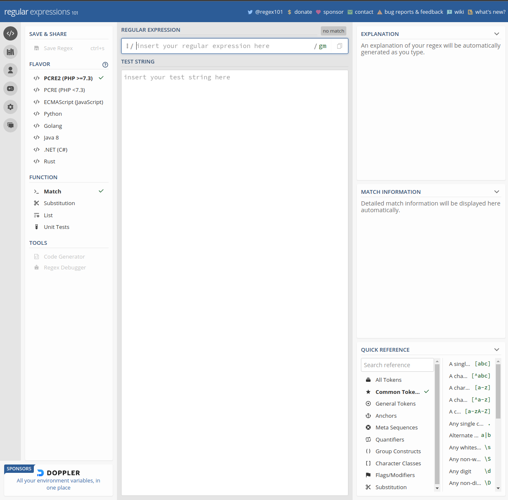

[На главную страницу](../README.md)

[В начало раздела Всё про Markdown](README.md)

# Работа с Markdown

# Содержание

- [Разделительные линии](#разделительные-линии-в-тексте)

- [Цитаты](#разделительные-линии-в-тексте)

- [Списки](#списки)

- [Гипперссылки](#гипперссылки)

- [Формат текста](#формат-текста)

- [Выделение кода в тексте](#выделение-кода-в-тексте)

- [Вставка изображений](#вставка-изображений)

- [Вставка таблиц](#вставка-таблиц)

---

## Разделительные линии в тексте

Горизонтальные линии разделители состоят из 3 и более "-" и "*".

---

## Цитаты

> Это цитаты
>> Это вложенная цитата

***

## Списки

### Список в виде checkbox'ов

- [x] Marked
- [ ] Unmarked

### Значки неупорядоченного списка

* Элемент неупорядоченного списка
+ Второй элемент неупорядоченного списка
- Тоже элемент неупорядоченного списка

### Упорядоченный список

1. Всегда начинается с единицы.
3. Несмотря на следующий номер, значения списка будут идти по порядку.
259. Номер позиции не влияет на порядок в итоговом выводе. Будет номер 3.

***

## Гипперссылки

### Ссылки внешние и локальные

<https://www.google.com/> тоже ссылка на внешний сайт.

<s21genesiss@gmail.com> - ссылка на почту.

[Ссылка внешний сайт](https://www.google.com/ "Сайт google.com")

[Ссылка на локальный объект](images/site_regex101.png "Всплывающая подсказка при наведении на ссылку")

### Ссылки внутри документа Markdown

[Перейти по ссылке внутри документа](#разделительные-линии-в-тексте) От сюда убежит на заголовок Квантификаторы. (название ссылки (в данном случае #разделительные-линии-в-тексте) писать с малой буквы, а если много слов в названии то через дифис каждое слово).

[Перейти по ссылке внутри документа](#вставка-таблиц) Это ещё одна ссылка для проверки.

---

## Формат текста

Курсив и ширина текста

_Пример_ __Пример__ ___Пример___

*Пример* **Пример** ***Пример***

***

## Выделение кода в тексте

### Однострочные кусочки кода

`Фрагмент содержащий код имеет моноширинный шрифт`
`#include <string.h>`

### Многострочные кусочки кода

```
Цельный элемент для большого куска кода
Фрагмент содержащий код имеет моноширинный шрифт
#include <string.h>
```

---

## Вставка изображений

### Без редактирования размеров

Ширину и высоту задать нельзя.



![Альтернативное название изображения, когда оно не прогрузилось][id_Picture]

### С возможностью редактирования размера

<p align="center">
</p>

***

## Вставка таблиц

### Таблица в стиле HTML

<table>
    <tr>
        <th>колонка 1</th>
        <th>колонка 2</th>
        <th>колонка 3</th>
    </tr>
    <tr>
        <td>значение 1.1</td>
        <td>значение 2.1</td>
        <td>значение 3.1</td>
    </tr>
    <tr>
        <td>значение 1.2</td>
        <td>значение 2.2</td>
        <td>значение 3.2</td>
    </tr>
    <tr>
        <td>значение 1.3</td>
        <td>значение 2.3</td>
        <td>значение 3.3</td>
    </tr>
</table>

### Таблица визуально удобно описана в коде 

| колонка 1    | колонка 2    | колонка 3    |
| ------------ | ------------ | ------------ |
| значение 1.1 | значение 2.1 | значение 3.1 |
| значение 1.2 | значение 2.2 | значение 3.2 |
| значение 1.3 | значение 2.3 | значение 3.3 |

### Таблица неудобно описана в коде

| 1 | 2 | 3 | 4 |
| ---- | ---- | ---- | ---- |
| Один | Два | Три | Четыре |
| One | Two | Free | For |
| 一 | 二 | 三 | 四 |

---

[В начало документа Работа с Markdown](#работа-с-markdown)

[В начало раздела Всё про Markdown](README.md)

[На главную страницу](../README.md)
