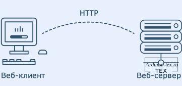

[На главную страницу](README.md)

[Про ESP32](electronika_arduino_and_esp32.md)

# Wi-Fi

## Режимы работы ESP32

Прочитать подробнее можно по [ссылке](https://arduino-tex.ru/news/15/urok-1-veb-server-esp32-esp8266-v-srede-arduino-ide.html).

**Веб-сервер** - это место, где хранятся, обрабатываются и отсылаются веб-страницы веб-клиентам. 
**Веб-клиент** - это не что иное, как веб-браузер на наших ноутбуках и смартфонах. 
Связь между клиентом и сервером происходит с использованием специального протокола, называемого протоколом передачи гипертекста (HTTP).

В этом протоколе клиент инициирует связь, отправляя запрос на конкретную веб-страницу с помощью HTTP, а сервер отдает содержимое этой веб-страницы, или сообщение об ошибке, если не может этого сделать (например: страница не найдена, ошибка 404). Страницы, которые отдает сервер, в основном представляют собой HTML-документы.

## Режимы работы ESP32.

Одна из особенностей ESP32 заключается в том, что он может не только подключаться к существующей сети Wi-Fi и действовать как веб-сервер, но также может настраивать собственную сеть, позволяя другим устройствам напрямую подключаться к ней и получать доступ к веб-страницам. Это возможно, потому что ESP32 работает в трех разных режимах: 
- режим станции (**STA**);
- режим точки доступа (**AP**);
- оба режима одновременно (**STA** и **AP**).