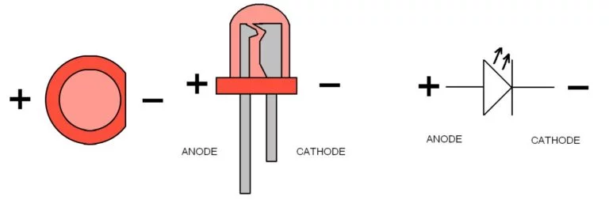

[На главную страницу](../../README.md)

[В начало раздела микроэлектроники и одноплатных компьютеров](../README.md)

# Компоненты микроэлектроники

# Содержание

- [Резисторы]()

- [Конденсаторы]()

- [Диоды]()

- [Транзисторы]()

- [Светодиоды]()

- [Микросхемы]()

## Светодиоды

[В начало документа](#компоненты-микроэлектроники)

[В начало раздела микроэлектроники и одноплатных компьютеров](../README.md)

[На главную страницу](../../README.md)
