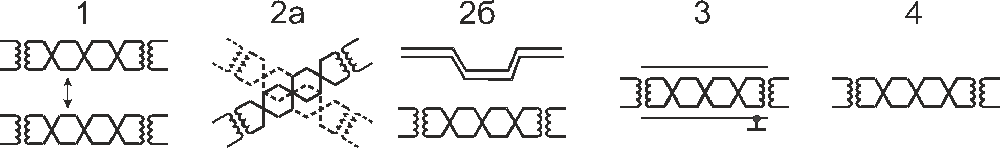

[На главную страницу](../../README.md)

[В начало раздела микроэлектроники и одноплатных компьютеров](../README.md)

# Общая информация и компоненты микроэлектроники

# Содержание

- [Общая информация]()

- [Резисторы]()

- [Конденсаторы]()

- [Диоды]()

- [Транзисторы]()

- [Светодиоды]()

- [Микросхемы]()

---

## Общая информация

Для работы большинства систем требуется собирать их из большого количества различных компонентов, которые для работы и общения между собой требуют соединения по кабелю (проводке). Неправильно спроектированная система может создавать наводки саму на себя или на рядом стоящую систему. Для борьбы с подобными проблемами применяется несколько методов, которые будут описаны ниже кратко или которые можно прочесть более подробно по следующим ссылкам:
- [Методы борьбы с наводками на систему.](https://emilink.ru/stati/navodki_v_elektroprovodnyh_kabelyah_sks_i_metody_ih_umensheniya)
- [Защита от помех. Методы экранирования и заземления.](https://www.reallab.ru/bookasutp/3-zashita-ot-pomeh/3-5-metodi-ekranirovaniya-i-zazemleniya/)

Рис.1 - Примеры методов борьбы с наводками.

<table>
    <tr>
        <th></th>
        <th>Метод уменьшения наводки</th>
        <th>Внешняя помеха</th>
        <th>Внутренняя помеха</th>
    </tr>
    <tr>
        <td>1.</td>
        <td>Увеличение расстояния между источником помехи и цепью передачи сигнала, подверженной влиянию</td>
        <td>Соблюдение норм по пространственному разнесению кабельных трасс и расстоянию до точечных источников. Запрет на регулярную укладку неэкранированных кабелей категории 6а</td>
        <td>Введение сепаратора в конструкцию кабельного сердечника</td>
    </tr>
    <tr>
        <td>2</td>
        <td>Ограничение длины взаимодействия</td>
        <td>
            - Пересечение кабельных трасс под прямым или максимально близким к прямому углом;
              - Соблюдение норм на длину совместной прокладки. 
        </td>
        <td>Нет</td>
    </tr>
    <tr>
        <td>3</td>
        <td>Применение экранирования</td>
        <td colspan="2">Внутренние и внешние экраны</td>
    </tr>
    <tr>
        <td>4</td>
        <td>Скрутка проводов</td>
        <td colspan="2">Скрутка различных видов отдельных пар проводов</td>
    </tr>
</table>

## Светодиоды

[В начало документа](#компоненты-микроэлектроники)

[В начало раздела микроэлектроники и одноплатных компьютеров](../README.md)

[На главную страницу](../../README.md)
