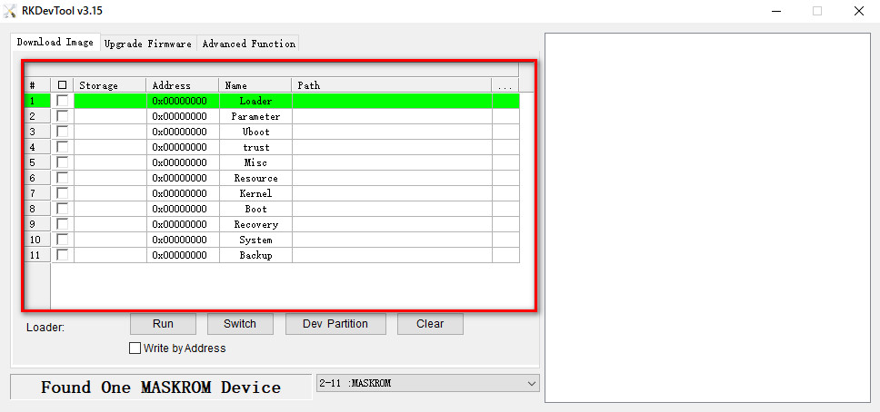

[На главную страницу](../../README.md)

[В начало раздела микроэлектроники и одноплатных компьютеров](../README.md)

---

# Всё про OrangePi

# Содержание

- [Плата OrangePi]()
- [Как записать образ Linux на eMMC](#как-записать-образ-linux-на-emmc)
- [Начало работы с платой разработки OrangePi 5B](#начало-работы-с-платой-разработки-orangepi-5b)
- [Как использовать Serial Port (последовательный порт)](#как-использовать-serial-port-последовательный-порт)

# Как записать образ Linux на eMMC

## Как использовать RKDevTool для записи образа Linux на eMMC

>Полезные ссылки этого раздела:
>[Инструменты для записи образа на плату OrangePi 5B](https://drive.google.com/drive/folders/1gvCbQTMHh80S8H2MIha20nsXOoHVY3X3)
>[Репозиторий с ОС Ubuntu для OrangePi 5B](https://github.com/Joshua-Riek/ubuntu-rockchip/releases)

| Обратите внимание, что все следующие операции выполняются на компьютере под управлением Windows. |
--

| Обратите внимание, что упомянутый здесь образ Linux относится конкретно к образу дистрибутивов Linux, таких как Debian или Ubuntu, загруженных со страницы загрузки данных Orange Pi. |
--

1. Для начала вам необходимо подготовить кабель передачи данных с качественным интерфейсом Type-C.

<p align="center">
</p>
<p align="center">Рис.1 - Кабель type-c.</p>

2. Затем загрузите **Rockchip DriverAssitant_v5.12.zip** и **MiniLoader**, а также инструмент для записи **RKDevTool_Release_v3.15.zip** со страницы [загрузки данных Orange Pi](https://drive.google.com/drive/folders/1gvCbQTMHh80S8H2MIha20nsXOoHVY3X3):

2.1 На странице загрузки данных Orange Pi сначала выберите официальный инструмент, а затем войдите в следующую папку

<p align="center"></p>
<p align="center">Рис.2 - Директория где искать файлы.</p>

2.2 Затем загрузите все файлы ниже

<p align="center"></p>
<p align="center">Рис.2 - Местонахождение файлов.</p>

3. Затем загрузите пакет сжатия файла образа операционной системы Linux, который вы хотите записать, со страницы загрузки данных Orange Pi или [репозитория](https://github.com/Joshua-Riek/ubuntu-rockchip/releases), а затем используйте программное обеспечение для распаковки, чтобы распаковать его. Среди распакованных файлов файл, заканчивающийся на ".img", является файлом образа операционной системы, его размер обычно превышает 2 ГБ.

4. Затем используйте программное обеспечение для распаковки **DriverAssitant_v5.12.zip**, а затем найдите исполняемый файл **DriverInstall.exe** в распакованной папке и откройте его.

<p align="center"></p>

5. После открытия **DriverInstall.exe** шаги по установке драйвера Rockchip будут следующими:

5.1 Нажмите кнопку «Установка драйвера»

<p align="center"></p>

5.2 Через некоторое время появится всплывающее окно с сообщением «Драйвер успешно установлен», после чего нажмите кнопку «ОК».

<p align="center"></p>

6. Затем распакуйте **RKDevTool_Release_v3.15.zip**, это программное обеспечение не нужно устанавливать, просто найдите RKDevTool в распакованной папке и откройте его.

<p align="center"></p>

6.1 Программа откроется на китайском языке

<p align="center"></p>

6.2 Чтобы изменить язык программы на английский нужно открыть файл **config.ini** и исправить цифру с 1 на 2.
<p align="center"></p>
<p align="center"></p>

7. После открытия инструмента записи **RKDevTool**, в левом нижнем углу появится сообщение **No Devices Found**(«Устройство не найдено»), поскольку в данный момент компьютер не подключен к плате разработки через кабель Type-C.

<p align="center"></p>

8. Затем начните записывать образ Linux на eMMC:

8.1 Сначала подключите плату разработки к компьютеру с ОС Windows через кабель передачи данных Type-C. Расположение интерфейса Type-C на плате разработки показано на рисунке ниже.

<p align="center"></p>

8.2 Убедитесь, что в макетной плате отсутствует TF-карта и источник питания отключен.

8.3 Также необходимо убедиться, что интерфейс USB2.0 белого цвета, находящийся на плате как показанно на рисунке ниже, свободен от подключений.

<p align="center"></p>

8.4 Затем нажмите и удерживайте кнопку MaskROM на плате разработки. Расположение кнопки MaskROM на плате разработки показано на рисунке ниже

<p align="center"></p>

8.5 Затем подключите блок питания интерфейса Type-C к плате разработки и подайте питание.

<p align="center"></p>

8.6 Если предыдущие шаги выполнены успешно, плата разработки в этот момент перейдет в режим **MASKROM**, а интерфейс инструмента записи выдаст сообщение **Found ONE MASKROM Device** («Найдено устройство MASKROM»).

<p align="center"></p>

8.7 Затем поместите курсор мыши в область ниже.

<p align="center"></p>

8.8 Затем кликните правой кнопкой мыши и появится интерфейс выбора, показанный на рисунке ниже, и выбирите опцию выбора конфигурации **Load Config**

<p align="center"></p>

8.9 Затем выбирите файл конфигурации **rk3588_linux_emmc.cfg** в папке **MiniLoader**, загруженной ранее и нажмите **Открыть**.

<p align="center"></p>

8.10 Нажмите **OK**

<p align="center"></p>

8.11 Затем нажмите на позиции, показанной ниже

<p align="center"></p>

8.12 Затем выбирите **MiniLoaderAll.bin** в папке **MiniLoader**, загруженной ранее, и нажмите **Открыть**

<p align="center"></p>

8.13 Затем нажмите на позиции, показанной ниже

<p align="center"></p>

8.14 Затем выбирите путь к образу Linux, который вы хотите записать, и нажмите **Открыть**

<p align="center"></p>

| Перед записью образа рекомендуется переименовать образ Linux на orangepi.img или другое более короткое имя, это позволит видеть процент хода записи образа в память |
--

8.15 Обзательно отметьте опцию **Write by Address** (запись по адресу)

<p align="center"></p>

8.16 Нажмите кнопку **Run** (выполнить), чтобы начать запись образа Linux на eMMC платы разработки.

<p align="center"></p>

8.17 Журнал отобразит информацию при записи образа Linux

<p align="center"></p>

| После записи образа Linux на eMMC система Linux запустится автоматически |
--

## Начало работы с платой разработки OrangePi 5B

1. Плата разработки имеет интерфейс **HDMI**, и плата разработки может быть подключена к телевизору или дисплею **HDMI** через кабель **HDMI - HDMI**. Если вы покупаете ЖК-экран, вы также можете использовать ЖК-экран для отображения системного интерфейса платы разработки. Если есть кабель **Type-C - HDMI**, системный интерфейс платы может быть подключён через интерфейс Type-C.
2. Подключите USB-мышь и клавиатуру для управления платой разработки Orange Pi.
3. Плата разработки имеет порт Ethernet, к которому можно подключить сетевой кабель для доступа в Интернет.
4. Подключите высококачественный источник питания с интерфейсом USB Type-C 5В / 4А.

<table>
    <tr>
        <td>
            <p align="left" style="color:red; font-weight: bold">Помните, что нельзя подключать адаптер питания с выходным напряжением более 5 В, так как это может привести к сгоранию макетной платы.</p>
            <p align="left" style="color:red; font-weight: bold">Многие нестабильные явления во время включения и запуска системы в основном вызваны проблемами с источником питания, поэтому надежный адаптер питания очень важен. Если вы обнаружите, что во время запуска наблюдается явление непрерывного перезапуска, замените источник питания или кабель данных Type-C и повторите попытку.</p>
            <p align="left" style="color:red; font-weight: bold">Не подключайте USB-интерфейс компьютера для питания макетной платы.</p>
        </td>
    </tr>
</table>

| На плате разработки есть два порта Type-C, которые выглядят одинаково. Тот, что справа, — это порт питания, а тот, что посередине, не имеет функции источника питания. Пожалуйста, не ошибитесь. |
--

5. Если вы хотите просмотреть выходную информацию системы через последовательный порт отладки, пожалуйста, используйте последовательный кабель для подключения платы разработки к компьютеру. Для метода подключения последовательного порта, пожалуйста, обратитесь к разделу о том, [как использовать последовательный порт для отладки](#как-использовать-serial-port-последовательный-порт).


### Как использовать Serial Port (последовательный порт)

#### Инструкция по подключению отладочного последовательного порта

1. Сначала необходимо подготовить модуль USB-TTL 3,3 В. Затем вставить интерфейс USB модуля USB-TTL в USB-интерфейс компьютера.

<table>
    <tr>
        <td>
            <p align="left" style="color:white; font-weight: bold">Для лучшей совместимости рекомендуется использовать модуль USB-TTL CH340 вместо модуля USB-TTL CP2102.</p>
            <p align="left" style="color:white; font-weight: bold">Перед покупкой модуля USB-TTL убедитесь, что модуль поддерживает скорость передачи данных 1500000.</p>
        </td>
    </tr>
</table>

<p align="center"></p>

1. Соответствующее расположение контактов GND, RXD и TXD отладочного последовательного порта платы разработки, показано на рисунке ниже.

<p align="center"></p>

3. Контакты GND, TXD и RXD модуля USB-TTL необходимо подключить к последовательному порту отладки платы разработки через линию DuPont.
- GND модуля USB-TTL подключен к GND платы разработки.
- RX модуля USB-TTL подключается к TX платы разработки.
- TX модуля USB-TTL подключается к RX платы разработки.

3. Принципиальная схема подключения модуля USB-TTL к компьютеру и плате разработки Orange Pi выглядит следующим образом.

<p align="center"></p>

| TX и RX последовательного порта должны быть соединены крест-накрест. Если вы не хотите тщательно различать порядок TX и RX, вы можете соединить TX и RX последовательного порта небрежно. Если в тесте нет выходного сигнала, то поменяйте порядок TX и RX, чтобы всегда был правильный порядок |
--

#### Как использовать отладочный последовательный порт на ОС Ubuntu

| Существует множество программ для отладки последовательного порта, которые можно использовать в Linux, например, putty, minicom и т. д. Ниже показано, как использовать putty. |
--

1. Сначала вставьте модуль USB-to-TTL в порт USB компьютера Ubuntu. Если подключение и распознавание модуля USB-to-TTL прошло нормально, вы увидите соответствующее имя узла устройства в `/dev` на компьютере с Ubuntu. Запомните это имя узла, а затем установите программное обеспечение последовательного порта, которое будет использоваться

```
test@test:~$ ls /dev/ttyUSB*
/dev/ttyUSB0
```

2. Затем используйте следующую команду для установки Putty на Ubuntu PC

```
test@test:~$ sudo apt-get update
test@test:~$ sudo apt-get install 
```

3. Затем запустите putty, не забудьте добавить разрешение sudo

```
test@test:~$ sudo putty
```

4. После выполнения команды putty появится следующий интерфейс

<p align="center"></p>

5. Сначала выберите интерфейс настройки последовательного порта

<p align="center"></p>

6. Затем установите параметры последовательного порта

6.1 Установите **Serial line to connect to** как **/dev/ttyUSB0** (измените на соответствующее имя узла, обычно **/dev/ttyUSB0**)
6.2 Установите **Speed(baud)** (скорость (бод)) на **1500000** (скорость передачи данных последовательного порта)
6.3 Установите для параметра **Flow control** (управление потоком) значение **None** (нет)

<p align="center"></p>

7. После настройки интерфейса последовательного порта вернитесь в интерфейс **Session** (сеанса).

7.1 Сначала выберите **Connection type** (тип подключения) **Serial** (последовательный).
7.2 Затем нажмите кнопку **Open** (открыть), чтобы подключиться к последовательному порту.

<p align="center"></p>

8. После запуска платы разработки вы можете увидеть информацию журнала, выводимую системой с открытого терминала последовательного порта.

<p align="center"></p>

#### Как использовать Serial port (порт для отладки) на платформе Windows

| Существует множество программ для отладки последовательных портов, которые можно использовать под Windows, например, SecureCRT, MobaXterm и т.д. Ниже показано, как использовать MobaXterm. Это программное обеспечение имеет бесплатную версию и может использоваться без покупки серийного номера. |
--

1. Загрузить MobaXterm.

1.1 Скачать [MobaXterm](https://mobaxterm.mobatek.net/).
1.2 После входа на страницу загрузки MobaXterm нажмите **GET XOBATERM NOW!**
<p align="center"></p>
1.3 Затем выберите загрузку версии Home Edition.
<p align="center"></p>
1.4 Затем выберите Portable — портативную версию, не нужно устанавливать после загрузки, просто откройте ее и пользуйтесь.
<p align="center"></p>

2. Распакуйте загруженный файл, и откройте его двойным нажатие левой кнопки мыши

<p align="center"></p>

3. После открытия программного обеспечения необходимо выполнить следующие шаги по настройке соединения через последовательный порт:

3.1 Выберите тип последовательного порта
3.2 Выберите номер порта последовательного порта (выберите соответствующий номер порта в соответствии с фактической ситуацией), если вы не видите номер порта, используйте 360 Driver Master для сканирования и установки драйвера микросхемы последовательного порта USB-TTL.
3.3 Выберите скорость передачи данных последовательного порта 1500000.
3.4 Наконец нажмите кнопку «ОК», чтобы завершить настройки.
<p align="center"></p>

4. После нажатия кнопки «ОК» вы попадете в следующий интерфейс. В это время запустите плату разработки и вы увидите выходную информацию последовательного порта.

<p align="center"></p>


#### Инструкции по использованию контакта 5 В в 26-контактном интерфейсе платы разработки для подачи питания

| Метод подачи питания, который мы рекомендуем для платы разработки, заключается в использовании кабеля питания интерфейса Type C 5 В/4 А для подключения к интерфейсу питания Type-C платы разработки для подачи питания. Если вам необходимо использовать контакт 5 В в интерфейсе 26 контактов для питания платы разработки, убедитесь, что используемый кабель питания и адаптер питания соответствуют требованиям к питанию платы разработки. Если использование нестабильно, переключитесь обратно на источник питания Type-C. |
--

1. Сначала вам необходимо подготовить шнур питания, как показано на рисунке ниже.
2. Используйте 5V контакт в 26pin интерфейсе для подачи питания на плату разработки. Метод подключения линии питания следующий
2.1 Порт USB A шнура питания, показанный на рисунке выше, необходимо подключить к разъему адаптера питания 5 В/4 А (не подключайте его к порту USB компьютера для подачи питания).
2.2 Красный провод DuPont необходимо подключить к 5-вольтовому контакту платы разработки 26pin.
2.3 Черную линию DuPont необходимо вставить в контакт GND 26-контактного интерфейса.
2.4 Расположение контакта 5 В и контакта GND 26-контактного интерфейса на плате разработки показано на рисунке ниже.

<p align="center"></p>


---

[В начало документа](#всё-про-orangepi)

[В начало раздела микроэлектроники и одноплатных компьютеров](../README.md)

[На главную страницу](../../README.md)