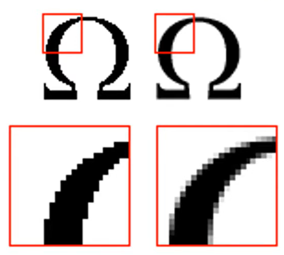
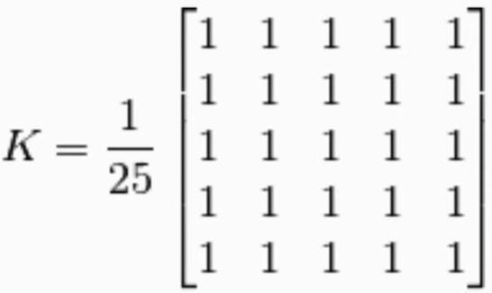
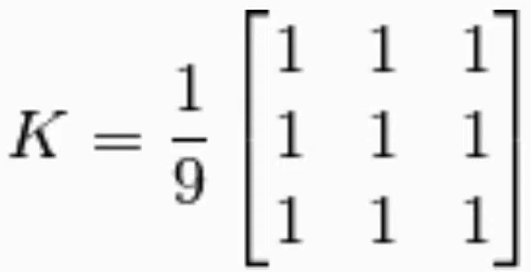
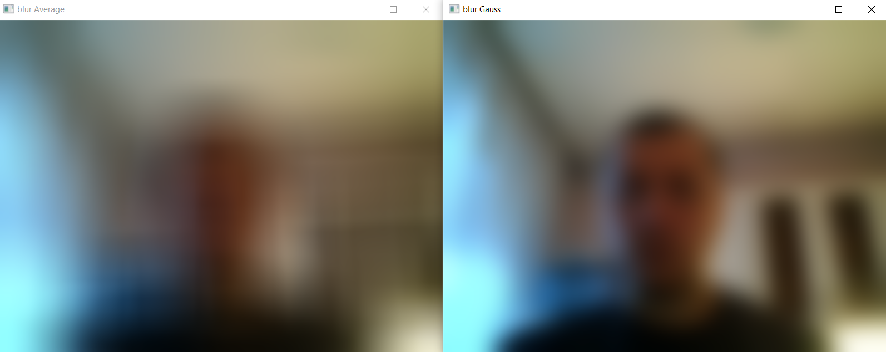
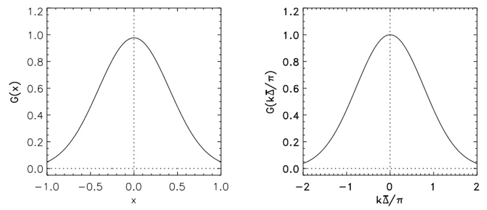
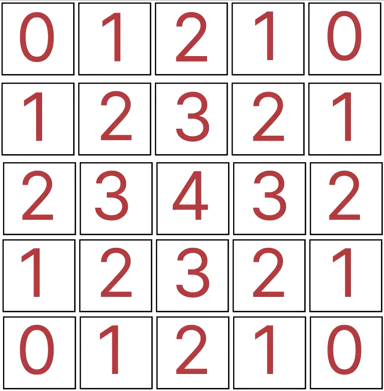

[На главную страницу](../../README.md)

[В начало раздела нейронных сетей](../README.md)

Информация делалась по этому [видео](https://www.youtube.com/watch?v=oc64kCbPi6o).

# Установка Python

Запускаем командную строку или терминал и проверяем установлен ли Python на компьютер

> python --version

Если Python установлен, то должен вывести верисю языка.

Если Python не установлен, то переходим по этой [ссылке](https://www.python.org/downloads/) и скачиваем установщик для Windows.


# Установка библиотеки OpenCV

Установка OpenCV

> pip install opencv-python

Если потребуется обновить, то 

> python.exe -m pip install --upgrade pip

Дополнения для библиотеки OpenCV дополниетльные команды, которые позволят работать в полную силу.

> pip install opencv-contrib-python

# 1. Первый урок

## Первая простая программа (создание окна)

Код с помощью которого можно вывести картинку.

```
import cv2
import numpy as np

img = cv2.imread("py_logo.png", -1)
#cv2.namedWindow("image_logo", cv2.WINDOW_AUTOSIZE)
cv2.namedWindow("image_logo", cv2.WINDOW_NORMAL)
cv2.imshow("image_logo", img)
cv2.waitKey(0)
cv2.destroyAllWindows()
```

## Считывание видеопотока

По сути видеопоток это много картинок (кадров) в секунду. Потому и оновная работа заклюяается в работе с картинками.

```
import cv2
import numpy as np

cap = cv2.VideoCapture(0)
#cap = cv2.VideoCapture("name_file.mp4") #запустит видео и будет показывать его

while True:
    ret, frame = cap.read()
    cv2.imshow("video", frame)
    if cv2.waitKey(1) & 0xFF == ord('q'):
        break

cap.release()
cv2.destroyAllWindows()
```

# 2. Рисование линии, прямоугольника, круга и вывод текста.

```
import cv2
import numpy as np

img = np.zeros((900, 900, 3), np.uint8) # создание массива данных заполненный нулями, нули дают чёрный цвет в RGB

img = cv2.line(img, (10, 10), (900, 900), (140, 160, 180), 1)

img = cv2.rectangle(img, (455, 5), (555, 45), (40, 20, 180), 3)

img = cv2.circle(img, (225, 455), 65, (220, 160, 10), -1)  # -1 означает что фигуру нужно закрасить

cv2.putText(img, "BeyondRobotics", (10, 450), 0, 3, (255, 255, 255), 1, cv2.LINE_AA)

cv2.imshow('image', img)

cv2.waitKey(0)
cv2.destroyAllWindows()
```

## Создание окна

> img = np.zeros((900, 900, 3), np.uint8) 

- np.zeros() - создание массива данных заполненный нулями, нули дают чёрный цвет по схеме RGB.
- (900, 900, 3) - размер изображения по X и Y, а тройка говорит что состоит из 3 цветов.
- np.uint8 - это второй аргумент, который говороит что ячейка цвета 8-ми битная (от 0 до 255), ограничивает размер ячейки памяти.

#### Рисование линии

За рисование линии отвечает строка

> img = cv2.line(img, (10, 10), (720, 640), (140, 160, 180), 1)

cv2.line(img, (x1, y1), (x2, y2), (B, G, R), T)
- img - полотно
- x1, y1 - координаты начала линии
- x2, y2 - координаты конца линии
- B - синий (от 0 до 255)
- G - зелёный (от 0 до 255)
- R - красный (от 0 до 255)
- T - толщина линии

#### Рисование паралелипипеда

> img = cv2.rectangle(img, (455, 5), (555, 45), (40, 20, 180), 3)

cv2.rectangle(img, (x1, y1), (x2, y2), (B, G, R), T)
- img - полотно
- x1, y1 - координаты первого угла прямоугольника
- x2, y2 - координаты противоположного угла прямоугольника
- B - синий (от 0 до 255)
- G - зелёный (от 0 до 255)
- R - красный (от 0 до 255)
- T - толщина линии (если указать -1 фигура будет закрашена)

#### Рисование окружности

> img = cv2.circle(img, (225, 455), 65, (220, 160, 10), -1)

cv2.circle(img, (x, y), R, (B, G, R), T)
- img - полотно
- x, y - координаты центра окружности
- R - радиус окружности
- B - синий (от 0 до 255)
- G - зелёный (от 0 до 255)
- R - красный (от 0 до 255)
- T - толщина линии (если указать -1 фигура будет закрашена)

#### Вывод текста

> cv2.putText(img, "BeyondRobotics", (10, 450), 0, 3, (255, 255, 255), 3, cv2.LINE_AA)

cv2.putText(img, text, (x, y), font, S, (B, G, R), T, cv2.LINE_AA)
- img - полотно
- text - вводимый текст
- x, y - координаты начала текста
- font - шрифт (от 0 до 16)
- S - размер
- B - синий (от 0 до 255)
- G - зелёный (от 0 до 255)
- R - красный (от 0 до 255)
- T - толщина линии (если указать -1 фигура будет закрашена)
- cv2.LINE_AA - тип шрифта скруглённый.

## Ползунки

cv2.createTrackbar(name, window, x, y, func)
- name - название полотна
- window - окно к которому будет прикреплён ползунок
- x - начальное значение
- y - конечное значение
- func - функция, которая вызывается при изменении ползунка

```
import cv2
import numpy as np

# пустая функция для создания пустой функции при создания трекбара
def nothing(x):
    pass # говорит от том что ничего не делать

img = np.zeros((300, 300, 3), np.uint8)

cv2.namedWindow('image')

cv2.createTrackbar('R', 'image', 0, 255, nothing)
cv2.createTrackbar('G', 'image', 0, 255, nothing)
cv2.createTrackbar('B', 'image', 0, 255, nothing)

while True:
    cv2.imshow('image', img)
    # ожидание нажатия клавиши чтобы остановить цикл
    # в данном случае будем ожидать нажатия клавиши 'Esc'
    k = cv2. waitKey(1) & 0xFF
    if k == 27:
        break
    r = cv2.getTrackbarPos('R', 'image')
    g = cv2.getTrackbarPos('G', 'image')
    b = cv2.getTrackbarPos('B', 'image')

    img[:] = [b, g, r]  # [:] означает от 0 и до конца массива
```

# 3. Математические операции. Сложение изображений.

```
import cv2

img1 = cv2.imread('py_logo.png')
img2 = cv2.imread('py_logo-opencv.png')


resize1 = cv2.resize(img1, (720, 720))
resize2 = cv2.resize(img2, (720, 720))


#summ = cv2.add(resize1, resize2)
#cv2.imshow('add', summ)

subtr = cv2.subtract(resize2, resize1)
cv2.imshow('subtract', subtr)

cv2.waitKey(0) # ожидаем нажатия любой клавишы

cv2.destroyAllWindows()
```

## Сложное смешивание изображений

Изменяем вес изображения через коэффициеты. По сути значение цвета пикселя умножается на коэффициет веса.

> dst = a * img1 + b * img2 + c
- a, b, c - коэффициенты.

Каждый пиксель имеет три цвета красный, зелёный и синий. Эти цвета задаются цифрами от 0 до 255. Если значение одного из цветов при умножении на коэффициент привысит 255, то число останется максимально возможным 255. А если при умножении на коэффициент число становится меньше 0 то значение цвета приводится к значению 0.

```
import cv2

img1 = cv2.imread('py_logo.png')
img2 = cv2.imread('py_logo-opencv.png')


resize1 = cv2.resize(img1, (720, 720))
resize2 = cv2.resize(img2, (720, 720))

summ = cv2.addWeighted(resize1, 1, resize2, 0.2, 0)


cv2.imshow('add', summ)
cv2.waitKey(0) # ожидаем нажатия любой клавишы

cv2.destroyAllWindows()
```

# 4. Цветовое пространство.

RGB - схема

HSV - схема


Изменить цветовое пространство можно с помощью функции

> cv2.cvtColor(frame, flag)

- frame - это изображение которому хотим изменить цветовое
- flag - это флаг котороый говорит о том в какой формат изменить. Основные флаги:
- - cv2.COLOR_BGR2HSV
- - cv2.COLOR_BGR2YCrCb
- - cv2.COLOR_BGR2GRAY

```
import cv2
import numpy as np

def nothing(x):
    pass

cap = cv2.VideoCapture(0)
cv2.namedWindow("frame")

# создание ползунков
cv2.createTrackbar("HL", "frame", 0 ,180, nothing)
cv2.createTrackbar("SL", "frame", 0 ,255, nothing)
cv2.createTrackbar("VL", "frame", 0 ,255, nothing)

cv2.createTrackbar("H", "frame", 0 ,180, nothing)
cv2.createTrackbar("S", "frame", 0 ,255, nothing)
cv2.createTrackbar("V", "frame", 0 ,255, nothing)


while True:
    ret, frame = cap.read()
    hsv = cv2.cvtColor(frame, cv2.COLOR_BGR2HSV)  # переделываем формат фрейма в HSV

    # переменные для считывания данных с трекбаров (ползунков)
    hl = cv2.getTrackbarPos("HL", "frame")
    sl = cv2.getTrackbarPos("SL", "frame")
    vl = cv2.getTrackbarPos("VL", "frame")

    h = cv2.getTrackbarPos("H", "frame")
    s = cv2.getTrackbarPos("S", "frame")
    v = cv2.getTrackbarPos("V", "frame")

    lower = np.array([hl, sl, vl])
    upper = np.array([h, s, v])
    # создаём маску
    mask = cv2.inRange(hsv, lower, upper)
    res = cv2.bitwise_and(frame, frame, mask = mask)
    # res = cv2.rotate(res, cv2.ROTATE_90_CLOCKWISE)
    # res = cv2.rotate(res, cv2.ROTATE_90_COUNTERCLOCKWISE)
    res = cv2.rotate(res, cv2.ROTATE_180)  # переворачивает кадр на 180 градусов
    # изменение размера изображения по кубическуму закону
    height, width = res.shape[:2]
    res = cv2.resize(res, (height * 2, width * 2), interpolation = cv2.INTER_CUBIC)
    
    cv2.imshow("frame", frame)
    # выводим результат смены цветовой схемы фрейма
    #cv2.imshow("hsv", hsv)
    cv2.imshow("mask", mask)
    cv2.imshow("res", res)

    k = cv2.waitKey(1) & 0xFF
    if k == 27:
        break

cv2.destroyAllWindows()
```

# 5. Градиенты и границы


```
import cv2
import numpy as np


cap = cv2.VideoCapture(0)
cv2.namedWindow("frame")


while True:
    ret, frame = cap.read()  # делаем фрэйм
    gray = cv2.cvtColor(frame, cv2.COLOR_BGR2GRAY)  # делаем начальный фрэйм чёрно-белым

    framex = cv2.Sobel(gray, cv2.CV_64F, 1, 0, ksize = 5)  # делаем градиент по горизонтали
    framey = cv2.Sobel(gray, cv2.CV_64F, 0, 1, ksize = 5)  # делаем градиент по вертикали
    edge = cv2.Canny(gray, 80, 150)  #  используем метод Канни для получения границ
    
    cv2.imshow("frame", frame)
    cv2.imshow("x", framex)
    cv2.imshow("y", framey)
    cv2.imshow("edge", edge)
    
    k = cv2.waitKey(1) & 0xFF
    if k == 27:
        break

cv2.destroyAllWindows()
```


# 6. Определение контуров


Определение контуров в кадре. На изображении накладывается замкнутый контур в рандомном порядке.
```
import cv2
import numpy as np


cap = cv2.VideoCapture(0)
cv2.namedWindow("frame")


while True:
    ret, frame = cap.read()  # делаем фрэйм
    gray = cv2.cvtColor(frame, cv2.COLOR_BGR2GRAY)  # делаем начальный фрэйм чёрно-белым
    edge = cv2.Canny(gray, 100, 200)

    contours, h = cv2.findContours(edge, cv2.RETR_LIST, cv2.CHAIN_APPROX_NONE)
    contours = sorted(contours, key = cv2.contourArea, reverse = True)

    cv2.drawContours(frame, [contours[0]], -1, (0, 0, 255), 5)
    
    cv2.imshow("frame", frame)
    cv2.imshow("edge", edge)
    
    k = cv2.waitKey(1) & 0xFF
    if k == 27:
        break

cv2.destroyAllWindows()
```


# 7. Сглаживание и морфологические трансформации

## 7.1 Сглаживания

Сглаживание используется для устранения эффекта зубчатости, возникающая на краях отдельных изображений.

<p align="center">
</p>

Чтобы обеспечить сглаживание применяется так называемое ядро, которое обеспечивает сглаживание. Для разных видов сглаживаний применяется разные ядра.

<p align="center">
</p>

#### Сглаживание по среденему значению

Сглаживание по среднему значению основано на получении среднего значения в пикселе от среднего значения пикселей вокруг.

Значения для каждого пикселя высчитывается путём нахождения среднего значения всех пикселей, лежащих в ядре. Делается это следующим образом. Берётся целевой пиксель и пиксели вокруг него (размером с ядро), вычисляется среднее значение и в целевой пиксель записывается среднее значение. Чаще всего берутся ядра с нечётным числом строк и стоблцов.

<p align="center">
</p>

```
import cv2
import numpy as np

cap = cv2.VideoCapture(0)

while True:
    ret, frame = cap.read(0)
    cv2.imshow("frame", frame)

    # Сглаживание
    blur = cv2.blur(frame, (3, 3))
    cv2.imshow("blur", blur)

    k = cv2.waitKey(1) & 0xFF
    if k == 27:
        break
cv2.destroyAllWindows()
```

#### Сглаживание по Гауссу

Это сглаживание является более щадящим для краёв, пожтому для задач связанных с обнаружение краёв метод сглаживания по Гауссу является более предпочтительным, по сравнеию со сглаживание по среднему значению. Но при этом для определения краёв это всё же не самый лучший метод. В следующем разделе будет описан более лучший метод для определения краёв. 

<p align="center">
</p>

На картинке показаны два вида сглаживаний с одинаковым размером ядра.

<p align="center">
</p>

В этом размытии используется ядро Гаусса

<p align="center">
</p>

```
import cv2
import numpy as np

cap = cv2.VideoCapture(0)

while True:
    ret, frame = cap.read(0)
    cv2.imshow("frame", frame)

    # Сглаживание
    blur = cv2.blur(frame, (11, 11))
    gblur = cv2.GaussianBlur(frame, (11, 11), 0)
    cv2.imshow("blur Average", blur)
    cv2.imshow("blur Gauss", gblur)

    k = cv2.waitKey(1) & 0xFF
    if k == 27:
        break
cv2.destroyAllWindows()
```

`cv2.GaussianBlur(frame, (11, 11), 0)`

- 3-й аргумент в методе  это константа стандартного отклонения значений. Чаще ставят 0, но стоит поэксперементировать.

#### Билатеральное сглаживание

Это сглаживание основанное на размытии Гаусса, при этом сохраняющее края. Выполняяется посредством сложных вычислений, из-за чего скорость программы может заметно упасть.

```
import cv2
import numpy as np

cap = cv2.VideoCapture(0)

while True:
    ret, frame = cap.read(0)
    cv2.imshow("frame", frame)

    # Сглаживание
    blur = cv2.blur(frame, (21, 21))
    gblur = cv2.GaussianBlur(frame, (21, 21), 0)
    bblur = cv2.bilateralFilter(frame, 21, 75, 75)
    cv2.imshow("blur Average", blur)
    cv2.imshow("blur Gauss", gblur)
    cv2.imshow("blur Bilateral", bblur)

    k = cv2.waitKey(1) & 0xFF
    if k == 27:
        break
cv2.destroyAllWindows()
```

`cv2.bilaterFilter(frame, 21, 75,75)` 
- 2-й аргумент это радиус ядра
- 3-й и 4-ый аргументы в методе являются константами для расчёта света и т.п.. О них лучше почитать в описании самого метода где-нибудь в сети.

## 7.2 Морфологические операции

Операции которые меняют форму изображения

- Erosion (эрозия)
- Dilation (расширение)
- Морфологическое открытие
- Морфологическое закрытие

#### Erosion (эрозия)

Операция которая уменьшает границы белого и увеличивает границы чёрного. 

Работает следующим образом. Ядро проходит по значению каждого пикселя и делает его 1 только в том случае, если все пиксели в ядре равны 1. Иначе пиксель равен 0.

#### Dilation (расширение)

Операция которая уменьшает границы чёрного и увеличивает границы белого. 

Работает следующим образом. Ядро проходит по значению каждого пикселя и делает его 0 только в том случае, если все пиксели в ядре равны 0. Иначе пиксель равен 1.

#### Опреации морффологического открытия и закрытия

Открытие - операция, в которой изображение проходит последовательно черех `erosion` и затем через `dilation`.

Закрытие - операция, в которой изображение проходит последовательно черех `dilation` и затем через `erosion`.

Первая часть программы где видны различия между сглаживаниями

```
import cv2
import numpy as np
import time

def nothing(x):
    pass

# создание ядра состоящего из едениц
kernel = np.ones((5, 5), np.uint8)

cap = cv2.VideoCapture(0)

# отдельное окошко для бегунков
cv2.namedWindow("track", cv2.WINDOW_NORMAL)

# создание ползунков
cv2.createTrackbar("HL", "track", 0 ,180, nothing)
cv2.createTrackbar("SL", "track", 0 ,255, nothing)
cv2.createTrackbar("VL", "track", 0 ,255, nothing)

cv2.createTrackbar("H", "track", 0 ,180, nothing)
cv2.createTrackbar("S", "track", 0 ,255, nothing)
cv2.createTrackbar("V", "track", 0 ,255, nothing)


while True:
    ret, frame = cap.read()
    cv2.imshow("frame", frame)
    hsv = cv2.cvtColor(frame, cv2.COLOR_BGR2HSV)  # переделываем формат фрейма в HSV

    # переменные для считывания данных с трекбаров (ползунков)
    hl = cv2.getTrackbarPos("HL", "track")
    sl = cv2.getTrackbarPos("SL", "track")
    vl = cv2.getTrackbarPos("VL", "track")
    
    h = cv2.getTrackbarPos("H", "track")
    s = cv2.getTrackbarPos("S", "track")
    v = cv2.getTrackbarPos("V", "track")

    lower = np.array([hl, sl, vl])
    upper = np.array([h, s, v])
    # создаём маску
    mask = cv2.inRange(hsv, lower, upper)
    res = cv2.bitwise_and(frame, frame, mask = mask)

    # выводим результат смены цветовой схемы фрейма
    cv2.imshow("mask", mask)

    erosion = cv2.erode(mask, kernel, iterations = 1) 
    dilation = cv2.dilate(mask, kernel, iterations = 1)
    opening = cv2.morphologyEx(mask, cv2.MORPH_OPEN, kernel)
    closing = cv2.morphologyEx(mask, cv2.MORPH_CLOSE, kernel)

    cv2.imshow("erosion", erosion)
    cv2.imshow("dilation", dilation)
    cv2.imshow("opening", opening)
    cv2.imshow("closing", closing)

    k = cv2.waitKey(1) & 0xFF
    if k == 27:
        break

cv2.destroyAllWindows()
```

cv2.erode(mask, kernel)
- mask - название кадра маски
- kernel - ядро
- iterations - кол-во итераций прохода ядром

```
import cv2
import numpy as np
import time

def nothing(x):
    pass

# создание ядра состоящего из едениц
kernel = np.ones((5, 5), np.uint8)

cap = cv2.VideoCapture(0)

# отдельное окошко для бегунков
cv2.namedWindow("track", cv2.WINDOW_NORMAL)

# создание ползунков
cv2.createTrackbar("HL", "track", 0 ,180, nothing)
cv2.createTrackbar("SL", "track", 0 ,255, nothing)
cv2.createTrackbar("VL", "track", 0 ,255, nothing)

cv2.createTrackbar("H", "track", 0 ,180, nothing)
cv2.createTrackbar("S", "track", 0 ,255, nothing)
cv2.createTrackbar("V", "track", 0 ,255, nothing)


while True:
    ret, frame = cap.read()
    cv2.imshow("frame", frame)
    hsv = cv2.cvtColor(frame, cv2.COLOR_BGR2HSV)  # переделываем формат фрейма в HSV

    # переменные для считывания данных с трекбаров (ползунков)
    hl = cv2.getTrackbarPos("HL", "track")
    sl = cv2.getTrackbarPos("SL", "track")
    vl = cv2.getTrackbarPos("VL", "track")
    
    h = cv2.getTrackbarPos("H", "track")
    s = cv2.getTrackbarPos("S", "track")
    v = cv2.getTrackbarPos("V", "track")

    lower = np.array([hl, sl, vl])
    upper = np.array([h, s, v])
    # создаём маску
    mask = cv2.inRange(hsv, lower, upper)
    res = cv2.bitwise_and(frame, frame, mask = mask)

    # выводим результат смены цветовой схемы фрейма
    cv2.imshow("mask", mask)

    opening = cv2.morphologyEx(mask, cv2.MORPH_OPEN, kernel)
    closing = cv2.morphologyEx(opening, cv2.MORPH_CLOSE, kernel)

    cv2.imshow("opening", opening)
    cv2.imshow("closing", closing)

    k = cv2.waitKey(1) & 0xFF
    if k == 27:
        break

cv2.destroyAllWindows()
```

Далее дописываем команды для обнаружения краёв и получения контура.
Маска самое лучшее условие для получения контура.

При использовании функции drawcontour, при рисовании контура, если контура не будет в кадре, т.е. нечего выделять, то может возникнуть ошибка и программа сломается. Для того чтобы это избежать нужно применить конструкцию try-catch

```
import cv2
import numpy as np
import time

def nothing(x):
    pass

# создание ядра состоящего из едениц
kernel = np.ones((5, 5), np.uint8)

cap = cv2.VideoCapture(0)

# отдельное окошко для бегунков
cv2.namedWindow("track", cv2.WINDOW_NORMAL)

# создание ползунков
cv2.createTrackbar("HL", "track", 0 ,180, nothing)
cv2.createTrackbar("SL", "track", 0 ,255, nothing)
cv2.createTrackbar("VL", "track", 0 ,255, nothing)

cv2.createTrackbar("H", "track", 0 ,180, nothing)
cv2.createTrackbar("S", "track", 0 ,255, nothing)
cv2.createTrackbar("V", "track", 0 ,255, nothing)


while True:
    ret, frame = cap.read()
    hsv = cv2.cvtColor(frame, cv2.COLOR_BGR2HSV)  # переделываем формат фрейма в HSV

    # переменные для считывания данных с трекбаров (ползунков)
    hl = cv2.getTrackbarPos("HL", "track")
    sl = cv2.getTrackbarPos("SL", "track")
    vl = cv2.getTrackbarPos("VL", "track")
    
    h = cv2.getTrackbarPos("H", "track")
    s = cv2.getTrackbarPos("S", "track")
    v = cv2.getTrackbarPos("V", "track")

    lower = np.array([hl, sl, vl])
    upper = np.array([h, s, v])
    # находим края с помощью билатерального фильтра
    frame = cv2.bilateralFilter(frame, 9, 75, 75)
    # создаём маску
    mask = cv2.inRange(hsv, lower, upper)
    res = cv2.bitwise_and(frame, frame, mask = mask)

    # определение края
    edge = cv2.Canny(mask, 100, 200)

    # нахождление контура
    contours, h = cv2.findContours(edge, cv2.RETR_LIST, cv2.CHAIN_APPROX_NONE)
    contours = sorted(contours, key = cv2.contourArea, reverse = True)

    # рисование контура
    try:
        cv2.drawContours(frame, [contours[0]], -1, (255, 0, 0), 5)
    except Exception:
        print()

    # выводим результат смены цветовой схемы фрейма
    cv2.imshow("mask", mask)

    opening = cv2.morphologyEx(mask, cv2.MORPH_OPEN, kernel)
    closing = cv2.morphologyEx(opening, cv2.MORPH_CLOSE, kernel)

    cv2.imshow("closing", closing)
    cv2.imshow("frame", frame)

    k = cv2.waitKey(1) & 0xFF
    if k == 27:
        break

cv2.destroyAllWindows()
```

# 8. Пороги

Пороги нужны например для вырезки:
- вырезать задний фон
- заменить хромокей
- найти контуры
и далее с результатом этих порогов работать.

```
import cv2
import numpy as np

cap = cv2.VideoCapture(0)

while True:
    # ret это true или false. Есть или нет картинка
    ret, frame = cap.read(0)
    # переводим видеопоток в серый цвет
    frame = cv2.cvtColor(frame, cv2.COLOR_BGR2GRAY)

    ret, t1 = cv2.threshold(frame, 127, 255, cv2.THRESH_BINARY)
    ret, t2 = cv2.threshold(frame, 127, 255, cv2.THRESH_BINARY_INV)
    ret, t3 = cv2.threshold(frame, 127, 255, cv2.THRESH_TRUNC)
    ret, t4 = cv2.threshold(frame, 127, 255, cv2.THRESH_TOZERO)
    ret, t5 = cv2.threshold(frame, 127, 255, cv2.THRESH_TOZERO_INV)

    cv2.imshow("t1", t1)
    cv2.imshow("t2", t2)
    cv2.imshow("t3", t3)
    cv2.imshow("t4", t4)
    cv2.imshow("t5", t5)

    cv2.imshow("frame", frame)

    k = cv2.waitKey(1) & 0xFF
    if k == 27:
        break

cv2.destroyAllWindows()
```


# 9. Распознование и отслеживание объектов по цветам.

```
import cv2
import numpy as np
import time

def nothing(x):
    pass

# создание ядра состоящего из едениц
kernel = np.ones((5, 5), np.uint8)

cap = cv2.VideoCapture(0)

# отдельное окошко для бегунков
cv2.namedWindow("track", cv2.WINDOW_NORMAL)

# создание ползунков
cv2.createTrackbar("H", "track", 0 ,180, nothing)
cv2.createTrackbar("S", "track", 0 ,255, nothing)
cv2.createTrackbar("V", "track", 0 ,255, nothing)

cv2.createTrackbar("HL", "track", 0 ,180, nothing)
cv2.createTrackbar("SL", "track", 0 ,255, nothing)
cv2.createTrackbar("VL", "track", 0 ,255, nothing)


while True:
    ret, frame = cap.read()
    frame = cv2.bilateralFilter(frame, 9, 75, 75)
    hsv = cv2.cvtColor(frame, cv2.COLOR_BGR2HSV)  # переделываем формат фрейма в HSV

    # переменные для считывания данных с трекбаров (ползунков)
    h = cv2.getTrackbarPos("H", "track")
    s = cv2.getTrackbarPos("S", "track")
    v = cv2.getTrackbarPos("V", "track")
    
    hl = cv2.getTrackbarPos("HL", "track")
    sl = cv2.getTrackbarPos("SL", "track")
    vl = cv2.getTrackbarPos("VL", "track")

    lower = np.array([hl, sl, vl])
    upper = np.array([h, s, v])
    mask = cv2.inRange(hsv, lower, upper)  # создаём маску
    res = cv2.bitwise_and(frame, frame, mask = mask)
    opening = cv2.morphologyEx(mask, cv2.MORPH_OPEN, kernel)
    closing = cv2.morphologyEx(opening, cv2.MORPH_CLOSE, kernel)

    contours, h = cv2.findContours(closing, cv2.RETR_TREE, cv2.CHAIN_APPROX_SIMPLE)
    # фильтрация контура (выбор максимального контура), фильтрация идёт от большего к меньшему за счёт reverse=True
    conturs = sorted(contours, key = cv2.contourArea, reverse = True)

    for x in range(len(contours)):
        area = cv2.contourArea(contours[x])
        if area > 300:
            x, y, w, h = cv2.boundingRect(contours[x])  # получаем координаты квадрата
            frame = cv2.rectangle(frame, (x, y), (x + w, y + h), (0, 255, 0), 2)  # рисуем квадрат на фрейме
            frame = cv2.rectangle(frame, (x, y), (x + 60, y - 25), (0, 0, 0), -1)  # рисуем чёрный прямоугольник чтобы на нём выводить белый текст
            frame = cv2.circle(frame, (x + (w//2), y + (h//2)), 10, (0, 255, 0), -1)  # рисуем круг в центре прямоугольника 
            print("x:", x + (w//2), "y:", y + (h//2))  # вывод в отдельное окно координат
            cv2.putText(frame, "Red", (x, y), cv2.FONT_HERSHEY_SIMPLEX, 1.0, (255, 255, 255), 2)  # дописываем текст на рамке

    cv2.imshow("mask", mask)
    cv2.imshow("closing", closing)
    cv2.imshow("frame", frame)

    k = cv2.waitKey(1) & 0xFF
    if k == 27:
        break

cv2.destroyAllWindows()
```


# 10. Распознование формы

Для определения формы требуется:
- перевести картинку в чёрно-белый цвет 
- находить контуры с помощью метода Canny
- применить метод delay для расширения белого цвета маски
- на основе вышеполученной информации отрисовываем контур фигуры (будем находить грани и углы).

Для определения формы предметов лучше иметь максимально контрастные предменты относительно фона.

Далее написанна программа которая выделяет хорошо контуры

```
import cv2
import numpy as np

def nothing(x):
  pass

cap = cv2.VideoCapture(0)

# создаём окно где будут распологаться ползунки(трекбары)
cv2.namedWindow("track")
# создаём ползунки
cv2.createTrackbar("T1", "track", 0, 255, nothing)
cv2.createTrackbar("T2", "track", 0, 255, nothing)

kernel = np.ones((5, 5))

while True:
  ret, frame = cap.read()

  cv2.imshow("frame", frame)

    # сглаживаем билатеральным фильтром основной фрейм
  biFilter = cv2.bilateralFilter(frame, 9, 75, 75)
    # переводим сглаженное изображение в серый цвет
  gray = cv2.cvtColor(biFilter, cv2.COLOR_BGR2GRAY)

  # определяем границу с помощью метода Канни
  # меняем значения беря эти значения из соответствующегои окна и соответствующего бегунка
  thresh1 = cv2.getTrackbarPos("T1", "track")
  thresh2 = cv2.getTrackbarPos("T2", "track")
  canny = cv2.Canny(gray, thresh1, thresh2)

  # делаем линии более толстыми, чтобы получить более явные контуры
  # для этого напишем ещё ядро
  dil = cv2.dilate(canny, kernel, iterations = 1)

  cv2.imshow("bilater", biFilter)
  cv2.imshow("Grey", gray)
  cv2.imshow("Canny", canny)

  cv2.imshow("Dilate", dil)

  k = cv2.waitKey(1) & 0xFF
  if k == 27:
    break

cv2.destroyAllWindows()
```


Вносим строки, которые вычленяют только контуры определённых размеров

```
import cv2
import numpy as np

def nothing(x):
  pass

cap = cv2.VideoCapture(0)

# создаём окно где будут распологаться ползунки(трекбары)
cv2.namedWindow("track")
# создаём ползунки
cv2.createTrackbar("T1", "track", 0, 255, nothing)
cv2.createTrackbar("T2", "track", 0, 255, nothing)

kernel = np.ones((5, 5))

while True:
  ret, frame = cap.read()


    # сглаживаем билатеральным фильтром основной фрейм
  biFilter = cv2.bilateralFilter(frame, 9, 75, 75)
    # переводим сглаженное изображение в серый цвет
  gray = cv2.cvtColor(biFilter, cv2.COLOR_BGR2GRAY)

  # определяем границу с помощью метода Канни
  # меняем значения беря эти значения из соответствующегои окна и соответствующего бегунка
  thresh1 = cv2.getTrackbarPos("T1", "track")
  thresh2 = cv2.getTrackbarPos("T2", "track")
  canny = cv2.Canny(gray, thresh1, thresh2)

  # делаем линии более толстыми, чтобы получить более явные контуры
  # для этого напишем ещё ядро
  dil = cv2.dilate(canny, kernel, iterations = 1)
  
  # RETR_EXTERNAL хорошо подходит для распознования контуров
  contours, h = cv2.findContours(dil, cv2.RETR_EXTERNAL, cv2.CHAIN_APPROX_NONE)
  # находим самые большие контуры среди найденых в contours
  for contour in contours:
    area = cv2.contourArea(contour)
    # Если конткр больше заданного кол-ва пикселей
    if area > 1000:
      # то рисуем контур
      cv2.drawContours(frame, contour, -1, (200, 200, 0), 3)

  cv2.imshow("frame", frame)
  cv2.imshow("Canny", canny)
  cv2.imshow("Dilate", dil)

  k = cv2.waitKey(1) & 0xFF
  if k == 27:
    break

cv2.destroyAllWindows()
```

```
import cv2
import numpy as np

def nothing(x):
  pass

cap = cv2.VideoCapture(0)

# создаём окно где будут распологаться ползунки(трекбары)
cv2.namedWindow("track")
# создаём ползунки
cv2.createTrackbar("T1", "track", 0, 255, nothing)
cv2.createTrackbar("T2", "track", 0, 255, nothing)

kernel = np.ones((5, 5))

while True:
  ret, frame = cap.read()


    # сглаживаем билатеральным фильтром основной фрейм
  biFilter = cv2.bilateralFilter(frame, 9, 75, 75)
    # переводим сглаженное изображение в серый цвет
  gray = cv2.cvtColor(biFilter, cv2.COLOR_BGR2GRAY)

  # определяем границу с помощью метода Канни
  # меняем значения беря эти значения из соответствующегои окна и соответствующего бегунка
  thresh1 = cv2.getTrackbarPos("T1", "track")
  thresh2 = cv2.getTrackbarPos("T2", "track")
  canny = cv2.Canny(gray, thresh1, thresh2)

  # делаем линии более толстыми, чтобы получить более явные контуры
  # для этого напишем ещё ядро
  dil = cv2.dilate(canny, kernel, iterations = 1)
  
  # RETR_EXTERNAL хорошо подходит для распознования контуров
  contours, h = cv2.findContours(dil, cv2.RETR_EXTERNAL, cv2.CHAIN_APPROX_NONE)
  # находим самые большие контуры среди найденых в contours
  for contour in contours:
    area = cv2.contourArea(contour)
    # Если конткр больше заданного кол-ва пикселей
    if area > 10000:
      # то рисуем контур
      cv2.drawContours(frame, contour, -1, (200, 200, 0), 3)
      # Для более стабильного определения контуров нужно применить апроксимацию
      # для этого даём периметр контура
      p = cv2.arcLength(contour, True)
      # получить количество вершин и провести апроксимацию
      num = cv2.approxPolyDP(contour, 0.03 * p, True)
      # выводим количество вершин
      print(num)
      # опишем координаты и ширину с высотой прямоугольника
      x, y, w, h = cv2.boundingRect(num)
      cv2.rectangle(frame, (x, y, x+w, y+h), (0, 0, 256), 4)

  cv2.imshow("frame", frame)
  cv2.imshow("Canny", canny)
  cv2.imshow("Dilate", dil)

  k = cv2.waitKey(1) & 0xFF
  if k == 27:
    break

cv2.destroyAllWindows()
```


На этом курс по OpenCV закончен! Дальше нужно изучить нейронки.

# Почитать

1. [learnopencv.com](https://learnopencv.com/) - Обучающие материалы.


[В начало документа Всё про Нейронные сети](../README.md)

[На главную страницу](../../README.md)
