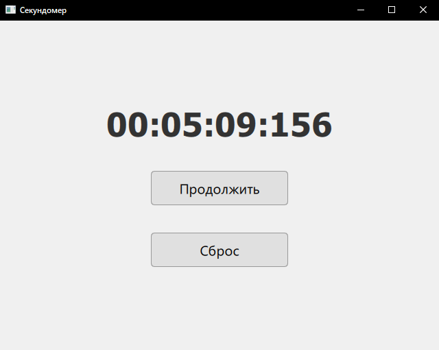

[<p align="center"></p>](../README.md "К проектам")

# Проект Секундомер

[Ссылка на проект](https://github.com/gitnesiss/Info_my_full/tree/main/programming_languages/qt_quick/project/Stopwatch)

## Содержание:

- [1. Описание проекта](#1-описание-проекта)
- [2. Описание файлов и их действий](#2-описание-файлов-и-их-действий)
- [3. Алгоритм работы программы](#3-алгоритм-работы-программы)
- [4. Программа](#4-программа)
- [5. Работа таймера QTimer в Qt](#5-работа-таймера-qtimer-в-qt)
- [6. Возможные улучшения программы](#6-возможные-улучшения-программы)

---

# 1. Описание проекта

[Перейти к содержанию](#содержание)

Проект представляет собой простое оконное приложение **Секундомер**. В окне выводятся секундомер, который запускается сразу с запуском программы, и две кнопки: "**Стоп**" / "**Продолжить**" и "**Сброс**".

<p align="center"></p>

Этот проект демонстрирует идеальное сочетание производительности C++ и красоты QML, с четким разделением обязанностей между компонентами. В этом проекте рассматривается взаимодействие QML и C++.

Данный проект демонстрирует основные принципы взаимодействия C++ и QML, использование паттерна MVC и работу с системой времени в C++. QML овечает за визуальную часть, а C++ за бэкэнд (модель и контроллер).

```
  Представление (QML)             Контроллер (C++)                 Модель (C++) 
┌──────────────────────┐      ┌──────────────────────┐       ┌──────────────────────┐
│       QML View       │      │    C++ Controller    │       │   C++ Model (Time)   │
├──────────────────────┤      ├──────────────────────┤       ├──────────────────────┤
│ - Отображение времени│◀─────│ - Stopwatch класс    │◀────▶│ - std::chrono        │
│ - Кнопки управления  │      │ - Обработка событий  │       │ - Хранение состояния │
└──────────────────────┘      └──────────────────────┘       └──────────────────────┘
       ▲                               ▲
       │                               │
       └───────────┐     ┌─────────────┘
                   │     │
               ┌───┴─────┴───┐
               │   Сигналы   │
               │   и Слоты   │
               └─────────────┘
```

### Как это работает: MVC-архитектура

1. Пользователь нажимает кнопку в QML.

2. QML вызывает метод C++ класса (startStop() или reset()).

3. C++ класс изменяет состояние и вычисляет время.

4. C++ класс генерирует сигналы timeChanged() и runningChanged().

5. QML получает сигналы и обновляет интерфейс.

## Ключевые моменты:
1. Разделение ответственности:
- QML отвечает только за отображение
- C++ обрабатывает логику и вычисления
2. Связь через свойства и сигналы:
- `Q_PROPERTY` делает данные доступными в QML
- Сигналы уведомляют QML об изменениях
- Слоты позволяют QML вызывать методы C++
3. Точное измерение времени:
- Используем `std::chrono::steady_clock` для монотонного времени
- Храним время в миллисекундах для точности
4. Паттерн MVC:
- Model: `std::chrono` и состояние времени
- View: QML интерфейс
- Controller: Класс `Stopwatch`

***

# 2. Описание файлов и их действий

[Перейти к содержанию](#содержание)

**Вот что происходит в программе шаг за шагом:**

#### 🏗️ Сборка проекта (CMakeLists.txt)
- **Настраиваем проект**: Говорим системе сборки, что нам нужен CMake 3.16+ и C++17
- **Подключаем Qt**: Ищем нужные компоненты Qt (QML, GUI)
- **Создаем приложение**: 
  - `appStopwatch` - имя нашей программы
  - Добавляем main.cpp и файлы секундомера
- **Интеграция QML+C++**:
  - `qt_add_qml_module` - "склеивает" QML и C++ код
  - `URI Stopwatch` - создает пространство имен для импорта в QML
- **Настройки платформ**:
  - Для Windows: скрываем консоль
  - Для macOS: настраиваем свойства приложения

#### 🎨 Интерфейс (Main.qml)
- **Окно приложения**: Размер 640x480, светло-серый фон
- **Экземпляр секундомера**:
  ```qml
  Stopwatch { id: stopwatch }
  ```
  - Создает наш C++ объект в QML
- **Отображение времени**:
  ```qml
  Text { text: stopwatch.time }
  ```
  - Автоматически обновляется при изменении свойства
- **Кнопки управления**:
  - "Стоп/Продолжить": меняет текст и вызывает `startStop()`
  - "Сброс": вызывает `reset()`

#### ⚙️ Логика работы (C++)

**Stopwatch.h - объявление класса:**
- `Q_OBJECT` - волшебное слово для Qt (разрешает сигналы/слоты)
- `QML_ELEMENT` - разрешает использовать класс в QML
- **Свойства**:
  - `time` - текущее время (строка)
  - `running` - состояние работы (true/false)
- **Методы**:
  - `startStop()` - запуск/пауза
  - `reset()` - сброс времени
- **Сигналы**:
  - `timeChanged()` - "эй, время изменилось!"
  - `runningChanged()` - "статус работы поменялся!"

**Stopwatch.cpp - реализация:**
1. **Конструктор**:
   - Создает таймер, который "тикает" каждые 17мс (≈60 раз/сек)
   - Автоматически запускает секундомер при создании
   
2. **Расчет времени**:
   ```cpp
   auto totalMs = getCurrentElapsed().count();
   ```
   - Берет общее время в миллисекундах
   - Разбивает на часы/минуты/секунды/мс
   - Форматирует в строку "00:00:00:000"

3. **Управление**:
   - `startStop()`: Переключает состояние и сохраняет/восстанавливает время
   - `reset()`: Обнуляет время и перезапускает отсчет если нужно

4. **Обновление**:
   - Каждые 17мс проверяет: если секундомер работает, шлет сигнал "время изменилось!"

#### 🚀 Запуск (main.cpp)
1. Создает приложение и движок QML
2. Обрабатывает ошибки загрузки
3. Загружает QML-интерфейс из модуля
4. Запускает главный цикл обработки событий

***

# 3. Алгоритм работы программы

[Перейти к содержанию](#содержание)

1. **При включении**:
   - Программа стартует и сразу показывает "00:00:00:000"
   - Секундомер автоматически начинает отсчет времени 🕒

2. **Как работает отсчёт времени**:
   - Внутри есть точные "часики" (библиотека chrono)
   - Каждые 17 миллисекунд (60 раз в секунду) программа:
     - Проверяет текущее время
     - Форматирует его в красивый вид
     - Обновляет цифры на экране

3. **Кнопки управления**:
   - **"Стоп/Продолжить"**:
     - Показывает "Стоп" когда секундомер работает
     - При нажатии останавливает время и меняет надпись на "Продолжить"
     - Повторное нажатие возобновляет отсчет с того же места
   - **"Сброс"**:
     - Обнуляет время до "00:00:00:000"
     - Если секундомер работал - продолжает отсчет с нуля

4. **Что происходит внутри**:
   - **QML (интерфейс)**:
     - Показывает красивые цифры и кнопки
     - "Слушает" изменения от C++ логики
   - **C++ (логика)**:
     - Считает точное время с помощью системных часов
     - Сохраняет состояние (работает/остановлено)
     - Отправляет уведомления в интерфейс при изменениях

5. **Как они общаются**:
   - Когда C++ говорит "время изменилось!", QML обновляет цифры
   - Когда вы нажимаете кнопку в QML, она вызывает метод в C++
   - Это похоже на диалог:
     - QML: "Пользователь нажал кнопку Стоп!"
     - C++: "Окей, останавливаю таймер. Кстати, время сейчас 00:01:23:456"
     - QML: "Хорошо, показываю 00:01:23:456 и меняю кнопку на Продолжить"

6. **Особенности работы**:
   - При остановке программа "запоминает" текущее время
   - При продолжении - добавляет новое время к сохраненному
   - Все вычисления используют точные системные часы
   - Интерфейс обновляется плавно (60 раз в секунду)

**Проще говоря:**
- C++ - это мозг: считает время и управляет логикой
- QML - это лицо: показывает красивый интерфейс
- Они постоянно общаются: когда мозг что-то посчитал - лицо это показывает, когда лицо получает команду - мозг ее обрабатывает

Этот секундомер работает как настоящий профессиональный таймер, но с красивым современным интерфейсом благодаря связке C++ для точных вычислений и QML для красивого отображения.

***

# 4. Программа

[Перейти к содержанию](#содержание)

Этот CMakeLists.txt является стандартным для современных Qt 6 проектов и обеспечивает правильную интеграцию C++ и QML компонентов.

### CMakeList.txt

```cmake
# Минимальная требуемая версия CMake (для Qt 6)
cmake_minimum_required(VERSION 3.16)

# Название проекта и язык проекта - C++
project(Stopwatch VERSION 0.1 LANGUAGES CXX)

# Включаем автоматическую обработку для Qt (moc, rcc, uic). Избавляют от ручного запуска утилит Qt
set(CMAKE_CXX_STANDARD_REQUIRED ON)
set(CMAKE_CXX_STANDARD 17)  # Настройки C++
set(CMAKE_AUTOMOC ON)  # Автоматически обрабатывает Q_OBJECT. Авто-генерация moc файлов. Автоматическая обработка Qt мета-объектов
set(CMAKE_AUTORCC ON)  # Авто-обработка ресурсов (.qrc)
set(CMAKE_AUTOUIC ON)  # Авто-генерация ui файлов

# Ищет Qt 6 и обязательные компоненты: Quick (QML), Gui (графика), Qml (движок QML)
find_package(Qt6 6.5 REQUIRED COMPONENTS Quick Gui Qml)

qt_standard_project_setup(REQUIRES 6.5)

# # Создаем исполняемый файл с именем проекта (Stopwatch) и добавляем исходные файлы. Перечисление всех исходных файлов (включая заголовки при ручной регистрации типа)
qt_add_executable(appStopwatch
    main.cpp
)

# Интеграция QML (самая важная часть):
#    URI Stopwatch: Пространство имен для импорта в QML
#    RESOURCE_PREFIX: Виртуальный путь в ресурсах
#    QML_FILES: Список QML-файлов
qt_add_qml_module(appStopwatch  # qt_add_qml_module - связывает QML файлы с приложением
    URI Stopwatch
    VERSION 1.0
    QML_FILES
        Main.qml
    SOURCES
        stopwatch.h
        stopwatch.cpp
)

# Qt for iOS sets MACOSX_BUNDLE_GUI_IDENTIFIER automatically since Qt 6.1.
# If you are developing for iOS or macOS you should consider setting an
# explicit, fixed bundle identifier manually though.
set_target_properties(appStopwatch PROPERTIES
#    MACOSX_BUNDLE_GUI_IDENTIFIER com.example.appStopwatch
    MACOSX_BUNDLE_BUNDLE_VERSION ${PROJECT_VERSION}
    MACOSX_BUNDLE_SHORT_VERSION_STRING ${PROJECT_VERSION_MAJOR}.${PROJECT_VERSION_MINOR}
    MACOSX_BUNDLE TRUE
    WIN32_EXECUTABLE TRUE  # Скрывает консольное окно при запуске
)

# Подключаем необходимые Qt модули к нашему исполняемому файлу
target_link_libraries(appStopwatch
    PRIVATE Qt6::Quick  # Qt6::Quick - необходим для QML интерфейса
)

include(GNUInstallDirs)

# Установка приложения (опционально): определяет, куда копировать приложение после сборки
install(TARGETS appStopwatch
    BUNDLE DESTINATION .
    LIBRARY DESTINATION ${CMAKE_INSTALL_LIBDIR}
    RUNTIME DESTINATION ${CMAKE_INSTALL_BINDIR}
)
```

#### Автоматическая регистрация типа `Stopwatch` в CMakeList.txt через `qt_add_qml_module`

В CMake-проекте мы использовали `qt_add_qml_module`, который автоматически регистрирует типы, если они указаны в QML_FILES как ассоциированные с C++.

Если мы хотим использовать автоматическую регистрацию через `qt_add_qml_module`, то нужно:
1. В `CMakeLists.txt` для `qt_add_qml_module` добавить аргумент `SOURCES`, указав C++ файлы, которые содержат типы, экспортируемые в QML.
2. `qt_add_qml_module`:
   - Автоматически обрабатывает QML-файлы
   - Генерирует правильные пути для ресурсов
   - Создает импортируемый модуль в QML
3. В заголовочном файле `Stopwatch.h` использовать макрос `QML_NAMED_ELEMENT` (или `QML_ELEMENT`) и не регистрировать тип в `main.cpp`.
    ```cmake
    qt_add_qml_module(${PROJECT_NAME}
        URI Stopwatch
        VERSION 1.0
        QML_FILES
            Main.qml
        SOURCES
            Stopwatch.h
            Stopwatch.cpp
    )
    ```

#### Почему в стандартном шаблоне нет ручной регистрации?
Потому что в стандартном шаблоне, созданном Qt Creator, используется автоматическая регистрация через систему метаобъектов Qt, которая интегрирована с системой сборки. При использовании `qt_add_qml_module` и указании C++ исходников в `SOURCES`, система сборки сгенерирует код для регистрации типов.
#### Какой вариант лучше?
Оба варианта правильные. Ручная регистрация в `main.cpp` более явная и понятна новичкам. Автоматическая регистрация через `qt_add_qml_module` удобнее, потому что не требует писать лишний код.

#### В проекте регистрация нужна для связи C++ и QML

1. Связь C++ и QML:
   - Наш секундомер реализован на C++ (Stopwatch класс)
   - Интерфейс реализован на QML
   - Без регистрации QML не узнает о существовании нашего C++ класса
2. Как это работает в QML:
    ```
    import Stopwatch 1.0  // Тот же модуль, что в qmlRegisterType

    Stopwatch {  // ЭТО НЕ БУДЕТ РАБОТАТЬ БЕЗ РЕГИСТРАЦИИ!
        id: stopwatch
    }
    ```

### main.cpp:

```c++
#include <QGuiApplication>          // Базовый класс приложения (без виджетов)
#include <QQmlApplicationEngine>    // Движок QML

int main(int argc, char *argv[])
{
    // Создаем приложение
    QGuiApplication app(argc, argv);

    // Создаем движок QML
    QQmlApplicationEngine engine;

    // Обработка ошибки загрузки QML
    QObject::connect(
        &engine,
        &QQmlApplicationEngine::objectCreationFailed,   //  **Подключение сигнала `objectCreationFailed`**: обработчик на случай, если загрузка QML-файла не удалась. Это важно для отлова ошибок при запуске приложения.
        &app,
        []() {
            // Выход с ошибкой
            QCoreApplication::exit(-1);
        },
        Qt::QueuedConnection);

    // **Отсутствует явная регистрации типа**: Не используется `qmlRegisterType<Stopwatch>("Stopwatch", 1, 0, "Stopwatch")` для регистрации типа. В стандартном шаблоне этого нет, потому что в CMake-проекте использовалась `qt_add_qml_module`, которая автоматически регистрирует типы, если они указаны в QML_FILES как ассоциированные с C++.

    // Загружаем главный QML файл из модуля (указанного в qt_add_qml_module)
    engine.loadFromModule("Stopwatch", "Main");         // engine.loadFromModule - загружает главный QML файл

    // Запускаем цикл обработки событий
    return app.exec();
}
```

#### Что делает `engine.loadFromModule`?

Эта функция загружает QML-файл из ресурсов модуля. В нашем случае, модуль называется `Stopwatch` (это URI, который мы указали в CMakeLixt.txt в `qt_add_qml_module`), а `Main` — это имя QML-файла без расширения. Фактически, это загрузка файла `qml/Main.qml`.

#### Почему в стандартном шаблоне используется `loadFromModule`, а не `load`?

`loadFromModule` — это более современный способ, который позволяет загружать QML из ресурсов, сгенерированных системой сборки. Это удобно, потому что не требует указывать путь к файлу, а работает по имени модуля.

#### Обработка ошибок:
- Ловит сигнал `objectCreationFailed`
- Выводит сообщение об ошибке через `qCritical()`
- Завершает приложение с кодом ошибки (-1)
#### Загрузка QML:
- `loadFromModule` загружает QML из ресурсов
- "Stopwatch" - имя модуля (из qt_add_qml_module)
- "Main" - главный QML-файл (main.qml)


### Stopwatch.h:
```c++
#ifndef STOPWATCH_H
#define STOPWATCH_H

#pragma once            // Защита от повторного включения

#include <QObject>      // Базовый класс Qt
#include <chrono>       // Библиотека для точного измерения времени
#include <QQmlEngine>   // Для QML_ELEMENT

class Stopwatch : public QObject
{
    Q_OBJECT        // Q_OBJECT - макрос для поддержки сигналов/слотов и свойств Qt
    QML_ELEMENT     // Регистрация класса в QML. QML_ELEMENT - позволяет использовать класс в QML.

    // Свойство для отображения времени (только чтение, уведомляет об изменении через сигнал timeChanged)
    Q_PROPERTY(QString time READ time NOTIFY timeChanged)       // Q_PROPERTY - определяет свойства, доступные в QML: time - текстовое представление времени. Сигналы timeChanged уведомляет QML об изменениях

    // Свойство, указывающее, работает ли секундомер (только чтение, уведомляет через runningChanged)
    Q_PROPERTY(bool running READ running NOTIFY runningChanged) // Q_PROPERTY - определяет свойства, доступные в QML: running - состояние секундомера. Сигналы runningChanged уведомляет QML об изменениях

public:
    // Конструктор с необязательным родительским объектом
    explicit Stopwatch(QObject *parent = nullptr);

    // Метод получения форматированного времени
    QString time() const;
    // Метод для получения состояния (работает/остановлен)
    bool running() const;

public slots:  // Слоты - методы, которые можно вызывать из QML
    // Переключает состояние (старт/стоп)
    void startStop();
    // Сбрасывает секундомер
    void reset();

signals:  // Сигналы - уведомления, которые можно отправлять в QML
    // Сигнал при изменении времени
    void timeChanged();
    // Сигнал при изменении состояния
    void runningChanged();

private:
    // Обновляет время (вызывается периодически)
    void updateTime();

    // Рассчитывает точное текущее время (включая активный интервал)
    std::chrono::milliseconds getCurrentElapsed() const;

    bool m_running = false;  // Состояние: запущен или остановлен
    
    
    std::chrono::steady_clock::time_point m_startTime;  // Время последнего старта
    
    // Накопленное время (при паузе)
    std::chrono::milliseconds m_elapsed = std::chrono::milliseconds(0);  // Накопленное время

};

#endif // STOPWATCH_H
```

### Stopwatch.cpp:
```c++
#include "Stopwatch.h"
#include <QTimer>  // Для периодического обновления
#include <QDebug>

// Конструктор: Создает таймер для обновления интерфейса
Stopwatch::Stopwatch(QObject *parent) : QObject(parent)
{
    // Таймер для обновления времени (60 раз в секунду)
    QTimer *timer = new QTimer(this);
    // Соединяем сигнал таймера timeout с нашим слотом updateTime
    connect(timer, &QTimer::timeout, this, &Stopwatch::updateTime);
    // Запускаем таймер
    timer->start(17);  // ≈60 FPS

    qInfo() << "Application started";
    qDebug() << "QML engine initialized";

    // Автоматический старт перенесён на сторону Main.qml чтобы программа больше соответствовала паттерну MVC.
    // // Автоматический старт при открытии программы
    // startStop();
}

// Рассчитывает точное текущее время (включая активный интервал)
std::chrono::milliseconds Stopwatch::getCurrentElapsed() const
{
    if (m_running) {
        // Время = накопленное + (текущее - время старта)
        return m_elapsed + std::chrono::duration_cast<std::chrono::milliseconds>(
                   std::chrono::steady_clock::now() - m_startTime);
    }

    // Если остановлен, возвращаем накопленное
    return m_elapsed;
}

// Возвращает актуальное время в любой момент, форматируя время в строку формата HH:MM:SS:zzz. time() возвращает актуальное значение через getCurrentElapsed()
QString Stopwatch::time() const
{
    // Определяем общее время в миллисекундах
    auto totalMs = getCurrentElapsed().count();

    int hours = totalMs / 3600000;
    int minutes = (totalMs % 3600000) / 60000;
    int seconds = (totalMs % 60000) / 1000;
    int ms = totalMs % 1000;

    return QString("%1:%2:%3:%4")
        .arg(hours, 2, 10, QLatin1Char('0'))  // Часы, 2 цифры, количество значений в одном разряде, заполняем нулями
        .arg(minutes, 2, 10, QLatin1Char('0'))
        .arg(seconds, 2, 10, QLatin1Char('0'))
        .arg(ms, 3, 10, QLatin1Char('0'));  // милисекунды, 3 цифры, количество значений в одном разряде, заполняем нулями
}

// Получение состояния работы
bool Stopwatch::running() const
{
    return m_running;
}

// Переключает состояние секундомера
void Stopwatch::startStop()
{
    if (m_running) {
        // Если секундомер работал, то останавливаем: сохраняем текущее накопленное время
        m_elapsed = getCurrentElapsed();
    } else {
        // Если был остановлен, то запускаем: запоминаем текущее время как время старта
        m_startTime = std::chrono::steady_clock::now();
    }

    m_running = !m_running;  // Меняем состояние

    // Отправляем сигналы об изменении состояния и времени
    emit runningChanged();
    emit timeChanged();
}

// Сбрасывает секундомер
void Stopwatch::reset()
{
    m_elapsed = std::chrono::milliseconds(0);  // Обнуляем накопленное время
    if (m_running) {
        // Если секундомер работал, то время старта устанавливаем на текущий момент
        m_startTime = std::chrono::steady_clock::now();
    }

    // Сигнализируем об изменении времени
    emit timeChanged();
}

// Вызывается таймером, обновляет время. updateTime() генерирует timeChanged()
void Stopwatch::updateTime()
{
    if (m_running) {
        // Если секундомер работает, то отправляем сигнал, что время изменилось
        emit timeChanged();  // Посылаем сигнал, только если секундомер работает
    }
}
```

### Main.qml:
```qml
import QtQuick
import QtQuick.Controls
import QtQuick.Window
import Stopwatch 1.0  // Импортируем наш C++ модуль. Позволяет определять
                      // Main.qml экземпляр класса Stopwatch. Можно закоментить,
                      // но qml не будет понимать Stopwatch, при этом проект
                      // будет собираться потому что он прописан в CMakeList.txt.

Window {
    width: 640      // Ширина окна
    height: 480     // Высота окна
    visible: true   // Делаем окно видимым
    // title: "Секундомер"
    title: qsTr("Секундомер")   // Заголовок окна
    color: "#f0f0f0"            // Цвет фона (светло-серый)

    // Создаем экземпляр секундомера Stopwatch (наш C++ класс)
    Stopwatch {
        id: stopwatch  // Идентификатор для доступа к свойствам и методам

        // Автоматический старт перенесён из stopwatch.cpp сюда для соответствия паттерну MVC
        // Автоматический старт при создании компонента
        Component.onCompleted: {
            console.log("Секундомер создан. Запускаем...")
            startStop()
        }
    }

    // Вертикальный контейнер для элементов
    Column {
        anchors.centerIn: parent  // Центрируем по центру окна
        spacing: 40               // Расстояние между элементами

        // Текстовый элемент для отображения времени
        Text {
            id: timeDisplay
            text: stopwatch.time    // Привязываем текст к свойству time из C++
            font {
                family: "Monospace" // Моноширинный шрифт для ровного отображения цифр
                pixelSize: 48
                bold: true
            }
            color: "#333"
        }

        // Кнопка "Стоп/Продолжить"
        Button {
            id: controlButton
            text: stopwatch.running ? "Стоп" : "Продолжить" // Текст зависит от состояния
            onClicked: stopwatch.startStop()                // Обработчик клика. При нажатии вызываем метод startStop

            // Стилизация кнопки. Настройки внешнего вида
            width: 200
            height: 50
            font.pixelSize: 20
            background: Rectangle {
                color: parent.down ? "#d0d0d0" : "#e0e0e0"  // Изменение цвета при нажатии
                radius: 5
                border.color: "#999"
            }
            anchors {
                horizontalCenter: parent.horizontalCenter
            }
        }

        // Кнопка "Сброс"
        Button {
            id: resetButton
            text: "Сброс"
            onClicked: stopwatch.reset()    // При нажатии вызываем reset

            width: 200
            height: 50
            font.pixelSize: 20
            background: Rectangle {
                color: parent.down ? "#d0d0d0" : "#e0e0e0"
                radius: 5
                border.color: "#999"
            }
            anchors {
                horizontalCenter: parent.horizontalCenter
            }
        }
    }
}
```

Пояснения по коду:
 - В C++ классе Stopwatch:
   - Мы используем std::chrono для точного измерения времени.
   - Таймер обновляет интерфейс каждые 17 мс (примерно 60 кадров в секунду), что достаточно для плавного отображения.
   - Свойства time и running объявлены с помощью Q_PROPERTY, поэтому они доступны в QML.
   - Сигналы timeChanged и runningChanged уведомляют QML об изменениях.
 - В QML:
   - Импортируем наш модуль Stopwatch 1.0, чтобы использовать класс Stopwatch.
   - Привязываем текст элемента Text к свойству stopwatch.time.
   - Текст кнопки меняется в зависимости от stopwatch.running.
   - При нажатии на кнопки вызываются методы stopwatch.startStop() и stopwatch.reset().

***

# 5. Работа таймера QTimer в Qt

[Перейти к содержанию](#содержание)

### Полная картина работы таймера

1. Инициализация
    ```c++
    Stopwatch::Stopwatch(QObject *parent) : QObject(parent)
    {
        // Создаем таймер (раз в 17 мс)
        QTimer *timer = new QTimer(this);
        
        // Соединяем сигнал таймера с нашим методом
        connect(timer, &QTimer::timeout, this, &Stopwatch::updateTime);
        
        // Запускаем таймер
        timer->start(17);
    }
    ```
2. Работа таймера:
    - Каждые 17 мс таймер генерирует сигнал timeout()
    - Система Qt вызывает соединенный слот Stopwatch::updateTime()
3. Обновление времени:
    ```c++
    void Stopwatch::updateTime()
    {
        if (m_running) { // Если секундомер активен
            emit timeChanged(); // Генерируем сигнал
        }
    }
    ```
4. Реакция в QML:
   - В QML есть привязка: `Text { text: stopwatch.time }`
   - Когда приходит сигнал `timeChanged()`, QML автоматически обновляет текст
   - Вызывается метод `Stopwatch::time()` для получения нового значения

### Почему это важно для секундомера
1. Точность времени:
    - Обновление каждые 17 мс обеспечивает плавное отображение миллисекунд
2. Реактивность интерфейса:
    - QML автоматически обновляется при получении сигналов
3. Эффективность:
    - Таймер не активен, когда секундомер остановлен (проверка m_running)
    - Не нагружает систему при простое
4. Автоматическое управление ресурсами:
    - Таймер уничтожается вместе с родителем
    - Не нужно заботиться об удалении объекта

***

Строка 1: `QTimer *timer = new QTimer(this);`

1. `QTimer *timer`:
    - `QTimer` - класс Qt, представляющий таймер, который может отправлять сигналы через определенные интервалы времени
    - `*timer` - объявление указателя на объект типа QTimer
2. `new QTimer(this)`:
    - `new` - оператор C++ для динамического создания объекта в куче
    - `QTimer()` - вызов конструктора класса QTimer
    - `(this)` - передача указателя на текущий объект (Stopwatch) в качестве родителя

#### Что это делает:
- Создает новый объект таймера
- Устанавливает текущий объект (Stopwatch) в качестве родителя таймера

#### Зачем нужно:
- Автоматическое управление памятью: Когда родительский объект (Stopwatch) будет уничтожен, Qt автоматически уничтожит и дочерний таймер
- Контекст выполнения: Таймер будет работать в том же потоке, что и родительский объект

#### Аналогия из жизни:
Представьте, что вы (Stopwatch) заводите будильник (QTimer) и ставите его на свою тумбочку (this). Когда вы уходите из комнаты (уничтожаетесь), будильник автоматически убирается.

***

Строка 2: `connect(timer, &QTimer::timeout, this, &Stopwatch::updateTime);`

1. `connect()`:
   - Функция Qt для установки связи между сигналом и слотом
   - Основа системы сигналов-слотов в Qt

2. Параметры:
   - `timer`: Объект-источник сигнала (наш таймер)
   - `&QTimer::timeout`: Указатель на сигнал таймера (сигнал, который испускается при срабатывании таймера)
   - `this`: Объект-получатель (текущий экземпляр Stopwatch)
   - `&Stopwatch::updateTime`: Указатель на метод-обработчик (слот)

#### Что это делает:
Создает соединение: "Когда таймер срабатывает (timeout), вызывай метод updateTime() текущего объекта"

#### Зачем нужно:
- Реализует механизм обратного вызова (callback)
- Позволяет реагировать на периодические события
- Обеспечивает асинхронное выполнение

#### Как работает сигнал-слот:

```
┌───────────┐       timeout        ┌─────────────┐
│  QTimer   ├──────────────────────▶ Stopwatch   │
└───────────┘       сигнал         └─────────────┘
                                      │
                                      ▼ updateTime()
                                   (вызов метода)
```

#### Важные особенности:
1. Типы безопасности: Qt проверяет совместимость сигнатуры сигнала и слота
2. Автоматическое соединение: Управляется системой событий Qt
3. Межпоточная коммуникация: Можно соединять объекты из разных потоков

***

Строка 3: `timer->start(17); // ≈60 FPS`

1. `timer->start()`:
    - Вызов метода start() объекта timer
    - Запускает таймер
2. `(17)`:
    - Интервал времени в миллисекундах
    - Таймер будет срабатывать каждые 17 мс
3. `// ≈60 FPS`:
    - Комментарий для пояснения
    - 1000 мс / 17 мс ≈ 58.8 кадров в секунду
    - Округляется до 60 FPS (frames per second)

#### Что это делает:
Запускает таймер, который будет:
1. Отсчитывать интервалы по 17 миллисекунд
2.  При каждом срабатывании интервала испускать сигнал timeout()
3. Сигнал timeout() будет вызывать метод updateTime() через ранее установленное соединение

#### Зачем нужно:
- Обеспечивает регулярное обновление времени в секундомере
- Позволяет создать плавную анимацию
- Реализует основной цикл обновления интерфейса

#### Что происходит в updateTime():

```c++
void Stopwatch::updateTime()
{
    if (m_running) {
        emit timeChanged(); // Генерируем сигнал об изменении времени
    }
}
```

***

# 6. Возможные улучшения программы:

[Перейти к содержанию](#содержание)

1. Добавить сохранение состояния при выходе:
  ```c++
  Q_PROPERTY(int savedTime READ savedTime WRITE setSavedTime)
  ```
2. Добавить круги и историю кругов:
  ```c++
  Q_INVOKABLE void saveLap();
  ```

[Перейти к содержанию](#содержание)

[<p align="center"></p>](../README.md "К проектам")
