[<p align="center"></p>](../README.md "На главную")

# Qt Quick Controls

## Содержание:

1. [Урок 1: Введение в Qt Quick Controls](#урок-1-введение-в-qt-quick-controls)
2. [Урок 2: Основы быстрого управления Qt](#урок-2-основы-быстрого-управления-qt)
3. [Урок 3: Настройка проекта и окна](#урок-3-настройка-проекта-и-окна)
4. [Урок 4: Визуальные контейнеры](#урок-4-визуальные-контейнеры)
5. [Урок 5: Реализация контроля](#урок-5-реализация-контроля)
6. [Урок 6: Реализация контроля](#урок-6-реализация-контроля)
7. [Урок 7: Иконки и цвет](#урок-7-иконки-и-цвет)

---

# Урок 1: Введение в Qt Quick Controls

[Перейти к содержанию](#содержание)

[Ссылка на курс](https://academy.qt.io/enrollments/260579705/page/987242755)

[Скрытыйкомментарий который не отображается при выводе файла markdown]: #

- В этом курсе вы примените свои знания QML и Qt Quick, изучив модуль Qt Quick Controls и его основные типы для создания пользовательских интерфейсов посредством создания простого приложения.
Используя предоставленные ресурсы, вы изучите анатомию Control, изучите базовый стиль элементов управления Qt Quick и разместите компоненты с помощью макетов. К концу курса у вас будет простое приложение Home Control.
- Этот курс предназначен для тех, кто хочет добавить новые технологии дизайна пользовательского интерфейса в свой инструментарий, и дизайнеров, которые хотят воплотить свои идеи дизайна пользовательского интерфейса в жизнь, создав пример, который они могут адаптировать и исследовать.
- Перед началом работы мы рекомендуем вам быстро освоить Qt и QML, записавшись на курсы Introduction to QML и Introduction to Qt Quick.

# Что мы будем изучать

1. Что такое Qt Quick Controls?
2. Какие свойства являются общими для Controls?
3. Как можно просто определить расположение элементов в приложениях?
4. Как использовать базовый стиль Qt Quick Controls?
5. Как можно просто стилизовать компоненты?
6. Как определить типы QML с помощью файла QML?

# Об этом курсе

💬 Курс содержит видео с английскими субтитрами. Вы также можете прочитать расшифровки видео отдельно.

⏱ Продолжительность этого курса составляет около 65 минут.

💻 Вам понадобится:

Ноутбук или настольный компьютер
Qt и совместимая IDE (например, Qt Creator)

# Что такое Qt Quick Controls?

> Перед началом проекта важно понять, что такое Qt Quick Controls и как он строится на модуле Qt Quick с использованием языка QML. Знание этого позволит вам понять и визуализировать, как эти элементы объединяются вместе и какие свойства вы можете использовать для определения стиля и функций ваших приложений QML.

Qt Quick Controls — это набор элементов управления пользовательского интерфейса, которые построены на основе фреймворка Qt Quick с использованием языка QML. Представленные в Qt 5.7, эти элементы управления предоставляют разработчикам готовые, универсальные и настраиваемые элементы пользовательского интерфейса, которые можно использовать для создания полных интерфейсов в приложениях Qt Quick. Эти элементы управления легко адаптируются, что упрощает разработчикам создание приложений, которые имеют единообразный вид и поведение на разных платформах.

Главное преимущество Qt Quick Controls заключается в том, что они предлагают высокоуровневый, простой в использовании уровень абстракции для часто используемых компонентов пользовательского интерфейса, таких как кнопки, ползунки, текстовые поля ввода и многое другое. Они разработаны так, чтобы быть визуально привлекательными и удобными для пользователя, ускоряя процесс разработки пользовательского интерфейса. В приведенном ниже примере кода элементы управления Qt Quick Controls используются для создания небольшого окна приложения с кнопкой в ​​центре с текстом «Нажмите здесь».

```
import QtQuick.Controls

ApplicationWindow {
    visible: true
    width: 640
    height: 480
    title: "Qt Quick Controls Example"

    Button {
        text: "Click Here"
        anchors.centerIn: parent
    }
}
```

> Модуль предоставляет API QML, который предоставляет типы QML для создания пользовательских интерфейсов с помощью языка QML, а также API C++ для расширения приложений QML с помощью кода C++.

Чтобы использовать Qt Quick Controls в вашем приложении QML, импортируйте модуль в ваш файл .qml. Это делается с помощью оператора импорта, показанного ниже:

```
import QtQuick.Controls
```

CMake — популярная система сборки, которую можно использовать для компиляции и компоновки приложения Qt Quick, включая приложения, использующие Qt Quick Controls. Чтобы использовать классы Qt Quick Controls C++, нужно использовать `find_package()` для поиска модуля в пакете Qt6 и связать библиотеки с проектом с помощью `target_link_libraries()`, как показано ниже:

```
find_package(Qt6 REQUIRED COMPONENTS QuickControls2)
target_link_libraries(mytarget PRIVATE Qt6::QuickControls2)
```

# Пункт: Основы визуальных элементов

В Qt Quick тип [Item](https://doc.qt.io/qt-6/qml-qtquick-item.html) является основополагающим элементом для всех визуальных элементов. Хотя объект Item не имеет визуального представления, он устанавливает атрибуты, общие для всех визуальных элементов. В приложении Qt Quick каждый видимый компонент, будь то базовая форма или сложный интерактивный элемент, является либо Item, либо производным от него.

Item определяет общие свойства для визуальных элементов, включая размер (`width` (ширину) and `height` (высоту)), положение (`x` и `y`) и основные поведения (`visibility`  (видимость) и `enabled` (включенность)). Он может содержать дочерние элементы, формируя таким образом иерархическую древовидную структуру. Эти группировки закладывают основу для сцены Qt Quick.

```
Item {
    Image {
        source: "image1.png"
    }
    Text {
        text: "Hello, World!"
    }
}
```

Ниже приведены некоторые общие свойства с кратким объяснением того, что они делают. Прямоугольные элементы используются для визуальной демонстрации. Нажмите на +, чтобы узнать больше:

<details>
<summary><b>width</b>, <b>height</b>, <b>x</b> и <b>y</b></summary>

Определите размер и положение элемента. Положение относительно родительского объекта, внутри которого он находится.
    
```
Rectangle {
width: 200
height: 200
color: "red"

    Rectangle {
        width: 100
        height: 100
        x: 100 
        y: 100
        color: "blue"
    }
}
```

<p align="center"></p>
    
</details>

<details>
<summary><b>scale</b></summary>

Коэффициент масштабирования элемента. Значение по умолчанию — 1,0. Масштаб меньше 1,0 приводит к уменьшению размера элемента, а масштаб больше 1,0 — к увеличению размера элемента. Отрицательный масштаб приводит к зеркальному отображению элемента при его отображении.
    
```
Rectangle {
    color: "blue"
    width: 200
    height: 200

    Rectangle {
        color: "green"
        width: 25
        height: 25
    }

    Rectangle {
        color: "red"
        x: 25
        y: 25
        width: 50
        height: 50
        scale: 1.5
        transformOrigin: Item.TopLeft
    }
}
```

<p align="center">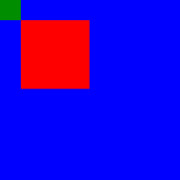</p>
    
</details>

<details>
<summary><b>rotation</b></summary>

Поворот в градусах по часовой стрелке вокруг точки transformOrigin.
    
```
Rectangle {
    color: "blue"
    width: 200
    height: 200

    Rectangle {
        color: "red"
        x: 50
        y: 50 
        width: 100
        height: 100
        rotation: 45
    }
}
```

<p align="center">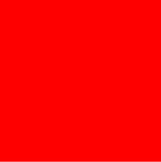</p>
    
</details>

<details>
<summary><b>visible</b></summary>

Это свойство определяет, является ли элемент видимым. По умолчанию это true. Установка этого свойства напрямую влияет на видимое значение дочерних элементов.
    
```
Rectangle {
    width: 200
    height: 200
    color: "red"

    Rectangle {
        width: 100
        height: 100
        x: 100
        y: 100
        color: "blue"
        visible: false
    }
}
```

<p align="center"></p>
    
</details>

<details>
<summary><b>enabled</b></summary>

Это свойство определяет, получает ли элемент события мыши и клавиатуры. По умолчанию это true.
    
```
Rectangle {
    width: 200
    height: 200
    color: "red"
    MouseArea {
        anchors.fill: parent
        onClicked: {
            console.log("Red Clicked")
        }
    }
}
Rectangle {
    x: 200
    width: 200
    height: 200
    color: "blue"
    enabled: false
    MouseArea {
        anchors.fill: parent
        onClicked: {
            console.log("Blue Clicked")
        }
    }
}
```

<p align="center">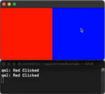</p>
    
</details>

<details>
<summary><b>transformOrigin</b></summary>

Это свойство содержит исходную точку, вокруг которой происходит преобразование масштаба и вращения.

Доступно девять исходных точек преобразования, как показано на рисунке ниже. Исходная точка преобразования по умолчанию — Item.Center.
    
<p align="center">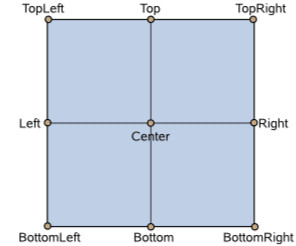</p>
    
</details>

<details>
<summary><b>opacity</b></summary>

Это свойство содержит непрозрачность элемента. Непрозрачность указывается как число от 0,0 (полностью прозрачный) до 1,0 (полностью непрозрачный). Значение по умолчанию — 1,0. Когда это свойство установлено, указанная непрозрачность также применяется индивидуально к дочерним элементам.
    
```
Rectangle {
    color: "red"
    width: 200
    height: 200
    Rectangle {
        opacity: 0.5
        color: "blue"
        x: 50
        y: 50
        width: 200
        height: 200
    }
}
```

<p align="center"></p>
    
</details>

---

# Урок 2: Основы быстрого управления Qt

[Перейти к содержанию](#содержание)

[Control](https://doc.qt.io/qt-6/qml-qtquick-controls-control.html#details) — базовый тип в Qt Quick Controls. Как базовый тип, он предоставляет основной набор функций, которые наследуют все Qt Quick Controls. Он наследуется от Item и формирует основу более сложных элементов управления, таких как кнопки, текстовые поля, ползунки и т. д. Наследуясь от Item, Control наследует все основные визуальные свойства и методы, обсуждавшиеся выше, но также добавляет более специализированные свойства и функции, характерные для интерактивных элементов пользовательского интерфейса.

Элементы управления могут обрабатывать вводимые пользователем данные, быть стилизованными и тематическими, а также включать такие функции, как шрифт и локаль, что делает их более подходящими для создания интерактивных компонентов пользовательского интерфейса.

Создание компонента Button, который наследуется от control, так же просто, как:

```
Button {
    text: "Click Here"
}
```
<p align="center"></p>

<p align="center">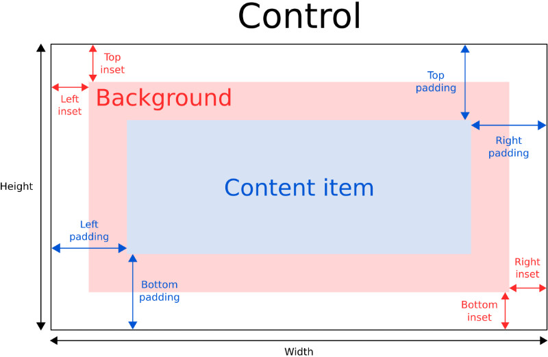</p>

Эта диаграмма иллюстрирует анатомию типичного элемента управления. Здесь мы видим некоторые знакомые свойства — ширину и высоту, а также некоторые новые свойства для управления размером, содержимым и их взаимосвязью. Давайте рассмотрим эти свойства и то, как они влияют на размер, стиль и содержимое элемента управления. Раскройте скрытый текст, чтобы узнать больше:

<details>
<summary><b>contentItem</b></summary>

**contentItem** — это визуальное представление содержимого элемента управления, которое может быть текстом, изображениями или пользовательскими компонентами QML. Это центральная точка взаимодействия пользователя с элементом управления. Например, метка «Нажмите здесь» предлагает пользователю щелкнуть по этой конкретной области. Элемент внутри contentItem имеет размер, соответствующий заполнителю родителя.
    
```
Button {
    contentItem: Label {
        text: "Click Here"
        font.pointSize: 24
        font.bold: true
        verticalAlignment: Text.AlignVCenter
    }
}
```

<p align="center">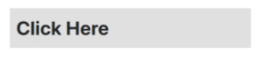</p>
    
</details>

<details>
<summary><b>background</b></summary>

Свойство **background** — это визуальный элемент, представляющий фон элемента управления. Он часто визуально изменяется в ответ на состояние элемента управления, например, когда он нажат или отключен. Если для элемента фона не указан явный размер, он автоматически следует размеру элемента управления.

В большинстве случаев нет необходимости указывать **implicitWidth** или **implicitHeight** для элемента фона. Большинство элементов управления используют неявный размер элемента фона для вычисления неявного размера самого элемента управления. Если вы заменяете элемент фона на пользовательский, вам также следует рассмотреть возможность предоставления для него разумного неявного размера (если это не элемент типа Image, который имеет свой собственный неявный размер).
    
```
Button {
    text: "Click Here"

    background: Rectangle {
        implicitWidth: 300
        implicitHeight: 50
        color: parent.down ? "#d1d5db" : "#29C878"
    }
}
```

<p align="center">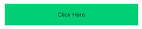</p>
    
</details>

<details>
<summary><b>inset</b></summary>

Проиллюстрированные красными стрелками выше, свойства вставки (**inset**) влияют на расположение фона относительно внешних краев элемента управления. Вставки могут расширять интерактивную область элемента управления, не влияя на его визуальный размер. Вставки влияют на размер элемента управления и, следовательно, будут влиять на то, сколько места они занимают в макете. Отрицательные вставки можно использовать, чтобы сделать фон больше элемента управления по стилистическим причинам, например, добавить эффект тени к фону.
    
```
Button {
    topInset: -2
    leftInset: -2
    rightInset: -6
    bottomInset: -6

    text: "Click Here"

    background: Image {
        source: "assets/Button-Green-DropShadow.png"
    }
}
```

<p align="center">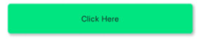</p>
    
</details>

<details>
<summary><b>padding</b></summary>

Padding добавляет пространство между каждым краем элемента содержимого и фоновым элементом, эффективно управляя размером элемента содержимого. Чтобы указать значение padding для определенного края элемента управления, задайте его соответствующее свойство: **leftPadding**, **rightPadding**, **topPadding** и **bottomPadding**. Для удобства вы также можете использовать **'padding'**, чтобы задать свойствам одинаковое значение.
    
```
Button {
    leftPadding: 10
    rightPadding: 10
    topPadding: 10
    bottomPadding: 10

    contentItem: Label {
        text: "Click Here"

        Rectangle {
            anchors.fill: parent
            color: "red"
            opacity: 0.2
        }
    }
}
```

<p align="center">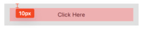</p>
    
</details>

<details>
<summary><b>font</b></summary>

Свойство шрифта **font** определяет внешний вид текста в элементе управления. Это свойство используется стилем элемента управления для отображения стандартных компонентов и обеспечивает соответствие пользовательских элементов управления собственной эстетике платформы. Как правило, разные платформы или стили могут указывать различные шрифты для приложения. Элементы управления наследуют явные свойства шрифта от своего родителя, каскадируясь на всех дочерних элементов и заменяя любые системные настройки по умолчанию для этого атрибута. Иногда свойства охватывают набор атрибутов подсвойств, которые могут быть назначены с помощью точечной или групповой нотации. Хотя в приведенном примере используется групповая нотация, можно также задать отдельные свойства, такие как **font.family**.
    
```
Button {
    text: "Click Here"

    font {
        family: "wingdings"
        pixelSize: 24
    }
}
```

<p align="center">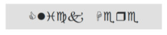</p>
    
</details>

<details>
<summary><b>locale</b></summary>

Это свойство содержит локаль элемента управления. Оно содержит локальные свойства для форматирования данных и чисел, такие как даты, измерения и направление текста. Если не установлена ​​специальная локаль, это локаль родителя или локаль по умолчанию. Элемент управления распространяет локаль от родителя к дочерним элементам. Если вы меняете локаль элемента управления, эта локаль распространяется на все дочерние элементы элемента управления, переопределяя системную локаль по умолчанию.

<p align="center">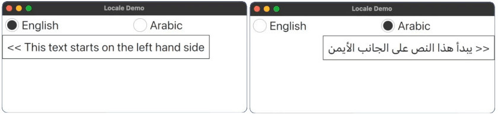</p>
    
</details>

---

# Урок 3: Настройка проекта и окна

[Перейти к содержанию](#содержание)

## Обзор проекта

Мы создадим простое приложение для управления домом, похожее на функциональность, которую вы можете увидеть на устройстве умного дома, используя Qt Quick Controls, QML и JavaScript. К концу курса вы создадите приложение, которое включает в себя различные стандартные элементы управления из модуля Qt Quick Controls, что приведет к созданию функционального приложения, предлагающего возможности для дальнейшего расширения и исследования.

<p align="center"></p>

В каждом разделе мы рассмотрим различные компоненты, которые лягут в основу нашего приложения, чтобы дать вам более глубокое понимание Qt Quick Controls. Давайте рассмотрим некоторые компоненты, которые мы будем использовать в этом разделе.

## ApplicationWindow

[ApplicationWindow](https://doc.qt.io/qt-6/qml-qtquick-controls-applicationwindow.html) — это тип QML, предоставляемый Qt Quick Controls. Он служит в качестве стилизованного окна верхнего уровня с удобными свойствами для структурирования вашего приложения. Он содержит несколько свойств, которые вы можете узнать из предыдущего объяснения типа **Control**, такие как **background**, **contentItem**, **font**, и **locale**. Подобно компоненту Window, который вы могли использовать ранее, окно приложения по умолчанию не отображается.

ApplicationWindow помогает облегчить создание последовательного и организованного макета пользовательского интерфейса, предоставляя свойства, которые могут содержать элементы в соответствующих областях окна. Например, заголовок **header**, который отображается в верхней части окна, нижний колонтитул **footer**, расположенный внизу, и **menuBar**, расположенный в самом верху, что обеспечивает легкую навигацию.

<p align="center">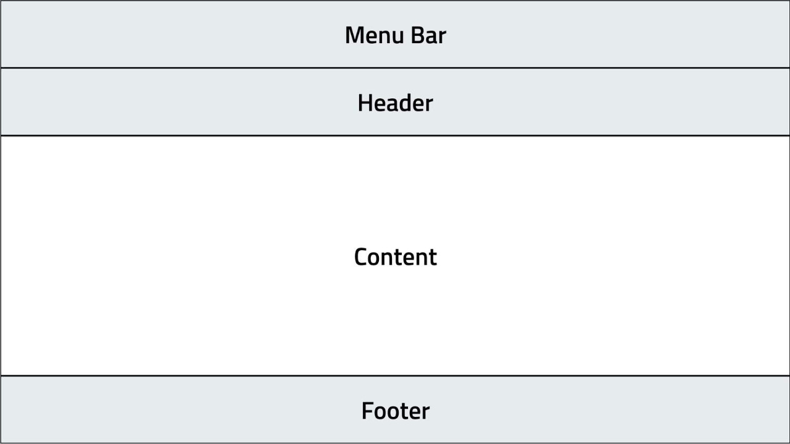</p>

```
ApplicationWindow {
    visible: true

    menuBar: MenuBar {
        // ...
    }

    header: ToolBar {
        // ...
    }

    footer: TabBar {
        // ...
    }
}
```

## Создание проекта

Загрузите файлы проекта с помощью кнопки справа. Ассеты, используемые в этом разделе, находятся в папке '00-Assets' в репозитории GitHub: [ссылка на проект на GitHub](https://github.com/qt-learning/Intro-Qt-Quick-Controls)

[](https://d3pg1c2bhy6429.cloudfront.net/114478/whbsGfuiNfkI98JagIlWQq4RWpx2gvCTIumCErq2/scormcontent/assets/01-Project-Setup.mp4?v=1)

<details>
<summary><b>Расшифровка видео</b></summary>

В этом видео мы начнем настраивать наш проект, готовый к созданию приложения Home Controls с выбором Qt Quick Controls.

Вы можете быть знакомы с существующими системами, которые могут отвечать за климат, безопасность, музыку и многие другие функции для вашего дома.

Этот курс создает простое приложение Home Controls, чтобы представить ряд Qt Quick Controls, как они выглядят, некоторые из их самых полезных свойств и как их использовать.

Для начала мы сосредоточимся только на первом наборе домашних элементов управления — климате. Дополнительные функции, такие как безопасность, музыка и т. д., могут быть изучены в последующих курсах, или почему бы не бросить вызов себе после изучения основ!

Как мы увидим, внешний вид и поведение будут основаны на стиле Qt Quick Controls «Basic», поэтому он будет выглядеть довольно просто. Но по мере изучения множества различных элементов управления и их свойств мы постараемся сделать их более визуально привлекательными по мере продвижения.

Давайте создадим новый проект Qt Quick с помощью мастера создания новых проектов.

Выберите Файл > Новый проект.

Выберите «Приложение (Qt)» и «Qt Quick Application».

На вкладке Расположение проекта мы даем нашему проекту имя «HomeControls» и оставляем расположение проекта по умолчанию как есть.

Поскольку этот курс лучше всего выполнять с Qt 6.5 или более поздней версией, мы выбираем Qt 6.5 в качестве минимальной версии из этого раскрывающегося списка. Это дает мастеру несколько подсказок о том, как настроить проект.

На вкладке Выбор комплектов вы можете выбрать, какую версию Qt использовать для этого проекта.

Вы можете выбрать Qt 6.5 или более поздней версией. Но давайте пока остановимся на Qt 6.5.

Мы также можем пока пропустить управление проектом, поскольку нас пока не интересует контроль версий.

Нажмите, готово — мы должны увидеть совершенно новый проект с простым окном и заголовком, объявляющим миру, что мы успешно дошли до этого места.

Быстрая сборка и запуск подтвердят, что то, что мы видим, на самом деле верно, и мы отлично стартовали.

</details>

### Резюме: Создание проекта

- Шаг 1: Создать новый проект

    <p align="center">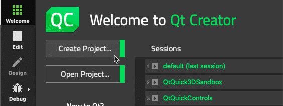</p>

    Открыв Qt Creator, мы создали новый проект, выбрав «Создать проект» на экране приветствия.

- Шаг 2: Выберите шаблон

    <p align="center">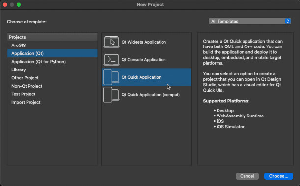</p>

    Мы выбрали 'Qt Quick Application' в качестве шаблона для запуска приложения. Это дает нам базовое приложение "Hello World".

- Шаг 3: Назовите свой проект

    <p align="center">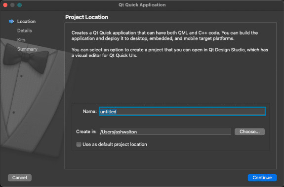</p>

    Назовите проект (в данном случае мы назвали его «HomeControls») и выберите место сохранения, не изменяя данные проекта.

- Шаг 4: Выбор комплекта

    <p align="center">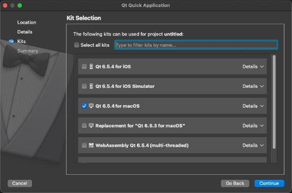</p>

    Далее мы выбрали набор, подходящий для системы и версии Qt. Выберите соответствующий набор для вашей операционной системы. Например, если вы используете Mac с Qt 6.5.4, выберите «Qt 6.5.4 для macOS». Этот шаг имеет решающее значение, поскольку он определяет настройки сборки и запуска вашего проекта. После выбора набора продолжайте работу без настройки контроля версий и завершите настройку проекта.


## Настройка окна приложения

[](https://d3pg1c2bhy6429.cloudfront.net/114478/whbsGfuiNfkI98JagIlWQq4RWpx2gvCTIumCErq2/scormcontent/assets/01-Window-Setup.mp4?v=1)

<details>
<summary><b>Расшифровка видео</b></summary>

Создав наше первоначальное приложение «Hello World», давайте начнем его изучать и внесем некоторые изменения, чтобы подготовить наш проект Home Controls.

В верхней части нашего файла Main dot qml мы видим, что модуль Qt Quick уже импортирован.

Этот импорт дает нам доступ ко многим элементарным элементам, таким как Item, Rectangle, Text, MouseArea и многим другим.

Модуль Qt Quick Controls дает нам доступ к гораздо большему набору элементов и элементов управления. Поэтому, чтобы получить к ним доступ, мы должны импортировать модуль Qt Quick Controls.

Модуль имеет несколько предопределенных стилей, как показано в этом раскрывающемся меню. Вы можете выбрать один из них, чтобы элементы управления отображались как дома на различных платформах и устройствах. Для этого проекта мы выберем стиль «Basic», чтобы наше приложение имело одинаковый вид и поведение независимо от вашей платформы.

Импортировав модуль Qt Quick Controls, давайте используем наш первый элемент управления — ApplicationWindow.

ApplicationWindow наследует стандартный элемент Window, но структурирован больше как Control, у которого есть contentItem и background. Он также имеет необязательные свойства menuBar, header и footer.

Сначала мы должны дать нашему окну идентификатор.

Небольшой совет об идентификаторах и привязках. Каждый документ QML имеет корневой элемент, который должен начинаться с простого идентификатора. Например, window, root или control. На этот идентификатор может ссылаться любой дочерний объект в контексте этого документа QML (и только в нем). Представьте корневой элемент как корень дерева, а элементы внутри него — как ветви. Каждое свойство, привязываемое к другому свойству другого объекта в контексте текущего документа QML, должно квалифицировать свойство с помощью идентификатора. Это избавит движок QML от необходимости пытаться разрешить его за вас (что занимает время) и предотвратит случайное разрешение неправильного объекта, если таковой существует (до или после рефакторинга).

Давайте изменим тип окна нашего корневого элемента «Window» на Qt Quick Controls «ApplicationWindow».

Мы можем задать окну больший размер по умолчанию, например, десять двадцать четыре на восемьсот, чтобы дать нам больше места для сборки. Его можно свободно изменить в любое время, даже во время выполнения, изменив размер окна. Мы также должны обновить заголовок нашего приложения, чтобы он был более релевантным, назовем его «Home Controls».

Обратите внимание, что мы используем функцию QSTR здесь в качестве хорошей практики для всех видимых строк пользовательского интерфейса, чтобы их можно было перевести и отобразить на другом языке. Хотя переводы, интернационализация и локализация здесь не рассматриваются, рассмотрите возможность использования QSTR в вашем пользовательском интерфейсе, чтобы вы могли позже изучить локализацию приложения.

ApplicationWindow предоставляет место верхнего уровня для установки шрифтов, палитр и локали для всего приложения.

В нашем случае мы можем установить шрифт pixelSize на 24, который будет унаследован всеми текстовыми элементами, которые являются дочерними элементами нашего ApplicationWindow. Это сделает наш текст во всем приложении последовательно больше в качестве стилистического выбора.

Мы добавим несколько изображений и масштабируемых значков, чтобы наш проект выглядел более интересно. Для этого мы скопируем ресурсы, предоставленные в репозитории Git для этого курса, и скопируем их в нашу локальную папку проекта home controls. Затем мы должны добавить их в наш проект CMake с помощью пункта меню «Добавить существующий каталог», где мы выберем папку ресурсов. Это добавит ссылки на ресурсы в ресурсы нашего модуля QML в файле CMake. Теперь мы готовы использовать ресурсы в нашем проекте.

Давайте начнем с назначения изображения свойству background окна ApplicationWindow. Назначение свойству background означает, что изображение автоматически изменяет размер в соответствии с размером окна, поэтому здесь нет необходимости явно задавать размер. (свойства menuBar, header и footer ведут себя одинаково только для ширины окна, но не для высоты).

Установите fillMode изображения на Image PreserveAspectCrop. Это сообщает элементу Image не делать letterbox или растягивать наше изображение, если оно не того же размера, что и окно.

Установите источник изображения на Qt resolveUrl, и мы передаем наш путь к ресурсу изображения в качестве параметра функции.

Совет о разрешении URL. Хотя Image явно не требует этого, хорошей привычкой является всегда использовать Qt resolveUrl для всех относительных URL при использовании в свойстве, которое его ожидает. При использовании Qt resolveUrl URL разрешается в базовый URL текущего документа QML.

Теперь вы должны иметь возможность построить и запустить и увидеть красивое окно с матовым металлическим фоном.

</details>

### Резюме: настройка окна приложения

Теперь у нас есть визуальная основа нашего приложения. Мы импортировали Qt Quick Controls, используя стиль Basic. Мы использовали ApplicationWindow для установки размера шрифта для его дочерних элементов и использовали свойство background для установки импортированного матового металлического фона. Вот как мы это сделали:

- Шаг 1: Импорт Qt Quick Controls

```
import QtQuick.Controls.Basic
```

Мы импортировали модуль Qt Quick Controls, чтобы расширить наш набор инструментов, что позволило нам получить доступ к ряду элементов управления пользовательского интерфейса, необходимых для нашего приложения. Мы выбрали стиль "Basic" из доступных предопределенных стилей, гарантируя, что наше приложение будет поддерживать единообразный вид на разных платформах.

- Шаг 2: Использование ApplicationWindow

```
ApplicationWindow {
    id: window

    width: 1024
    height: 800
    visible: true

    title: qsTr("Home Controls")

    font.pixelSize: 24
}
```

Затем мы заменили базовый тип **Window** на **ApplicationWindow** из Qt Quick Controls, который более структурирован и включает в себя дополнительные функции, такие как **contentItem**, **background** и необязательные свойства для **menuBar**, **header** и **footer**. Мы назначили нашему окну идентификатор, который необходим для ссылок в документе QML. Изменив корневой элемент на ApplicationWindow и изменив размер по умолчанию на 1024x800 пикселей, мы расширили пространство дизайна для нашего приложения. Мы также обновили заголовок приложения на «Home Controls» и изменили размер шрифта до 24 пикселей, чтобы добиться согласованного и визуально привлекательного размера текста во всем приложении.

- Шаг 3: Импорт ассетов

<p align="center">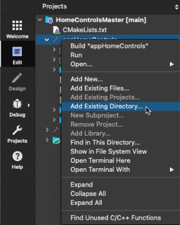</p>

Мы скопировали изображения и масштабируемые значки из предоставленного репозитория Git в нашу папку проекта и интегрировали их в наш проект с помощью CMake. Этот шаг включал добавление каталога assets в проект CMake, обновление ресурсов нашего модуля QML, чтобы убедиться, что assets готовы к использованию.

- Шаг 4: Установка фона приложения

<p align="center">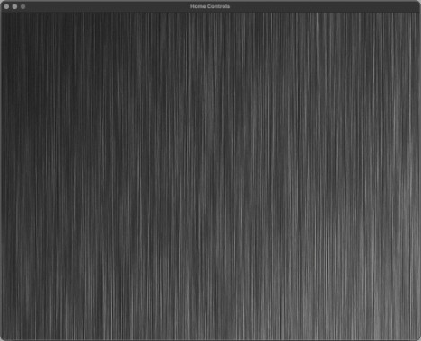</p>

Мы установили изображение в качестве **background** фона для нашего **ApplicationWindow**, настроив его **fillMode** на '**PreserveAspectCrop**', чтобы сохранить соотношение сторон без растяжения. Мы использовали функцию **Qt.resolvedUrl()** для установки источника изображения, гарантируя, что URL-адрес будет правильно разрешен относительно нашего документа QML. Хотя это не является обязательным для свойства источника элементов Image, это отличный совет, который следует помнить всякий раз, когда вы назначаете URL-адрес любому свойству Item, требующему его. Это дало нашему приложению фон из матового металла, видимый при сборке и запуске проекта.

### Прогресс кода

Вот фрагмент того, что мы добавили в наш файл Main.qml:

```
ApplicationWindow {
    id: window

    width: 1024
    height: 800
    visible: true

    title: qsTr("Home Controls")

    font.pixelSize: 24

    background: Image {
        source: Qt.resolvedUrl("assets/BrushedMetal.jpg")
        fillMode: Image.PreserveAspectCrop
    }
}
```

> **Репозиторий проекта**
>
> Чтобы увидеть весь проект в его текущем виде, перейдите к '**01-Project-Setup**' в репозитории проекта. Вы можете открыть проект, перейдя к **CMakeLists.txt** в Qt Creator.
>
> [Ссылка на GitHub](https://github.com/qt-learning/Intro-Qt-Quick/tree/main)

Далее мы начнем структурировать наше приложение для управления домом с помощью макетов.

---

# Урок 4: Визуальные контейнеры

[Перейти к содержанию](#содержание)

Визуальный макет, который мы создадим для приложения, показан с помощью цветных прямоугольников.

<p align="center">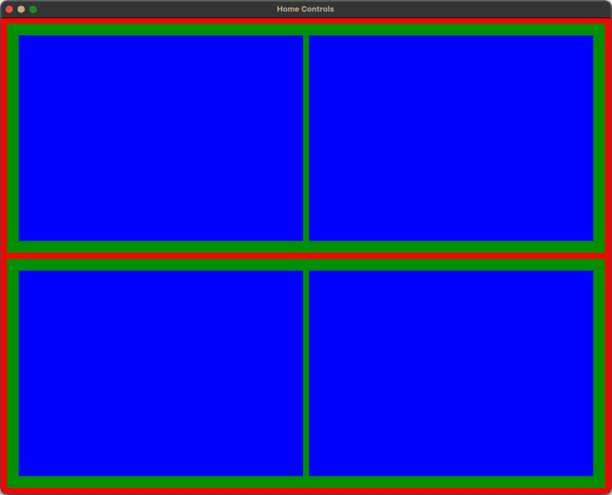</p>

Теперь у нас есть основа для нашего приложения управления домом с фоном из матового металла и соответствующим заголовком окна. К концу этого раздела мы создадим визуальную структуру для нашего приложения, из которой мы сможем начать добавлять и позиционировать элементы управления для создания функциональности.

Прежде чем углубляться, давайте рассмотрим некоторые компоненты, которые мы будем использовать в этом разделе: **Pane** Панель и **Page** Страница.

## **Pane** (панель)

Тип QML [Pane](https://doc.qt.io/qt-6/qml-qtquick-controls-pane.html) из Qt Quick Controls — это контейнер, который предоставляет тематический, согласованный по стилю фоновый цвет для своего содержимого без навязывания определенной структуры макета. Это делает его очень универсальным, поскольку он может содержать различные дочерние компоненты, которые необходимо размещать вручную или с помощью дополнительных элементов управления макетом, таких как [RowLayout](https://doc.qt.io/qt-6/qml-qtquick-layouts-rowlayout.html) или [ColumnLayout]([открывается в новой вкладке](https://doc.qt.io/qt-6/qml-qtquick-layouts-columnlayout.html)). Такие свойства, как **contentWidth** и **contentHeight**, позволяют управлять размером области содержимого, которая автоматически подстраивается под неявные размеры своих дочерних элементов. Если в Pane используется только один элемент, он изменит свой размер, чтобы соответствовать неявному размеру содержащегося в нём элемента.

```
Pane {
    ColumnLayout {
        anchors.fill: parent
        CheckBox { text: qsTr("Weather Notifications") }
        CheckBox { text: qsTr("Climate Schedule") }
        CheckBox { text: qsTr("Eco Mode") }
    }
}
```
## **Page** (Страница)

Тип QML [Page](https://doc.qt.io/qt-6/qml-qtquick-controls-page.html) является частью Qt Quick Controls и служит в качестве контейнерного элемента управления, оптимизируя разработку пользовательских интерфейсов структурированным образом. Он упрощает управление макетом, поддерживая интеграцию компонентов верхнего и нижнего колонтитула, которые можно адаптировать к конкретным потребностям приложения. Используя тип Page, разработчики могут создавать отдельные разделы в приложении, обеспечивая организованность и визуальную связность контента.

<p align="center">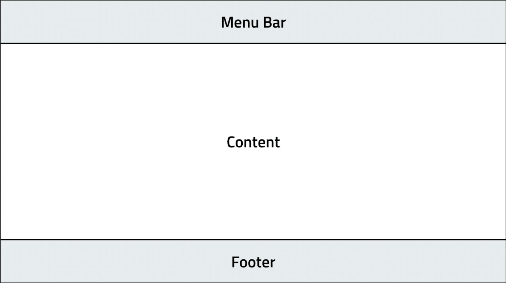</p>

Тип Page наследует все свойства типа **Pane** и предоставляет дополнительные свойства, такие как **header** заголовок и **footer** нижний колонтитул, аналогичные **ApplicationWindow**. Дополнительные свойства, такие как **title**, хранят текст, отображаемый обычно в верхней части страницы, чтобы предоставить контекст пользователю. Page не отображает заголовок сам по себе, а вместо этого полагается на приложение, чтобы сделать это. Такая структуризация имеет решающее значение при создании приложений, которым требуется чистый, удобный для навигации интерфейс с последовательным дизайном в различных разделах.

В примере ниже у нас есть несколько страниц в компоненте [**SwipeView**](https://doc.qt.io/qt-5/qml-qtquick-controls2-swipeview.html). За раз видна только одна страница. Пользователь может перемещаться между страницами, проводя пальцем вбок. Сам SwipeView полностью невизуален, но предоставляет пользователю механизм для перемещения между несколькими элементами. Мы отображаем заголовок **currentItem** текущего элемента (на какую бы страницу пользователь не перешел) в заголовке ApplicationWindow.

## Структурирование климат-контроля

[](https://d3pg1c2bhy6429.cloudfront.net/114478/whbsGfuiNfkI98JagIlWQq4RWpx2gvCTIumCErq2/scormcontent/assets/02-Visual-Containers.mp4?v=1)

<details>
<summary><b>Расшифровка видео</b></summary>

Прежде чем добавлять какие-либо элементы управления в наше приложение, мы уделим немного времени добавлению визуальной структуры или «макета» для них.

Хотя мы не будем подробно обсуждать макеты, вы должны получить фундаментальное представление о том, как они могут помочь нам позиционировать наши элементы управления и улучшить масштабируемость наших приложений.

Давайте начнем с добавления пары файлов QML в наш проект — один с именем «ClimateControls.qml», а другой — «ZoneControls.qml».

В дереве проекта щелкните правой кнопкой мыши проект «appHomeControls» и выберите «Добавить новый...».

Выберите Qt > Файл QML (Qt Quick 2) и дайте ему имя «ClimateControls.qml».

Расширение файла QML предлагается по умолчанию, поэтому в следующий раз мы можем пропустить это.

Давайте создадим еще один файл QML для «ZoneControls» таким же образом.

Наша система Home Controls будет иметь две зоны, что означает, что мы создаем два экземпляра компонента ZoneControls. Однако вы можете добавить столько, сколько захотите, просто чтобы увидеть, насколько легко повторно использовать компоненты QML. Это называется инкапсуляцией.

Откройте «Main.qml» и создайте экземпляр ClimateControls в нашем ApplicationWindow.

Используйте anchors.fill и установите его в родительский элемент, чтобы ClimateControls заполнил окно.

В «ClimateControls.qml» мы видим один импорт Qt Quick и пустой компонент Item. Нам нужно будет импортировать Qt Quick Controls с помощью Basic Style и модуля Layouts, поэтому давайте добавим эти импорты в начало файла.

Нам также понадобятся те же модули в файле ZoneControls, поэтому давайте добавим их, пока помним.

Возвращаясь к ClimateControls, давайте представим новый элемент управления, Page. Page — полезный элемент управления, который предоставляет contentItem и фон, padding и inset, как и любой другой элемент управления, но также добавляет заголовок и нижний колонтитул. Его визуальная компоновка похожа на ApplicationWindow, только без menuBar. Page также сожмется, чтобы вместить содержимое, если для нее не задан явный размер; это может быть очень полезной функцией! Мы добавим заголовок позже.

Обновите корневой элемент на Page и задайте ему отступ 10. В качестве полезного совета помните, что это устанавливает topPadding, bottomPadding, leftPadding и rightPadding на то же значение, что и удобное сочетание клавиш.

Чтобы визуализировать размещение и границы элементов управления, которые мы добавим позже; мы можем добавить временные фоновые прямоугольники с уникальным цветом.

Компонент ClimateControls будет иметь два экземпляра ZoneControls, расположенных в вертикальном столбце.

Используя ColumnLayout, мы установим anchors.fill на parent, чтобы он заполнил Page. Давайте также зададим ему интервал в десять.

Вы можете настраивать интервал и отступ на протяжении всего курса, но пока мы будем придерживаться десяти. Если вы не укажете значение, будет использоваться значение по умолчанию из стиля Qt Quick Controls Basic.

Создайте экземпляр ZoneControls и дайте ему идентификатор zone1.

Каждый ZoneControl будет разделять равную часть ширины ColumnLayout и заполнять его высоту.

Для этого мы можем установить Layout.fillWidth на true и Layout.fillHeight на true. Это называется «прикрепленными свойствами». Не вдаваясь в ненужные подробности, они просто помогают ColumnLayout знать, как изменять размер элементов, за которые он отвечает.

Теперь у нас есть основа для нашего экземпляра управления зоной, добавьте еще один и установите идентификатор на zone2.

Теперь у нас есть наш документ ClimateControls QML, содержащий страницу с ColumnLayout, упорядочивающим наши два экземпляра ZoneControls.

Теперь сделаем то же самое для ZoneControl и настроим его структуру макета, готовую для добавления всего интересного контента!

Здесь мы представим еще один элемент управления — Pane. Мы установим его как корневой. Pane выглядит и работает так же, как Page, но не имеет верхнего или нижнего колонтитула. Если вы захотите поэкспериментировать позже, попробуйте изменить Pane на Page и добавить собственные заголовки и нижние колонтитулы для ZoneControls.

Еще раз, чтобы визуализировать макет и взаимосвязь нашего макета, мы добавим фоновый прямоугольник.

Мы можем задать ZoneControls горизонтальный RowLayout, который заполняет Pane, и два ColumnLayouts, разделяющие доступную ширину RowLayout. ColumnLayouts и RowLayouts автоматически заполняют друг друга, поэтому нам не нужно указывать здесь значение. Давайте также используем здесь наш надежный интервал в десять.

Каждый ColumnLayout будет аналогичным образом содержать Rectangle с теми же прикрепленными свойствами Layout, которые мы использовали ранее, чтобы мы могли визуализировать макет нашего приложения.

Давайте посмотрим, как все выглядит, собрав и запустив приложение.

Компонент ClimateControl выделен красным и заполняет все окно. Наши два экземпляра ZoneControl окрашены в зеленый цвет с некоторым отступом от ClimateControl. Каждый ZoneControl имеет две синие области, левую и правую, с некоторым шагом, предоставленным RowLayout. Эти разделы — то, где мы начнем создавать наши элементы управления.

</details>

### Резюме: Структурирование климат-контроля

Теперь у нас есть визуальная компоновка, определенная для нашего приложения. Климат-контроль заполняет окно двумя экземплярами структур управления зонами в ColumnLayout, причем каждый элемент визуализируется с помощью компонента Rectangle разного цвета для визуализации компоновки. Вот как мы это сделали:

- Шаг 1: Добавление визуальной структуры с помощью файлов QML

<p align="center"></p>

Мы создали два файла QML, названные **ClimateControls.qml** и **ZoneControls.qml**, чтобы помочь организовать компоненты нашего интерфейса в управляемые разделы. Такая настройка обеспечивает лучшую масштабируемость и адаптивность нашего приложения, следуя принципу инкапсуляции, делая эти компоненты повторно используемыми.

- Шаг 2: Структурирование ClimateControls
  
Main.qml:
```
ApplicationWindow {
    //...

    ClimateControls {
        anchors.fill: parent
    }
}
```

Climate Controls.qml:
```
import QtQuick
import QtQuick.Controls.Basic
import QtQuick.Layouts

Page {
    padding: 10

    background: Rectangle {
        color: "red"
    }
}
```

В нашем файле **main.qml** мы создали экземпляр **ClimateControls** и настроили его на заполнение всего **ApplicationWindow** с помощью якорей. Затем мы изменили **ClimateControls.qml**, импортировав необходимые модули для использования Qt Quick Controls и Layouts. Мы заменили корневой элемент **component** компонентом Page, настроив его отступы, чтобы он отображался с чистой компоновкой, и добавили временные фоновые прямоугольники для визуализации того, где будут размещены будущие элементы управления.

- Шаг 3: Создание экземпляра ZoneControls

ClimateControls.qml:

```
ColumnLayout {
    anchors.fill: parent
    spacing: 10

    ZoneControls {
        id: zone1

        Layout.fillHeight: true
        Layout.fillWidth: true
    }

    ZoneControls {
        id: zone2

        Layout.fillHeight: true
        Layout.fillWidth: true
    }
}
```

<p align="center">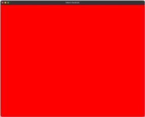</p>

Внутри **ClimateControls** мы использовали **ColumnLayout** для вертикального расположения двух экземпляров **ZoneControls**. Этот макет был настроен на заполнение родительской страницы и включал свойства, гарантирующие, что каждый **ZoneControl** использует одинаковую ширину и высоту в столбце. Эта настройка обеспечивает базовую структуру для каждой зоны, содержащую соответствующие элементы управления и информацию для пользователя.

- Шаг 4: Настройка ZoneControls

ZoneControls.qml:

```
Pane {
    padding: 20

    background: Rectangle {
        color: "green"
    }

    RowLayout {
        anchors.fill: parent

        spacing: 10

        ColumnLayout {
            id: leftColumn

            spacing: 10

            Rectangle {
                color: "blue"

                Layout.fillWidth: true
                Layout.fillHeight: true
            }
        }

        ColumnLayout {
            id: rightColumn

            spacing: 10

            Rectangle {
                color: "blue"

                Layout.fillWidth: true
                Layout.fillHeight: true
            }
        }
    }
}
```

<p align="center">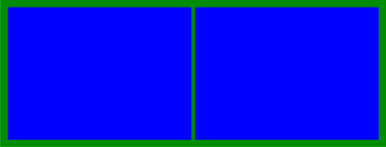</p>

В **ZoneControls.qml** мы создали базовую компоновку, используя **Pane** вместо Page, чтобы исключить ненужные заголовки и нижние колонтитулы. Мы включили **RowLayout**, чтобы разделить пространство на две горизонтальные секции. Каждому ColumnLayout в Row Layout был предоставлен собственный прямоугольник, визуально различающий каждую часть зоны. Эта конфигурация компоновки помогает в разметке пространства, где впоследствии будут размещены фактические элементы управления.

- Шаг 5: Визуализация макета

<p align="center">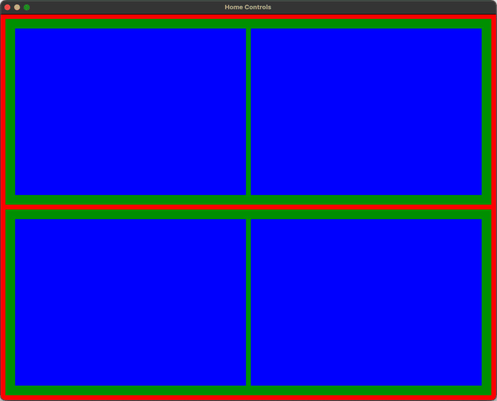</p>

Создав и запустив приложение на этом этапе, мы смогли визуально подтвердить эффективность макета. **ClimateControl** появился с отчетливым красным фоном, заполняющим окно, а два экземпляра **ZoneControl** были отмечены зеленым цветом и размещены соответствующим образом. Внутренняя структура каждого ZoneControl была выделена синим цветом, показывая предполагаемые области для будущих элементов управления. Эта визуальная проверка гарантировала, что все было выровнено и размещено так, как планировалось, подготовив почву для следующего этапа детальной реализации элементов управления.

Вот изменения, которые мы внесли в наш проект на данный момент:

<details>
<summary><b>Main.qml</b></summary>

```
ApplicationWindow {
    //...

    ClimateControls {
        anchors.fill: parent
    }
}
```
    
</details>

<details>
<summary><b>ClimateControls.qml</b></summary>

```
import QtQuick
import QtQuick.Controls.Basic
import QtQuick.Layouts

Page {
    padding: 10

    background: Rectangle {
        color: "red"
    }

    ColumnLayout {
        anchors.fill: parent

        spacing: 10

        ZoneControls {
            id: zone1

            Layout.fillHeight: true
            Layout.fillWidth: true
        }

        ZoneControls {
            id: zone2

            Layout.fillHeight: true
            Layout.fillWidth: true
        }
    }
}
```
    
</details>

<details>
<summary><b>ZoneControls.qml</b></summary>

```
import QtQuick
import QtQuick.Controls.Basic
import QtQuick.Layouts

Pane {
    padding: 20

    background: Rectangle {
        color: "green"
    }

    RowLayout {
        anchors.fill: parent

        spacing: 10

        ColumnLayout {
            id: leftColumn

            spacing: 10

            Rectangle {
                color: "blue"

                Layout.fillWidth: true
                Layout.fillHeight: true
            }
        }

        ColumnLayout {
            id: rightColumn

            spacing: 10

            Rectangle {
                color: "blue"

                Layout.fillWidth: true
                Layout.fillHeight: true
            }
        }
    }
}
```
    
</details>

> **Репозиторий проекта**
>
> Чтобы увидеть весь проект в его текущем виде, перейдите к **'02-Visual-Containers'** в репозитории проекта. Вы можете открыть проект, перейдя к **CMakeLists.txt** в Qt Creator.
>
> [Ссылка на GitHub](https://github.com/qt-learning/Intro-Qt-Quick-Controls)

Далее мы начнем структурировать наше приложение для управления домом с помощью макетов.

---

# Урок 5: Реализация контроля

[Перейти к содержанию](#содержание)

В этом разделе мы рассмотрим ряд Qt Quick Controls для разработки функциональности наших климатических элементов. Мы создали визуальный макет для нашего приложения управления домом, описывающий структуру приложения и взаимосвязи между различными элементами. Климатические элементы занимают окно, показывая два экземпляра наших зональных элементов управления внутри ColumnLayout, представленных временными прямоугольниками.

<p align="center"></p>

Прежде чем углубляться, давайте рассмотрим некоторые компоненты, которые мы будем использовать в этом разделе: **Label** метка, **CheckBox** флажок, **Switch** переключатель.

## Label метка

[Label](https://doc.qt.io/qt-6/qml-qtquick-controls-label.html) в Qt Quick Controls расширяет тип **Text** из Qt Quick, предлагая функциональность стилизованного текста с дополнительными преимуществами стилей, специфичных для темы, и наследованием шрифтов. Это означает, что цвет и стиль шрифта соответствуют определенному используемому стилю Qt Quick Controls, например, стилю Qt Quick Controls Basic в нашем приложении.

```
Label {
    text: "Home Controls"
    padding: 10

    font {
        family: "Arial"
        pointSize: 24
        bold: true
    }
    background: Rectangle {
        color: "lightgray"
    }
}
```

<p align="center">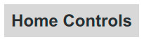</p>

Вы можете настроить внешний вид метки с помощью свойств, унаследованных от **Text** и **Item** соответственно, а также **background** фонового свойства Label, где вы можете определить элемент, например прямоугольник, чтобы дополнительно стилизовать вашу метку. Если фоновый элемент не имеет явного размера, он автоматически следует за размером элемента управления. В целом, label — это универсальный выбор для разработчиков, которые хотят сохранить согласованность и читаемость во всем своем приложении.

## CheckBox метка

[CheckBox](https://doc.qt.io/qt-6/qml-qtquick-controls-checkbox.html) в Qt Quick Controls представляет собой переключаемую кнопку, содержащую символ галочки и текст для описания того, что отмечено. Он наследуется от типа **AbstractButton**, который обеспечивает базовую функциональность кнопки, возможность быть отмеченным или не отмеченным через свойство selected. CheckBox также включает свойство **checkable** из своего базового класса, которое изначально установлено в true, что позволяет им поддерживать состояние либо отмечено, либо нет. CheckBox также имеет свойство **text**, унаследованное от AbstractButton, что позволяет разработчикам помечать флажок непосредственно в его объявлении, улучшая читаемость и простоту использования в пользовательских интерфейсах.

```
CheckBox {
    text: "Checked"
    checked: true
}

CheckBox {
    text: "Partially Checked"
    tristate: true
    checkState: Qt.PartiallyChecked
}
```

<p align="center">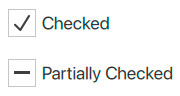</p>

Особенностью CheckBox является свойство tristate, которое позволяет CheckBox обрабатывать дополнительное, неопределенное состояние наряду со стандартными отмеченными и неотмеченными состояниями. Когда **tristate** установлено в true, CheckBox может представлять частичный выбор, обычно используемый в сложных формах или представлениях данных, таких как древовидные структуры, где не все подопции выбраны. Это свойство делает его универсальным для сценариев, требующих более тонкого выбора пользователя. В целом, CheckBox служит фундаментальным компонентом для создания интерактивных и удобных для пользователя форм и меню настроек в приложениях.

## Switch переключатель

[Switch](https://doc.qt.io/qt-6/qml-qtquick-controls-switch.html) — это универсальный переключатель, который обеспечивает визуально интуитивный способ выбора между двумя состояниями, обычно включено и выключено. Как и CheckBox, Switch наследует AbstractButton, который предоставляет ему базовые функции кнопок, включая такие свойства, как отмечено, для определения его состояния.

```
Switch {
    text: "Bedroom Lights"
    checked: true
}

Switch {
    text: "Kitchen Lights"
}
```

<p align="center">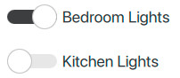</p>

Switch вводит еще два свойства, **position** и **visualPosition**, которые являются ключевыми для настраиваемых анимаций и визуальной обратной связи. Свойство position представляет логическое положение ручки (перетаскиваемой части переключателя) по шкале от 0,0 до 1,0, где 0,0 полностью выключено, а 1,0 полностью включено. Это свойство доступно только для чтения и в основном используется для создания реактивного поведения пользовательского интерфейса на основе состояния переключателя.

Свойство visualPosition, также доступное только для чтения, визуально регулирует положение большого пальца для автоматического размещения макетов справа налево (**RTL**). Это гарантирует, что поведение Switch остается согласованным и интуитивно понятным в средах RTL, что делает его универсальным выбором для международных приложений.

## Маркировка наших элементов управления

[](https://d3pg1c2bhy6429.cloudfront.net/114478/whbsGfuiNfkI98JagIlWQq4RWpx2gvCTIumCErq2/scormcontent/assets/03.01-Label.mp4?v=1)

<details>
<summary><b>Расшифровка видео</b></summary>

В этом разделе мы познакомимся с большинством быстрых элементов управления Qt, которые мы добавим в наш проект.

При представлении нового элемента управления я опишу некоторые из его самых полезных свойств и то, как они работают.

Обратите внимание, что каждый элемент управления будет иметь те же основные свойства padding, inset, background и contentItem. Я не буду упоминать их снова для краткости, но имейте в виду, что они будут использоваться.

Первым дополнением станет скромный Label.

Примечание о компоненте Label. Хотя он является частью модуля Qt Quick Controls, он наследует от Qt Quick Text. Label наследует свойства padding и palette от Text, но добавляет свой собственный компонент background и свойства inset. Кроме того, Label — один из немногих быстрых элементов управления Qt, у которого нет свойства locale!

Давайте назначим Label свойству header страницы.

Label показывает нам хороший пример разницы между свойствами width и height и свойствами implicitWidth и implicitHeight. Последнее — это естественные размеры элемента управления, если бы он был подобран так, чтобы идеально вмещать весь текст в соответствии со свойствами шрифта и текста. Это означает, что неявный размер будет меняться по мере изменения текста и/или шрифта. Ширина и высота — это те размеры, которые мы накладываем на элемент управления. Они могут быть больше или меньше неявного размера и могут привести к обрезке, перевыравниванию, исключению или даже масштабированию текста, если для управления этим поведением используются свойства из Qt Quick Text.

Установите текст метки на «Climate Control» с помощью функции qsTr().

Как и в случае с другими элементами управления, такими как ApplicationWindow, которые также имеют заголовок, нижний колонтитул и, возможно, menuBar, элемент управления, назначенный одному из этих свойств, автоматически устанавливает свою ширину в соответствии с родительским элементом управления. Однако его высота будет такой, какой мы ее зададим. И поскольку мы не задаем высоту, это будет implicitHeight метки, отображающей текст «Climate Control» со ​​свойствами шрифта, которые мы ранее задали в ApplicationWindow в Main.qml.

Давайте установим цвет шрифта на «белый», чтобы текст Label лучше был виден на темном фоне, и увеличим размер шрифта в пикселях до 48, так как это будет основной заголовок для климат-контроля. Нам также нужно добавить отступы, так как у Page нет отступов по умолчанию для верхнего или нижнего колонтитула.

Теперь давайте удалим красный фон и протестируем приложение.

Обратите внимание, что теперь мы видим белый фон вместо матового металла, который мы установили ранее. Это связано с тем, что цвет фона наследует стиль и тему приложения. Поэтому нам нужно установить фон на ноль.

Установка фона на ноль означает не только отсутствие фона, но и то, что фон по умолчанию, предоставляемый Page, на самом деле никогда не создается. Это хорошая оптимизация QML Engine, которая происходит, когда не установлен идентификатор.

После сборки и запуска мы должны увидеть фон матового металла.

Далее, давайте исправим зеленые и синие прямоугольники в ZoneControls. Откройте ZoneControls и удалите два синих прямоугольника в ColumnLayouts.

У нас все еще будет прямоугольник для фона Pane, но давайте сделаем его более тонким. Установите цвет на «черный» и непрозрачность на «0,5».

Наконец, давайте дадим каждой зоне имя. Добавьте строковое свойство с именем «zoneName» в ZoneControls и переключитесь обратно в ClimateControls, чтобы заполнить свойство именем по вашему выбору.

Для удобства я буду использовать «zone1» и «zone2». Вы можете предпочесть использовать названия комнат или этажей; просто сделайте их своими!

Это свойство будет использоваться вскоре, когда мы заполним визуальные детали в ZoneControls.

Теперь наше приложение должно выглядеть так:

</details>

### Резюме: Создание проекта

- Шаг 1: Добавление метки в ClimateControls

ClimateControls.qml
```
//...
Page {
    //...
    header: Label {
        text: qsTr("Climate Control")
        color: "white"
        font.pixelSize: 48
        padding: 10
    }
    //...
}
```

<p align="center">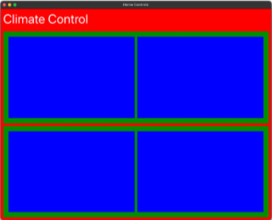</p>

Мы назначили **Label** метку **header** заголовку нашей **Page** страницы Climate Control, установив ее текст на «Climate Control» с помощью функции **qsTr()** для потенциальной локализации. Мы установили цвет шрифта на белый и увеличили размер пикселя до 48, чтобы сделать его фокусной точкой нашего заголовка. Поскольку Page не предоставляет отступы по умолчанию для заголовка, мы добавили их, чтобы текст был аккуратно вписан в пространство.

- Шаг 2: Оптимизация внешнего вида фона ClimateControls

ClimateControls.qml
```
//...
Page {
    //...
    background: null
    //...
}
```

<p align="center">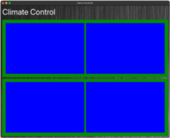</p>

После удаления красного прямоугольника, который был ранее добавлен к фону страницы, **background** фон страницы становится белым, то есть наш заголовок и фоновое изображение шлифованного металла не видны. Установив свойство фона страницы на **null**, мы оптимизировали производительность QML Engine, гарантируя, что он не будет создавать ненужный фон по умолчанию. Эта настройка позволила нам сохранить внешний вид шлифованного металла во всем приложении.

- Шаг 3: Настройка фона ZoneControls

ZoneControls.qml
```
//...
Pane {
    padding: 20
    background: Rectangle {
        color: "black"
        opacity: 0.5
    }
    //...
}
```

<p align="center">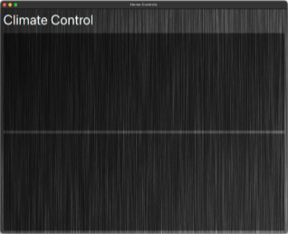</p>

Затем мы усовершенствовали визуальные элементы в **ZoneControls**, удалив временные синие прямоугольники, используемые для визуализации макета. Мы также изменили **background** фон панели в каждом ZoneControl на черный с **opacity** непрозрачностью 0,5, сделав его более тонким и более интегрированным в общую эстетику.

- Шаг 4: Наименование зон

ZoneControls.qml
```
//...
Pane {
    property string zoneName
    //...
}
```

ClimateControls.qml
```
//...
Page {
    //...
    ColumnLayout {
        //...
        ZoneControls {
            id: zone1

            zoneName: qsTr("Zone 1")
            //...
        }

        ZoneControls {
            id: zone2

            zoneName: qsTr("Zone 2")
            //...
        }
    }
}
```

Наконец, мы добавили новое **string** строковое свойство **zoneName** в **ZoneControls**. В каждом экземпляре мы назначаем **id** идентификатор, а также **zoneName** для каждого экземпляра. Это не только помогает различать зоны, но и готовит нас к добавлению более персонализированных деталей на будущих этапах. Эта настройка отражает гибкий подход, позволяющий выполнять настройку, например, использовать названия комнат или этажей.

## Включение зон с помощью флажков

[](https://d3pg1c2bhy6429.cloudfront.net/114478/whbsGfuiNfkI98JagIlWQq4RWpx2gvCTIumCErq2/scormcontent/assets/03.02-Checkbox.mp4?v=1)

<details>
<summary><b>Расшифровка видео</b></summary>

Теперь мы рассмотрим некоторые из быстрых элементов управления Qt, которые мы будем использовать для нашей двухзонной системы климат-контроля.

Мы уже познакомились с ApplicationWindow, Page, Pane и Label. В следующих разделах мы добавим CheckBox для включения и отключения зоны, Switch для переключения единиц отображения между градусами Цельсия и Фаренгейта, Dial для изменения температуры зоны и, наконец, Slider для управления скоростью вращения вентилятора. Мы также будем использовать еще один Label для большого отображения текущей информации о зоне.

Некоторые свойства элементов управления будут привязаны к панели ZoneControls,

поэтому мы должны присвоить ему идентификатор «root». Убедитесь, что мы можем квалифицировать все наши привязки свойств при их добавлении.

Хорошей практикой является квалификация всех ваших привязок свойств с помощью целевого идентификатора, чтобы избежать непредвиденных проблем при перемещении или реструктуризации вашего кода QML, поскольку это гарантирует, что привязки являются абсолютными, а не относительными к какой-либо другой неожиданной области действия.

Для левого столбца Zone Controls давайте поместим CheckBox в новый RowLayout с обычным интервалом 10. В RowLayout мы добавим новый CheckBox и дадим ему идентификатор «zoneEnabledCheckBox»; позже мы обнаружим, что это пригодится в других привязках.

CheckBox — это тип кнопки, содержащий символ галочки и текст, описывающий, что именно отмечено. Его можно включить (отмечено) или выключить (снять отметку). Флажки обычно используются для выбора одного или нескольких параметров из большего набора параметров, но их также можно использовать независимо, как мы и делаем.

CheckBox наследует от AbstractButton, где он получает свои булевы свойства checkable и checked. Свойство checkable по умолчанию равно true, тогда как свойство checked по умолчанию равно false.

CheckBox также имеет свойство «tristate», которое по умолчанию равно false. Третье состояние, «частично отмечено», может использоваться, если установлено значение true. CheckBox добавляет свойство «checkState» для управления этим; это перечисление, перечисляющее три конкретных состояния: Unchecked, Checked или PartiallyChecked.

Будучи элементом, CheckBox также может быть отключен или включен с помощью его свойства enabled или свойства одного из его родительских элементов.

Чтобы включить зону по умолчанию, мы можем установить значение checked в true.

В качестве примечания, это первый из многих элементов управления Qt Quick Controls, свойства которых можно изменять с помощью касания, клавиатуры или мыши или путем изменения кода. Хорошей практикой является обработка изменений свойств только тогда, когда элемент управления изменяет внутренний объект во время взаимодействия с пользователем.

Например, используйте обработчик сигнала «onClicked» для чтения значения «checkState», которое изменилось из-за взаимодействия с пользователем. Сигнал «clicked» не выдается, если «checkState» изменяется из внутреннего кода. Этот шаблон будет неоднократно возникать с другими элементами управления, и хорошо понимать, какой тип взаимодействия с пользователем или программного взаимодействия вызовет дальнейшие изменения, чтобы ваш пользовательский интерфейс работал гладко и гладко, избегая ненужной обработки изменения свойств.

Давайте вернемся к созданию нашего флажка. Добавьте текст в флажок, используя свойство «zoneName», которое мы добавили ранее, используя простой синтаксис заполнителя, как показано. Это отобразит слово «Enable» и выбранное вами имя для каждого экземпляра зоны.

Давайте посмотрим на наш прогресс, создав и запустив приложение.

Пока не беспокойтесь о цвете текста — позже мы будем использовать свойство «palette», чтобы внести некоторые последовательные изменения цвета во все наши элементы управления.

Обратите внимание, что флажок вертикально центрирован — это положение макета по умолчанию для RowLayout и ColumnLayout, и мы неявно воспользуемся этим для большинства наших элементов управления здесь.

</details>

### Резюме: Включение зон с помощью флажков

Теперь у нас есть первый готовый элемент управления, который позволяет включать и выключать элементы управления, если пользователь не хочет использовать зону. Вот как мы это сделали:

- Шаг 1: Знакомимся с элементом управления CheckBox

ZoneControls.qml
```
//...
ColumnLayout {
    id: leftColumn

    spacing: 10

    RowLayout {
        spacing: 10

        CheckBox {
            id: zoneEnabledCheckBox
            checked: true
        }
    }
}
//...
```

<p align="center">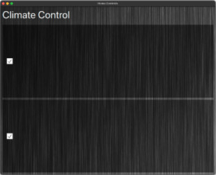</p>

**CheckBox** позволит пользователям включать или отключать каждую конкретную зону. Мы начали с размещения **CheckBox** в **RowLayout** в левом столбце **ZoneControls** и назначили ему идентификатор **zoneEnabledCheckBox**. Это позволило нам начать организовывать наш интерфейс для будущих дополнений и подготовило нас к привязке различных элементов к CheckBox при добавлении элементов для включения и отключения. Наконец, мы установили значение checkbox в true, чтобы элементы управления в каждом экземпляре элементов управления зоны были включены по умолчанию после реализации.

- Шаг 2: Добавление метки CheckBox

ZoneControls.qml
```
//...
    CheckBox {
        id: zoneEnabledCheckBox

        checked: true
        text: qsTr("Enable %1").arg(root.zoneName)
    }
//...
```

<p align="center">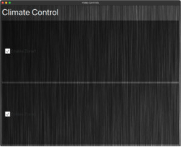</p>

Мы связали свойство текста CheckBox со свойством **zoneName**, которое мы установили ранее, добавив «Enable» к имени каждой зоны, чтобы прояснить ее функцию. Мы отложили настройку цвета текста, планируя уточнить его вместе с другими элементами управления позже, используя свойство палитры, чтобы обеспечить согласованность во всем интерфейсе.

## Изменение единиц измерения температуры с помощью переключателя

[](https://d3pg1c2bhy6429.cloudfront.net/114478/whbsGfuiNfkI98JagIlWQq4RWpx2gvCTIumCErq2/scormcontent/assets/03.03-Switch.mp4?v=1)

<details>
<summary><b>Расшифровка видео</b></summary>

Следующий элемент управления, который мы добавим в ZoneControls, — это Switch. Добавьте новый компонент switch прямо под флажком.

Switch — это кнопка выбора, которую можно включить (отмечено) или выключить (снята отметка), и обычно она используется для выбора между двумя состояниями, как CheckBox. У нее также есть свойство «checkable», которое она унаследовала от AbstractButton.

Switch также можно перетаскивать или нажимать для переключения между отмеченным и неотмеченным состояниями, и она обеспечивает приятную небольшую анимацию при смене состояний.

В отличие от CheckBox, у Switch нет опции с тремя состояниями, что означает, что это строго двоичный выбор.

Он также добавляет два свойства только для чтения, «position» и «visualPosition», со значениями десятичной точки от 0 до 1, которые относятся к положению индикатора во время его анимации между отмеченным и неотмеченным состояниями. VisualPosition имеет то же значение, что и position, если только не используется зеркальное отображение макета, в этом случае его значения меняются местами.

Дайте переключателю идентификатор. Обратите внимание, что вы не можете использовать «switch» в качестве идентификатора, поскольку это зарезервированное ключевое слово в JavaScript.

Мы также дадим переключателю текст, чтобы показать его назначение, в нашем случае, какие единицы измерения температуры использовать. Вы можете найти символ градуса, используя сочетание клавиш вашей операционной системы, или вы можете ввести \u00B0 (обратная косая черта U ноль ноль B ноль) внутри строки, как показано. Это код символа UTF-16 для символа градуса.

Пока мы здесь, давайте исправим цвет CheckBox и Switch, используя свойство палитры Pane. Свойство палитры содержит несколько свойств роли цвета, которые наследуются элементами и доступны для обеспечения того, чтобы пользовательские элементы управления поддерживали единообразный внешний вид и восприятие.

Давайте установим свойство палитры Pane, используя синтаксис свойства группы, и установим цветовую роль windowText на «белый».

Теперь мы можем выполнить сборку и запустить, чтобы увидеть CheckBox и Switch в действии.

</details>

### Резюме: Изменение единиц измерения температуры с помощью переключателя

Теперь у нас есть переключатель, готовый управлять единицами, в которых отображается наша температура. Вот как мы это сделали:

- Шаг 1: Добавление переключателя управления

ZoneControls.qml
```
//...    
RowLayout {
    //...
                
    Switch {
        id: unitsSwitch
    }
}
//...
```

<p align="center">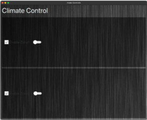</p>

Мы ввели элемент управления Switch в наши ZoneControls, разместив его сразу под CheckBox. Этот элемент управления функционирует аналогично CheckBox, позволяя пользователям переключаться между двумя состояниями, например, включено и выключено. Switch обычно используется для бинарных выборов и включает анимацию, которая визуально отображает изменение состояния.

- Шаг 2: Цельсий или Фаренгейт?

ZoneControls.qml
```
//...
RowLayout {
    //...
            
    Switch {
        id: unitsSwitch
        
        text: qsTr("ºC / ºF")
    }
}
//...
```

<p align="center"></p>

Чтобы сообщить о его функции, мы добавили текст, указывающий, что он управляет единицами измерения температуры, включив символ градуса (°) или используя последовательность Unicode **\u00B0**.

- Шаг 3: Последовательность стиля и цвета

ZoneControls.qml
```
//...
Pane {
    //...
    palette {
        windowText: "white"
    }
    //...
}
```

<p align="center">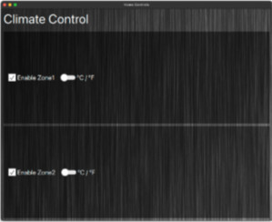</p>

Чтобы обеспечить визуальную согласованность всех наших элементов управления, мы скорректировали свойство **palette** палитры **Pane**, в котором находятся **CheckBox** и **Switch**. Мы установили цветовую роль **windowText** на **white** белый цвет, гарантируя, что весь текст, являющийся дочерним элементом Pane, будет читаемым на нашем темном фоне.

Вот фрагмент того, что мы добавили в наш файл ZoneControls.qml:

<details>
<summary><b>ClimateControls.qml</b></summary>

```
import QtQuick
import QtQuick.Controls.Basic
import QtQuick.Layouts

Page {
    //...
    header: Label {
        text: qsTr("Climate Control")
        color: "white"
        font.pixelSize: 48
        padding: 10
    }

    background: null

    ColumnLayout {
        //...
        ZoneControls {
            id: zone1

            zoneName: "Zone1"
            //...
        }

        ZoneControls {
            id: zone2

            zoneName: "Zone2"
            //...
        }
    }
}
```
    
</details>

<details>
<summary><b>ZoneControls.qml</b></summary>

```
import QtQuick
import QtQuick.Controls.Basic
import QtQuick.Layouts

Pane {
    id: root

    property string zoneName

    palette {
        windowText: "white"
    }

    background: Rectangle {
        color: "black"
        opacity: 0.5
    }

    RowLayout {
        anchors.fill: parent

        spacing: 10

        ColumnLayout {
            spacing: 10

            RowLayout {

                spacing: 10

                CheckBox {
                    id: zoneEnabledCheckBox

                    checked: true
                    text: qsTr("Enable %1").arg(root.zoneName)
                }

                Switch {
                    id: unitsSwitch

                    text: qsTr("ºC / ºF")
                }
            }
        }

        ColumnLayout { }
    }
}
```
    
</details>

> **Репозиторий проекта**
>
> Чтобы увидеть весь проект в его текущем виде, перейдите к **'03-Introducing-Controls'** в репозитории проекта. Вы можете открыть проект, перейдя к **CMakeLists.txt** в Qt Creator.
>
> [Ссылка на GitHub](https://github.com/qt-learning/Intro-Qt-Quick-Controls)

Далее мы добавим циферблат и ползунок, а также определим метку для отображения желаемой температуры.

---

# Урок 6: Реализация контроля

[Перейти к содержанию](#содержание)

В этом разделе мы продолжим реализацию элементов управления в нашем приложении и динамически отображать желаемую температуру для пользователя.

<p align="center">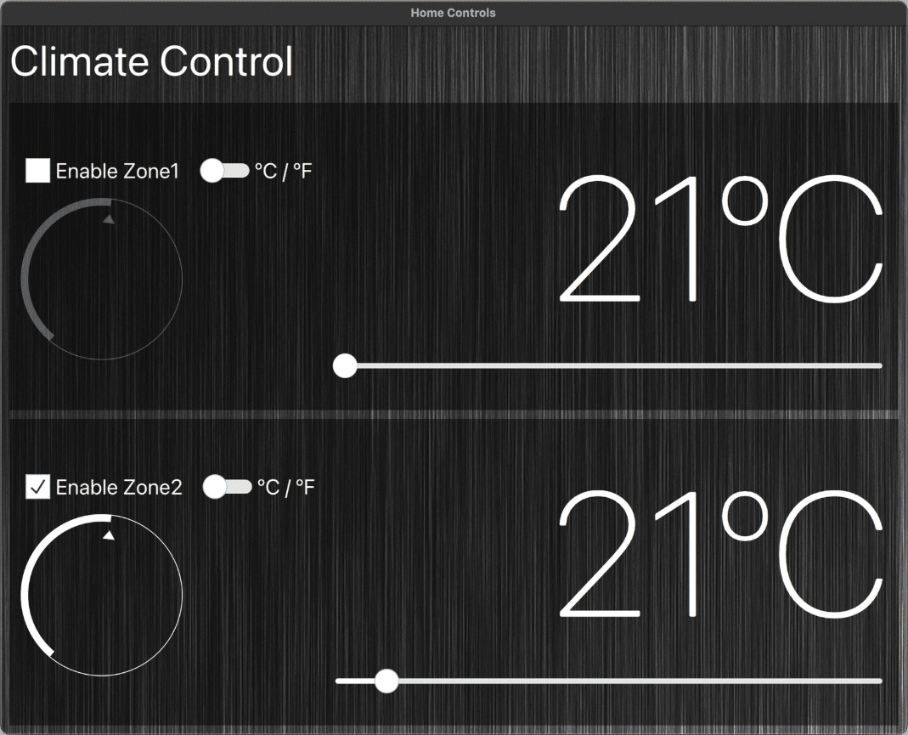</p>

Прежде чем продолжить, давайте рассмотрим компоненты, которые мы будем использовать в этом разделе: **Dial** циферблат и **Slider** слайдер.

## Dial циферблат

[Dial](https://doc.qt.io/qt-6/qml-qtquick-controls-dial.html) — это универсальный компонент пользовательского интерфейса в Qt Quick Controls, который эмулирует физический поворотный диск, позволяя пользователям выбирать значение в определенном диапазоне. Этот элемент управления похож на ручку на радио или термостате и обеспечивает интуитивно понятный метод установки числовых значений посредством вращения.

Ключевые свойства Dial включают **from** и **to**, которые определяют начальное и конечное значения диапазона диска соответственно. Свойство **value** указывает текущее положение диска в этом диапазоне. Если вы хотите настроить, насколько значение увеличивается или уменьшается при каждом взаимодействии, свойство **stepSize** позволяет вам задать шаг, на который изменяется значение при регулировке диска с помощью клавиатуры. Чтобы гарантировать соблюдение stepSize при сенсорном и мышином взаимодействии, необходимо настроить **snapMode**. Режим привязки работает с stepSize, чтобы позволить ручке привязываться к назначенным точкам на диске, что может происходить непрерывно, при отпускании или вообще не привязываться.

```
Dial {
    from: 0
    to: 200
    stepSize: 5
    snapMode: Dial.SnapAlways
    value: 50
}
```

<p align="center">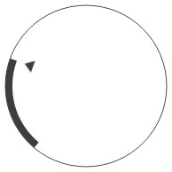</p>

Dial также включает свойство положения, которое, подобно Switch и другим элементам управления, является нормализованным представлением (от 0,0 до 1,0) значения относительно его диапазона, облегчая анимацию или визуальную обратную связь на основе положения циферблата. Это делает Dial функциональным и легко адаптируемым к различным эстетическим и функциональным возможностям пользовательского интерфейса, улучшая общий пользовательский опыт в приложениях, требующих выбора значения через вращающийся интерфейс.

## Slider слайдер

[Slider](https://doc.qt.io/qt-6/qml-qtquick-controls-slider.html) позволяет пользователям выбирать значение, перемещая ползунок вдоль дорожки. Как и Dial, Slider использует такие свойства, как **from**, **to**, **value** и **stepSize**, чтобы определить свой диапазон и поведение при взаимодействии пользователя. Свойства from и to задают начальную и конечную точки диапазона, в то время как value представляет текущую позицию в пределах этого диапазона. Свойство stepSize определяет приращения, на которые может быть скорректировано значение при перемещении ползунка пользователем. Он также реализует свойство **snapMode**, которое управляет тем, как ползунок выравнивается с stepSize, что позволяет использовать такие поведения, как привязка к шагам при перетаскивании ползунка пользователем или привязка только при отпускании ползунка.

```
Slider {
    from: 0
    to: 100
    value: 70
    stepSize: 10
    snapMode: Slider.SnapAlways
}

Slider {
    from: 0
    to: 100
    value: 10
    orientation: Qt.Vertical
}
```

<p align="center">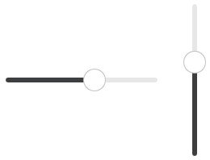</p>

У слайдера также есть свойство ориентации, которое можно установить как горизонтальное, так и вертикальное, что позволяет адаптировать его к различным макетам пользовательского интерфейса.

## Регулировка температуры с помощью Dial циферблата

[](https://d3pg1c2bhy6429.cloudfront.net/114478/whbsGfuiNfkI98JagIlWQq4RWpx2gvCTIumCErq2/scormcontent/assets/03.04-Dial.mp4?v=1)

<details>
<summary><b>Расшифровка видео</b></summary>

Далее мы рассмотрим один из самых важных элементов управления нашего приложения — Dial.

Dial предоставляет нам естественный способ взаимодействия с нашим приложением, имитируя ручки управления, которые вы можете найти на физических устройствах, таких как духовка или домашний кинотеатр. Многие элементы управления, такие как кнопки, переключатели, ползунки и циферблаты, имитируют реальные системы управления, обеспечивая знакомый и интуитивно понятный опыт.

Циферблат позволяет пользователю выбирать значение в указанном диапазоне, при этом свойство value по умолчанию установлено на 0. Вы можете взаимодействовать с циферблатом несколькими способами: щелкая по циферблату, чтобы задать значение, перетаскивая с помощью устройства ввода или с помощью клавиатуры. Существует несколько способов изменить поведение циферблата, некоторые из которых мы рассмотрим позже.

Прежде чем добавлять циферблат в наше приложение, давайте добавим новый RowLayout с обычным интервалом. Таким образом, мы сможем позже добавлять значки к циферблату, чтобы передать его назначение.

Чтобы гарантировать, что наш циферблат реагирует на флажок, который мы создали ранее, мы привязываем это свойство RowLayout enabled к свойству zoneEnabledCheckBox selected. Это означает, что когда пользователь включает или выключает зону, циферблат будет реагировать соответствующим образом.

Добавьте компонент Dial в RowLayout. Для простоты мы не будем указывать размер циферблата, поэтому это будет просто неявный размер циферблата.

Нам еще предстоит определить, для чего будет использоваться этот циферблат.

Обычно циферблат в системе климат-контроля будет управлять температурой — так что давайте сделаем это!

Нам нужно указать значения свойств «from» и «to», чтобы создать диапазон, в котором работает наш циферблат. Выбранное значение будет удерживаться в пределах свойства «value», когда мы перемещаем циферблат между его минимальным и максимальным положением. Мы начнем с установки диапазона рабочей температуры нашего циферблата с использованием градусов Цельсия, и мы можем использовать переключатель, который мы добавили ранее, чтобы преобразовать его в градусы Фаренгейта. Давайте установим «from» и «to» на 0 и 40 соответственно.

Чтобы наблюдать за изменением значения, мы можем использовать обработчик сигнала «onValueChanged» для записи текущего значения в консоль при каждом изменении свойства «value». Давайте посмотрим на это в действии.

Обратите внимание, что довольно сложно увидеть циферблат на нашем фоне. Циферблат использует роль палитры «dark» для своих элементов. Поэтому мы можем установить роль палитры dark на более светлый цвет в свойстве палитры нашей панели.

Использование палитры и ее имен ролей свойств может показаться немного запутанным на первый взгляд. Поиграйте с палитрой и ее цветовыми ролями, и вы быстро освоитесь с ними. Чтобы узнать больше, посмотрите на типы ColorGroup и Palette QML в документации Qt. Позже мы еще больше настроим цвета нашего приложения. Давайте проверим, что циферблат теперь отображается белым.

Мы видим, что при взаимодействии с циферблатом изменение значения происходит плавно и гранулярно. Системы климат-контроля обычно позволяют пользователям изменять температуру с шагом в целый градус или полградуса. Чтобы реализовать это с помощью нашего циферблата, мы можем использовать свойства «stepSize» и «snapMode». stepSize определяет, насколько увеличивается и уменьшается значение циферблата при взаимодействии с клавиатурой. Если мы хотим, чтобы stepSize учитывался при взаимодействии с сенсорным экраном и мышью, мы также должны установить snapMode.

Режим привязки работает с stepSize, чтобы позволить ручке привязываться к определенным точкам на циферблате. Значение режима привязки представляет собой перечисление из трех возможных вариантов: Dial.NoSnap, который является значением по умолчанию; Dial.SnapAlways, который привязывается при перетаскивании ручки, и Dial.SnapOnRelease, который привязывается только после отпускания ручки.

В качестве упражнения поиграйте с различными режимами привязки и значениями размера шага, чтобы получить «рукоятку» того, как они влияют на поведение циферблата.

Изучение свойств элемента управления и, что самое важное, игра с ними — лучший способ обучения! Например, свойство «live» — это логическое значение, которое определяет, предоставляет ли циферблат обновления в реальном времени для свойства значения при перетаскивании ручки или «position», которое является нормализованным значением (от 0 до 1) по всему диапазону циферблата.

Взгляните на страницу документации циферблата и поэкспериментируйте со свойствами, чтобы настроить приложение на данный момент, потратив некоторое время на то, чтобы сделать его своим.

</details>

### Резюме: Регулировка температуры с помощью циферблата

Теперь у нас есть циферблат, который выводит значение от 0 до 40 градусов Цельсия. Циферблат увеличивается с шагом в один градус, и мы можем использовать его для отображения нашей температуры на следующих этапах. Вот как мы это сделали:


- Шаг 1: Реализация Dial

ZoneControls.qml
```
//...
ColumnLayout {
    id:leftColumn
    
    //...    
    RowLayout {
        enabled: zoneEnabledCheckBox.checked

        spacing: 10
               
        Dial {
            from: 0 // ºC
            to: 40 // ºC
        }
    }
}
//...
```

<p align="center">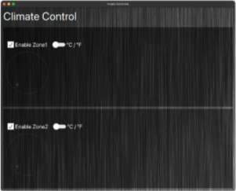</p>

Мы добавили циферблат в новый **RowLayout**, чтобы поддерживать постоянный интервал и организацию для последующего добавления значков. Мы связали свойство **enabled** **RowLayout** с **zoneEnabledCheckBox** из более раннего, гарантируя, что функциональность циферблата соответствует состоянию зоны **enabled**. Мы установили свойства **from** и **to** циферблата на 0 и 40 соответственно, чтобы определить диапазон температур. Чтобы обеспечить обратную связь по изменению значений, мы использовали обработчик сигнала **onValueChanged** для регистрации корректировок в консоли для тестирования.

- Шаг 2: Повышение видимости

ZoneControls.qml
```
//...
Pane {
    //...
    palette {
        //...
        dark: "white"
    }
    //...
}
```

<p align="center">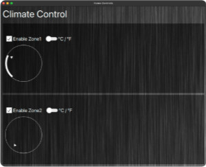</p>

Для улучшения видимости мы отрегулировали цвет Dial, установив более светлый оттенок для роли **dark** темной палитры в свойстве **palette** палитры Pane. Это изменение обеспечило более отчетливое выделение Dial.

- Шаг 3: Настройка взаимодействия

ZoneControls.qml
```
//...
RowLayout {
    //...
                
    Dial {
        //...
        stepSize: 1 // degrees
        snapMode: Dial.SnapAlways
    }
}
//...
```

<p align="center"></p>

Чтобы сделать регулировку температуры более точной и удобной для пользователя, мы устанавливаем свойство **stepSize** на '1', которое определяет изменения приращения при взаимодействии с Dial с помощью клавиатуры. Для согласованности в регулировках посредством сенсорного взаимодействия и взаимодействия с мышью мы также настроили **snapMode**. Это свойство позволяет ручке Dial привязываться к определенным точкам вдоль ее пути с шагом в один градус Цельсия.


## Отображение температуры с помощью метки

[](https://d3pg1c2bhy6429.cloudfront.net/114478/whbsGfuiNfkI98JagIlWQq4RWpx2gvCTIumCErq2/scormcontent/assets/03.05-BigLabel.mp4?v=1)

<details>
<summary><b>Расшифровка видео</b></summary>

Наше приложение для управления климатом не было бы полным без большого элемента, показывающего пользователю желаемую температуру.

Мы могли бы просто привязать значение циферблата к тексту метки. Однако мы хотим, чтобы пользователь мог изменять отображаемую температуру между градусами Цельсия и Фаренгейта.

Для начала мы добавим два свойства в нашу панель, начав с целого числа для градусов Цельсия, а затем еще одно для градусов Фаренгейта. Мы привяжем свойство Fahrenheit к выражению, которое преобразует свойство Celsius.

Прежде чем добавлять новый компонент для отображения температуры, нам нужно присвоить нашему ранее созданному циферблату идентификатор и задать температуру по умолчанию. Затем мы можем привязать свойство Celsius к значению циферблата.

Теперь мы можем добавить компонент Label для отображения температуры. Мы добавим его в пустой ColumnLayout, который мы создали ранее, поэтому элементы в этом ColumnLayout будут отображаться в правой части экрана.

Мы будем использовать сверхлегкий шрифт и большой размер шрифта в пикселях, чтобы создать большой, чистый элемент. Мы заставим метку заполнить ширину макета столбца и выровнять текст по правой стороне.

Теперь мы можем связать свойство text нашей метки с выражением JavaScript, содержащим условный оператор на основе свойства unitSwitch «checked», и отобразить соответствующую температуру в градусах Цельсия или Фаренгейта с добавленным символом для каждого. Давайте посмотрим на приложение в действии.

В настоящее время мы можем включать и отключать каждую зону, управлять температурой и переключаться между желаемыми единицами измерения температуры.

Вы могли заметить, что более крупный размер шрифта нашей метки температуры имеет артефакты по краям. Это связано с тем, что выбранный нами pixelSize начал достигать предела качества renderType по умолчанию «Text.QtRendering».

Для версий Qt ниже 6.7 мы устанавливаем свойство «renderTypeQuality» на «Text.HighRenderTypeQuality», чтобы улучшить внешний вид шрифтов большого размера за счет использования большего объема памяти.

Начиная с Qt 6.7, вы можете изменить свойство «renderType» на «Text.CurveRendering», что дает лучшие результаты для шрифтов большего размера. Его также можно рассмотреть в случаях, когда сокращение потребления графической памяти является приоритетом.

Теперь у нас есть приятный, чистый вид нашего температурного дисплея, и наше приложение оживает. Давайте добавим один последний элемент управления — ползунок для изменения скорости вращения вентилятора для каждой зоны.

</details>

### Резюме: Отображение температуры с помощью метки

Теперь у нас есть большая заметная метка в каждом зонном элементе управления, отображающая температуру в желаемых пользователем единицах. Вот как мы это сделали:

- Шаг 1: Создание температурных свойств

ZoneControls.qml
```
//...
Pane {
    //...
    
    property int celsius
    property int fahrenheit: (celsius * 1.8) + 32
    
    //...
}
```

Мы добавили два свойства в нашу панель: **integer** целое число для градусов Цельсия и еще одно для градусов Фаренгейта. Затем мы установили связь между этими свойствами, привязав свойство Фаренгейта к динамическому преобразованию из значения Цельсия. Обратите внимание, что мы использовали здесь целое число, чтобы избежать преобразования значения десятичной точки Dial в **string** строку.

- Шаг 2: Привязка циферблата к температурным свойствам

ZoneControls.qml
```
//...
Pane {
    //...
    
    property int celsius: temperatureDial.value
    property int fahrenheit: (celsius * 1.8) + 32
    
    //...
        Dial {
            id: temperatureDial
            //...
            value: 21 // Celsius
            //...
        }
    //...
}
```

<p align="center"></p>

Чтобы напрямую подключить элементы пользовательского интерфейса к функциональной логике приложения, мы назначили **id** идентификатор ранее созданному Dial и установили **value** значение температуры по умолчанию. Затем свойство Pane **celsius** было привязано к свойству **value** значения Dial.

- Шаг 3: Настройка большой температурной метки

ZoneControls.qml
```
//...
ColumnLayout {
    id: rightColumn

    spacing: 10

    Label {
        text: unitsSwitch.checked ? 
                  root.fahrenheit + "ºF" : root.celsius + "ºC"

        font {
            weight: Font.ExtraLight
            pixelSize: 200
        }

        Layout.fillWidth: true
        horizontalAlignment: Qt.AlignRight
    }
}
//...
```

<p align="center">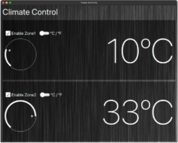</p>

Мы добавили новый компонент Label для отображения температуры на видном месте. Размещенный в **ColumnLayout** с правой стороны экрана, этот Label был оформлен с использованием сверхтонкого шрифта и значительно большего размера шрифта для обеспечения видимости и читаемости. Мы установили выравнивание текста по правому краю и обеспечили, чтобы Label заполнял ширину своего контейнера для эстетической согласованности. Свойство **text** метки было привязано к выражению JavaScript, которое переключало отображаемую температуру между градусами Цельсия и Фаренгейта на основе состояния **unitSwitch**, что позволяет пользователям легко переключаться между единицами измерения температуры.

- Шаг 4: Улучшение качества отображения текста

ZoneControls.qml
```
Label {
    // renderTypeQuality: Text.HighRenderTypeQuality 
    renderType: Text.CurveRendering
}
```

<p align="center"></p>

Для версий Qt ниже 6.7 мы устанавливаем свойство **renderTypeQuality** на **Text.HighRenderTypeQuality**, чтобы улучшить внешний вид текста за счет увеличения использования памяти. Для Qt 6.7 и более поздних версий мы рекомендуем изменить **renderType** на **Text.CurveRendering**, оптимизируя как внешний вид, так и потребление графической памяти.


## Управление вентилятором с помощью ползунка

[](https://d3pg1c2bhy6429.cloudfront.net/114478/whbsGfuiNfkI98JagIlWQq4RWpx2gvCTIumCErq2/scormcontent/assets/03.06-Slider.mp4?v=1)

<details>
<summary><b>Расшифровка видео</b></summary>

Последний элемент управления, который мы добавим, — это ползунок. Ползунки позволяют пользователям регулировать значение, манипулируя перетаскиваемым маркером вдоль определенной дорожки. Вы можете увидеть, что они широко используются для регулировки громкости, уровня масштабирования или манипулирования фотофильтрами в вашем любимом приложении социальных сетей.

Тип ползунка в Qt Quick Controls очень похож на Dial и Switch во многих отношениях.

Подобно циферблату, ползунок также содержит свойство «live» и позволяет вам управлять размером шага и привязкой. Вы также можете задать ориентацию ползунка, которая по умолчанию равна «Qt.Horizontal».

По мере того, как вы больше узнаете о Qt Quick Controls, вы увидите, что между их общим поведением существует большая согласованность, что позволяет очень легко научиться использовать новые без лишних догадок.

Наш ползунок будет управлять скоростью вентилятора в каждой зоне. Давайте добавим ползунок в тот же ColumnLayout, что и наша метка температуры, но сначала поместим его в новый RowLayout, чтобы позже можно было добавить значки на каждый конец.

Дайте ползунку идентификатор и установите значения from и to на 0 и 100 соответственно.

Мы установим Layout.fillWidth на true, чтобы он заполнил RowLayout и, соответственно, ColumnLayout справа от зоны.

Поскольку мы не хотим, чтобы пользователь управлял ползунком, когда зона отключена, мы можем установить свойство enabled для ColumnLayout, чтобы предотвратить случайное взаимодействие пользователя.

Давайте протестируем ползунок, отключив зону и убедившись, что он не реагирует соответствующим образом.

Настройте свойства ползунка и макет зоны по своему вкусу и разберитесь с дополнительными свойствами, которые мы не рассмотрели.

В заключительном разделе мы добавим немного визуальных эффектов элементам управления с помощью иконок для циферблата и ползунка, а также настроим цвета нашего приложения в соответствии со значениями температуры.

</details>

### Резюме: Управление вентилятором с помощью ползунка

Теперь у нас есть слайдер в правой колонке нашего приложения, который представляет собой управление скоростью вентилятора для наших домашних элементов управления и готов к добавлению иконок для предоставления дальнейшего контекста для его цели. Вот как мы это сделали:

- Шаг 1: Настройка слайдера

ZoneControls.qml
```
//...
ColumnLayout {
   id: rightColumn
  
   //...
   RowLayout {
      spacing: 10

      Slider {
         id: fanSpeedSlider

         from: 0 // fan off
         to: 100 // fan max speed

         Layout.fillWidth: true
      }
   }
}
//...
```

<p align="center">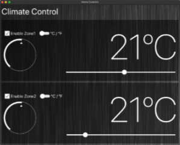</p>

Мы поместили **Slider** в тот же **ColumnLayout**, что и метка температуры, но в новый **RowLayout**, чтобы оставить место для дополнительных визуальных элементов, таких как значки. Slider получил **id** идентификатор и установил диапазон **from** от 0 **to** до 100, что представляет собой скорость вентилятора в процентах. Чтобы гарантировать, что ползунок адаптируется к доступному пространству, мы установили **Layout.fillWidth** в значение **true**, что позволяет ему полностью расширяться в пределах **RowLayout** и, соответственно, **ColumnLayout**.

- Шаг 2: Контроль взаимодействия с пользователем

ZoneControls.qml
```
ColumnLayout {
    id: rightColumn
        
    enabled: zoneEnabledCheckBox.checked
    //...
}
```

<p align="center">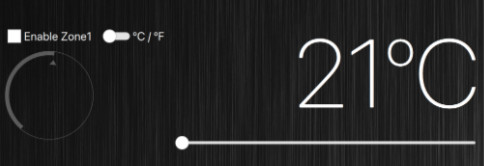</p>

Чтобы предотвратить взаимодействие с ползунком, когда зона отключена, мы связали свойство **enabled** элемента **ColumnLayout** с **zoneEnabledCheckBox.checked**. Это условное включение гарантирует, что пользователи не смогут регулировать скорость вентилятора, когда зона неактивна, избегая любых непреднамеренных настроек.


Вот фрагмент того, что мы добавили в наш файл ZoneControls.qml:

<details>
<summary><b>ZoneControls.qml</b></summary>

```
import QtQuick
import QtQuick.Controls.Basic
import QtQuick.Layouts

Pane {
    id: root

    property string zoneName

    palette {
        windowText: "white"
        dark: "white"
    }

    background: Rectangle { }

    // temperatature conversion
    property int celsius: temperatureDial.value
    property int fahrenheit: (celsius * 1.8) + 32

    RowLayout {
        anchors.fill: parent

        spacing: 10

        ColumnLayout {
            spacing: 10

            RowLayout { }

            RowLayout {
                enabled: zoneEnabledCheckBox.checked

                spacing: 10

                Dial {
                    id: temperatureDial

                    from: 0 // ºC
                    to: 40 // ºC

                    value: 21 // default value ºC

                    stepSize: 1 // whole degrees
                    snapMode: Dial.SnapAlways
                }
            }
        }

        ColumnLayout {
            enabled: zoneEnabledCheckBox.checked

            spacing: 10

            Label {

                text: unitsSwitch.checked ? root.fahrenheit + "ºF" 
                                          : root.celsius + "ºC"

                font {
                    weight: Font.ExtraLight
                    pixelSize: 200
                }

                Layout.fillWidth: true
                horizontalAlignment: Qt.AlignRight

                renderTypeQuality: Text.HighRenderTypeQuality
                // renderType: Text.CurveRendering
            }

            RowLayout {
                spacing: 10

                Slider {
                    id: fanSpeedSlider

                    from: 0 // fan off
                    to: 100 // fan max speed

                    Layout.fillWidth: true
                }
            }
        }
    }
}
```
    
</details>

> **Репозиторий проекта**
>
> Чтобы увидеть весь проект в его текущем виде, перейдите к **'03-Introducing-Controls'** в репозитории проекта. Вы можете открыть проект, перейдя к **CMakeLists.txt** в Qt Creator.
>
> [Ссылка на GitHub](https://github.com/qt-learning/Intro-Qt-Quick-Controls)

## Эксперименты с элементами управления

Настройте элементы управления и их расположение в соответствии с вашими требованиями к системе управления домом. Изучите реализованные элементы управления и их атрибуты, чтобы понять их функцию в пользовательском интерфейсе. Рассмотрите следующее: Как вы можете улучшить пользовательский опыт? Какие дополнительные элементы управления могут быть полезны? Каким образом вы можете улучшить дизайн приложения?

<p align="center">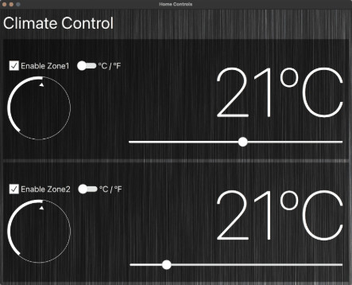</p>


Далее мы завершим наше приложение, добавив значки и цвета, чтобы оживить его.

---

# Урок 7: Иконки и цвет

[Перейти к содержанию](#содержание)

<p align="center">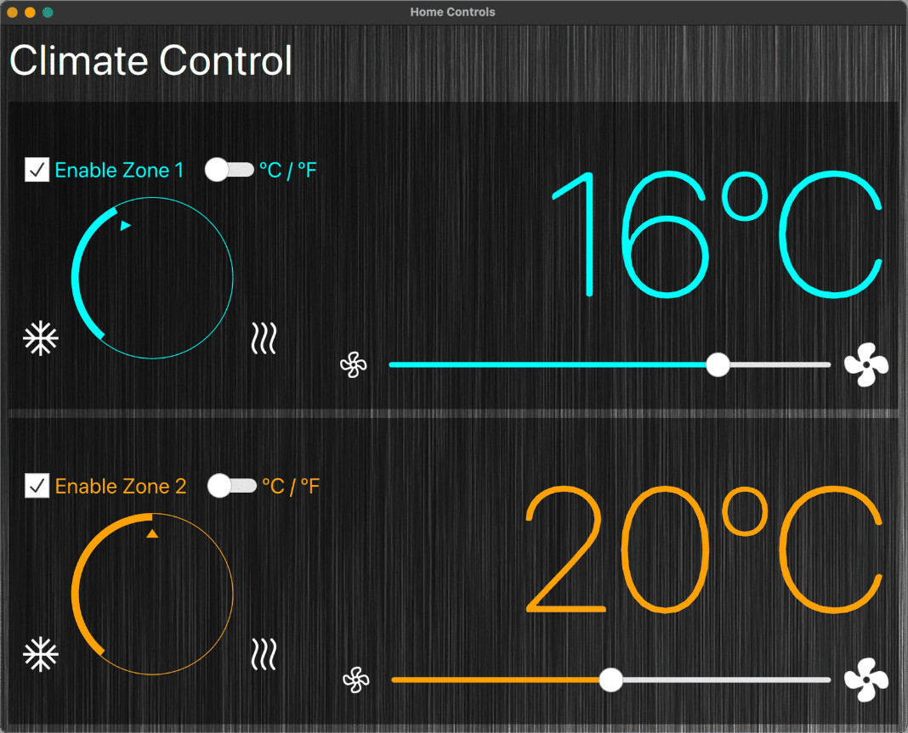</p>

Теперь у нас есть основная функциональность нашего приложения, включающая два независимых зональных элемента управления, которые можно включать и отключать. У нас есть циферблат для регулировки температуры, переключатель для выбора предпочтительных единиц измерения температуры и ползунок для скорости вентилятора. В этом последнем разделе мы улучшаем наш циферблат и ползунок с помощью иконок и контекстных цветов пользовательского интерфейса, соответствующих текущей температуре.

Прежде чем углубляться, давайте рассмотрим некоторые элементы, которые мы будем использовать в этом разделе: **Palette** палитру и **ColorGroups** цветовые группы.

## Palette палитра и ColorGroups: стилизовать Qt Quick Controls

Свойство [palette](https://doc.qt.io/qt-6/qml-qtquick-item.html#palette-prop) является частью Qt Quick **Item** и наследуется элементами управления, которые мы реализовали в предыдущем разделе. Тип [Window](https://doc.qt.io/qt-6/qml-qtquick-window.html) также содержит свойство palette; [ApplicationWindow](https://doc.qt.io/qt-6/qml-qtquick-controls-applicationwindow.html) нашего приложения наследует это свойство. До сих пор мы использовали свойство palette в нашей панели ZoneControls, чтобы предоставить альтернативный цвет некоторым ролям в базовом стиле Qt Quick Controls. Хотя мы не будем здесь вдаваться в подробности о палитре, неплохо предоставить более широкий контекст того, что она делает и как мы ее используем.

Палитра используется стилем элемента при визуализации всех элементов управления. Она доступна для обеспечения того, чтобы пользовательские элементы управления могли поддерживать согласованность с внешним видом и поведением собственной платформы. Часто бывает так, что разные платформы или стили определяют разные палитры для приложения. Элементы распространяют явные свойства палитры от родителей к потомкам. Если вы измените определенное свойство в палитре элемента, это свойство распространится на все дочерние элементы элемента, переопределяя любые системные значения по умолчанию для этого свойства.

Тип QML [Palette](https://doc.qt.io/qt-6/qml-qtquick-palette.html#details) состоит из трех цветовых групп: **active** активная, **disabled** отключенная и **inactive** неактивная. Активная цветовая группа является группой по умолчанию; ее цвета используются для других групп, если цвета этих групп явно не указаны. Вот как мы используем свойство палитры в нашем приложении для управления домом.

```
ColumnLayout {
    palette {
        text: "darkslategray"
        button: "slategray"
    }

    Label {
        text: "This text will be dark slate gray"
    }

    Button {
        text: "This button will be slate gray"
    }
}
```

<p align="center">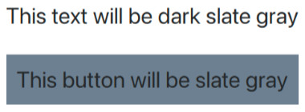</p>

В приведенном выше примере мы задаем роли цвета текста и кнопки. Любой дочерний компонент ColumnLayout, использующий эти роли, унаследует указанные цвета: темно-серый для текста Label и Button и сланцево-серый для фона кнопки. Изучите свойства в [документации Qt](https://doc.qt.io/qt-6/qml-qtquick-colorgroup.html#properties), чтобы узнать больше о различных цветовых ролях, которые можно использовать для настройки вашего приложения.

## Добавление контекста и цвета

[](https://d3pg1c2bhy6429.cloudfront.net/114478/whbsGfuiNfkI98JagIlWQq4RWpx2gvCTIumCErq2/scormcontent/assets/04-Life-Color.mp4?v=1)

<details>
<summary><b>Расшифровка видео</b></summary>

В этом заключительном разделе мы добавим последние штрихи к нашему приложению управления домом, добавив значки и настроив цвет элементов управления, когда пользователь изменяет температуру. Давайте начнем с некоторых графических элементов, которые мы импортировали ранее.

В RowLayout циферблата мы добавим два значка, которые обеспечивают контекст для его использования. Чтобы отобразить изображение «cool.svg», мы будем использовать метод Qt.resolvedUrl() и укажем путь, как упоминалось ранее. Размещение значка «cool» над циферблатом означает, что он будет размещен слева от циферблата. Чтобы выровнять изображение по нижней части RowLayout вместо его стандартного центрального положения, мы можем использовать Layout.alignment. Мы также будем использовать тот же процесс для отображения изображения «heat.svg».

Теперь ползунок. Мы добавим значки, чтобы визуально представить диапазон скорости вентилятора от выключенного/низкого до высокого, разместив их слева и справа соответственно.

Для низкой скорости вращения вентилятора мы можем использовать сравнение JavaScript и условный оператор для изменения источника изображения в зависимости от того, равна ли скорость вращения вентилятора нулю (выключено) или нет.

Пока мы используем implicitWidth и implicitSize изображений, мы изменим как изображения низкой/выключенной, так и высокой скорости вращения вентилятора, изменив масштаб. Сделав первое немного меньше, а второе немного больше.

Перейдя в начало файла ZoneControls, давайте добавим новое свойство цвета только для чтения, содержащее блок if, который возвращает определенный цвет в зависимости от текущего значения по Цельсию. Теперь мы можем обновить роли цветов windowText и темной палитры, чтобы динамически изменять эти роли цветов в зависимости от температуры.

Давайте посмотрим на наше окончательное завершенное приложение для управления домом во всей его красочной красе!

</details>

### Резюме: Контекст и цвет

Теперь наше приложение имеет больший контекст для своих элементов управления с иконками для обозначения диапазона ползунка и циферблата, а также цвета элементов пользовательского интерфейса, соответствующие текущей температуре. Вот как мы это сделали:

- Шаг 1: Интеграция иконок для контекста

ZoneControls.qml
```
//...
RowLayout {
    //...
        
    Image {
        // cool temperature image
        source: Qt.resolvedUrl("assets/cool.svg")
        Layout.alignment: Qt.AlignBottom
    }

    Dial {}

    Image {
        // hot temperature image
        source: Qt.resolvedUrl("assets/heat.svg")
        Layout.alignment: Qt.AlignBottom
    }
}
//...
```

<p align="center">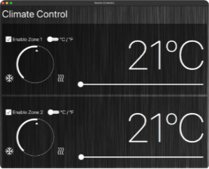</p>

Мы начали с добавления иконок в RowLayout циферблата, чтобы дать визуальные подсказки о его функциональности. Мы использовали метод **Qt.resolvedUrl()** для включения изображений **cool.svg** и **heat.svg**, предоставляя четкие индикаторы для регулировки охлаждения и нагрева. Эти иконки были размещены слева и справа от циферблата, выровненные по нижней части RowLayout, чтобы гарантировать их правильное расположение с циферблатом.

- Шаг 2: Настройка иконок слайдера

ZoneControls.qml
```
//...
RowLayout {
    Image {
        source: fanSpeedSlider.value > 0 ? 
                    Qt.resolvedUrl("assets/fan_outline.svg") : 
                    Qt.resolvedUrl("assets/fan_off.svg")
        
        scale: 0.75 
    }

    Slider {}
    
    Image { 
        source: Qt.resolvedUrl("assets/fan_fill.svg") 
        scale: 1.25
    }
}
//...
```

<p align="center">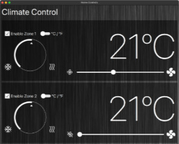</p>

Для ползунка, который управляет скоростью вентилятора, мы добавили значки на обоих концах шкалы, чтобы представить диапазон от низкого/выкл. до высокого. Это визуальное представление помогает пользователям быстро понять воздействие ползунка без чтения дополнительных инструкций. Мы использовали условный оператор JavaScript для динамического изменения исходного пути значка низкой скорости вентилятора в зависимости от того, была ли скорость вентилятора установлена ​​на ноль, что улучшает понимание пользователя посредством визуальной обратной связи.

- Шаг 3: Динамическое изменение цвета в зависимости от температуры

ZoneControls.qml
```
//...
    readonly property color temperatureColor: {
        if (celsius < 10)
            return Qt.color("lightblue")
        else if (celsius >= 10 && celsius < 20)
            return Qt.color("cyan")
        else if (celsius >= 20 && celsius < 30)
            return Qt.color("orange")
        else
            return Qt.color("red")
    }

    palette {
        windowText: root.temperatureColor
        dark: root.temperatureColor
    }
//...
```

<p align="center">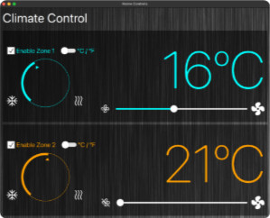</p>

Мы ввели новое **readonly color** свойство цвета только для чтения в верхней части файла ZoneControls, которое выводит определенный цвет на основе текущего значения Цельсия. Этот подход позволил нам визуально представить изменения температуры через цвет, сделав интерфейс визуально привлекательным и функционально информативным. Мы обновили роли цветов **windowText** и **dark** темной палитры, чтобы отразить эти изменения в наших элементах пользовательского интерфейса.

Вот фрагмент того, что мы добавили в наш проект:

<details>
<summary><b>ZoneControls.qml</b></summary>

```
Pane {
    id: root
    
    readonly property color temperatureColor: {
        if (celsius < 10)
            return Qt.color("lightblue")
        else if (celsius >= 10 && celsius < 20)
            return Qt.color("cyan")
        else if (celsius >= 20 && celsius < 30)
            return Qt.color("orange")
        else
            return Qt.color("red")
    }

    palette {
        windowText: root.temperatureColor
        dark: root.temperatureColor
    }

    background: Rectangle {}

    RowLayout {
        ColumnLayout {
            RowLayout {}

            RowLayout {
                Image {
                    source: Qt.resolvedUrl("assets/cool.svg")
                    Layout.alignment: Qt.AlignBottom
                }

                Dial {}

                Image {
                    source: Qt.resolvedUrl("assets/heat.svg")
                    Layout.alignment: Qt.AlignBottom
                }
            }
        }

        ColumnLayout {
            Label {}

            RowLayout {

                Image {
                    source: fanSpeedSlider.value
                            > 0 ? Qt.resolvedUrl(
                                      "assets/fan_outline.svg") : 
                                  Qt.resolvedUrl(
                                      "assets/fan_off.svg")
                    scale: 0.75
                }

                Slider {}

                Image {
                    source: Qt.resolvedUrl("assets/fan_fill.svg")
                    scale: 1.25
                }
            }
        }
    }
}
```
    
</details>

> **Репозиторий проекта**
>
> Чтобы увидеть весь проект в его текущем виде, перейдите к **'04-Icons-Color'** в репозитории проекта. Вы можете открыть проект, перейдя к **CMakeLists.txt** в Qt Creator.
>
> [Ссылка на GitHub](https://github.com/qt-learning/Intro-Qt-Quick-Controls)

Теперь посмотрим, чему вы научились!

# 🎉 Молодец! 🎉

Поздравляю с выполнением следующих шагов.

# Что дальше?

Здесь вы найдете список ценных ресурсов, которые помогут вам в вашем путешествии.

### На следующих страницах Qt Docs вы можете найти подробную информацию о темах этого курса:

**Qt Quick Controls QML Types**
[Изучите QML-типы, включенные в Qt Quick Controls.](https://doc.qt.io/qt-6/qtquick-controls-qmlmodule.html)

**Стили Qt Quick Controls**
[Посмотрите на доступные стили, предоставляемые Qt Quick Controls.](https://doc.qt.io/qt-6/qtquickcontrols-styles.html)

**Настройка элементов управления Qt Quick**
[Узнайте подробнее, как настраивать элементы управления, стили и изучите примеры для различных типов элементов управления Qt Quick.](https://doc.qt.io/qt-6/qtquickcontrols-customize.html)

**Qt Quick Layouts**
[Qt Quick Layouts — это набор типов QML, используемых для размещения элементов в пользовательском интерфейсе.](https://doc.qt.io/qt-6/qtquicklayouts-index.html)

---

[Перейти к содержанию](#содержание)

[<p align="center"></p>](../README.md "На главную")
