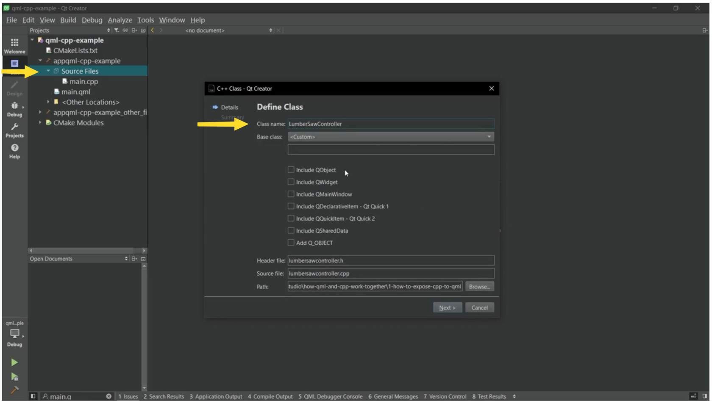
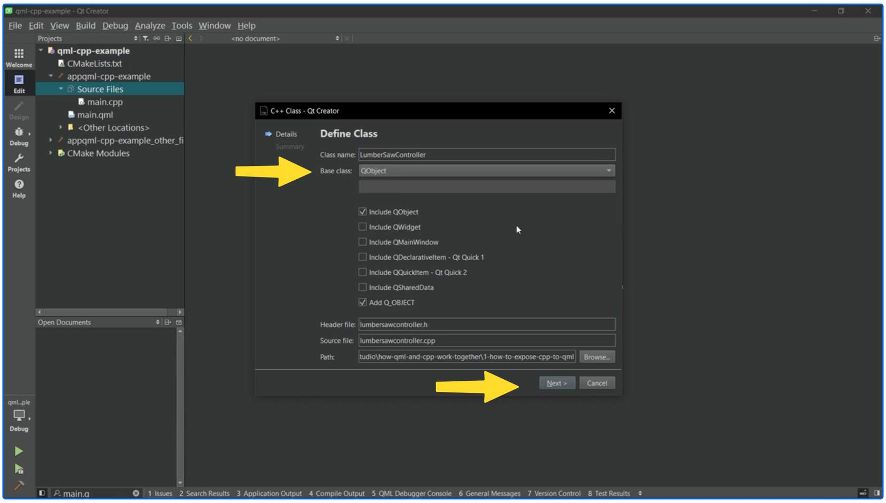
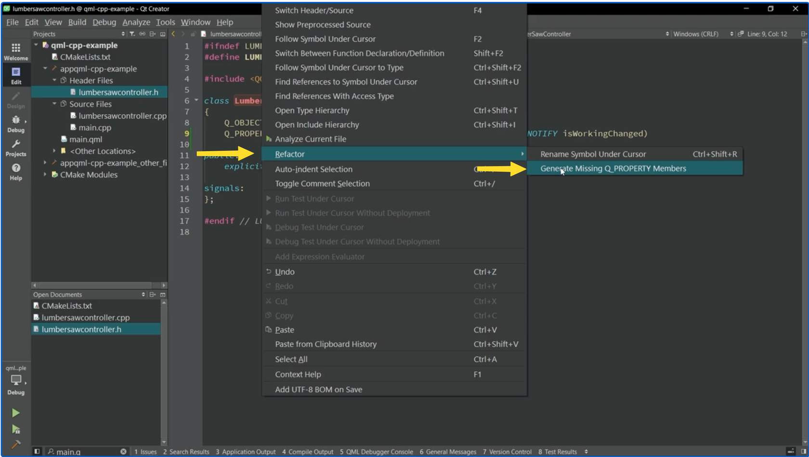
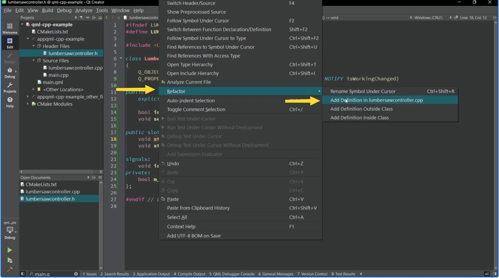
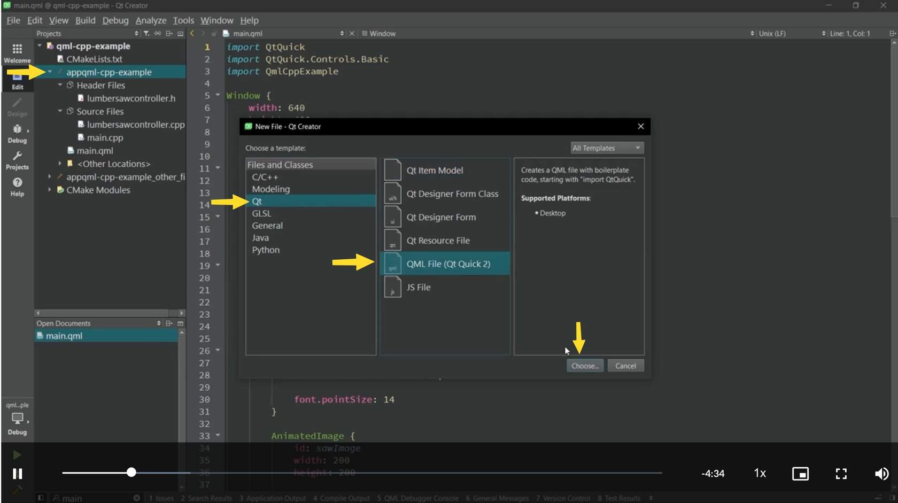

[<p align="center"></p>](../README.md "На главную")

# Как представить C++ в QML?

## Содержание:

- [Как представить C++ в QML?](#как-представить-c-в-qml)
  - [Содержание:](#содержание)
- [Урок 1: Введение в представление C++ в QML?](#урок-1-введение-в-представление-c-в-qml)
  - [Обзор](#обзор)
  - [Чему я научусь?](#чему-я-научусь)
  - [Об этом курсе](#об-этом-курсе)
  - [Зачем мне смешивать C++ и QML?](#зачем-мне-смешивать-c-и-qml)
  - [Что такое регистрация?](#что-такое-регистрация)
- [Урок 2: Проект Дело](#урок-2-проект-дело)
  - [Давайте рассмотрим проект в видео ниже.](#давайте-рассмотрим-проект-в-видео-ниже)
- [Урок 3: Создание класса C++](#урок-3-создание-класса-c)
  - [Как создать класс C++?](#как-создать-класс-c)
  - [Резюме: Представление класса C++](#резюме-представление-класса-c)
  - [Некоторые ключевые концепции и передовой опыт](#некоторые-ключевые-концепции-и-передовой-опыт)
- [Урок 4: Регистрация класса C++ как типа QML](#урок-4-регистрация-класса-c-как-типа-qml)
  - [Посмотрите видео, где мы регистрируем класс C++](#посмотрите-видео-где-мы-регистрируем-класс-c)
  - [Вот что мы сделали:](#вот-что-мы-сделали)
- [Урок 5: Использование пользовательского типа QML в качестве типа свойства](#урок-5-использование-пользовательского-типа-qml-в-качестве-типа-свойства)
  - [Посмотрите видео, в котором мы добавляем еще одну пилу, используя пользовательский тип QML в качестве типа свойства.](#посмотрите-видео-в-котором-мы-добавляем-еще-одну-пилу-используя-пользовательский-тип-qml-в-качестве-типа-свойства)
  - [Вот что мы сделали:](#вот-что-мы-сделали-1)
- [Вопросы](#вопросы)
- [Давайте сделаем краткий обзор того, что вы исследовали!](#давайте-сделаем-краткий-обзор-того-что-вы-исследовали)

---

# Урок 1: Введение в представление C++ в QML?

[Перейти к содержанию](#содержание)

[Ссылка на курс](https://academy.qt.io/catalog/courses/4265149)

## Обзор

🎯 В этом курсе вы узнаете, как получить доступ к функциональности C++ из QML: предоставить C++ для QML. Это делается путем регистрации класса C++ как типа QML.

🧑‍💻 Этот курс предназначен для людей с базовыми знаниями QML и пониманием концепций объектно-ориентированного программирования с использованием C++. Мы предполагаем, что вы знаете классы, методы и члены классов, наследование и базовое управление памятью с использованием указателей.

👉 После завершения этого курса вы сможете сделать свой объект C++ видимым в QML и использовать его возможности.

## Чему я научусь?

1. Узнайте, почему смешивание C++ и QML выгодно.
2. Поймите, что такое регистрация и как она выполняется.
3. Как изучить макросы, которые позволяют вам представить C++ в QML.
4. Узнайте, как создать, зарегистрировать и использовать пользовательский тип QML в качестве типа свойства.

## Об этом курсе

💬 Курс содержит видео с английскими субтитрами. Вы также можете прочитать расшифровки видео отдельно.

⏱ Продолжительность этого курса составляет около 30 минут.

💻 Вам необходимо установить Qt Creator на вашем компьютере, чтобы получить максимальную пользу от этого курса. Инструкции по установке вы найдете в курсе Как установить [Qt](https://courses.qt.io/how-to-install-qt). Для использования Qt Creator вам понадобится ноутбук или настольный компьютер (не мобильное устройство).

👉 Примечание: ваш прогресс не сохраняется при закрытии окна курса. Однако вы можете свободно перемещаться по курсу и всегда возвращаться.

## Зачем мне смешивать C++ и QML?

Объединение C++ и QML дает вам четкое разделение между пользовательским интерфейсом и бизнес-логикой вашего приложения. С помощью C++ вы можете расширить свое приложение QML и получить доступ к функциям и программным API. Он позволяет получить доступ к объекту класса C++ и его методам и свойствам из кода QML. Это дает вам масштабируемую и поддерживаемую кодовую базу — в чем и заключается сила Qt!

1. Используйте собственные функции платформы и библиотеки C/C++, которые недоступны в QML.

2. Имейте четкое разделение между пользовательским интерфейсом и бизнес-логикой вашего приложения.

3. Имейте масштабируемую и поддерживаемую кодовую базу.

4. Используйте некоторые функции Qt, которые доступны только в C++.

5. Достигайте более высокой производительности и реализуйте расширенную многопоточность для требовательного к производительности программного обеспечения.

## Что такое регистрация?

Основной способ представления C++ в QML — **регистрация** класса C++ как типа QML.

В этом контексте регистрация (или определение) означает включение возможности **использования пользовательского класса C++ в качестве *типа данных* в коде QML**. Это делается путем создания модуля QML и регистрации классов или функций C++ в качестве типов QML в этом модуле. Это позволяет разработчикам создавать пользовательские компоненты QML с использованием кода C++, а также позволяет коду QML вызывать функции C++ и получать доступ к свойствам C++.

Более подробное описание [см. в документации](https://doc.qt.io/qt-6/qtqml-cppintegration-definetypes.html).

Ниже вы можете увидеть пример этого. Позже в этом курсе мы создадим его шаг за шагом.

```
LumberSawController{
    id: otherSawController
    sawSpeed: 3
    onIsWorkingChanged: {
        console.log("Saw changed working state")
    }
}
```

Пользовательский класс C++ "LumberSawController" был зарегистрирован и создан в QML. Вы также можете определить свойства с помощью вашего класса на основе C++ в качестве типа свойства.

---

# Урок 2: Проект Дело

[Перейти к содержанию](#содержание)

В этом разделе мы расширим приложение QML-only, создав класс C++ в Qt Creator IDE и предоставив его QML. Чтобы создать нужную нам бизнес-логику, нам нужно расширить приложение QML классом C++, который наследует QObject и использует макрос Q_OBJECT.

## Давайте рассмотрим проект в видео ниже.

> **Репозиторий проекта**
>
> Нажмите правую кнопку, чтобы загрузить файлы проекта. Найдите файл **CMakeLists.txt**, чтобы открыть проект в Qt Creator.
>
> [Ссылка на GitHub](https://github.com/qt-learning/how-to-expose-c-to-qml)

[](https://d3pg1c2bhy6429.cloudfront.net/114478/Y3Pf2yC1gGiCNqS7Yk71Dk0VGymIsLKRicTsaBg0/scormcontent/assets/Video01and02.mp4?v=1)

<details>
<summary><b>Расшифровка видео</b></summary>

Наш пример проекта управляет работой лесопилки. Он предоставляет пользовательский интерфейс для независимого запуска и остановки двух пил и управления скоростью каждой пилы.

Начальная кодовая база включает пользовательский интерфейс QML со всеми элементами, элементами управления и активами для одной пилы. Проект пока не включает никакого кода C++, кроме файла main.cpp, который автоматически генерируется Qt Creator.

Чтобы создать нужную нам бизнес-логику, нам нужно сообщить пользовательскому интерфейсу на основе QML состояние пилы. Для этого нам нужно расширить QML, создав класс C++ и предоставив его QML. Мы также будем использовать этот пользовательский тип QML на основе C++ в качестве типа свойства для создания двух независимых пил.

Это означает, что мы собираемся создать класс C++ под названием «LumberSawController», который будет иметь два атрибута: логическое значение с именем «isWorking», указывающее, включена или выключена пила, и целое значение с именем «sawSpeed», указывающее скорость пилы. Оба будут доступны для чтения из QML, но только sawSpeed ​​будет доступен для редактирования со стороны QML.

Изменение значения isWorking будет возможно путем вызова функций запуска или остановки из QML.

Для управления одной пилой будет использоваться один экземпляр класса LumberSawController.

Класс C++, который должен быть представлен в QML, должен наследовать QObject и использовать макрос Q_OBJECT. В этом курсе вы познакомитесь с их использованием, а позже в этом учебном пути вы более подробно узнаете, как они работают.

С помощью этого примера вы изучите основы C++ в Qt и как интегрировать его с QML. Но теперь давайте приступим к работе и создадим класс!

</details>

---

# Урок 3: Создание класса C++

[Перейти к содержанию](#содержание)

В этом разделе мы рассмотрим, как создать класс C++ и представить его в QML.

## Как создать класс C++?

> **Репозиторий проекта**
>
> Если вы еще этого не сделали, нажмите правую кнопку, чтобы загрузить файлы проекта. Найдите файл **CMakeLists.txt**, чтобы открыть проект в Qt Creator.
>
> [Ссылка на GitHub](https://github.com/qt-learning/how-to-expose-c-to-qml)

[](https://d3pg1c2bhy6429.cloudfront.net/114478/Y3Pf2yC1gGiCNqS7Yk71Dk0VGymIsLKRicTsaBg0/scormcontent/assets/Video03.mp4?v=1)

<details>
<summary><b>Расшифровка видео</b></summary>

В этом видео мы создадим класс C++ под названием «LumberSawController» и предоставим его QML.

Щелкните правой кнопкой мыши по исходным файлам и выберите «Добавить новый». Откроется мастер создания файлов и классов. Выберите «Класс C++».

В следующем представлении мы определим класс. Сначала дайте классу имя. В этом примере мы назовем его «LumberSawController».

Чтобы мы могли предоставить C++ QML, класс должен наследоваться от QObject и использовать макрос Q_OBJECT. Для этого выберите QObject в качестве базового класса в раскрывающемся меню. Как вы видите, флажки затем устанавливаются автоматически. В следующих курсах вы узнаете больше о том, как и почему работает QObject.

Вы также можете увидеть, что мастер автоматически заполнил заголовки и имена исходных файлов.

Выберите «Далее», а затем «Готово».

Теперь вы должны увидеть всплывающее окно с вопросом, хотите ли вы скопировать путь к исходным файлам в буфер обмена. Мы хотим это сделать, поэтому выберите «Да».

Чтобы включить заголовочные и исходные файлы в свой проект, вам нужно добавить путь в команду qt_add_executable файла CMakeLists.txt. Qt Creator автоматически направит вас туда. Вставьте путь после main.cpp. Теперь файлы сгенерированы.

Затем откройте заголовочный файл LumberSawController, дважды щелкнув его. Вы можете видеть, что класс наследуется от QObject, и добавлен макрос Q_OBJECT, как мы определили в мастере.

Теперь давайте добавим первый атрибут isWorking.

Свойства Qt объявляются с помощью макроса Q_PROPERTY, поэтому нам нужно добавить его первым. Когда вы начнете вводить текст, Qt Creator предложит варианты автодополнения. Выберите первый из списка.

В скобках сначала нужно указать тип свойства и дать ему имя. В этом случае тип — bool, а имя — «isWorking». Остальное автоматически заполняется за вас. Нажмите Enter, когда закончите.

Ключевые слова READ и WRITE указывают на функции setter и getter, которые изменяют и возвращают значение свойства. Ключевое слово NOTIFY указывает на сигнал, что является одной из основных концепций при разработке с использованием Qt. Сигнал УВЕДОМЛЯЕТ об изменении значения свойства. Вы узнаете об этом больше в следующих курсах.

Далее мы автоматически сгенерируем отсутствующие члены Q_PROPERTY. Щелкните правой кнопкой мыши по макросу, чтобы открыть контекстное меню, выберите «Рефакторинг» и «Сгенерировать отсутствующие члены Q_PROPERTY». Отсутствующие объявления и определения функций добавляются в исходный код.

Вы также можете увидеть новый атрибут сигнала и класса «m_isWorking». «m_» — это способ объявления переменных-членов в Qt.

Теперь давайте объявим две функции для управления пилой: start() и stop(). Они должны быть объявлены как публичные слоты, чтобы сделать их доступными в QML. Сигналы также могут быть подключены к слотам. Когда сигнал уведомляет об изменении значения, будет вызвана функция слота.

С помощью той же опции «Рефакторинг» из контекстного меню вы можете автоматически создать определение функции в файле lumbersawcontroller.cpp. Сделайте это для обеих функций, start() и stop().

Теперь в определении функции start() используйте функцию setIsWorking(), чтобы изменить значение атрибута isWorking на true. Используйте ту же функцию, чтобы изменить значение атрибута на false в функции stop(). Хорошей практикой является не изменять значение атрибута, если новое значение равно существующему.

Атрибут isWorking не будет доступен со стороны QML, поэтому мы можем удалить ключевое слово WRITE и сеттер из макроса Q_PROPERTY. Таким образом, он не будет виден из QML.

Также хорошей практикой является сделать как можно больше членов класса закрытыми. Вот почему мы сейчас объявим функцию setIsWorking как закрытую. Она вызывается только в функциях-членах класса start() и stop().

Последний шаг — добавить еще одно свойство для скорости пилы. Мы будем использовать макрос Q_PROPERTY, который вам уже знаком. На этот раз мы будем использовать int в качестве типа свойства и назовем его «sawSpeed». Чтобы вызвать меню рефакторинга, вы можете щелкнуть правой кнопкой мыши по свойству или выбрать Alt + Enter. Выберите «Сгенерировать отсутствующие члены Q_PROPERTY».

Давайте установим значение по умолчанию sawSpeed ​​на 1.

И вот оно: новый класс C++, LumberSawController, готовый к представлению в QML.

</details>

## Резюме: Представление класса C++

- Шаг 1: Добавьте новый класс C++ и назовите его

    <p align="center"></p>

    Щелкните правой кнопкой мыши на Sources Files и выберите "Add New". Это откроет мастер создания файлов и классов. Выберите "C++ Class". Дайте вашему классу имя (здесь "LumberSawController").

- Шаг 2: Наследование от QObject и использование макроса Q_OBJECT

    <p align="center"></p>

    Выберите QObject в качестве базового класса в раскрывающемся меню. Как вы видите, флажки затем выбираются автоматически. Мастер автоматически заполняет заголовки и имена исходных файлов. Нажмите «Далее», а затем «Готово».
    
    Появится всплывающее окно с вопросом, хотите ли вы скопировать путь к исходным файлам в буфер обмена. Выберите «Да».

- Шаг 3: Включите заголовочные и исходные файлы в свой проект

    ```
    qt_add_executable(appqml-cpp-example
        main.cpp
        lumbersawcontroller.h
        lumbersawcontroller.cpp
    )
    ```

    Добавьте путь в команду qt_add_executable файла CMakeLists.txt. Qt Creator автоматически направит вас туда. Вставьте путь после main.cpp. Теперь файлы сгенерированы.

- Шаг 4: Добавьте свой первый атрибут

    ```
    Q_PROPERTY(bool isWorking READ isWorking 
           WRITE setIsWorking NOTIFY isWorkingChanged)
    ```

    Откройте заголовочный файл LumberSawController.

    Добавьте макрос Q_PROPERTY, который используется для объявления свойств Qt. Когда вы начнете вводить текст, Qt Creator предложит варианты автодополнения. Выберите первый из списка.

    В скобках сначала нужно указать тип свойства и дать ему имя. В этом случае тип — bool, а имя — «isWorking». Остальное автоматически дополняется за вас. Нажмите Enter, когда закончите.

- Шаг 5: Автоматически сгенерировать отсутствующие элементы Q_PROPERTY

    <p align="center"></p>

    Щелкните правой кнопкой мыши по макросу, чтобы открыть контекстное меню, выберите «Рефакторинг» и «Сгенерировать отсутствующие члены Q_PROPERTY». Отсутствующие объявления и определения функций добавляются в исходный код.

- Шаг 6: Добавить функции

    ```
    public slots:
        void start();
        void stop();
    ```

    Добавьте две функции для управления пилой: **start()** и **stop()**. Чтобы сделать их доступными в QML, их необходимо объявить как публичные слоты. Сигналы также могут быть подключены к слотам. Когда сигнал уведомляет об изменении значения, будет вызвана функция слота.

- Шаг 7: Создать определения функций

    <p align="center"></p>

    С помощью той же опции «Рефакторинг» из контекстного меню вы можете автоматически создать определение функции в файле lumbersawcontroller.cpp. Сделайте это для обеих функций: start() и stop().

- Шаг 8: Добавить функцию setIsWorking()

    ```
    #include <lumbersawcontroller.h>

    LumbersawController::LumbersawController(QObject *parent) 
    : QObject(parent)
    {

    }

    bool LumbersawController::isWorking() const
    {
        return m_isWorking;
    }

    void LumbersawController::setIsWorking(bool newIsWorking)
    {
        if (m_isWorking == newIsWorking)
            return;

        m_isWorking = newIsWorking;
        emit isWorkingChanged();
    }

    void LumbersawController::start()
    {
        setIsWorking(true);
    }

    void LumbersawController::stop()
    {
        setIsWorking(false);
    }
    ```

    В определении функции start() используйте функцию setIsWorking(), чтобы изменить значение атрибута isWorking на true. Используйте ту же функцию, чтобы изменить значение атрибута на false в функции stop().

- Шаг 9: Добавить еще одно свойство (sawSpeed)

    ```
    class LumbersawController : public QObject
    {
        ...
        Q_PROPERTY(int sawSpeed READ sawSpeed WRITE setSawSpeed 
                NOTIFY sawSpeedChanged)

    public:
        ...
        int sawSpeed() const;

    signals:
        ...
        void sawSpeedChanged();

    private:
        ...
        int m_sawSpeed = 1;
        void setSawSpeed(int newSawSpeed);
    };
    ```

    Используйте макрос Q_PROPERTY, чтобы добавить еще одно свойство, на этот раз для скорости пилы. Используйте int в качестве типа свойства и назовите его «sawSpeed». Чтобы вызвать меню рефакторинга, вы можете щелкнуть правой кнопкой мыши по верхней части свойства или выбрать Alt + Enter. Выберите «Generate Missing Q_PROPERTY Members».

    Давайте установим значение по умолчанию sawSpeed ​​на 1.

## Некоторые ключевые концепции и передовой опыт

<details>
<summary><b>Ключевые слова READ и WRITE в макросе Q_PROPERTY</b></summary>

Ключевые слова READ и WRITE указывают на функции setter и getter, которые изменяют и возвращают значение свойства. Более подробную информацию об этих ключевых словах можно найти [здесь](https://doc.qt.io/qt-6/properties.html).

</details>

<details>
<summary><b>Ключевое слово NOTIFY в макросе Q_PROPERTY</b></summary>

Ключевое слово NOTIFY указывает на сигнал, который является одной из основных концепций при разработке с использованием Qt. Сигнал NOTIFIES об изменении значения свойства Ключевые слова READ и WRITE указывают на функции setter и getter, которые изменяют и возвращают значение свойства.

</details>

<details>
<summary><b>Сделайте как можно больше членов класса закрытыми</b></summary>

Это хорошая практика. В видео выше это использовалось путем объявления функции setIsWorking как закрытой. Она вызывается только в функциях-членах класса start() и stop().

</details>

---

# Урок 4: Регистрация класса C++ как типа QML

[Перейти к содержанию](#содержание)

С Qt 6 регистрация класса C++ проста. Все, что вам нужно сделать, это добавить макрос QML_ELEMENT в объявление класса. Давайте посмотрим на это действие!

## Посмотрите видео, где мы регистрируем класс C++

> **Репозиторий проекта**
>
> Если вы еще этого не сделали, нажмите правую кнопку, чтобы загрузить файлы проекта. Найдите файл **CMakeLists.txt**, чтобы открыть проект в Qt Creator.
>
> [Ссылка на GitHub](https://github.com/qt-learning/how-to-expose-c-to-qml)

> **Примечание: используйте #include <QQmlEngine> вместо ссылки на qqml. QQmlEngine — это облегченное включение для использования макроса QML_ELEMENT без необходимости ссылки на библиотеку QML.**

[](https://d3pg1c2bhy6429.cloudfront.net/114478/Y3Pf2yC1gGiCNqS7Yk71Dk0VGymIsLKRicTsaBg0/scormcontent/assets/Video04.mp4?v=1)

<details>
<summary><b>Расшифровка видео</b></summary>

Теперь, когда у нас есть класс C++, мы собираемся представить его QML, зарегистрировав его как новый тип QML. Это делается путем добавления макроса QML_ELEMENT к классу. В следующих курсах вы более подробно узнаете, как это работает.

Начните с включения файла qqml.h в заголовочный файл вашего класса LumberSawController. После этого добавьте макрос QML_ELEMENT.

Далее перейдите к файлу CMakeLists.txt, который является определением вашего проекта. Ранее в этом курсе мы добавили пути к файлам C++ под командой qt_add_executable. Теперь мы вырежем эти пути и переместим их под командой qt_add_qml_module после ключевого слова SOURCES. Обратите внимание, что имя модуля — QmlCppExample. Далее мы импортируем модуль в файл QML проекта.

Перейдите в main.qml и импортируйте модуль QmlCppExample. Он включает ваш класс C++, и теперь вы можете использовать свой класс из QML так же, как и любой другой тип QML.

Теперь мы создадим экземпляр нашего класса C++ в QML. Создайте экземпляр объекта QML, написав имя класса LumberSawController. Добавьте фигурные скобки и присвойте ему идентификатор. Я использую "sawController".

Теперь давайте его используем. Перейдите в AnimatedImage и используйте свойство isWorking sawController, чтобы узнать, запущена пила или нет. Это включит или выключит анимацию изображения GIF соответственно. Мы также используем свойство sawSpeed ​​sawController, чтобы сообщить AnimatedImage, как быстро должен воспроизводиться GIF.

Далее мы вызовем функции start() и stop() sawController. Это делается так же, как при вызове функций JavaScript для элементов, поддерживающих только QML.

Наконец, давайте также заставим ползунок взаимодействовать с sawController. Исходное значение ползунка должно быть установлено на значение скорости пилы. Скорость пилы обновляется всякий раз, когда обновляется свойство value, а это происходит, когда пользователь перемещает ползунок.

И все! Благодаря использованию Q_PROPERTY мы можем изменять свойства типов QML на основе C++ так же, как и любое другое свойство QML.

Теперь, когда мы запускаем приложение, мы можем запускать и останавливать пилу и изменять ее скорость.

</details>

## Вот что мы сделали:

- Шаг 1: Включить файл QQmlEngine и макрос QML_ELEMENT

    ```
    #ifndef LUMBERSAWCONTROLLER_H
    #define LUMBERSAWCONTROLLER_H

    #include <QObject>
    #include <QQmlEngine>

    class LumbersawController : public QObject
    {
        ...
        
        QML_ELEMENT
        
        ...
    };

    #endif // LUMBERSAWCONTROLLER_H
    ```

    Включите **QQmlEngine** в заголовочный файл вашего класса LumberSawController. После этого добавьте макрос **QML_ELEMENT**.

- Шаг 2: Переместить пути к файлам C++

    ```
    qt_add_executable(appqml-cpp-example
        main.cpp
    )

    qt_add_qml_module(appqml-cpp-example
        URI QmlCppExample
        VERSION 1.0
        QML_FILES main.qml
        RESOURCES
            assets/circular-saw.gif
            assets/built-with-qt-badge.png
        SOURCES
            lumbersawcontroller.h
            lumbersawcontroller.cpp
    )
    ```

    Перейдите к файлу CMakeLists.txt. Вырежьте пути файлов C++ из команды **qt_add_executable** и переместите их под команду **qt_add_qml_module** после ключевого слова **SOURCES**.

    Обратите внимание, что имя модуля в нашем проекте — **QmlCppExample**.

- Шаг 3: Импортируйте модуль в QML-файл проекта.

    ```
    import QmlCppExample
    ```

    Перейдите в main.qml и импортируйте модуль QmlCppExample. Он включает ваш класс C++. Теперь вы можете использовать свой класс из QML, как и любой другой тип QML.

- Шаг 4: Создать экземпляр C++ в QML

    ```
    LumbersawController {
        id: lumberSawController
    }
    ```

    Создайте экземпляр нашего класса C++ в QML. Создайте экземпляр объекта QML внутри элемента Window и дайте ему идентификатор, например, "sawController".

- Шаг 5: Использовать свойства

    ```
    AnimatedImage {
        id: sawImage
        width: 200
        height: 200

        playing: sawController.isWorking
        source: "assets/circular-saw.gif"
        speed: sawController.sawSpeed
    }
    ```

    Перейдите в **AnimatedImage** и используйте свойство **isWorking** **sawController**, чтобы узнать, запущена ли пила. Это соответственно включит или выключит анимацию изображения GIF.

    Используйте свойство **sawSpeed** **​​sawController**, чтобы сообщить **AnimatedImage**, как быстро должен воспроизводиться GIF.

- Шаг 6: Вызов функций

    ```
    Button {
        text: "Start"

        onClicked: {
            sawController.start();
        }
    }

    Button {
        text: "Stop"

        onClicked: {
            sawController.stop();
        }
    }
    ```

    Далее вызовите функции **start()** и **stop()** sawController. Это делается так же, как и при вызове функций JavaScript элементов, содержащих только QML.

- Шаг 7: Крепление слайдера

    ```
    Slider {
        id: slider

        width: 200

        from: 0
        to: 5

        value: sawController.sawSpeed

        onValueChanged: {
            sawController.sawSpeed = value;
        }
    }
    ```

    Наконец, давайте заставим **slider** ползунок взаимодействовать с **sawController**. Исходное значение ползунка должно быть установлено на значение скорости пилы. Скорость пилы обновляется всякий раз, когда обновляется свойство value, а это происходит, когда пользователь перемещает ползунок.

И все! Благодаря Q_PROPERTY можно изменять свойства типов QML на основе C++ так же, как и любое другое свойство QML.

Теперь, во время работы приложения, вы можете запускать и останавливать пилу и изменять ее скорость.

---

# Урок 5: Использование пользовательского типа QML в качестве типа свойства

[Перейти к содержанию](#содержание)

Но наш лесопильный завод растет, и нам нужно добавить еще одну пилу! Как нам это сделать?!

## Посмотрите видео, в котором мы добавляем еще одну пилу, используя пользовательский тип QML в качестве типа свойства.

[](https://d3pg1c2bhy6429.cloudfront.net/114478/Y3Pf2yC1gGiCNqS7Yk71Dk0VGymIsLKRicTsaBg0/scormcontent/assets/Video05.mp4?v=1)

<details>
<summary><b>Расшифровка видео</b></summary>

В этом видео мы собираемся расширить наше приложение панели управления лесопильным заводом, добавив еще одну пилу, которая работает независимо от исходной пилы. Это означает, что у вас будет два экземпляра класса LumberSawController для независимого управления обеими пилами. Для этого нам не нужно копировать и вставлять весь код QML. Вместо этого мы создадим пользовательский элемент QML на основе C++ и используем его как тип свойства.

Щелкните правой кнопкой мыши по исходным файлам проекта и выберите «Добавить новый». В мастере выберите «Qt» и «Файл QML», а затем «Выбрать». Дайте вашему файлу QML имя. Назовем его «LumberMillBlock».

Выберите «Далее» и «Готово».

Теперь перейдите в CMakeLists.txt и добавьте только что созданный нами файл QML в команду qt_add_qml_module. Как вы видите, файл LumberMillBlock.qml теперь появился в разделе «Исходные файлы».

Теперь вырежьте элементы из main.qml и откройте LumberMillBlock.qml. Чтобы получить красивую компоновку, добавьте столбец, используйте «root» в качестве идентификатора и добавьте немного интервалов перед вставкой элементов. Когда это будет сделано, вставьте элементы.

Мы пропустили некоторые импорты, поэтому вернитесь в main.qml и скопируйте импорты туда.

Далее мы добавим новое строковое свойство и дадим ему идентификатор «name». Давайте привяжем элемент Text к свойству text, определенному в корне.

Теперь давайте определим новое свойство типа LumberSawController с именем controller. Нам нужно импортировать модуль так же, как здесь.

Благодаря этому свойству при создании элементов QML LumberMillBlock мы сможем указать, какой контроллер следует использовать в качестве логики для определенного блока. Требуемое ключевое слово запретит создание элементов LumberMillBlock без связанного LumberSawController.

Далее нам нужно изменить ссылки на sawController как root.controller. Вы можете найти все ссылки сразу, нажав Ctrl+F и выполнив поиск по запросу «sawController». В поле «Заменить на» ниже введите «root.controller» и выберите «Заменить все». Это заменит все ссылки.

Теперь вернемся к main.qml и создадим два элемента LumberMillBlock. Давайте поместим их рядом друг с другом, создав элемент Row.

Давайте установим имя первого блока как «Saw 1», а второго блока как «Saw 2».

Если я сейчас запущу приложение, вы увидите, что оно вылетает, так как невозможно создать элементы LumberMillBlock без LumberSawController.

Давайте исправим это, передав идентификатор уже созданного контроллера, которым является sawController, в первый блок.

А для второго блока давайте создадим новый LumberSawController прямо здесь. Такая возможность тоже есть. Вы даже можете изменить значение sawSpeed ​​отсюда. Давайте установим значение sawSpeed ​​на 5.

Теперь, когда мы запустим приложение, вы увидите, что у вас есть две пилы рядом друг с другом. У них разные значения скорости пилы по умолчанию. Пилы имеют отдельные экземпляры LumberSawController, поэтому вы можете независимо управлять каждой пилой.

</details>

## Вот что мы сделали:

Мы собираемся расширить наше приложение лесопилки, добавив еще одну пилу, которая работает независимо от исходной пилы. Это означает, что у вас будет два экземпляра класса LumberSawController для независимого управления обеими пилами.

- Шаг 1: Добавить новый файл QML

    <p align="center"></p>

    Щелкните правой кнопкой мыши по исходникам проекта и выберите «Добавить новый». В мастере выберите «Qt» и «Файл QML», а затем «Выбрать». Дайте вашему файлу QML имя. Назовем его «LumberMillBlock». Выберите «Далее» и «Готово».

- Шаг 2: Добавьте новый файл QML в команду qt_add_qml_module

    ```
    qt_add_qml_module(appqml-cpp-example
        URI QmlCppExample
        VERSION 1.0
        QML_FILES
            main.qml
            LumberMillBlock.qml
        RESOURCES
            assets/circular-saw.gif
            assets/built-with-qt-badge.png
        SOURCES
            lumbersawcontroller.h
            lumbersawcontroller.cpp
    )
    ```

    Перейдите в **CMakeLists.txt** и добавьте файл QML, который мы только что создали, в команду **qt_add_qml_module**. Файл **LumberMillBlock.qml** появится в разделе Source Files.

- Шаг 3: Вставьте элементы из main.qml в LumberMillBlock.qml

    ```
    Column {
        id: root

        // Existing Code
    }
    ```

    Перейдите в main.qml и вырежьте элементы из элемента Text и ниже. Откройте LumberMillBlock.qml.

    Чтобы получить хороший макет, добавьте столбец, используйте «root» в качестве идентификатора и добавьте немного интервала перед вставкой элементов. Когда это будет сделано, вставьте элементы.

- Шаг 4: Добавить новое строковое свойство

    ```
    import QtQuick.Controls.Basic
    ```

    Вернитесь в main.qml. Скопируйте **import QtQuick.Controls.Basic** и вставьте их в LumberMillBlock.qml.

- Шаг 5: Добавить импорт

    ```
    Column {
        id: root

        property string name: ""

        spacing: 10

        Text {
            text: root.name
            anchors.horizontalCenter: parent.horizontalCenter

            font.pointSize: 18
        }
        ...
    }
    ```

    Добавьте новое строковое свойство и дайте ему идентификатор «имя». Привяжите элемент Текст к свойству текста, определенному в корне.

- Шаг 6: Определить новое свойство типа

    ```
    import QmlCppExample

    Column {
        id: root

        property string name: ""
        required property LumbersawController sawController
        ...
    }
    ```

    Импортируйте модуль **QmlCppExample** и определите новое свойство типа **LumberSawController** с именем controller. Благодаря этому свойству при создании элементов QML LumberMillBlock мы сможем указать, какой контроллер следует использовать в качестве логики для конкретного блока.

    Требуемое ключевое слово запретит создание элементов **LumberMillBlock** без связанного **LumberSawController**.

- Шаг 7: Изменить ссылки

    ```
    AnimatedImage {
        id: sawImage
        width: 200
        height: 200

        playing: root.sawController.isWorking
        source: "assets/circular-saw.gif"
        speed: root.sawController.sawSpeed
    }
    ```

    Измените ссылки на sawController на root.controller. Вы можете найти все ссылки сразу, нажав Ctrl+F и выполнив поиск по запросу "sawController.". В поле "Заменить на" введите "root.controller." и выберите "Заменить все". Это заменит все ссылки.

- Шаг 8: Создать элементы LumberMillBlock

    ```
    Row {
        spacing: 10

        LumberMillBlock {
            name: "Lumber Mill 1"
        }

        LumberMillBlock {
            name: "Lumber Mill 2"
        }
    }
    ```

    Вернитесь в main.qml и создайте два элемента LumberMillBlock. Давайте разместим их рядом друг с другом, создав элемент Row. Давайте установим имя первого блока как "Saw 1", а второго блока как "Saw 2".

- Шаг 9: Включить контроллер

    ```
    Row {
        spacing: 10

        LumberMillBlock {
            name: "Lumber Mill 1"
            sawController: LumbersawController {}
        }

        LumberMillBlock {
            name: "Lumber Mill 2"
            sawController: LumbersawController {}
        }
    }
    ```

    Передайте идентификатор уже созданного контроллера, которым является sawController, в первый блок.

    Для второго блока давайте создадим новый LumberSawController прямо здесь. Такая возможность тоже есть. Вы даже можете изменить значение sawSpeed ​​отсюда. Давайте установим значение sawSpeed ​​на 5.

Теперь, когда вы запустите приложение, вы увидите, что у вас есть две пилы рядом друг с другом. У них разные значения скорости пилы по умолчанию. Пилы имеют отдельные экземпляры LumberSawController, поэтому вы можете независимо управлять каждой пилой.

---

# Вопросы

[Перейти к содержанию](#содержание)

<details>
<summary><b>1. Чтобы представить C++ в QML, класс должен</b></summary>

Ответ: наследоваться от QObject и использовать макрос Q_OBJECT.

</details>

<details>
<summary><b>2. Чтобы использовать свойства Qt, вам необходимо добавить</b></summary>

Ответ: макрос Q_PROPERTY

</details>

<details>
<summary><b>3. Сопоставьте следующее</b></summary>

| | |
|---|---|
| Ключевые слова READ и WRITE указывают | на функции установки и получения, которые изменяют и возвращают значение свойства. |
| Ключевое слово NOTIFY указывает |  на сигнал. Сигнал уведомляет об изменении значения свойства. |
| “m_” | — это способ объявления переменных-членов в Qt. |
| Предоставление возможности как можно большему числу участников занятий быть закрытыми | является хорошей практикой. |

</details>

<details>
<summary><b>4. ИСТИНА или ЛОЖЬ?
Чтобы предоставить класс C++ для QML, его необходимо зарегистрировать как новый тип QML.
Это делается путем добавления макроса QML_ELEMENT к классу.</b></summary>

Ответ: ИСТИНА

</details>

---

# Давайте сделаем краткий обзор того, что вы исследовали!

[Перейти к содержанию](#содержание)

- **Смешивание C++ с QML имеет много преимуществ**

    С C++ вы можете расширить свое приложение QML и получить доступ к функциям и программным API. Это обеспечивает вам масштабируемую и поддерживаемую кодовую базу. Кроме того, сочетание C++ и QML позволяет вам иметь четкое разделение между пользовательским интерфейсом и бизнес-логикой вашего приложения.

- **Регистрация класса C++ как типа QML**

    Основной способ представления C++ в QML — **регистрация** класса C++ как типа QML.

- **Класс должен наследоваться от QObject и использовать макрос Q_OBJECT**

    Для представления C++ в QML класс должен наследоваться от QObject и использовать макрос Q_OBJECT.

- **Свойства Qt объявляются с помощью макроса Q_PROPERTY**

    Свойства Qt объявляются с помощью макроса Q_PROPERTY:

    Q_PROPERTY (type name READ name WRITE setName NOTIFY nameChanged)

    Вам необходимо указать тип свойства и дать ему имя.

- **Вы можете использовать пользовательский тип QML как тип свойства**

    Вы можете создать два экземпляра класса, создав пользовательский элемент QML на основе C++ и использовать его как тип свойства.

---

[Перейти к содержанию](#содержание)

[<p align="center"></p>](../README.md "На главную")