[<p align="center"></p>](../README.md "На главную")

# Qt Quick позиционеры и макеты (Positioners and Layouts)

## Содержание:

0. [Урок 0: Элементы QML Fluid и анимация](#урок-0-элементы-qml-fluid-и-анимация)
1. [Урок 1: Свойства анимации](#урок-1-свойства-анимации)
2. [Урок 2: Типы замедления (Easing Types)](#урок-2-типы-замедления-easing-types)
3. [Урок 3: Анимация поведения](#урок-3-анимация-поведения)


---

# Урок 0: Элементы QML Fluid и анимация

[Перейти к содержанию](#содержание)

## Обзор

🎯 В этом курсе вы изучите возможности гибких элементов и анимации в QML, научитесь создавать плавные, динамичные и визуально привлекательные пользовательские интерфейсы. Анимация является фундаментальной частью современного дизайна пользовательского интерфейса, делая приложения естественными и отзывчивыми. С помощью практических примеров и управляемых упражнений вы получите практический опыт использования фреймворка анимации QML для повышения интерактивности и эстетической привлекательности ваших приложений. Этот курс будет охватывать различные методы анимации QML, включая анимацию свойств, кривые плавности, анимацию поведения, анимацию траектории и расширенные переходы состояний. К концу курса вы сможете реализовывать гибкие и высокопроизводительные анимации, которые улучшают пользовательский опыт в ваших приложениях Qt Quick.

🧑‍💻 Этот курс предназначен для разработчиков с некоторым опытом работы с QML, которые хотят изучить методы анимации для создания гибких и интерактивных пользовательских интерфейсов.

👉 Прежде чем начать, если вы не знакомы с основами QML и Qt Quick, рассмотрите возможность изучения курсов «Введение в Qt Quick», «Позиционеры и макеты» и «Передовые практики QML», которые помогут вам быстро освоить основные концепции QML.

## Чему я научусь?

1. Как использовать PropertyAnimation для плавной анимации элементов QML.
2. Влияние кривых смягчения на скорость и ощущения от анимации.
3. Как применять BehaviorAnimation для автоматических переходов на основе изменений свойств.
4. Как анимировать элементы по пользовательским траекториям с помощью PathAnimation.
5. Роль состояний и переходов в создании динамических пользовательских интерфейсов.

## Об этом курсе

💬 Курс содержит видео с субтитрами на английском языке. Вы также можете прочитать расшифровки видео отдельно.

⏱ Продолжительность этого курса составляет около 60 минут.

💻 Вам понадобится:
- Ноутбук или настольный компьютер.
- Qt и совместимая IDE (например, Qt Creator)

---

# Урок 1: Свойства анимации

[Перейти к содержанию](#содержание)

Анимации являются неотъемлемой частью современных пользовательских интерфейсов. Они обеспечивают визуальную обратную связь, повышают удобство использования и делают взаимодействие более естественным. В этом разделе мы рассмотрим **PropertyAnimation**, один из основных типов анимации в QML, который плавно изменяет значения свойств с течением времени.

Мы начнем с понимания того, как работает **PropertyAnimation**, рассмотрим его основные свойства и покажем, как его можно комбинировать с **ParallelAnimation** и **SequentialAnimation** для создания сложных эффектов движения. К концу этого раздела вы сможете реализовать базовые и расширенные анимации свойств в QML.

## Изучение PropertyAnimation

[](https://d3pg1c2bhy6429.cloudfront.net/114478/llfgGJmuezi97TnP1515Yp4ruGDj6WeQclsGR2lr/scormcontent/assets/01_PropertyAnimation_v2.mp4?v=1)

<details>
<summary><b>Расшифровка видео</b></summary>

В этом видео мы научимся анимировать элементы в QML с помощью PropertyAnimation. Мы создадим простой пример проекта для анимации свойств элемента QML с помощью Qt Quick.

Откройте Qt Creator и создайте новое приложение Qt Quick. Настройте свой проект, указав имя и папку по вашему выбору, убедившись, что вы выбрали набор для рабочего стола для вашей платформы рабочего стола и последнюю версию Qt. В нашем случае мы используем Qt 6.7 для macOS.

После создания проекта, открыв файл Main.qml, мы можем настроить нашу игровую площадку для анимации.

Импортируем Qt Quick Controls, чтобы создать ApplicationWindow, задать его ширину, высоту и дать приложению соответствующий заголовок.

Внутри ApplicationWindow мы создадим Rectangle, который будет служить элементом для анимации. Мы дадим ему идентификатор animatedRectangle, зададим его ширину и высоту, а также зададим ему начальный цвет и положение.

Теперь мы представим PropertyAnimation, чтобы оживить наш прямоугольник. Мы анимируем свойство вращения animatedRectangle, чтобы он вращался на 360 градусов непрерывно.

PropertyAnimation предоставляет способ анимации изменений значения свойства, позволяя плавно анимировать свойство от одного значения к другому. PropertyAnimation можно использовать различными способами для анимации различных свойств элементов QML.

Как элемент Transitions, его можно использовать для анимации изменений свойств при изменении состояния.

В элементе Behavior его можно использовать для анимации изменений свойств при изменении значения свойства.

Как источник значения свойства его можно использовать для многократной анимации значения свойства.

В обработчике сигналов его можно использовать для анимации значения свойства в ответ на сигнал.

Или, как отдельный элемент, его можно использовать для анимации значения свойства декларативным способом. Начнем с отдельного подхода.

Мы можем объявить элемент PropertyAnimation и установить target на animatedRectangle, чтобы анимация применялась к нему. Установите значения from и to на 0 и 360 соответственно, чтобы прямоугольник вращался по полной окружности. Мы установим продолжительность на 2000 миллисекунд (2 секунды) и easing.type на Easing.InOutQuad, чтобы сделать начало и конец плавными. Наконец, мы установим running на true, чтобы анимация начиналась автоматически, и loops на Animation.Infinite, чтобы сделать вращение бесконечным.

Теперь, когда мы запустим приложение, мы увидим, как прямоугольник непрерывно вращается, плавно приближаясь и отдаляясь в начале и конце каждого поворота.

Далее давайте рассмотрим, как работают последовательные анимации. Последовательные анимации полезны, поскольку они позволяют создавать сложные анимации, объединяя несколько анимаций одну за другой. Это может помочь вам создавать более динамичные и увлекательные анимации, которые более интересны и реагируют на ввод пользователя. Элемент SequentialAnimation используется для создания последовательных анимаций в QML.

Давайте используем его для масштабирования прямоугольника вверх и вниз. Мы добавим элемент SequentialAnimation ниже существующего PropertyAnimation.

Внутри SequentialAnimation мы можем объявить элементы PropertyAnimation в том порядке, в котором мы хотим, чтобы они запускались. Мы также можем установить свойство running в значение true, чтобы автоматически запустить анимацию, и циклы в Animation.Infinite, чтобы сделать анимацию бесконечной. Мы можем добавить два элемента PropertyAnimation, чтобы масштабировать прямоугольник вверх и вниз. Первый PropertyAnimation увеличит масштаб прямоугольника до 1,5, а второй PropertyAnimation уменьшит масштаб обратно до 1,0. Мы также можем добавить элемент PauseAnimation между ними, чтобы сделать паузу на 500 миллисекунд перед уменьшением масштаба.

Первый PropertyAnimation увеличит масштаб прямоугольника до 1,5, а второй PropertyAnimation уменьшит масштаб обратно до 1,0. Мы установим длительность каждой анимации на 500 миллисекунд и добавим между ними элемент PauseAnimation, чтобы сделать паузу на 500 миллисекунд перед уменьшением масштаба.

Теперь, когда мы запустим приложение, мы увидим, как прямоугольник масштабируется вверх и вниз в непрерывном цикле.

Давайте привяжем прямоугольник к центру окна, чтобы более четко увидеть анимацию масштабирования.

Если мы хотим анимировать несколько свойств одновременно, мы можем использовать ParallelAnimation. ParallelAnimation позволяет анимировать несколько свойств одновременно, создавая более сложные и увлекательные анимации. Давайте анимируем свойства x и y прямоугольника одновременно, чтобы переместить его по диагонали через экран.

Мы хотим, чтобы анимация запускалась по умолчанию и продолжалась бесконечно, поэтому мы установим running на true, а loops на Animation.Infinite.

Внутри ParallelAnimation мы можем объявить два элемента PropertyAnimation для анимации свойств x и y прямоугольника. Мы установим значения from и to для x и y, чтобы переместить прямоугольник из верхнего левого угла в нижний правый угол окна. Мы установим длительность 2000 миллисекунд (2 секунды) для обеих анимаций.

Нам нужно удалить якоря прямоугольника, чтобы обеспечить свободное позиционирование. Теперь, когда мы запустим приложение, мы увидим, как прямоугольник движется по диагонали по экрану.

Наконец, давайте рассмотрим, как использовать Behavior для создания плавных переходов при изменении свойства. Behavior определяет анимацию по умолчанию, которая автоматически запускается при каждом изменении значения связанного свойства, независимо от того, как происходит изменение. Это особенно полезно, когда вам нужны последовательные анимации для изменений свойств, инициированных из разных источников.

Мы можем использовать Behavior с ColorAnimation для плавного перехода цвета прямоугольника.

Синтаксис для использования Behavior — Behavior on Мы добавим это в Rectangle и используем ColorAnimation для анимации свойства цвета прямоугольника. Мы установим длительность 1000 миллисекунд (1 секунду) и easing.type на Easing.InOutQuad, чтобы сделать переход плавным.

Давайте автоматизируем смену цвета с помощью элемента Timer. Мы будем переключать цвет прямоугольника с красного на синий каждую секунду.

Мы будем использовать целочисленное свойство для переключения между двумя числами и в зависимости от значения установим цвет прямоугольника на красный или синий.

Давайте запустим приложение еще раз. Мы увидим, как прямоугольник плавно переходит с красного на синий каждую секунду, масштабируется вверх и вниз, непрерывно вращается и перемещается по диагонали через экран.

В этом разделе мы изучили основы анимации элементов в QML с использованием различных методов анимации. Вы узнали, как анимировать свойства напрямую с помощью PropertyAnimation, последовательно сцеплять анимации с помощью SequentialAnimation и запускать анимации одновременно с помощью ParallelAnimation. Мы также рассмотрели Behavior для определения анимаций по умолчанию для изменения свойств и Timer для добавления автоматизированных интервалов, создавая плавные и динамичные взаимодействия для элементов пользовательского интерфейса.

Благодаря этим инструментам у вас теперь есть прочная основа для создания увлекательных анимаций в QML, оживляя ваши приложения с помощью плавных интерактивных элементов.

В следующем разделе мы рассмотрим типы замедления, которые позволяют вам контролировать скорость и ощущение анимации, регулируя, как значения меняются с течением времени.

</details>

## Резюме: изучение PropertyAnimation

В этом видео мы представили PropertyAnimation и изучили, как он обеспечивает плавные переходы для различных изменений свойств. Мы увидели, как анимация улучшает пользовательские интерфейсы, делая их более динамичными и интерактивными. Мы использовали PropertyAnimation в QML, реализовав различные анимации в компоненте Rectangle. Вот как мы это сделали:

- Шаг 1: Настройка проекта

    ```
    import QtQuick
    import QtQuick.Controls

    ApplicationWindow {
        id: rootWindow
        width: 800
        height: 600
        title: "QML Property Animation Example"
        visible: true
    }
    ```

    Мы начали с создания **new Qt Quick application** нового приложения Qt Quick в Qt Creator и настройки базового проекта. Был открыт файл **Main.qml**, в котором мы настроили нашу среду анимации. Мы импортировали **Qt Quick Controls** для создания **ApplicationWindow**, дали ему **id** идентификатор, задали его размеры, **title** заголовок и сделали его **visible** видимым.

- Шаг 2: Создание анимированного прямоугольника

    ```
    Rectangle {
        id: animatedRectangle
        width: 100
        height: 100
        color: "red"
        x: 0
        y: 0
    }
    ```

    Внутри ApplicationWindow мы создали **Rectangle** как наш анимированный элемент. **ID** Идентификатор (animatedRectangle) позволяет нам ссылаться на него в анимации. Мы задаем начальный **color** цвет (красный), **dimensions** размеры (100x100) и **position** положение (x: 0, y: 0).

- Шаг 3: Вращение прямоугольника с помощью PropertyAnimation

    ```
    PropertyAnimation {
        target: animatedRectangle
        property: "rotation"
        from: 0
        to: 360
        duration: 2000
        loops: Animation.Infinite
        easing.type: Easing.InOutQuad
        running: true
    }
    ```

    Далее мы ввели **PropertyAnimation** для **continuously** непрерывного вращения прямоугольника. Анимация **targets** нацелена на свойство вращения Rectangles, вращая прямоугольник **from** от **0°** **to** до **360°** за **2000 миллисекунд**. **loop** Цикл установлен на **Animation.Infinite**, что делает его вращение бесконечным. Мы использовали **easing enumeration** перечисление **InOutQuad** для создания плавного начала и конца.

- Шаг 4: Последовательность анимаций с помощью SequentialAnimation

    ```
    SequentialAnimation {
        loops: Animation.Infinite
        PropertyAnimation { 
            target: animatedRectangle
            property: "scale"
            from: 1.0
            to: 1.5
            duration: 1000 
        }
        PauseAnimation { duration: 500 }
        PropertyAnimation {
            target: animatedRectangle
            property: "scale"
            from: 1.5
            to: 1.0
            duration: 1000 
        }
    }
    ```

    Затем мы ввели **SequentialAnimation**, которая выполняет несколько анимаций одну за другой. Мы применили это для **scale the rectangle up and down** увеличения и уменьшения прямоугольника. Прямоугольник **scales up** **увеличивается до 1,5** за **1000 мс**. **PauseAnimation** добавляет **delay** задержку в **500 мс** перед уменьшением. Затем прямоугольник **scales back down** уменьшается **до 1,0** за **1000 мс**. Последовательность **loops infinitely** бесконечно повторяется, создавая эффект пульсации. Затем мы **anchored the rectangle to the center** прикрепили прямоугольник к центру для лучшей видимости.

- Шаг 5: Параллельный запуск анимаций

    ```
    ParallelAnimation {
        running: true
        loops: Animation.Infinite

        NumberAnimation { 
            target: animatedRectangle
            property: "x"
            from: 0
            to: 600
            duration: 2000 
        }
            NumberAnimation { 
            target: animatedRectangle
            property: "y"
            from: 0
            to: 400
            duration: 2000 
        }
    }
    ```

    Далее мы продемонстрировали **ParallelAnimation**, которая позволяет запускать несколько анимаций **simultaneously** одновременно. Мы использовали её для **перемещения прямоугольника по диагонали по экрану** с одновременным масштабированием. Два элемента **NumberAnimation** **одновременно** анимируют x и y. Прямоугольник **перемещается по диагонали** от **(0,0)** до **(600,400)**. **duration** Длительность составляет **2000 мс**, и он **loops infinitely** зацикливается бесконечно. Наконец, мы удалили **якоря** прямоугольника, чтобы обеспечить свободное позиционирование.

- Шаг 6: Использование поведения для плавных переходов

    ```
    property int currentColorIndex: 1; 

    Behavior on color {
        ColorAnimation { duration: 1000; easing.type: Easing.InOutQuad }
    }

    Timer {
        interval: 1000
        repeat: true
        running: true
        onTriggered: {
            if (currentColorIndex === 1) {
                animatedRectangle.color = "blue";
                currentColorIndex = 2;
            } else {
                animatedRectangle.color = "red";
                currentColorIndex = 1;
            }
        }
    }
    ```

    Далее мы изучили **Behavior**, который применяет анимацию по умолчанию при каждом изменении свойства. Мы применили его к свойству **color** цвета прямоугольника. При каждом изменении **color** цвета переход происходит **плавно в течение 1000 мс**. Перечисление **смягчения** (**InOutQuad**) делает переход постепенным. Мы автоматизировали изменение с помощью **Timer**, который срабатывал каждую секунду для изменения целого числа, переключая **color** цвет с **red** красного на **blue** синий и наоборот.

### Репозиторий проекта

> Ссылка на проект
>
> Кнопка справа позволяет вам загрузить файлы справочного проекта. Активы, используемые в этом разделе, находятся в папке **'01-PropertyAnimation'** в репозитории [GitHub](https://github.com/qt-learning/FluidElements-Animation).

Давайте рассмотрим ключевые концепции из видео, чтобы закрепить то, что мы рассмотрели. Мы разберем, как работает **PropertyAnimation**, рассмотрим **ParallelAnimation** и **SequentialAnimation** и обсудим различные способы анимации свойств в QML.

### PropertyAnimation

[PropertyAnimation](https://doc.qt.io/qt-6/qml-qtquick-propertyanimation.html#details) — это тип анимации в QML, который обеспечивает плавные переходы значений свойств с течением времени. Он наследуется от базового [типа Animation](https://doc.qt.io/qt-6/qml-qtquick-animation.html) и может анимировать такие свойства, как **position** положение, **size** размер, **rotation** вращение, **color** цвет и **opacity** непрозрачность, путем интерполяции между значениями в течение заданной продолжительности. Тип **PropertyAnimation** — это базовый класс для нескольких специализированных анимаций, которые упрощают анимацию определенных типов свойств:

- COLORANIMATION

    [ColorAnimation](https://doc.qt.io/qt-6/qml-qtquick-coloranimation.html) анимирует изменения **color** цветовых значений, плавно переходя между цветами.
    
    <p align="center">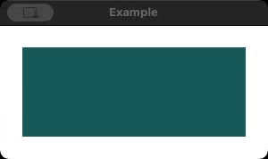</p>

    ```
    property int currentColorIndex: 1; 

    Behavior on color {
        ColorAnimation { duration: 1000; easing.type: Easing.InOutQuad }
    }

    Timer {
        interval: 1000
        repeat: true
        running: true
        onTriggered: {
            if (currentColorIndex === 1) {
                animatedRectangle.color = "blue";
                currentColorIndex = 2;
            } else {
                animatedRectangle.color = "red";
                currentColorIndex = 1;
            }
        }
    }
    ```

- NUMBERANIMATION

    [NumberAnimation](https://doc.qt.io/qt-6/qml-qtquick-numberanimation.html) анимирует значения **qreal-type** типа qreal, такие как **x**, **y**, **width** ширина и **opacity** непрозрачность.
    
    <p align="center">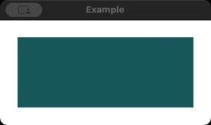</p>

    ```
    Rectangle {
        height: 100
        color: "darkslategray"

        NumberAnimation on width {
            from: 250
            to: 150
            duration: 2000
            loops: Animation.Infinite
            easing.type: Easing.InOutQuad
        }
    }
    ```

- ROTATIONANIMATION

    [RotationAnimation](https://doc.qt.io/qt-6/qml-qtquick-rotationanimation.html) специально анимирует значения **rotation** вращения, идеально подходит для плавного вращения.
    
    <p align="center">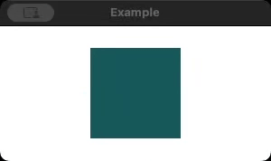</p>

    ```
    Rectangle {
        width: 100
        height: 100
        color: "darkslategray"

        RotationAnimation on rotation {
            to: 360
            duration: 2000
            loops: Animation.Infinite
            easing.type: Easing.InOutQuad
        }
    }
    ```

- VECTOR3DANIMATION

    [Vector3dAnimation](https://doc.qt.io/qt-6/qml-qtquick-vector3danimation.html) используется для анимации свойств трехмерных векторов **QVector3d**, таких как **position** положение в Qt Quick 3D.
    
    <p align="center"></p>

    ```
    Model {
        source: "#Cube"
        scale: Qt.vector3d(1, 1, 1)
        materials: DefaultMaterial {
            diffuseColor: "darkorange"
        }

        Vector3dAnimation on eulerRotation {
            from: Qt.vector3d(0, 0, 0)
            to: Qt.vector3d(0, 360, 0)
            duration: 4000
            loops: Animation.Infinite
        }
    }
    ```

**PropertyAnimation** можно применять несколькими способами в зависимости от варианта использования:

- Как переход (AS A TRANSITION)

    Используется при изменении состояний элементов, обеспечивая плавное перемещение между определенными состояниями.
    
    <p align="center">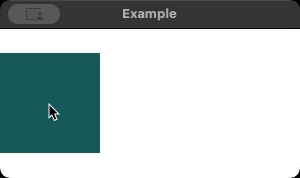</p>

    ```
    Rectangle {
        id: rect
        width: 100
        height: 100
        y: (parent.height / 2) - (height / 2)
        color: "darkslategray"

        states: State {
            name: "moved"
            when: mouseArea.pressed
            PropertyChanges {
                rect.width: root.width
            }
        }
        transitions: Transition {
            PropertyAnimation {
                properties: "width"
                easing.type: Easing.InOutQuad
            }
        }
        MouseArea {
            id: mouseArea
            anchors.fill: parent
        }
    }
    ```

- В элементе поведения (IN A BEHAVIOR ELEMENT)

    Используется для автоматической анимации изменений свойств всякий раз, когда они происходят.
    
    <p align="center"></p>

    ```
    Rectangle {
        id: rect
        width: 100
        height: 100
        y: (parent.height / 2) - (height / 2)
        color: "darkslategray"

        Behavior on width {
            PropertyAnimation {}
        }

        MouseArea {
            id: mouseArea
            anchors.fill: parent

            onPressed: rect.width = root.width
            onReleased: rect.width = 100
        }
    }
    ```

- Как свойство значения источника (AS A PROPERTY VALUE SOURCE)

    Прикрепляется непосредственно к объекту недвижимости для создания непрерывного эффекта.
    
    <p align="center">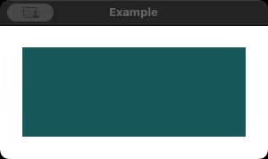</p>

    ```
    Rectangle {
        id: rect
        width: 250
        height: 100
        color: "darkslategray"

        SequentialAnimation on scale {
            loops: Animation.Infinite
            PropertyAnimation {
                to: 0.8
                duration: 2000
            }
            PropertyAnimation {
                to: 1.0
                duration: 2000
            }
        }
    }
    ```

- В обработчике сигналов (IN A SIGNAL HANDLER)

    Запускается при взаимодействии с пользователем или других событиях.
    
    <p align="center">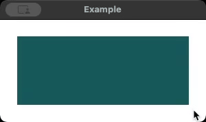</p>

    ```
    Rectangle {
        id: rect
        width: 250
        height: 100
        color: "darkslategray"

        MouseArea {
            anchors.fill: parent
            hoverEnabled: true

            onEntered: fadeOut.start()
            onExited: fadeIn.start()

            PropertyAnimation {
                id: fadeIn
                property: "opacity"
                to: 1.0
                duration: 200
            }
            PropertyAnimation {
                id: fadeOut
                property: "opacity"
                to: 0.5
                duration: 200
            }
        }
    }
    ```

В примере ниже элемент **Image** отображает значок отправки, расположенный вертикально в центре родительского контейнера. **PropertyAnimation** применяется для анимации свойства x, заставляя значок перемещаться слева направо по экрану. Анимация начинается с позиции сразу за левой границей, в -**send.width**, и перемещается к самому правому краю **ApplicationWindow**. Тип замедления **Easing.OutInQuart** обеспечивает плавное замедление в начале, замедление в середине и еще один плавный переход в конце.

```
Image {
    id: send
    source: "assets/icons/send.png"
    y: root.height / 2 - height / 2

    PropertyAnimation {
        target: send
        property: "x"
        from: -send.width
        to: root.width
        duration: 2000
        running: true
        loops: Animation.Infinite
        easing.type: Easing.OutInQuart
    }
}
```
<p align="center"></p>

### Параллельная анимация (ParallelAnimation)

[ParallelAnimation](https://doc.qt.io/qt-6/qml-qtquick-parallelanimation.html) позволяет запускать несколько анимаций одновременно. Это полезно при анимации нескольких свойств одновременно. В этом примере мы **scale** масштабируем сетку приложения Image до её собственного размера и изменяем её **opacity** непрозрачность, создавая плавный комбинированный эффект.

```
Image {
    id: appGrid
    source: "assets/icons/appgrid.png"

    ParallelAnimation {
        running: true
        loops: Animation.Infinite

        NumberAnimation {
            target: appGrid
            property: "scale"
            from: 0
            to: 1
        }
        NumberAnimation {
            target: appGrid
            property: "opacity"
            duration: 1100
            from: 0
            to: 1
        }
    }
}
```

<p align="center"></p>

### Последовательная анимация (SequentialAnimation)

[SequentialAnimation](https://doc.qt.io/qt-6/qml-qtquick-sequentialanimation.html) позволяет анимациям запускаться одна за другой, обеспечивая хореографические эффекты. Ниже **scale** масштаб сначала устанавливается больше собственного размера, а затем возвращается к 1,0 с короткой паузой, чтобы создать эффект отскока внутрь/наружу, который привлекает внимание пользователя.

```
Image {
    id: appGrid
    source: "assets/icons/appgrid.png"
    scale: 0

    SequentialAnimation {
        running: true
        loops: Animation.Infinite

        NumberAnimation {
            target: appGrid
            property: "scale"
            to: 1.2
            duration: 250
        }
        NumberAnimation {
            target: appGrid
            property: "scale"
            to: 1.0
            duration: 100
        }
        PauseAnimation { duration: 1000 }
        NumberAnimation {
            target: appGrid
            property: "scale"
            to: 0
            duration: 150
        }
        PauseAnimation { duration: 1000 }
    }
}
```

<p align="center">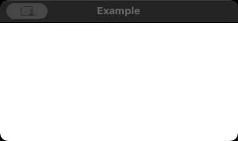</p>

Далее мы более подробно рассмотрим типы замедления, чтобы управлять анимацией с течением времени.

---

# Урок 2: Типы замедления (Easing Types)

[Перейти к содержанию](#содержание)

В этом разделе мы рассмотрим, как **easing curves** кривые замедления формируют анимацию, делая движение более естественным и визуально привлекательным. Вместо того, чтобы перемещать элементы с **constant speed** постоянной скоростью, кривые замедления определяют **acceleration and deceleration patterns** шаблоны ускорения и замедления, создавая плавные переходы, которые улучшают пользовательский опыт. Мы применим различные типы замедления и проанализируем, как они влияют на движение элементов пользовательского интерфейса.

## Изучение кривых замедления

[](https://d3pg1c2bhy6429.cloudfront.net/114478/llfgGJmuezi97TnP1515Yp4ruGDj6WeQclsGR2lr/scormcontent/assets/02_Easing_v2.mp4?v=1)

<details>
<summary><b>Расшифровка видео</b></summary>

В этом разделе мы рассмотрим, как кривые замедления формируют анимацию, создавая плавные, динамичные переходы. Кривые замедления определяют, как анимация перемещается между своими начальными и конечными значениями, позволяя нам настраивать скорость и ощущение наших анимаций для более естественного эффекта. Вместо постоянной скорости кривые замедления позволяют нам задавать шаблоны ускорения и замедления, которые делают анимацию плавной и отзывчивой.

Что такое кривые замедления?

Кривые замедления — это математические функции, которые управляют скоростью изменения анимации. С помощью PropertyAnimation QML мы можем использовать различные кривые замедления для достижения различных эффектов движения. Например, кривая InOutQuad начинается и заканчивается медленно, кривая OutBounce имитирует эффект подпрыгивания, а InElastic представляет игривое эластичное движение. Каждая кривая имеет свой собственный характер, позволяя нам добавлять индивидуальность и выразительность в анимацию. Мы рассмотрим некоторые из этих кривых замедления в действии, изучим, как они влияют на движение элементов пользовательского интерфейса, и создадим для вас настройку для экспериментов с типами замедления.

Начнем с пустого ApplicationWindow, как и раньше, и создадим элемент Rectangle, чтобы продемонстрировать наш первый тип замедления, InOutQuad. Эта кривая замедления идеально подходит для плавной, естественной анимации, поскольку она постепенно ускоряется, а затем плавно замедляется к концу.

Мы дадим Rectangle идентификатор красного цвета, зададим его ширину, высоту и цвет, чтобы выделить его, и используем PropertyAnimation для анимации его положения x по горизонтали на экране:

Мы можем использовать свойство to, чтобы привязать анимацию к ширине родителя, гарантируя, что прямоугольник будет перемещаться от левого до правого края экрана.

Мы обеспечим немедленное выполнение анимации с помощью свойства running.

Внутри PropertyAnimation мы определяем тип замедления. Мы устанавливаем easing.type на Easing.InOutQuad, что сообщает анимации использовать кривую замедления InOutQuad. Эта кривая создает плавное, естественное движение.

Понемногу мы сделаем так, чтобы анимация выполнялась бесконечно, установив циклы на Animation.Infinite на 1 секунду.

Запуск этого кода переместит красный прямоугольник слева направо с медленным началом и концом, создавая очень естественный эффект. Этот тип замедления хорошо подходит для плавных переходов и может повысить удобство использования, делая анимацию более плавной и естественной.

Давайте также добавим элемент Text к прямоугольнику, чтобы отобразить тип замедления.

Далее давайте добавим еще один прямоугольник, чтобы проиллюстрировать тип замедления OutBounce. Эта кривая создает игривый эффект отскока в конце анимации, идеально подходящий для подчеркивания элементов или добавления ощущения интерактивности.

Мы можем начать с создания элемента Column, чтобы сложить прямоугольники вертикально. Внутри столбца добавьте синий прямоугольник под первым и задайте его анимацию с помощью OutBounce:

Мы будем использовать те же свойства, что и раньше, но на этот раз мы зададим тип замедления как Easing.OutBounce.

При запуске приложения синий прямоугольник будет перемещаться по экрану. Обратите внимание, что прямоугольник ускоряется быстрее, чем красный.

Теперь, когда у нас есть два прямоугольника внутри столбца, они начинаются с центра экрана, поэтому нам нужно установить якоря для заполнения родителя.

Мы также можем добавить элемент Text к синему прямоугольнику, чтобы отобразить тип замедления.

И, наконец, давайте замедлим анимацию до 4 секунд, чтобы сделать отскок более заметным.

При запуске приложения сейчас синий прямоугольник будет перемещаться по экрану и слегка подпрыгивать в конце своего движения. Обе анимации длятся 4 секунды, но их положение и скорость создают разные эффекты.

Подумайте о том, как вы можете использовать тип смягчения OutBounce в своих приложениях, чтобы добавить игривый штрих к анимации. Эта кривая может быть полезна для привлечения внимания к определенным элементам или создания интерактивных элементов пользовательского интерфейса, которые реагируют на пользовательский ввод, такой как нажатие или создание нового элемента.

Для нашего третьего примера давайте используем InElastic, который создает эффект, похожий на пружину, ускоряющуюся по мере набора импульса.

Давайте добавим зеленый прямоугольник на этот раз и анимируем его с типом замедления InElastic:

Обратите внимание, что зеленый прямоугольник имеет некоторые отрицательные значения x в начале анимации, поэтому подумайте, как вы используете этот тип замедления в своих приложениях и какой эффект он создает.

QML предоставляет широкий спектр типов замедления, от InExpo для экспоненциального роста до InOutCirc для кругового замедления. Каждый тип имеет свой собственный эффект, поэтому не стесняйтесь экспериментировать с другими типами замедления в созданной нами игровой площадке проекта. Вы можете обнаружить, что определенные типы замедления лучше подходят для определенных взаимодействий пользовательского интерфейса, таких как подпрыгивающие элементы или создание привлекающих внимание анимаций.

Чтобы изучить больше типов замедления, попробуйте изменить свойство easing.type в каждой анимации и понаблюдайте за различными эффектами. Это экспериментирование может вдохновить на уникальные способы использования анимаций в ваших приложениях и улучшить пользовательский опыт.

В этом разделе мы изучили основы кривых замедления и то, как они могут значительно улучшить анимацию в QML. Мы рассмотрели три популярных типа смягчения — InOutQuad, OutBounce и InElastic — каждый из которых обеспечивает уникальный эффект, который добавляет индивидуальности элементам пользовательского интерфейса. Помните, кривые смягчения помогают определить движение анимаций, делая их плавными и интуитивно понятными.

В следующем разделе мы более подробно рассмотрим анимацию поведения, где узнаем, как автоматически запускать анимацию при изменении свойств, что добавляет интерактивности вашему пользовательскому интерфейсу.

</details>

## Резюме: кривые замедления

В этом видео мы изучили **easing curves** кривые замедления в QML и то, как они формируют поведение анимации. Мы реализовали различные функции замедления, чтобы увидеть, как они влияют на скорость и ощущение анимации. Давайте рассмотрим каждый шаг реализации.

- Шаг 1: Настройка проекта

    ```
    import QtQuick
    import QtQuick.Controls

    ApplicationWindow {
        id: rootWindow
        width: 640
        height: 480
        title: "Easing Types Example"
        visible: true
    }
    ```

    Мы начали с создания нового приложения Qt Quick в Qt Creator и открытия Main.qml для определения нашей игровой площадки анимации. Мы настроили базовую компоновку для визуализации различных типов замедления. Для начала мы импортировали элементы **Qt Quick Controls** и определили **ApplicationWindow** для размещения анимированных элементов.

- Шаг 2: Создание анимированных прямоугольников

    ```
    Column {
        anchors.fill: parent
        spacing: 20

        Rectangle {
            id: red
            width: 100; height: 50; color: "red"
        }

        Rectangle {
            id: blue
            width: 100; height: 50; color: "blue"
        }

        Rectangle {
            id: green
            width: 100; height: 50; color: "green"
        }
    }
    ```

    Для демонстрации различных типов замедления мы создали три элемента **Rectangle** внутри контейнера **Column**. Каждому прямоугольнику был назначен фиксированный размер (100x50) и **color** цвет; готовый к назначению анимации и типа замедления.

- Шаг 3: Анимация первого прямоугольника с помощью InOutQuad

    ```
    PropertyAnimation {
        target: red
        property: "x"
        from: 0
        to: rootWindow.width - red.width
        running: true
        easing.type: Easing.InOutQuad
        loops: Animation.Infinite
        duration: 4000
    }
    ```

    Первый тип замедления, который мы исследовали, был **InOutQuad**, который создает плавный старт и остановку. Мы анимировали свойство x, чтобы переместить прямоугольник **слева направо**.

- Шаг 4: Анимация второго прямоугольника с помощью OutBounce

    ```
    PropertyAnimation {
        target: blue
        property: "x"
        from: 0
        to: rootWindow.width - blue.width
        running: true
        easing.type: Easing.OutBounce
        duration: 4000
        loops: Animation.Infinite
    }
    ```

    Далее мы добавили анимацию **OutBounce** ко второму прямоугольнику. Этот тип смягчения делает движение **bouncy** упругим, когда элемент достигает своей конечной позиции.

- Шаг 5: Анимация третьего прямоугольника с помощью InElastic

    ```
    PropertyAnimation {
        target: green
        property: "x"
        from: 0
        to: rootWindow.width - green.width
        running: true
        easing.type: Easing.InElastic
        duration: 4000
        loops: Animation.Infinite
    }
    ```

    Для конечного прямоугольника мы использовали **InElastic**, который создает **эффект пружины**, которая проскакивает перед усадкой.

- Шаг 6: Добавление меток для отображения типов замедления

    ```
    Text {
        text: "InOutQuad"
        anchors.centerIn: red
    }
    Text {
        text: "OutBounce"
        anchors.centerIn: blue
    }
    Text {
        text: "InElastic"
        anchors.centerIn: green
    }
    ```

    Чтобы визуализировать различные типы замедления, мы добавили **текстовые элементы** для обозначения каждого прямоугольника.

### Репозиторий проекта

> Ссылка на проект
>
> Кнопка справа позволяет вам загрузить файлы справочного проекта. Активы, используемые в этом разделе, находятся в папке **'02-Easing'** в репозитории [GitHub](https://github.com/qt-learning/FluidElements-Animation).

**Кривые замедления** изменяют способ развития анимации в течение ее жизненного цикла. Мы исследовали различные типы замедления, применили их к анимации и наблюдали, как они влияют на движение. Чтобы закрепить эти концепции, давайте углубимся в **кривые замедления**, рассмотрев типы замедления, которые мы реализовали.

### Что такое кривые замедления?

**Кривая замедления** определяет, как анимация развивается между **начальным и конечным значениями**. QML предоставляет ряд **предопределенных типов замедления**, каждый из которых по-разному влияет на движение. Каждый тип замедления имеет определенный вариант использования, что позволяет создавать анимации, которые повышают удобство использования и обеспечивают лучшую визуальную обратную связь.

<p align="center"></p>

### Применение Easing замедления к PropertyAnimation

Свойство [easing.type](https://doc.qt.io/qt-6/qml-qtquick-propertyanimation.html#easing-prop) в **PropertyAnimation** позволяет нам изменять поведение замедления анимации, используя предопределенные кривые с **Enumeration Easing**. Вы также можете определять кривые с помощью свойства **easing.bezierSpline**. Обратите внимание, что easing — это групповое свойство и имеет некоторые свойства, которые применимы только к определенным предопределенным сплайнам; [см. документацию](https://doc.qt.io/qt-6/qml-qtquick-propertyanimation.html#easing-prop) для получения дополнительной информации.

В примере ниже мы используем перечисление **Easing.OutBounce** в последовательности анимации для создания эффекта отскока на значке уведомления, чтобы привлечь внимание пользователя к тому, что есть уведомления для прочтения.

```
Image {
    source: "assets/icons/notifications.png"

    SequentialAnimation on rotation {
        loops: Animation.Infinite

        RotationAnimation {
            to: -20
            duration: 700
            easing.type: Easing.OutBounce
        }
        PauseAnimation { duration: 50 }
        RotationAnimation {
            to: 20
            duration: 700
            easing.type: Easing.OutBounce
        }
        PauseAnimation { duration: 50 }
    }
}
```

<p align="center">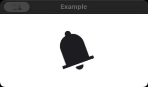</p>

Qt содержит множество предопределенных кривых, которые мы можем использовать для оживления наших анимаций. Вы можете увидеть их все в [документации](https://doc.qt.io/qt-6/qml-qtquick-propertyanimation.html#easing-prop), но ниже приведены несколько примеров:

| Название  | Анимация |
|---|---|
| EASING.INOUTQUAD <br> Кривая замедления для квадратичной функции (t^2): ускорение до середины, затем замедление. | <p align="center">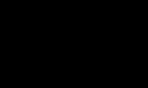</p> |
| EASING.OUTINSINE <br> Кривая замедления для синусоидальной функции (sin(t)) — замедление до середины пути, затем ускорение. | <p align="center">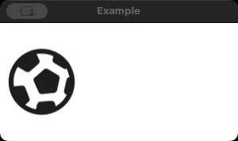</p> |
| EASING.INCIRC <br> Кривая замедления для круговой функции (sqrt(1-t^2)) — ускорение от нулевой скорости. | <p align="center"></p> |
| EASING.OUTELASTIC <br> Кривая замедления для упругой (экспоненциально затухающей синусоиды) функции: замедление до нулевой скорости. Пиковая амплитуда может быть установлена ​​параметром амплитуды, а период затухания — параметром периода. | <p align="center">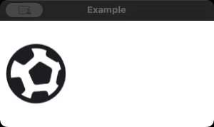</p> |

Далее мы более подробно рассмотрим анимацию поведения и то, как запускать анимацию при изменении свойств.

---

# Урок 3: Анимация поведения

[Перейти к содержанию](#содержание)

В этом разделе мы рассмотрим **тип Behavior QML** и то, как он позволяет автоматически запускать анимацию при изменении значения свойства. Чтобы продемонстрировать это, мы создадим интерактивную сцену с прыгающим мячом, где мяч перемещается между двумя точками в пружинном движении с помощью **SpringAnimation**. К концу этого раздела вы поймете, как применять **Behavior** в различных сценариях.

## Изучение поведенческой анимации

[](https://d3pg1c2bhy6429.cloudfront.net/114478/llfgGJmuezi97TnP1515Yp4ruGDj6WeQclsGR2lr/scormcontent/assets/03_BehaviorAnimation_v3.mp4?v=1)

<details>
<summary><b>Расшифровка видео</b></summary>

В этом разделе мы узнаем больше о том, как настроить анимацию, которая автоматически запускается в ответ на изменение свойств. Анимация поведения особенно полезна для создания динамических и интерактивных сцен, которые плавно реагируют на действия пользователя. В этом примере мы создадим сцену, которая имитирует мяч, подпрыгивающий на батуте.

Мы кратко рассмотрели эту функциональность, когда изменяли свойство цвета Rectangle в предыдущем разделе. Теперь мы рассмотрим, как использовать Behavior с SpringAnimation в другом контексте.

Давайте начнем с создания элементов фона для нашей сцены. Откройте файл Main.qml и настройте базовую структуру, как мы делали в предыдущих разделах:

Внутри ApplicationWindow создайте светло-голубой Rectangle вверху, чтобы представить небо. Установите его высоту на 20 пикселей и привяжите его к верхней части окна. Затем добавьте еще один прямоугольник внизу с зеленым цветом, представляющий батут. Привяжите его к нижней части окна.

Далее мы создадим элемент Rectangle, который будет играть роль нашего мяча. Чтобы он выглядел круглым, задайте его ширину и высоту одинаковыми и примените радиус, равный половине высоты. Разместите его около верхней части батута, используя начальное значение y немного ниже неба.

Тип Behavior позволяет нам указывать анимации, которые автоматически воспроизводятся при изменении определенного свойства, независимо от того, как происходит изменение. В этом случае мы хотим, чтобы свойство y мяча анимировалось в пружинном движении, имитируя эффект батута. Чтобы добиться этого, мы используем SpringAnimation в Behavior на y. Синтаксис для использования Behavior — Behavior на .

SpringAnimation наследуется от NumberAnimation, который сам является производным от PropertyAnimation. Это означает, что SpringAnimation не только анимирует числовые свойства, но и делает это с помощью пружинной физики, создавая эффект колебания. Свойство spring управляет натяжением, в то время как затухание влияет на то, как быстро затухают колебания. Более низкие значения для затухания заставляют анимацию подпрыгивать дольше, а более высокие значения успокаивают ее быстрее.

Теперь, когда Behavior настроен, нам нужен способ запустить анимацию. Добавьте MouseArea, чтобы покрыть все окно приложения. При щелчке он изменит значение y мяча, заставив Behavior с SpringAnimation анимировать движение.

В нашем коде, когда вы щелкаете по окну, он переключает положение мяча между небом и батутом. Благодаря Behavior SpringAnimation автоматически анимирует движение y каждый раз, когда изменяется свойство y.

Чтобы направлять пользователя, давайте добавим элемент Text, который отображает инструкции, когда анимация останавливается. Используйте свойство running springAnim для управления видимостью текста, показывая его только после завершения анимации.

В этом разделе мы узнали, как использовать Behavior с SpringAnimation для создания интерактивной, динамической сцены. Тип Behavior позволяет анимациям запускаться в ответ на изменения свойств, что упрощает создание адаптивных, плавных анимаций с минимальной настройкой. Это идеально подходит для создания естественных взаимодействий, таких как мяч, подпрыгивающий на батуте.

В следующем разделе мы рассмотрим PathAnimation, который позволяет анимировать объекты по сложным траекториям, открывая новые творческие возможности для ваших анимаций QML.

</details>

## Резюме: Анимация поведения

В этом видео мы создали интерактивную сцену с прыгающим мячом, где мяч движется между двумя точками в пружинном движении, используя типы **SpringAnimation** и **Behavior** QML для создания постоянного эффекта отскока при движении мяча. Вот как мы это сделали:

- Шаг 1: Настройка проекта

    ```
    ApplicationWindow {
        id: root
        visible: true
        width: 800
        height: 600
        title: "Behavior Animation Example"

        Rectangle {
            id: sky
            width: root.width
            height: 20
            color: "lightblue"
            anchors.horizontalCenter: parent.horizontalCenter
            anchors.top: parent.top
        }
        Rectangle {
            id: trampoline
            width: root.width
            height: 100
            color: "green"
            anchors.horizontalCenter: parent.horizontalCenter
            anchors.bottom: parent.bottom
        }
    }
    ```

    Мы начали с создания нового приложения и добавления фона сцены. Это включало: **sky** небо, представленное прямоугольником вверху, и **trampoline** батут, представленный прямоугольником внизу.

- Шаг 2: Создание мяча

    ```
    Rectangle {
        id: ball
        width: 50
        height: width
        radius: width / 2
        color: "red"
        anchors.horizontalCenter: parent.horizontalCenter
        y: trampoline.y - height
    }
    ```

    Далее мы создали **круглый шар**, который взаимодействует с батутом. Мы устанавливаем его начальное положение немного **выше батута**. Свойство радиуса гарантирует, что прямоугольник будет выглядеть **круглым**.

- Шаг 3: Применение поведения с помощью SpringAnimation

    ```
    Behavior on y {
        SpringAnimation { id: behaviorAnimation; spring: 3; damping: 0.2 }
    }
    ```

    Мы добавили **Behavior к свойству y**, используя SpringAnimation для создания естественного эффекта подпрыгивания. Значение **spring** пружины контролирует силу колебания. Значение **damping** затухания определяет, насколько быстро движение успокаивается. При такой настройке любое изменение свойства **y** мяча приводит к пружинному отскоку вместо резкого изменения положения.

- Шаг 4: Реализация взаимодействия с мышью

    ```
    MouseArea {
        anchors.fill: parent
        onClicked: {
            if (ball.y === 20) {
                ball.y = trampoline.y - ball.height;
            }
            else {
                ball.y = 20;
            }
        }
    }
    ```

    Чтобы запустить анимацию, мы добавили **MouseArea**, которая переключает положение мяча между **sky** небом и **trampoline** батутом при щелчке. Каждый раз, когда пользователь щелкает, позиция **y** меняется, заставляя анимацию **Behavior** автоматически воспроизводиться.

- Шаг 5: Реализация взаимодействия с мышью

    ```
    Text {
        anchors.centerIn: parent
        text: "Click me"
        font.pixelSize: 25
        color: "white"
        visible: !behaviorAnimation.running
    }
    ```

    Чтобы помочь пользователям, мы добавили **текстовый** элемент, который появляется, когда анимация не запущена.

### Репозиторий проекта

> Ссылка на проект
>
> Кнопка справа позволяет вам загрузить файлы справочного проекта. Активы, используемые в этом разделе, находятся в папке **'03-Behavior'** в репозитории [GitHub](https://github.com/qt-learning/FluidElements-Animation).

Мы изучили анимации **Behavior** и продемонстрировали, как их можно использовать для создания **автоматических анимаций** в ответ на изменения свойств. Мы изучили тип **SpringAnimation** и применили его для имитации эффекта подпрыгивания. Теперь давайте углубимся в то, как работает **Behavior**, и рассмотрим некоторые ключевые свойства **SpringAnimation**.

### Тип поведения QML (Behavior QML Type)

[Behavior Поведение](https://doc.qt.io/qt-6/qml-qtquick-behavior.html) определяет **анимацию по умолчанию** для свойства. Всякий раз, когда свойство изменяется, назначенная анимация автоматически воспроизводится без необходимости явных триггеров. Это полезно для обеспечения последовательного, плавного перехода между значениями свойств.

```
MouseArea {
    anchors.fill: parent

    onClicked: {
        rect.width = rect.width === 100 ? 250 : 100
    }

    Rectangle {
        id: rect
        anchors.centerIn: parent
        width: 100
        height: 100
        y: (parent.height / 2) - (height / 2)
        color: "darkslategray"

        Behavior on width {
            NumberAnimation {}
        }
    }
}
```

<p align="center">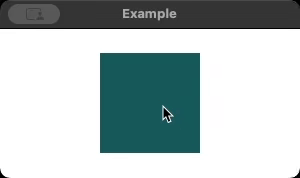</p>

В этом примере **MouseArea** используется для переключения ширины Rectangle между **100 и 250 пикселями** всякий раз, когда пользователь щелкает в любом месте внутри родительского контейнера. **Behavior on width** используется для применения NumberAnimation всякий раз, когда изменяется свойство width. Это гарантирует, что каждый переход ширины анимируется плавно, а не меняется мгновенно. При щелчке **MouseArea** обработчик **onClicked** проверяет текущую ширину **rect**. Если ширина равна **100**, она расширяется до **250**; в противном случае она сжимается до **100**. Благодаря **Behavior** каждое изменение ширины приводит к плавной и последовательной анимации.

### Пружинная анимация

[SpringAnimation](https://doc.qt.io/qt-6/qml-qtquick-springanimation.html) в QML создает эффект динамического движения, имитируя физику пружин. Когда значения свойств изменяются, анимация не просто интерполируется между значениями, а вместо этого движется переменным движением. Свойство **spring** определяет силу притяжения к целевому значению, а **damping** управляет скоростью затухания движения. Низкое значение damping позволяет анимации дольше колебаться перед остановкой. Высокое значение damping быстрее стабилизирует движение.

```
MouseArea {
    anchors.fill: parent

    onClicked: {
        ball.x = Math.random() * (root.width - ball.width)
    }

    Image {
        id: ball
        y: (root.height / 2) - (height / 2)
        source: "assets/icons/football.png"

        Behavior on x {
            SpringAnimation {
                damping: 0.1
                spring: 5.0
            }
        }
    }
}
```

<p align="center">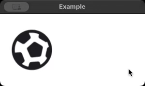</p>

В этом примере **SpringAnimation** применяется к свойству **x** изображения, представляющего футбольный мяч. Анимация запускается через **MouseArea**, которая заполняет родительский контейнер и отслеживает щелчки. Когда пользователь щелкает в любом месте экрана, положение **x** мяча устанавливается на новое случайное значение в пределах ширины окна. Вместо того чтобы двигаться немедленно, **Behavior on x** обеспечивает плавный переход с помощью **SpringAnimation**. Анимация имеет **значение пружины 5,0**, что делает ее очень отзывчивой, в то время как **значение затухания 0,1** позволяет мячу колебаться перед остановкой.

Далее мы рассмотрим PathAnimation, который позволяет анимировать объекты вдоль сложных траекторий.

---

# Урок 4: Анимация пути

[Перейти к содержанию](#содержание)

В этом разделе мы рассмотрим **PathAnimation**, тип QML, который позволяет объектам следовать сложным траекториям движения. В отличие от линейных или простых анимаций, **PathAnimation** позволяет элементам двигаться по **предопределенным траекториям**, созданным с помощью типа **Path**. Этот метод полезен для сценариев, требующих плавного движения по кривым или сложным траекториям. Мы создадим **эффект сердцебиения**, когда анимированный объект следует по траектории, напоминающей линию сердцебиения.

## Исследование анимации пути (PathAnimation)

> **Репозиторий файлов курса**
>
> Загрузите изображение **heart.svg**, используемое в этом разделе, из [репозитория GitHub](https://github.com/qt-learning/FluidElements-Animation/blob/heart-asset/heart.svg). Его можно найти в ветке **'heart-asset'**.

[](https://d3pg1c2bhy6429.cloudfront.net/114478/llfgGJmuezi97TnP1515Yp4ruGDj6WeQclsGR2lr/scormcontent/assets/04_PathAnimation_v2.mp4?v=1)

<details>
<summary><b>Расшифровка видео</b></summary>

В этом разделе мы оживим эффект сердцебиения, анимировав объект вдоль заданного пути. Это визуально привлекательный способ изучить PathAnimation, тип, который позволяет анимировать элемент вдоль предопределенного пути. Это особенно полезно для создания сложных последовательностей движения, которые не ограничиваются линейными или простыми движениями.

Если вам нужно анимировать объекты вдоль сложных траекторий, таких как кривые или петли, которые сложно реализовать с помощью простых анимаций, или вы хотите создать захватывающие пользовательские интерфейсы, в которых элементы движутся по определенным траекториям в ответ на действия пользователя, то PathAnimation — идеальный инструмент для этой работы.

Откройте файл Main.qml и настройте базовую структуру, как мы делали в предыдущих разделах:

Чтобы сделать анимацию настраиваемой, мы введем два свойства: `pulse`, которое определяет `удары в минуту` нашей анимации, и `speed`, которое управляет длительностью анимации и масштабирует удары в минуту по нашей стандартной длительности анимации в 3000 миллисекунд.

Мы добавим Rectangle в качестве основного контейнера для пути и эффекта сердцебиения.

Мы используем тип Path для определения пользовательской линии сердцебиения. Тип Path позволяет нам соединять точки для формирования линий, кривых или других фигур. Здесь мы начнем путь с левой стороны и отцентрируем его по вертикали, чтобы настроить путь сердцебиения.

PathLine определяет прямые сегменты внутри Path и позволяет нам создавать пики и спады сердцебиения. Добавляя элементы PathLine, мы можем воспроизвести внешний вид монитора сердца.

Внутри Path добавьте элементы PathLine для имитации подъема и спада сердцебиения:

Эта настройка создает последовательность линий, которые представляют движение сердцебиения, с определенными пиками и спадами.

Теперь давайте анимируем объект — небольшой красный «шарик», который будет двигаться по пути, имитируя пульс. Мы используем PathAnimation для перемещения этого шара точно по heartbeatPath.

Свойство target определяет объект для анимации, а path определяет путь следования.

Чтобы усилить эффект сердцебиения, давайте создадим след, который следует за основным пульсом. Мы будем использовать Repeater для создания нескольких «теневых» шаров с SequentialAnimation, чтобы разбить их движение по пути.

Добавьте Repeater для создания дополнительных шаров пульса:

Внутри каждого повторяющегося элемента используйте SequentialAnimation, чтобы добавить задержку PauseAnimation, чтобы каждый шар, отстающий от предыдущего, немного отставал:

Эта настройка создает эффект следа, при котором каждый шар немного задерживается по пути. Этот разнесенный эффект придает анимации глубину, делая ее похожей на плавную линию сердцебиения.

Чтобы еще больше усилить эффект сердцебиения, давайте добавим изображение сердца, которое масштабируется в зависимости от пульса. Мы будем использовать Behavior с PropertyAnimation, чтобы плавно изменять свойство масштаба сердца по мере выполнения анимации.

Добавьте элемент Image для загрузки значка сердца:

Чтобы сердце «билось» синхронно с пульсом, настройте Timer, который обновляет шкалу на основе положения мяча по оси Y.

Эта комбинация Timer и Behavior плавно обновляет шкалу, заставляя сердце казаться «бьющимся» вместе с линией пульса. Регулировка значения шкалы создает реалистичный эффект сердцебиения, синхронизированный с анимацией пульса.

В этом разделе мы создали динамическую анимацию сердцебиения с помощью PathAnimation с пользовательскими элементами PathLine. Мы улучшили ее, добавив тянущиеся мячи с помощью Repeater и разместили их в шахматном порядке с помощью SequentialAnimation для плавного ритмичного эффекта. Наконец, мы синхронизировали изображение сердца с анимацией, масштабируя его с помощью Behavior, чтобы завершить иллюзию сердцебиения.

В следующем разделе мы рассмотрим состояния и переходы, где узнаем, как определять различные состояния для элементов пользовательского интерфейса и создавать плавные переходы между ними для интерактивных пользовательских интерфейсов.

</details>

## Резюме: изучение PathAnimation

В этом видео мы создали эффект сердцебиения с помощью PathAnimation, построив его шаг за шагом с нуля. Вот как мы это сделали:

- Шаг 1: Инициализация переменных

    ```
    ApplicationWindow {
        ...
        property int pulse: 60
        property real speed: 3000 / pulse
    }
    ```

    Мы начали с определения двух свойств для управления поведением анимации. Свойство **pulse** пульса представляет удары в минуту, а **speed** скорость регулирует длительность анимации на основе значения пульса. Эти свойства позволили нам динамически рассчитать длительность анимации, гарантируя, что синхронизация сердцебиения соответствует заданным ударам в минуту.

- Шаг 2: Настройка сцены анимации

    ```
    Rectangle {
        id: root
        anchors.verticalCenter: parent.verticalCenter
        width: parent.width - heart.width
        height: 200
        color: "black"
    }
    ```

    Мы создали **Rectangle**, который будет служить основным контейнером для анимации. Этот контейнер определял размеры сцены и предоставлял черный фон для эффекта сердцебиения.

- Шаг 3: Создание Пути Сердцебиения

    ```
    Path {
        id: path
        startX:0
        startY: root.height

        PathLine { x: root.width * 0.125; y: root.height / 2 }
        PathLine { x: root.width * 0.1875; y: root.height / 4 }
        PathLine { x: root.width * 0.25; y: root.height * 3 / 4 }
        PathLine { x: root.width * 0.3125; y: root.height / 2 }
        PathLine { x: root.width * 0.375; y: root.height / 2 }
        PathLine { x: root.width * 0.4375; y: root.height / 4 }
        PathLine { x: root.width * 0.5; y: root.height * 3 / 4 }
        PathLine { x: root.width * 0.5625; y: root.height / 2 }
        PathLine { x: root.width * (0.5+0.125); y: root.height / 2 }
        PathLine { x: root.width * (0.5+0.1875); y: root.height / 4 }
        PathLine { x: root.width * (0.5+0.25); y: root.height * 3 / 4 }
        PathLine { x: root.width * (0.5+0.3125); y: root.height / 2 }
        PathLine { x: root.width * (0.5+0.375); y: root.height / 2 }
        PathLine { x: root.width * (0.5+0.4375); y: root.height / 4 }
        PathLine { x: root.width * (0.5+0.5); y: root.height /2 }
    }
    ```

    Линия сердцебиения была построена с использованием типа **Path**. Элементы **PathLine** были добавлены для создания пиков и спадов сердцебиения.

- Шаг 4: Анимация элемента импульса

    ```
    Rectangle {
        id: pulseLine
        width: 10
        height: 10
        radius: 5
        color: "red"

        PathAnimation {
            id: pathAnimation
            target: pulseLine
            path: path
            duration: speed
            loops: Animation.Infinite
            easing.type: Easing.Linear
            running: true
        }
    }
    ```

    Маленький красный прямоугольник был добавлен для представления пульса, движущегося по пути сердцебиения. **PathAnimation** использовался для анимации прямоугольника по пути. Свойство **target** связывало анимацию с элементом **pulse** пульса, в то время как длительность динамически адаптировалась к свойству **speed**, синхронизируя анимацию с заданной частотой пульса.

- Шаг 5: Добавление эффектов замыкающего импульса

    ```
    Repeater {
        id: rep
        model: 20

        Rectangle {
            id: shadowLine
            required property int index
            property var shadowPath: path
            property int delay: 20
            width: 10
            height: 10
            radius: 5
            color: "red"
            opacity: 1.0 - (index / rep.model)

            SequentialAnimation {
                loops: Animation.Infinite
                running: true
                
                PauseAnimation {
                    duration: shadowLine.delay * shadowLine.index
                }
                PathAnimation {
                    target: shadowLine
                    path: shadowLine.shadowPath
                    duration: root.speed - shadowLine.delay * shadowLine.index
                    easing.type: Easing.Linear
                }
            }
        }
    }
    ```

    Мы ввели эффекты слежения с помощью **Repeater**. Этот компонент генерировал несколько меньших кругов, которые следовали за основным импульсом с разнесенными задержками. **PauseAnimation** задерживал время начала каждого круга на основе его **index** индекса, создавая эффект текучести, где каждый слежение следовал за основным импульсом последовательно.

- Шаг 6: Синхронизация с изображением сердцебиения

    ```
    Item {
        id: heartArea
        width: 100
        height: pathRoot.height
        anchors.left: pathRoot.right
        anchors.leftMargin: -heart.width * .5

        Image {
            id: heart
            anchors.centerIn: parent
            width: 100
            height: 100
            source: "heart.svg"

            Behavior on scale {
                NumberAnimation {
                    duration: 20
                }
            }
        }
        Timer {
            id: animationTimer
            interval: 16
            running: true
            repeat: true
            onTriggered: {
                var heartScale = 1 + (pathRoot.height / 2 - pulseLine.y) 
                                    / (pathRoot.height / 4)
                heart.scale = Math.max(0.5, heartScale)
            }
        }
    }
    ```

    Для завершения эффекта было добавлено изображение сердца, синхронизированное с **pulse** пульсом. Масштаб **scale** сердца динамически обновлялся с помощью **Timer** Таймера и **Behavior** Поведения. По мере того, как пульс двигался по траектории, сердце увеличивалось и уменьшалось синхронно с движением, что усиливало реалистичность эффекта сердцебиения.

### Репозиторий проекта

> Ссылка на проект
>
> Кнопка справа позволяет вам загрузить файлы справочного проекта. Активы, используемые в этом разделе, находятся в папке **'04-PathAnimation'** в репозитории [GitHub](https://github.com/qt-learning/FluidElements-Animation).

Теперь мы изучили **PathAnimation** и продемонстрировали его способность анимировать объекты вдоль путей, определенных элементами **Path**. Чтобы закрепить эти концепции, давайте еще раз подробно рассмотрим настройку и разберемся с представленными элементами.

### PathAnimation

[PathAnimation](https://doc.qt.io/qt-6/qml-qtquick-pathanimation.html) анимирует объект вдоль пути, определенного с помощью типа [Path](https://doc.qt.io/qt-6/qml-qtquick-path.html). Анимация основана на двух основных свойствах: **target**, которое указывает объект для анимации, и **path**, которое определяет траекторию движения. Плавное и точное движение позволяет создавать визуально привлекательные и динамичные анимации. Тип **Path** включает такие элементы, как [PathLine](https://doc.qt.io/qt-6/qml-qtquick-pathline.html) и [PathQuad](https://doc.qt.io/qt-6/qml-qtquick-pathquad.html), которые позволяют определять прямые или изогнутые сегменты. Другие типы, такие как [PathSvg](https://doc.qt.io/qt-6/qml-qtquick-pathsvg.html), могут указывать путь с помощью строки данных пути SVG. Вы можете просмотреть все элементы Path в [документации Qt](https://doc.qt.io/qt-6/qml-qtquick-path.html#details).

<p align="center"></p>

```
Item {
    id: container
    anchors.centerIn: parent
    width: 100
    height: 100
    readonly property real radius: width / 2

    Path {
        id: motionPath
        startX: container.width / 2
        startY: 0
        
        PathSvg {
            path: `M ${container.width / 2} 0
            A ${container.radius} ${container.radius}
            0 0 1 ${container.width} ${container.height / 2}
            A ${container.radius} ${container.radius}
            0 0 1 ${container.width / 2} ${container.height}
            A ${container.radius} ${container.radius}
            0 0 1 0 ${container.height / 2}
            A ${container.radius} ${container.radius}
            0 0 1 ${container.width / 2} 0`       
        }
    }
    Repeater {
        model: 10
        delegate: Dot {}
    }
    component Dot: Rectangle {
        id: dotDelegate
        width: 10
        height: width
        radius: width / 2
        color: "#0066cc"
        opacity: 0
        required property int index

        SequentialAnimation {
            running: true
            PauseAnimation {
                duration: dotDelegate.index * 175
            }
            ParallelAnimation {
                NumberAnimation {
                    target: dotDelegate
                    property: "opacity"
                    to: 1
                    duration: 200
                }
                PathAnimation {
                    target: dotDelegate
                    path: motionPath
                    duration: 2200
                    loops: Animation.Infinite
                    easing {
                        type: Easing.BezierSpline
                        bezierCurve: [.48, .75, .51, .27, 1, 1]
                    }
                }
            }
        }
    }
}
```

В приведенном выше примере **PathAnimation** используется для анимации нескольких точек, движущихся по круговой траектории, определенной элементом **PathSvg**, имитируя анимацию загрузки. **motionPath** описывает идеальный круг, центрированный внутри контейнера, с использованием синтаксиса пути SVG. **Repeater** генерирует десять элементов **Dot**, каждый из которых представлен прямоугольником, стилизованным под маленький круг.

Анимация каждой точки определяется в его делегате. Применяется **SequentialAnimation**, где **PauseAnimation** разбивает начало движения каждой точки на основе ее индекса, создавая эффект текучести. **ParallelAnimation** объединяет **NumberAnimation** для постепенного появления точки с **PathAnimation**, которая перемещает ее по круговой траектории. **PathAnimation** использует **кривую плавности BezierSpline** для создания динамического движения, где точки группируются вместе по направлению к средней точке.

Далее мы рассмотрим состояния и переходы, где узнаем, как определять различные состояния для элементов пользовательского интерфейса.

---

# Урок 5: Состояния и переходы

[Перейти к содержанию](#содержание)

В этом разделе мы рассмотрим, как **States** состояния и **Transitions** переходы позволяют создавать динамические и интерактивные компоненты пользовательского интерфейса в QML. Состояния определяют отдельные конфигурации для элементов пользовательского интерфейса, такие как **size** размер, **color** цвет или **position** положение, в то время как **Transitions** переходы анимируют изменения между этими конфигурациями. Объединяя эти инструменты, мы можем создавать элементы интерфейса с конфигурациями свойств, между которыми мы можем анимировать.

## Изучение состояний и переходов

[](https://d3pg1c2bhy6429.cloudfront.net/114478/llfgGJmuezi97TnP1515Yp4ruGDj6WeQclsGR2lr/scormcontent/assets/05_States-Transitions_v3.mp4?v=1)

<details>
<summary><b>Расшифровка видео</b></summary>

Давайте рассмотрим состояния и переходы. В этом разделе мы научимся определять и анимировать различные состояния для наших элементов пользовательского интерфейса, создавая плавные и визуально привлекательные переходы между ними. Состояния позволяют нам определять конфигурации для элементов, в то время как переходы делают изменения между состояниями плавными.

Подумайте о том, как состояния и переходы позволяют сделать элементы пользовательского интерфейса реагирующими на действия пользователя. Например, изменение внешнего вида кнопок или панелей при нажатии. Для более сложных макетов состояния и переходы могут анимировать изменения между различными расположениями экрана, создавая бесшовный опыт для пользователей. Визуальная обратная связь (например, изменение цвета или положения) может усилить взаимодействие с пользователем и создать более привлекательный интерфейс.

Откройте файл Main.qml и настройте базовую структуру, как мы делали в предыдущих разделах:

Начнем с добавления ColumnLayout для вертикальной организации элементов пользовательского интерфейса

Мы добавим кнопку, которая переключает состояние прямоугольника при нажатии, переключаясь между состояниями при вызове обработчика сигнала onClicked.

Под кнопкой добавьте прямоугольник и задайте некоторые начальные свойства:

Тип State позволяет нам определять альтернативные конфигурации для компонентов пользовательского интерфейса. В этом примере мы создадим два состояния для прямоугольника — состояние по умолчанию и вторичное состояние, которое изменяет форму, цвет и размер прямоугольника.

По умолчанию прямоугольник зеленый и прямоугольный. Теперь мы добавим еще одно состояние, в котором он изменится на круглую красную форму. Используйте свойство states прямоугольника, чтобы определить это:

Здесь PropertyChanges позволяет нам указать, какие свойства следует изменять в каждом состоянии. В состоянии state1 прямоугольник сжимается до круга и становится красным.

Если мы запустим приложение сейчас, прямоугольник будет в своем состоянии по умолчанию, а когда мы нажмем кнопку, он перейдет в state1. Однако изменение произойдет немедленно. Давайте добавим переход, чтобы сделать его плавным.

Тип Transition определяет анимации, которые происходят во время изменения состояния. Давайте добавим Transition с NumberAnimation и ColorAnimation, чтобы состояние прямоугольника изменялось плавно.

Этот переход будет использовать подстановочные знаки ("*") для состояний from и to, применяя переход к любому изменению состояния.

Мы будем использовать NumberAnimation для анимации числовой ширины, высоты и радиуса, в то время как ColorAnimation будет выполнять переход цвета.

В этом разделе мы изучили State, PropertyChanges и Transition в QML для создания гибких анимированных компонентов пользовательского интерфейса. Определив несколько состояний и используя переходы для анимации изменений, мы добились динамического взаимодействия для нашего Rectangle. Состояния и переходы позволяют вам добавлять интерактивность и индивидуальность вашим элементам пользовательского интерфейса, заставляя их плавно реагировать на действия пользователя.

В следующем разделе мы углубимся в тип Animator, который добавляет еще больше возможностей анимации, особенно для высокопроизводительных анимаций.

</details>

## Резюме: изучение состояний и переходов

В видео мы продемонстрировали, как использовать типы **State** и **Transition** для определения и анимации изменений в элементах пользовательского интерфейса. Мы создали кнопку, переключающую **Rectangle** между двумя состояниями: состоянием по **default** умолчанию и **secondary** вторичным состоянием с круглой формой и другим цветом. Мы улучшили взаимодействие, добавив переход, чтобы обеспечить плавные анимированные изменения между состояниями. Давайте еще раз рассмотрим эти концепции:

- Шаг 1: Подготовка сцены

    ```
    ColumnLayout {
        anchors.centerIn: parent

        Button {
            text: "Toggle State"
            onClicked: rect.state = rect.state === "default" ? "state1" : "default"
        }
        Rectangle {
            id: rect
            width: 400
            height: 200
            radius: 20
            color: "green"
            state: "default"
        }
    }
    ```

    Мы начали с определения базового макета с использованием **ColumnLayout** для вертикальной организации пользовательского интерфейса. На сцену были добавлены **button** кнопка и **rectangle** прямоугольник. Кнопка переключает **state** состояние прямоугольника при нажатии.

- Шаг 2: Определение состояний

    ```
    states: [
        State {
            name: "default"
            PropertyChanges {
                animatedRect.x: 100
                animatedRect.y: 100
                animatedRect.scale: 1
                animatedRect.opacity: 1
            }
        },
        State {
            name: "expanded"
            PropertyChanges {
                animatedRect.x: 400
                animatedRect.y: 300
                animatedRect.scale: 2
                animatedRect.opacity: 0.5
            }
        }
    ]
    ```

    Далее мы добавили два состояния к прямоугольнику. Состояние по умолчанию **default state** определило его начальный размер и цвет, а вторичное состояние преобразовало его в меньшую, круглую, красную форму. Свойство **states** прямоугольника содержит массив объектов **State**. Каждое состояние использует **PropertyChanges** для указания изменений, которые должны произойти, когда состояние активно.

- Шаг 3: Добавление перехода

    ```
    transitions: [
        Transition {
            from: "*"
            to: "*"
            XAnimator {
                duration: 1000
                easing.type: Easing.InOutQuad
            }
            YAnimator {
                duration: 1000
                easing.type: Easing.InOutQuad
            }
            ScaleAnimator {
                duration: 1000
                easing.type: Easing.InOutQuad
            }
            OpacityAnimator {
                duration: 1000
                easing.type: Easing.InOutQuad
            }
        }
    ]
    ```

    Чтобы сделать переходы между состояниями плавными и визуально привлекательными, мы добавили **Transition** Переход с анимацией для свойств прямоугольника. Мы установили свойства **from** и **to** на состояния по умолчанию и вторичные состояния соответственно для каждого перехода. Мы также экспериментировали с **"*"** (подстановочные знаки), поэтому переход применялся к любому изменению состояния.

### Репозиторий проекта

> Ссылка на проект
>
> Кнопка справа позволяет вам загрузить файлы справочного проекта. Активы, используемые в этом разделе, находятся в папке **'05-States-Transitions'** в репозитории [GitHub](https://github.com/qt-learning/FluidElements-Animation).

Теперь мы изучили, как использовать типы **State** состояний и **Transition** переходов для определения и анимации изменений в элементах пользовательского интерфейса. Например, кнопка может расширяться при нажатии, или панель может выдвигаться в поле зрения при изменении ее состояния. Эти взаимодействия обеспечивают визуальную обратную связь, делая пользовательский интерфейс более интуитивным и привлекательным. Давайте повторим основные моменты ниже.

### Состояния и изменения свойств

Тип [State](https://doc.qt.io/qt-6/qml-qtquick-state.html) позволяет определять альтернативные конфигурации для элементов. Каждое состояние содержит набор **PropertyChanges**, которые определяют, как свойства элемента должны отличаться от их значений по умолчанию. Каждое состояние идентифицируется уникальным свойством **name**. Все объекты на основе **Item** имеют свойство state и могут указывать дополнительные состояния, добавляя новые объекты State к свойству **states** элемента.

<p align="center">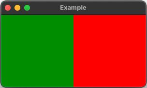</p>

```
component Signal: Rectangle {
    id: signal
    width: 150
    height: 150
    state: "NORMAL"

    states: [
        State {
            name: "NORMAL"
            PropertyChanges {
                signal.color: "green"
            }
        },
        State {
            name: "CRITICAL"
            PropertyChanges {
                signal.color: "red"
            }
        }
    ]
}

Signal {
    id: normalSignal
    anchors.left: parent.left
}
Signal {
    id: criticalSignal
    anchors.right: parent.right
    state: "CRITICAL"
}
```

В приведенном выше примере компонент **Signal** определяет **Rectangle**, который может переходить между двумя **состояниями**, "**NORMAL**" и "**CRITICAL**", причем каждое состояние указывает свой цвет. В компоненте **Signal** свойство **states** определяет две конфигурации. Состояние "**NORMAL**" устанавливает цвет Rectangle на **зеленый**, а состояние "**CRITICAL**" меняет цвет на **красный**. Блок **PropertyChanges** в каждом State определяет, какое свойство изменяется, когда состояние активно.

### Переходы

Тип [Transition](https://doc.qt.io/qt-6/qml-qtquick-transition.html) анимирует изменения свойств при переключении между состояниями. Без перехода обновления свойств происходят мгновенно, что может показаться резким в пользовательском интерфейсе. Подстановочный знак (*) используется по умолчанию для свойств **from** и **to** в Transition. Он указывает, что переход применяется к **any state change** любому изменению состояния. Явное указание имен состояний необязательно, если только переход не должен быть ограничен определенными изменениями состояния.

Когда указано несколько переходов, для данного изменения состояния применяется только **best-matching transition** наиболее подходящий переход. Например, если были определены дополнительные переходы с определенными свойствами **from** и **to**, QML выберет тот, который наиболее точно соответствует текущему изменению состояния. Без определенных соответствий подстановочный знак (*) действует как резервный вариант.

<p align="center">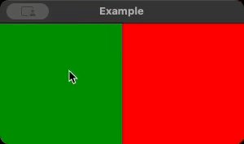</p>

```
component Signal: Rectangle {
    id: signal
    width: 150
    height: 150
    state: "NORMAL"

    states: [
        State {
            name: "NORMAL"
            PropertyChanges { signal.color: "green" }
        },
        State {
            name: "CRITICAL"
            PropertyChanges { signal.color: "red" }
        }
    ]

    transitions: [
        Transition { ColorAnimation { duration: 1000 } }
    ]

    MouseArea {
        anchors.fill: parent
        onClicked: signal.state = (signal.state === "NORMAL") ? "CRITICAL" 
                                                                : "NORMAL"
    }
}
```

В приведенном выше примере компонент **Signal** демонстрирует, как определять переходы между состояниями с использованием типа **Transition** в QML. **Переход** добавляется для анимации изменений состояния, содержащий **ColorAnimation**, который интерполирует свойство цвета при каждом изменении состояния. В этом примере переход применяется универсально всякий раз, когда компонент Signal переключается между "**NORMAL**" и "**CRITICAL**".

Теперь посмотрим, чему вы научились!

---

[Дополнительные ссылки по анимации в QML](https://academy.qt.io/enrollments/260579711)

---

[Перейти к содержанию](#содержание)

[<p align="center"></p>](../README.md "На главную")