[<p align="center"></p>](../README.md "На главную")

# Qt Quick позиционеры и макеты (Positioners and Layouts)

## Содержание:

1. [Урок 1: Позиционеры и макеты](#урок-1-позиционеры-и-макеты)
2. [Урок 2: Якори](#урок-2-якори)
3. [Урок 3: Позиционеры (Positioners)](#урок-3-позиционеры-positioners)
4. [Урок 4: Макеты](#урок-4-макеты)
5. [Урок 5: Прокси-элемент макета (LayoutItemProxy)](#урок-5-прокси-элемент-макета-layoutitemproxy)

---

# Урок 1: Позиционеры и макеты

[Перейти к содержанию](#содержание)

## Обзор

🎯 В этом курсе вы изучите ряд методов эффективного размещения и изменения размера визуальных элементов в ваших приложениях. Управление позиционированием и компоновкой визуальных элементов имеет решающее значение при разработке для различных устройств и по мере роста сложности ваших проектов. Вы начнете с базовых приемов с использованием якорей и постепенно перейдете к более продвинутым методам компоновки, гарантируя, что ваш пользовательский интерфейс будет работать без сбоев на экранах разных размеров и устройствах.

Независимо от того, создаете ли вы настольные приложения или ориентируетесь на адаптивный мобильный дизайн, этот курс даст вам навыки оптимизации компоновки для любого экрана. К концу этого курса у вас будет приложение галереи изображений, которое будет адаптивно к экранам разных размеров.

🧑‍💻 Этот курс предназначен для тех, кто хочет добавить новые технологии проектирования пользовательского интерфейса в свой набор инструментов для кроссплатформенной разработки, создав пример, который они смогут адаптировать и изучить.

👉 Перед началом работы мы рекомендуем вам быстро освоить Qt и QML, записавшись на курсы «Введение в Qt Quick» и «Введение в элементы управления Qt Quick».

## Чему я научусь?

1. Как использовать якоря для позиционирования визуальных элементов в моем приложении и ограничения.
2. Преимущества и ограничения использования позиционеров, таких как Row, Column, Grid и Flow.
3. Чем макеты отличаются от позиционеров и как они могут помочь управлять размером и выравниванием элементов.
4. Какие стратегии использовать при создании адаптивного макета, который адаптируется к различным размерам экрана.

## Об этом курсе

💬 Курс содержит видео с субтитрами на английском языке. Вы также можете прочитать расшифровки видео отдельно.

⏱ Продолжительность этого курса составляет около 95 минут.

💻 Вам понадобится:
- Ноутбук или настольный компьютер.
- Qt и совместимая IDE (например, Qt Creator)

---

# Урок 2: Якори

[Перейти к содержанию](#содержание)

По мере того, как ваше приложение развивается и обрабатывает более сложные элементы, эффективное управление позиционированием и размером визуальных элементов становится все более важным. Всякий раз, когда ваше приложение отображает или запрашивает информацию на экране, вы работаете с этими визуальными элементами.

В этом первом разделе будут рассмотрены основные методы управления положением и компоновкой визуальных элементов без явного указания их положения. Начиная с **anchors** якорей, мы постепенно перейдем к более продвинутым подходам к обработке сложных и динамических макетов. Вы познакомитесь с типами **Positioner** в модуле [Qt Quick](https://doc.qt.io/qt-6/qtquick-index.html) и типами **Layout** в модуле [Qt Quick Layouts](https://doc.qt.io/qt-6/qtquicklayouts-index.html).

По мере продвижения вы получите представление о преимуществах и ограничениях каждого метода, что поможет вам уверенно выбрать наиболее подходящий подход для дизайна и структуры вашего приложения.

## Обзор проекта

<p align="center">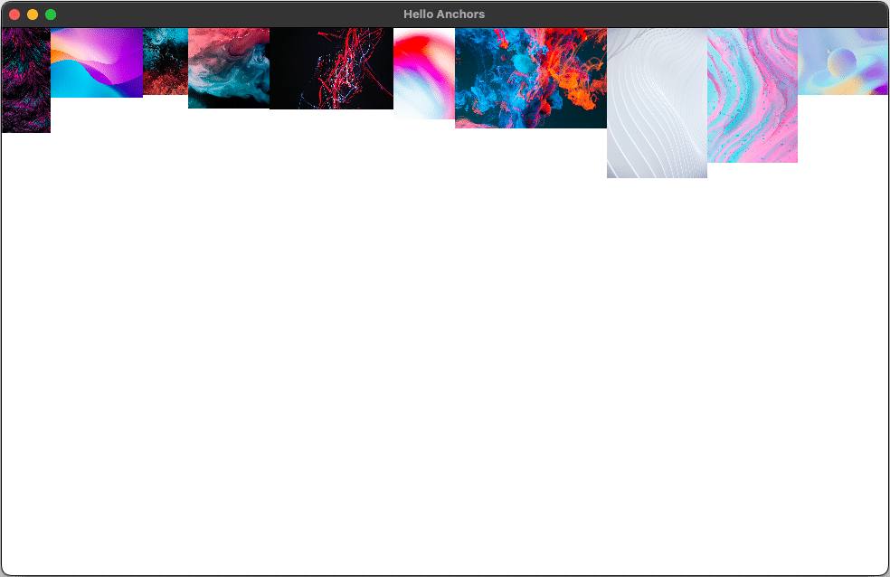</p>

В этом разделе мы сделаем первые шаги к созданию адаптивного приложения галереи. Начнем с создания простого приложения, которое отображает выборку изображений, размещенных с помощью якорей.

В каждом разделе мы обсудим различные компоненты или концепции, которые лягут в основу нашего приложения, чтобы дать вам более глубокое понимание того, как размещать и выкладывать элементы вашего приложения.

## Неявный размер

В QML неявный размер относится к естественным размерам визуального элемента на основе его содержимого. Когда элементам не заданы явные значения ширины и высоты, их размер определяется их содержимым, например текстом в метке или размерами изображения в пикселях. Свойства **implicitWidth** и **implicitHeight** управляют этим поведением, позволяя элементу свободно изменять свой размер в соответствии с его содержимым.

Например, если вы создаете элемент **Label** с текстом, длина текста будет определять его ширину, а размер шрифта или количество строк будут влиять на его высоту. То же самое относится к элементу **Image**: его **implicitWidth** и **implicitHeight** будут соответствовать размерам файла изображения, если они не будут переопределены вручную.

### Явный и неявный размер

```
Label {
    text: "This is a label"
    font.pixelSize: 16
    // The implicit size will adjust to fit the text
}

Rectangle {
    width: 100
    height: 100
    // The size is explicitly set, ignoring content
}
```

Неявный размер отличается от установки явного размера. Когда вы устанавливаете свойства **width** ширины и **height** высоты, элемент ограничивается этими размерами независимо от его содержимого. Если явный размер не определен, неявный размер элемента будет определять его окончательный вид.

Неявный размер по умолчанию для большинства элементов — **0x0**. Однако некоторые элементы имеют неотъемлемый неявный размер, который нельзя переопределить, например, Изображение [Image](https://doc.qt.io/qt-6/qml-qtquick-image.html) и Текст [Text](https://doc.qt.io/qt-6/qml-qtquick-text.html).

<p align="center">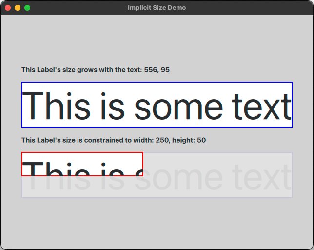</p>

В этом примере размер синего Label определяется неявным размером текста. Это означает, что если бы текстовая строка была длиннее, Label был бы шире, а если бы шрифт pixelSize был больше, label был бы выше.

С красным Label мы указываем ширину и высоту. Это означает, что Label имеет явный размер, а неявный размер текста игнорируется; текст и любые дочерние компоненты рискуют отображаться неправильно.

На практике неявный размер удобен при работе с макетами и динамическим содержимым. Понимание того, как работает неявный размер, позволяет вам разрабатывать гибкие пользовательские интерфейсы, которые адаптируются к изменяющемуся содержимому без ручного вмешательства.

## Изучение якорей

> Прежде чем продолжить, мы рекомендуем загрузить ресурсы, которые вы будете использовать, по ссылке ниже.
>
> **Project Assets**
> 
> Вы можете загрузить файлы проекта, используя кнопку справа. Активы, используемые в этом разделе, находятся в папке **'00-Assets'** в репозитории [GitHub](https://github.com/qt-learning/QML-Positioners-And-Layouts).

[](https://d3pg1c2bhy6429.cloudfront.net/114478/ADZmE8Pm70dWzl9MslTss9JfQo41QilXJSd312jM/scormcontent/assets/01-Anchors-ShortIntro-Final.mp4?v=1)

<details>
<summary><b>Расшифровка видео</b></summary>

В этом курсе мы рассмотрим различные методы управления положением и компоновкой визуальных элементов, начиная с самых простых методов и переходя к более продвинутым методам обработки сложных и динамических макетов.

Этот курс строится на фундаментальных знаниях, таких как синтаксис языка, элементы и их основные свойства позиционирования и размера.

В этом разделе мы начнем с модуля Qt Quick, изучая якоря. Мы обсудим преимущества и проблемы каждого метода, гарантируя, что вы будете хорошо подготовлены к выбору наиболее подходящего подхода для дизайна и структуры вашего приложения.

Для начала мы создадим простое приложение, которое отображает ряд изображений, и рассмотрим один из способов их упорядочивания.

Сначала давайте создадим новый проект Qt Quick с помощью мастера создания новых проектов: выберите «Файл > Новый проект». Выберите «Приложение (Qt)», а затем «Приложение Qt Quick».

На вкладке «Расположение проекта» назовите свой проект «Якоря» и выберите местоположение проекта.

Мы выберем Qt 6.5 в качестве минимальной версии из раскрывающегося списка, если она еще не выбрана. Это поможет мастеру правильно настроить проект.

На вкладке «Выбор комплектов» выберите версию Qt для использования в этом проекте. Вы можете выбрать комплект Qt Desktop для версии 6.6 или более поздней. Здесь мы выберем Qt 6.7 для macOS, который будет работать просто отлично.

Мы можем пропустить раздел «Управление проектами» на данный момент, поскольку нас пока не интересует управление версиями.

Нажмите «Готово», и вы должны увидеть совершенно новый проект, содержащий простое окно «Hello World». Быстрая сборка и запуск подтвердят, что все работает.

Глядя на верхнюю часть нашего файла Main.qml, мы видим, что модуль Qt Quick уже импортирован. Этот импорт обеспечивает доступ ко многим базовым типам, таким как Item, Rectangle, Text, MouseArea и Image, которые мы здесь будем использовать.

Давайте сделаем окно больше, чем размер по умолчанию, например, 1200 x 800, чтобы у нас было больше места. Этот размер можно свободно изменить в любое время, даже во время выполнения, изменив размер окна.

Мы также должны дать ему более описательное название: «Hello Anchors».

Нам нужны некоторые изображения для сборки нашего приложения. Чтобы добавить их, мы скопируем ресурсы, предоставленные в репозитории git для этого курса, в нашу локальную папку проекта.

Далее мы добавим их в наш проект CMake с помощью пункта меню «Добавить существующий каталог» и выбрав папку ресурсов. Это добавит ссылки на ресурсы в раздел RESOURCES модуля QML в проекте CMake.

Теперь мы готовы использовать эти ресурсы в нашем проекте.

Мы будем повторять шаги по созданию проекта и копированию ресурсов для каждого из следующих разделов этого курса, поэтому не стесняйтесь возвращаться к этим инструкциям, когда это необходимо.

Теперь, когда ресурсы изображений добавлены, мы можем начать использовать их в нашем проекте. Мы добавили 10 файлов изображений в наш проект.

Давайте начнем с добавления 10 элементов Image в файл Main.qml. Сначала мы добавим один элемент Image, дадим ему идентификатор "image0" и зададим источник изображения.

Затем скопируем и вставим этот элемент Image еще девять раз, настроив идентификаторы и источники изображений так, чтобы они соответствовали соответствующим изображениям.

Теперь у нас должно быть 10 элементов Image. На этом этапе каждый элемент Image имеет позицию x,y по умолчанию 0,0, поэтому все изображения будут накладываться друг на друга.

"image0" будет внизу, а "image9" будет наверху.

Естественный z-порядок Qt Quick означает, что элементы накладываются в том порядке, в котором они объявлены в файле QML: первый объявленный элемент находится внизу, а каждый последующий элемент накладывается над предыдущим.

Давайте расположим изображения в горизонтальной линии с помощью якорей. Мы привяжем левый якорь каждого изображения к правому якорю изображения слева от него, за исключением первого изображения, конечно.

Когда мы запускаем приложение, мы видим только пару наших изображений. Почему так?

Изображения довольно большие и все разного размера. Использование якорей, как мы это делали, влияет только на положение элементов изображения.

Поскольку мы не обрабатывали размер изображений, каждое изображение остается в своем исходном размере в пикселях, выступая за правый край окна.

Разве не было бы здорово, если бы мы могли быстро уменьшить масштаб окна, чтобы увидеть все изображения?

Мы можем сделать это, настроив свойства contentItem окна.

Используя свойство группы contentItem, установите масштаб на 0,1, а transformOrigin на Item.TopLeft.

Повторный запуск приложения покажет наши 10 изображений в строке слева направо.

Обратите внимание, что добавление свойства масштаба к каждому изображению не изменит его ширину, высоту, неявную ширину или неявную высоту. Это означает, что это не повлияет на их позиции из-за привязки.

Поскольку все изображения являются родительскими по отношению к contentItem окна, применение масштаба к contentItem одновременно масштабирует все его дочерние изображения и их позиции из-за привязки.

Давайте сделаем шаг назад и рассмотрим некоторые плюсы и минусы использования привязок для компоновки наших компонентов.

Привязки очень просты в использовании, эффективны в исполнении и универсальны для быстрых и простых макетов. Они должны быть вашей первой мыслью при начале проектирования макета — возможно, их будет все, что вам нужно.

Скромный anchors.fill: parent всегда будет вашим лучшим другом при настройке контейнеров элементов.

Однако одна проблема с использованием привязок таким образом заключается в том, что каждый элемент содержит ссылку на один или несколько других элементов.

Подумайте, что произойдет, если мы захотим изменить количество изображений в нашем приложении.

Например, что, если мы удалим image5 или вставим другое изображение между image7 и image8? Или что, если мы захотим вертикальное расположение?

Насколько удобен этот подход, если мы планируем расширять наше приложение с помощью будущих изменений?

Легко увидеть, что добавление и удаление элементов в «цепочке якорей» вызывает проблему обслуживания кода.

Разве не было бы здорово, если бы мы могли просто добавлять наши изображения в какой-то элемент, который бы размещал их рядом друг с другом, чтобы нам не приходилось устанавливать или поддерживать якоря, и где добавление и удаление дочерних элементов имеет большую гибкость.

В следующем разделе мы рассмотрим позиционеры и увидим, как они обеспечивают нам более динамичный подход.

</details>

### Резюме: изучение якорей

[Якоря](https://doc.qt.io/qt-6/qtquick-positioning-anchors.html) в Qt Quick позволяют вам позиционировать элементы относительно друг друга или их родителя без указания точных координат. Каждый элемент имеет невидимые края (левый, правый, верхний, нижний) и центры (горизонтальный, вертикальный), которые можно «прикрепить» к соответствующим краям другого элемента или его родителя. Это позволяет вам создавать связи между объектами для построения макетов, которые не зависят от ограничения положения размером окна.

<p align="center">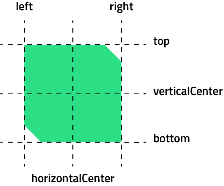</p>

Например, вы можете прикрепить левую сторону элемента к правой стороне другого элемента или центрировать элемент внутри его родителя. Якоря позволяют вам контролировать интервалы с помощью полей и задавать положение или размер элемента, привязывая его стороны к другим элементам. Однако избегайте смешивания якорей с абсолютными свойствами позиционирования, такими как x, y, ширина и высота, чтобы предотвратить непредсказуемое поведение. Якоря предоставляют гибкий и эффективный способ поддержания согласованности макета, даже если размер родительского или других элементов изменяется. Однако одна из проблем с использованием якорей таким образом заключается в том, что каждый элемент содержит ссылку на один или несколько других элементов, что означает, что для динамического контента это не масштабируемый рабочий процесс.

В видео мы создали простое приложение галереи, которое позиционировало выборку изображений, используя якоря для их позиционирования относительно друг друга. Вот как мы это сделали:

- Шаг 1: Создание проекта

    <p align="center">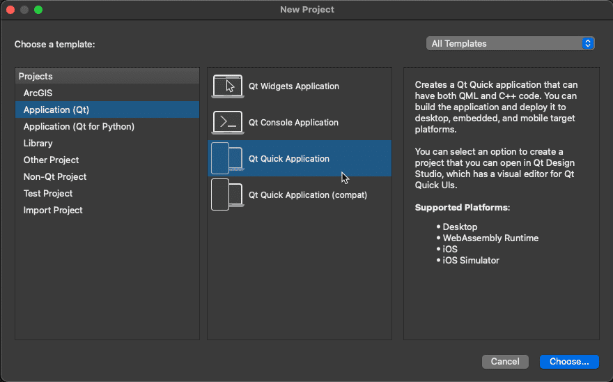</p>

    Мы начали с создания нового проекта Qt Quick под названием **Anchors**. Используя **New Project Wizard**, мы выбрали **Qt Quick Application** в качестве шаблона. На вкладке **Project Location** мы назвали наш проект "Anchors". После этого у нас был базовый проект с простым окном **Hello World**. Быстрая сборка и запуск подтвердили, что все работает правильно.

- Шаг 2: Регулировка окна

    ```
    Window {
        width: 1280
        height: 800
        visible: true
        title: qsTr("Hello Anchors")
    }
    ```

    После настройки проекта мы изменили размер окна до 1200 x 800 пикселей, чтобы предоставить себе больше места для макета. Мы также изменили заголовок окна на «Hello Anchors», обновив свойство title в файле Main.qml.

- Шаг 3: Добавление графических ресурсов

    <p align="center">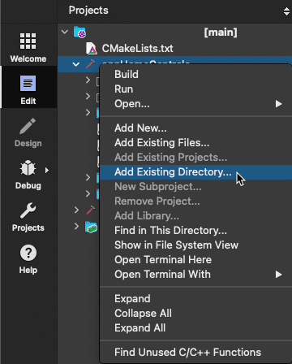</p>

    Далее мы добавили в наш проект ресурсы изображений. Мы скопировали предоставленные ресурсы из репозитория курса в нашу локальную папку проекта. Затем, используя опцию **Add Existing Directory**, мы добавили каталог ресурсов в наш проект, убедившись, что на них есть ссылки в разделе **RESOURCES модуля QML** в CMakeLists.txt. Помните, этот шаг повторяется в следующих разделах, и теперь ресурсы готовы к использованию.

- Шаг 4: Создание элементов изображения

    ```
    Image {
        id: image0
        source: Qt.resolvedUrl("assets/image0.jpg")
    }
    ```

    После того, как активы были на месте, мы добавили 10 элементов **Image** в файл Main.qml. Мы создали один элемент **Image**, присвоили ему идентификатор image0 и установили его источник на соответствующий файл изображения. После этого мы скопировали и вставили элемент **Image** еще девять раз, настроив идентификаторы и источники изображений для каждого из них. Это дало нам десять отдельных элементов **Image**, каждый с позицией по умолчанию (0,0), что означает, что изображения были наложены друг на друга.

- Шаг 5: Расположение изображений с использованием якорей

    ```
    Image {
        id: image1
        anchors.left: image0.right
        source: Qt.resolvedUrl("assets/image1.jpg")
    }
    ```

    Для упорядочивания изображений мы использовали якоря, чтобы выровнять их по горизонтали. В частности, мы привязали левый якорь каждого изображения к правому якорю изображения, предшествующего ему, за исключением первого изображения, которое оставалось прикрепленным к левой стороне окна.

- Шаг 6: Масштабирование содержимого окна

    ```
    contentItem {
        scale: 0.1
        transformOrigin: Item.TopLeft
    }
    ```

    Когда мы запустили приложение, были видны только первые несколько изображений, поскольку они были большими и выходили за пределы края окна. Чтобы решить эту проблему, мы уменьшили масштаб содержимого с помощью свойств **contentItem** **window** окна. Мы установили масштаб на 0,1 и **transformOrigin** на **Item.TopLeft**, что уменьшило масштаб представления, позволив нам увидеть все 10 изображений, расположенных в горизонтальной линии.

### Репозиторий проекта: наш прогресс на данный момент

> **Репозиторий проекта**
>
> Чтобы изучить пример проекта, перейдите к **'01-Anchors'** в репозитории проекта. Вы можете открыть проект, перейдя к **CMakeLists.txt** в Qt Creator.
>
> [Ссылка на GitHub](https://github.com/qt-learning/QML-Positioners-And-Layouts)

Далее мы рассмотрим, как позиционировать элементы с помощью позиционеров элементов.

---

# Урок 3: Позиционеры (Positioners)

[Перейти к содержанию](#содержание)

В этом разделе мы рассмотрим различные типы Item Positioner из Qt Quick. [Item Positioners](https://doc.qt.io/qt-6/qtquick-positioning-layouts.html) в QML предоставляют декларативный способ размещения визуальных элементов без указания точных координат. Независимо от того, нужно ли вам организовать элементы по горизонтали, вертикали или в сетке, Positioners, такие как **Row**, **Column**, **Grid** и **Flow**, упрощают управление макетом динамического контента. Мы рассмотрим эти Positioners, объясним их основные свойства и то, как они могут помочь в создании адаптивных, организованных интерфейсов.

Мы продолжим развивать нашу концепцию приложения галереи с этим новым рабочим процессом Item Positioners, и, делая это, вы можете столкнуться с некоторыми новыми концепциями и типами QML, которые вы раньше не использовали. Итак, прежде чем погрузиться, давайте рассмотрим некоторые из этих элементов.

## Тип компонента QML

Тип [Component](https://doc.qt.io/qt-6/qml-qtqml-component.html) инкапсулирует повторно используемый блок кода QML, что делает его важным строительным блоком для структурирования вашего приложения. Компоненты часто определяются как отдельные документы QML в файлах QML **(.qml)**. Тип Component позволяет определять компоненты QML в строке, в документе QML, а не в отдельном файле **.qml**. Это может быть полезно для повторного использования небольшого компонента в файле QML или для определения компонента, который логически принадлежит другим компонентам QML в файле. Поскольку Component не является производным от Item, вы не можете ничего привязать к нему. Он также должен содержать только один элемент верхнего уровня.

```
Component {
    id: redSquare

    Rectangle {
        width: 100
        height: 100
        color: "red"
        border.color: "black"
    }
}

Column {
    anchors.centerIn: parent

    Repeater {
        model: 3
        delegate: redSquare
    }
}
```

<p align="center">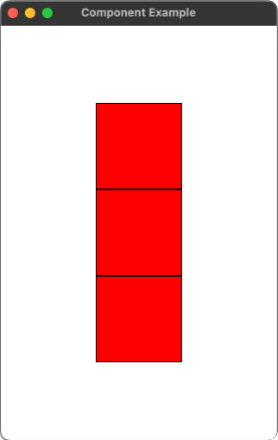</p>

Такой компонент, как Rectangle, сам по себе будет автоматически визуализирован и отображен. Это не относится к прямоугольнику выше, поскольку он определен внутри компонента. Компонент инкапсулирует типы QML внутри, как если бы они были определены в отдельном файле QML, и не загружается до тех пор, пока не будет запрошено. В приведенном выше примере мы используем компонент Repeater для создания трех экземпляров компонента внутри **Column** столбца. Давайте рассмотрим **Repeater** немного ближе.

## Ретранслятор (Repeater)

[Repeater](https://doc.qt.io/qt-6/qml-qtquick-repeater.html) — это мощный элемент в QML, который позволяет вам генерировать несколько экземпляров элемента на основе модели данных. Вместо того, чтобы вручную определять каждый элемент, Repeater динамически создает их по мере необходимости, экономя время и упрощая управление большим количеством элементов. Его основное преимущество заключается в гибкости — если модель изменяется, Repeater автоматически обновляет элементы. Например, при создании списка изображений или серии кнопок Repeater упрощает процесс, генерируя каждый элемент программно, что делает его идеальным для динамических пользовательских интерфейсов, управляемых данными. Repeater имеет модель [model](https://doc.qt.io/qt-6/qml-qtquick-repeater.html#model-prop) и делегата [delegate](https://doc.qt.io/qt-6/qml-qtquick-repeater.html#delegate-prop) для каждой записи в модели. Делегаты представляют визуальную структуру для каждого элемента в модели. Делегат создается для каждого элемента в модели, при этом каждый экземпляр инициализируется определенными данными из этой модели.

```
Component {
    id: number

    Text {
        required property int index

        text: `${index}`
        color: "black"
        font.pixelSize: 80
    }
}

Column {
    anchors.centerIn: parent

    Repeater {
        model: 3
        delegate: number
    }
}
```

<p align="center">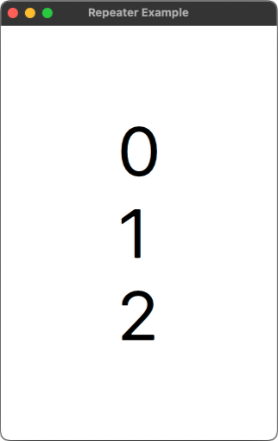</p>

В приведенном выше примере модель установлена ​​на 3, что указывает на количество делегатов, которые создаст повторитель. Повторитель добавляет свойство **index** индекса только для чтения к каждому Delegate, используя присоединенный объект Positioner. Индекс используется свойством text компонента Text для отображения индекса повторяющегося элемента.

## Прикрепленные свойства

Большинство **Item** элементов в QML имеют предопределенные свойства, такие как **visible** видимый, **color** цветной или **text** текстовый. Эти свойства управляют некоторыми аспектами поведения элемента или дают нам информацию о его состоянии.

Однако QML также позволяет нам «прикреплять» дополнительные свойства к элементу без непосредственного знания этого элемента. Они называются прикрепленными свойствами (**attached properties**). В отличие от обычных свойств, прикрепленные свойства в основном используются другими элементами, взаимодействующими с ним, которые могут захотеть прочитать или записать в него позже. Они расширяют функциональность элемента для определенных случаев использования, не изменяя сам элемент.

Представьте прикрепленные свойства как липкие заметки, которые вы размещаете на своем холодильнике. Холодильник ничего не знает о липких записках, прикрепленных к нему, но вы, как пользователь, понимаете, что они означают, и можете взаимодействовать с ними. **Желтые липкие заметки** могут быть для задач, **розовые липкие заметки** могут быть для школьных заданий, а **зеленые липкие заметки** могут быть для покупок.

Вы можете добавить заметку, прочитать то, что на ней, и написать новую информацию на заметке. Однако цвет липкой заметки предопределен — она доступна только для чтения.

Теперь представьте, что холодильник достаточно «умный», чтобы написать список покупок за вас. Если холодильник поймет, что у вас мало молока, он может добавить «купить еще молока» на зеленую записку. Но если зеленой записки нет, он может решить создать для вас новую как раз вовремя. Таким образом, холодильник избежит попыток написать на самой дверце холодильника перманентным маркером!

```
Component {
    id: square

    Rectangle {
        width: 100
        height: 100
        color: Positioner.isFirstItem ? 
                  "yellowgreen" : "red"
        border.color: "black"
    }
}

Column {
    anchors.centerIn: parent

    Repeater {
        model: 3
        delegate: square
    }
}
```

<p align="center">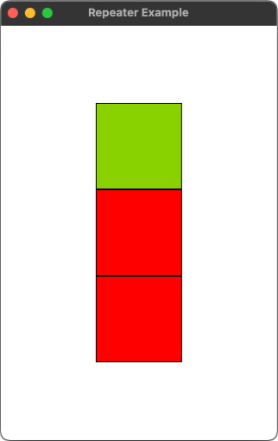</p>

В приведенном выше примере мы используем прикрепленные свойства типа QML [Positioner](https://doc.qt.io/qt-6/qml-qtquick-positioner.html) в **Repeater** внутри **Column**, чтобы предоставить дополнительный контекст дочерним элементам внутри Item Positioner, который можно использовать для создания дополнительных функций. В частности, **Positioner.isFirstItem** — это прикрепленное свойство, которое позволяет каждому Rectangle, созданному Repeater, знать, является ли он первым элементом в макете. Это используется в примере для изменения **color** цвета Rectangle: зеленый, если это первый элемент; в противном случае он красный.

## Позиционеры предметов

> Прежде чем продолжить, мы рекомендуем загрузить ресурсы, которые вы будете использовать, по ссылке ниже.

> **Ресурсы проекта**
>
> Вы можете скачать файлы проекта, нажав на кнопку справа. Ресурсы, используемые в этом разделе, находятся в папке '00-Assets' в репозитории [GitHub](https://github.com/qt-learning/QML-Positioners-And-Layouts)

[](https://d3pg1c2bhy6429.cloudfront.net/114478/ADZmE8Pm70dWzl9MslTss9JfQo41QilXJSd312jM/scormcontent/assets/02-Positioners-Final.mp4?v=1)

<details>
<summary><b>Расшифровка видео</b></summary>

В этом разделе мы создадим второе приложение, чтобы изучить, как использовать Positioners для отображения ряда изображений в предписанном порядке.

Типы Positioners, такие как Row, Column, Grid и Flow, помогут нам легко упорядочить наши элементы. Итак, начнем.

Создайте новый проект, выбрав Qt Quick Application и назвав его «Positioners», оставив все остальное таким же, как и раньше. Мы изменим размер окна на 1200x800 и установим заголовок окна на «Hello Positioners».

Скопируйте ту же папку assets, содержащую изображения, которые мы использовали в разделе 1, в наш проект «Positioners». Используйте пункт меню «Add Existing Directory» и выберите папку assets, как и прежде, чтобы добавить их в проект CMake.

Чтобы избежать повторения, мы можем использовать Repeater для создания наших 10 изображений. Но сначала, чтобы нам было проще опробовать разные Positioners, давайте создадим повторно используемый делегат. Мы создадим компонент Image с меткой Text в центре, чтобы показать изображение и его индекс.

Начнем с создания компонента и присвоим ему идентификатор imageDelegate. Внутри компонента объявим элемент Image и присвоим ему идентификатор. Мы добавим обязательное целочисленное свойство, чтобы гарантировать предоставление свойства index при каждом создании этого компонента.

Мы установим источник изображения с помощью метода Qt resolveURL, заключив URL-адрес в обратные кавычки вместо одинарных или двойных кавычек. Шаблонные литералы могут содержать заполнители, обозначенные синтаксисом ${}. В нашем случае мы передаем обязательное свойство index для построения URL-адреса для каждого изображения, которое хотим отобразить. Это гарантирует, что компонент получит всю необходимую информацию для правильной работы.

Мы также установим asynchronous на true для более быстрой производительности пользовательского интерфейса. Добавьте элемент Text внутри Image, чтобы видеть, какое изображение загружено и его положение. Установите якоря в центре родителя и задайте ему удобный размер в пикселях, например, 30. Установите цвет на «белый» с черным контуром для удобства чтения поверх изображения. Свяжите свойство text со свойством index изображения.

Теперь добавьте Repeater для создания экземпляров imageDelegate. Свяжите модель Repeater с 10, целочисленным массивом длиной 10 со значениями от 0 до 9. Это заставит Repeater создать 10 экземпляров делегата, которым в данном случае является imageDelegate.

Обратите внимание, что свойство delegate является свойством по умолчанию Repeater, поэтому делегаты могут быть объявлены внутри Repeater без явной привязки к свойству delegate. Repeater визуально переродит созданные им элементы в родительский элемент Repeater, но по-прежнему сохранит владение объектом. Repeater, а также общие концепции моделей, представлений и делегатов, а также использование требуемых свойств будут рассмотрены в отдельном курсе.

Повторитель создаст 10 изображений, но нам нужно их упорядочить. Вот тут-то и вступают в дело Позиционеры. Давайте посмотрим.

Давайте начнем с добавления строки вокруг повторителя и запуска приложения. Все изображения располагаются рядом, но, как и в первом разделе, все они сохраняют свой собственный размер. Это сразу же демонстрирует одно ограничение не только строки, но и всех типов Positioner: они только позиционируют элементы, не управляя их размером. Однако размер элементов учитывается при расчете положения каждого последующего элемента. Давайте обеспечим постоянный размер для изображений: 100 ширины и высоты.

После внесения этой корректировки и запуска приложения мы увидим 10 изображений, расположенных в строке, каждое из которых имеет соответствующий размер, отображаемых рядом, с текстом, показывающим индекс каждого изображения.

Прежде чем продолжить рассмотрение других Positioner, самое время упомянуть, что все типы Positioner, которые мы обсуждаем в этом разделе, имеют общие свойства, которые мы можем начать изучать.

Во-первых, все типы Positioner наследуются от Item, поэтому у них есть все обычные свойства, такие как положение (x и y), якоря, видимость, включено и многое другое. Они также добавляют свойства отступа, такие как leftPadding, rightPadding, topPadding, bottomPadding, и общее свойство отступа, если вы хотите установить для них все одно и то же значение. Использование свойств отступа создает зазор между краями Positioner и управляемыми им элементами.

У нас также есть свойство интервала, которое добавляет равномерный зазор между каждым элементом по горизонтали, вертикали или по обоим направлениям в зависимости от типа Positioner. Итак, насколько велики эти Positioner, например, строка, которая у нас есть здесь? Если не указано иное, Positioner будут увеличиваться до размера содержащихся в них элементов, включая любые заданные отступы и интервалы.

Мы можем увидеть это в действии, создав фоновый прямоугольник, который следует размеру Positioner. Сначала присвойте строке идентификатор, например positioner. Затем добавьте серый прямоугольник позади него и используйте якоря, чтобы заполнить размер positioner. Добавьте значение интервала 10 и посмотрите, как это вводит равномерный зазор между изображениями.

Давайте еще немного поэкспериментируем со свойствами интервала и отступа. Добавьте значение отступа 10 и посмотрите, как это добавит отступ вокруг всех четырех краев строки. Теперь мы можем видеть общий размер позиционера строки, независимо от того, сколько элементов он обрабатывает или какие значения отступа и интервала.

Изменение горизонтального расположения в строке на вертикальное расположение в столбце теперь тривиально: измените строку на столбец и посмотрите, как расположение смещается к вертикальному макету. Интервал и отступ применяются к вертикальному макету точно так же, как и ожидалось, и размер позиционера соответствующим образом корректируется.

Затем измените элемент столбца на элемент сетки и посмотрите, как расположение меняется на сетку. Сетка по умолчанию располагает элементы слева направо, а затем сверху вниз. Количество столбцов и строк можно задать с помощью свойств столбцов и строк соответственно. Количество столбцов по умолчанию равно 4, если мы не задаем количество строк и столбцов, что дает нам наш текущий макет.

Мы можем начать понимать, как работает расположение по умолчанию слева направо, сверху вниз, изменив количество столбцов. Если мы изменим количество столбцов на 5, а затем на 2, это продемонстрирует, как работает расположение по умолчанию слева направо, сверху вниз.

Мы также можем ограничить количество строк вместо столбцов. Попробуйте удалить свойство columns и установить rows на 2. Теперь мы получим две строки по 5 изображений. В этом случае количество столбцов по умолчанию 4 игнорируется, поскольку мы указали значение для строк, сделав значение столбца динамическим.

Что происходит, когда Grid недостаточно большой? Почему бы не попробовать установить rows и columns на 2, чтобы посмотреть, что произойдет? Вы, вероятно, получите полезный вывод, вежливо объясняющий проблему!

Grid добавляет rowSpacing и columnSpacing, чтобы обеспечить точный контроль над интервалом между строками и столбцами. Свойство spacing все еще работает, если rowSpacing или columnSpacing не указаны. Поэкспериментируйте с различными значениями для отдельных свойств отступа и интервалов, чтобы увидеть, как они меняют визуальную привлекательность макета.

Например, попробуйте установить rowSpacing на 25 и columnSpacing на 30.

Мы экспериментировали с количеством столбцов, чтобы Grid создавал новую строку каждый раз, когда достигал последнего столбца. Мы также видели, как порядок макета идет слева направо, сверху вниз. Если мы хотим изменить направление макета, Grid добавляет свойство layoutDirection, которое можно установить на Qt.LeftToRight (по умолчанию) или Qt.RightToLeft. Мы можем установить layoutDirection на Qt.RightToLeft и посмотреть, как изменится порядок.

Порядок слева направо также можно изменить, установив присоединенное свойство LayoutMirroring.enabled на true. Это полезно для пользовательских интерфейсов, представленных на таких языках, как арабский или иврит, которые имеют направление чтения справа налево. EffectiveLayoutDirection — это свойство только для чтения, указывающее, в каком направлении Positioner размещает элементы.

У Row также есть свойства layoutDirection и effectiveLayoutDirection, а у Column — нет. Для Grid мы увидели, что порядок расположения основан на строках, заполняя строки слева направо или справа налево перед переносом на следующую строку ниже. Это называется направлением «потока». Если вы предпочитаете поток на основе столбцов, где столбцы заполняются сверху вниз перед переносом на следующий столбец, Grid добавляет свойство потока со следующими значениями: Grid.LeftToRight (по умолчанию) течет вдоль строк в эффективном направлении LayoutDirection, и Grid.TopToBottom, который течет вдоль столбцов в направлении сверху вниз.

Попробуйте установить свойство потока на Grid.TopToBottom и посмотрите, как изображения теперь упорядочены сверху вниз в порядке столбцов. В сочетании с layoutDirection или LayoutMirroring вы можете расположить изображения сверху вниз и справа налево одновременно. Обратите внимание, что вы не можете идти снизу вверх. Чтобы добиться этого, вы должны учитывать использование индекса делегата и/или порядок модели.

Кроме того, направление потока не зависит от LayoutMirroring, поэтому нет свойства "effectiveFlow". Поэкспериментируйте с Grid, используя собственный контент, и попробуйте расположить элементы разных размеров, чтобы понять, как Grid обрабатывает элементы нестандартного размера.

Flow очень похож на Grid в том, что он располагает элементы, которыми управляет, слева направо или справа налево, сначала строки или столбцы, используя похожие свойства, что и Grid. Как и Grid, Flow также поддерживает зеркалирование макета и имеет только для чтения effectiveLayoutDirection, который работает таким же образом.

Итак, чем Flow отличается от Grid? Вместо того, чтобы указывать количество строк и столбцов и позволять размеру Positioner потенциально меняться вокруг нашего контента, ограничения Flow исходят из его собственного размера. Думайте об этом как о том, как работает перенос слов в текстовом поле с ограничением ширины; если слово не помещается в конце строки, начинается новая строка. Flow работает аналогично с управляемыми им элементами.

Давайте попробуем это. Начиная с нашего исходного Row Positioner, измените его на Flow. Интервалы и отступы поддерживаются, как и для всех позиционеров, но поскольку Flow не имеет концепции отдельных строк и столбцов, он не предлагает отдельные rowSpacing или columnSpacing.

Ограничьте размер Flow размером его родителя, установив anchors.fill. Запустите приложение, чтобы увидеть позиционер Flow в действии. Когда мы меняем размер окна, Flow перепозиционирует элементы, создавая новые строки по мере необходимости.

Затем установите layoutDirection на Qt.RightToLeft, а поток на Flow.TopToBottom. Обратите внимание, что, как и в случае с Grid, перечисления свойств потока квалифицируются с использованием типа Flow, а не типа Qt.

Изменение высоты окна заставляет Flow переупорядочивать элементы таким образом, чтобы новые столбцы вместо строк создавались по мере необходимости, в данном случае справа налево.

Поэкспериментируйте с Flow, используя собственный контент, и попробуйте расположить элементы разных размеров, чтобы понять, как Flow обрабатывает расположение элементов и как он ведет себя по-другому по сравнению с Grid.

Позиционеры также предоставляют три удобных прикрепленных свойства: index, isFirstItem и isLastItem. Эти прикрепленные свойства применяются только к элементам, которые позиционеры позиционируют напрямую. Чтобы получить доступ к прикрепленным свойствам из дочерних элементов этих элементов, мы должны квалифицировать прикрепленное свойство с помощью идентификатора делегата Repeater.

Мы можем легко продемонстрировать, как использовать эти свойства, добавив цветную рамку вокруг первого и последнего изображений. Давайте добавим прямоугольник, который заполнит изображение, и установим его цвет на прозрачный, а ширину границы 5. Если изображение является первым элементом, установите цвет границы на зеленый. Если это последний элемент, установите цвет на красный, в противном случае установите его на прозрачный.

Мы также можем использовать Positioner.index вместо индекса модели в тексте, изменив его на текст: image.Positioner.index. Мы видим, что первое и последнее изображения имеют зеленую и красную границу. Обратите внимание, как мы квалифицировали прикрепленный объект Positioner с помощью идентификатора изображения для доступа к нему. Также обратите внимание, что в зависимости от вашей настройки или версии Qt QML может не обеспечивать автодополнение кода для прикрепленных свойств при использовании таким образом.

Давайте рассмотрим некоторые плюсы и минусы Positioners. Positioners позволяют вам размещать элементы в строке, столбце, сетке или потоке без необходимости ссылаться на идентификатор любого соседнего элемента. Они предоставляют дополнительную функциональность через прикрепленные свойства Positioner и LayoutMirroring.

Переходы, которые мы здесь не рассматривали, можно использовать для добавления базовой анимации, когда элементы меняют свое положение или добавляются и удаляются из Positioner. Интервалы и отступы обеспечивают хороший контроль над расположением. Кроме того, Positioners могут быть вложенными.

Однако есть и некоторые минусы. Positioners только размещают элементы — они не изменяют размер каждого элемента под своим контролем. Положение элемента всегда относительно верхнего левого угла, то есть нет вариантов вертикального или горизонтального выравнивания. Мы должны задать размер каждого элемента вручную. Позиционеры не делают никаких предположений о размере и не могут выполнять вертикальное или горизонтальное распределение. Вложенные позиционеры могут затруднить отслеживание общего размера группы позиционеров.

</details>

### Резюме: Позиционеры предметов

Позиционеры элементов в QML предоставляют удобный способ размещения визуальных элементов в пользовательском интерфейсе. Независимо от того, нужно ли вам организовать элементы в горизонтальную строку, вертикальный столбец или гибкую сетку, такие позиционеры, как **Row**, **Column**, **Grid** и **Flow**, предлагают мощные инструменты для управления макетом без явного указания положения каждого элемента. Однако у позиционеров есть некоторые ограничения. Они обрабатывают позиционирование, но не управляют размером элементов, то есть размеры каждого элемента должны быть установлены вручную. Позиционеры также размещают элементы относительно верхнего левого угла, то есть нет параметров выравнивания, таких как вертикальное или горизонтальное выравнивание. Хотя они предлагают гибкость с такими свойствами, как интервал и отступ, расширенные варианты использования часто требуют вложенных позиционеров, что затрудняет отслеживание общего макета.

Давайте рассмотрим некоторые из конкретных позиционеров элементов:

- ROW 
  
  Позиционер [Row](https://doc.qt.io/qt-6/qml-qtquick-row.html) размещает свои дочерние элементы горизонтально в одну линию. Каждый элемент размещается рядом, при этом свойство **spacing** управляет зазором между элементами, а свойство **padding** управляет пространством вокруг содержимого. Это идеально подходит для панелей инструментов, панелей управления или любого макета, где элементы должны быть выровнены по горизонтали. Row также содержит свойство **layoutDirection**, которое мы исследовали с помощью Grid и Flow, что позволяет нам размещать наши элементы слева направо (по умолчанию) или справа налево.

    ```
    Component {
        id: imageDelegate

        Image {
            required property int index

            source: `assets/image${index}.jpg`

            width: 100
            height: 100
        }
    }

    Row {
        anchors.centerIn: parent

        spacing: 10
        padding: 10

        Repeater {
            model: 3
            delegate: imageDelegate
        }
    }
    ```

    <p align="center">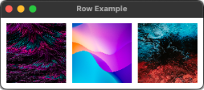</p>

- COLUMN
  
  [Column](https://doc.qt.io/qt-6/qml-qtquick-column.html) размещает элементы вертикально, один под другим, как и **Row**, но в вертикальном направлении. Идеально подходит для размещения элементов, таких как формы, списки или поля ввода. Он содержит те же свойства **spacing** интервалов и **padding** отступов, что и **Row**, для управления пространством между элементами и вокруг содержимого в целом. Обратите внимание, что Column не содержит свойства направления **layoutDirection**, то есть мы не можем размещать элементы сверху вниз.

    ```
    Component {
        id: imageDelegate

        Image {
            required property int index

            source: `assets/image${index}.jpg`

            width: 100
            height: 100
        }
    }

    Column {
        anchors.centerIn: parent

        spacing: 10
        padding: 10

        Repeater {
            model: 3
            delegate: imageDelegate
        }
    }
    ```

    <p align="center">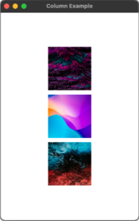</p>

- GRID
  
  [Grid](https://doc.qt.io/qt-6/qml-qtquick-grid.html) размещает элементы в двухмерной сетке с настраиваемыми **rows** строками и **columns** столбцами. По умолчанию количество **columns** столбцов равно 4. Если в сетке недостаточно элементов для заполнения указанного количества столбцов, некоторые столбцы будут иметь нулевую ширину. Свойства **columnSpacing** и **rowSpacing** позволяют точно контролировать расстояние между каждым элементом в сетке, интервал также можно изменить с помощью общего свойства **spacing** интервала. Row также содержит свойство **layoutDirection** и, кроме того, свойство **flow**, с помощью которого можно размещать элементы слева направо или сверху вниз, если вы хотите сначала заполнить столбцы.

    ```
    Component {
        id: imageDelegate

        Image {
            required property int index

            source: `assets/image${index}.jpg`

            width: 100
            height: 100
        }
    }

    Grid {
        anchors.centerIn: parent

        columns: 2
        spacing: 10

        Repeater {
            model: 4
            delegate: imageDelegate
        }
    }
    ```

    <p align="center">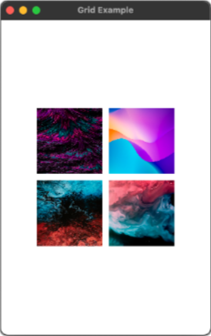</p>

- FLOW
  
  [Flow](https://doc.qt.io/qt-6/qml-qtquick-flow.html#details) работает аналогично Grid, но более гибко при работе с переменными размерами содержимого. Элементы располагаются рядом, переносясь на новую строку, когда достигают конца доступного пространства, подобно тому, как текст переносится в абзаце. Это особенно полезно для адаптивных макетов, где содержимое должно динамически подстраиваться под размер окна или экрана. Flow содержит свойства, похожие на Grid, но только одно свойство **spacing** интервала для управления интервалом между элементами. Обратите внимание, что перечисление **flow** потоков квалифицируется с помощью **Flow**, а не **Grid**. Например, **Flow.TopToBottom**.

    ```
    Component {
        id: imageDelegate

        Image {
            required property int index

            source: `assets/image${index}.jpg`

            width: 100
            height: 100
        }
    }

    Flow {
        anchors.fill: parent

        spacing: 10

        Repeater {
            model: 10
            delegate: imageDelegate
        }
    }
    ```

    <p align="center">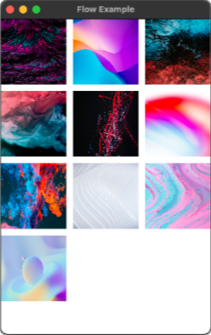</p>

Тип QML [Positioner](https://doc.qt.io/qt-6/qml-qtquick-positioner.html) предоставляет прикрепленные свойства, содержащие сведения о том, где элемент находится в позиционере. Эти свойства доступны только для чтения.

- **Positioner.isFirstItem**: позволяет элементу определить, является ли он первым в позиционере.

- **Positioner.isLastItem**: позволяет элементу определить, является ли он последним в позиционере.

- **Positioner.index**: позволяет элементу определить свой индекс в позиционере.

В видео мы изучили использование позиционеров элементов, создав динамическое приложение галереи. Мы использовали различные позиционеры для размещения серии изображений в гибких композициях. Вот как мы это сделали:

- Шаг 1: Создание нового проекта и добавление активов

    <p align="center"></p>

    Мы создали новый проект, чтобы изучить, как Positioners могут помочь нам организовать элементы, как и в предыдущем разделе, и изменили заголовок на «Привет, Positioners». Затем мы скопировали те же ресурсы, которые использовались в разделе **Anchors**, и добавили их в проект **Positioners**, готовый к работе с изображениями.

- Шаг 2: Создание повторно используемого делегата изображения

    ```
    Component {
        id: imageDelegate

        Image {
            id: image
        
            required property int index
        
            source: Qt.resolvedUrl(`assets/image${index}.jpg`)
            asynchronous: true
        
            Text {
                anchors.centerIn: parent
                text: image.index
                font.pixelSize: 30
                color: "white"
                style: Text.Outline
                styleColor: "black"
            }
        }
    }
    ```

    Чтобы уменьшить повторения, мы создали повторно используемый делегат для наших изображений. Мы объявили **Component** компонент и дали ему идентификатор **imageDelegate**. Внутри компонента мы создали элемент **Image** изображения, добавили **integer property** целочисленное свойство с именем index и установили **source** источник изображения с помощью функции **Qt.resolvedUrl()** в сочетании с литералами шаблона. Это позволило нам динамически назначать источники изображений на основе индекса.

    Кроме того, мы добавили элемент **Text** текста внутри **Image** изображения, центрированный с помощью **anchors.centerIn: parent**. Этот текст отображал индекс каждого изображения, что упрощало отслеживание того, какое изображение визуализируется. Текст имел размер пикселя 30 и белый цвет с черным контуром для лучшей читаемости.

- Шаг 3: Использование репитера для генерации изображений

    ```
    Repeater {
        model: 10
        delegate: imageDelegate
    }
    ```

    Для генерации изображений мы использовали **Repeater**. Мы связали модель **Repeater** с массивом из 10 целых чисел (от 0 до 9), что дало **Repeater** команду создать 10 экземпляров компонента imageDelegate. Это избавило нас от необходимости вручную объявлять каждое изображение, сделав процесс более эффективным и масштабируемым.

- Шаг 4: Расположение изображений с помощью позиционера строк

    ```
    Row {
        id: row

        spacing: 10
        padding: 10

        Repeater {
            model: 10
            delegate: imageDelegate
        }
    }
    ```

    Чтобы упорядочить изображения, мы обернули **Repeater** внутри **Row**. Это расположило изображения горизонтально, одно рядом с другим. Изначально изображения оставались в своем исходном размере, поэтому мы настроили свойства **width** ширины и **height** высоты изображений на 100 пикселей каждое.

    После этого изображения появились рядом, равномерно распределенные, с индексом в центре. Мы потратили немного времени, чтобы поэкспериментировать с некоторыми общими свойствами Positioners. Мы добавили **spacing** интервал и **padding** отступ к **Row**, чтобы создать зазоры между изображениями и по краям Positioner.

    Установив **spacing** интервал на 10 и **padding** отступ на 10, мы ввели равномерные зазоры между изображениями и буфер по краям макета. Это дало нам более точный контроль над внешним видом макета.

- Шаг 5: Переключение на позиционер колонны

    ```
    Column {
        id: column

        spacing: 10
        padding: 10

        Repeater {
            model: 10
            delegate: imageDelegate
        }
    }
    ```

    Затем мы изменили **Row** строку на **Column** столбец, что преобразовало макет из горизонтального расположения в вертикальное. Свойства **spacing** интервала и **padding** отступа применялись аналогичным образом в вертикальном направлении, а **Column** столбец изменял свой размер, чтобы вместить элементы.

- Шаг 6: Размещение с помощью позиционера Grid

    ```
    Grid {
        id: grid

        spacing: 10
        padding: 10
        columns: 4

        columnSpacing: 20
        rowSpacing: 25

        Repeater {
            model: 10
            delegate: imageDelegate
        }
    }
    ```

    Затем мы заменили **Column** на **Grid**. По умолчанию **Grid** размещал изображения слева направо и сверху вниз. Без указания каких-либо свойств сетка создала 4 столбца. Чтобы увидеть эффект изменения свойства **columns**, мы изменили его на 5, затем на 2, наблюдая, как сетка корректирует макет.

    После этого мы исследовали свойство **rows**, удалив настройку **columns** и указав rows: 2. Это создало 2 строки с 5 изображениями в каждой. Мы также экспериментировали с **columnSpacing** и **rowSpacing**, чтобы добавить дополнительный контроль над макетом и увидеть эффект на расположение сетки.

- Шаг 7: Изучение позиционера потока

    ```
    Flow {
        id: flow

        anchors.fill: parent

        spacing: 10
        padding: 10

        layoutDirection: Qt.LeftToRight
        flow:Flow.TopToBottom

        Repeater {
            model: 10
            delegate: imageDelegate
        }
    }
    ```

    Наконец, мы заменили **Grid** на **Flow**. **Flow** упорядочивает элементы, такие как перенос текста в ограниченном поле, создавая новые строки или столбцы на основе размера контейнера. Мы установили **anchors.fill**, чтобы гарантировать, что **Flow** заполнит свой родительский контейнер. По мере изменения размера окна изображения динамически перестраивались, перетекая в новые строки по мере необходимости. Мы также экспериментировали со свойствами **layoutDirection** и **flow**, чтобы управлять расположением справа налево и сверху вниз, наблюдая, как макет реагирует на изменения размера окна.

- Шаг 8: Прикрепленные свойства позиционера

    ```
    Image {
        id: image

        required property int index

        source: Qt.resolvedUrl(`assets/image${index}.jpg`)
        asynchronous: true

        Text {
            anchors.centerIn: parent
            text: image.Positioner.index
            font.pixelSize: 30
            color: "white"
            style: Text.Outline
            styleColor: "black"
        }
        
        Rectangle {
            anchors.fill: parent
            color: "transparent"
            border {
                width: 5
                color: image.Positioner.isFirstItem ? 
                    "green" : image.Positioner.isLastItem ? 
                    "red" : "transparent"
            }
        }
    }
    ```

    Затем мы изучили **прикрепленные свойства Positioner**: index, isFirstItem и isLastItem. Эти свойства используются элементами, которые напрямую управляются Positioner. Чтобы продемонстрировать их использование, мы добавили **Rectangle** вокруг каждого изображения. Внутри **Repeater** мы создали **Rectangle** с **border** рамкой и заполнили его изображением.

    Мы установили **border.width** на 5 и использовали свойства **isFirstItem** и **isLastItem** для настройки цвета рамки. Если изображение было первым элементом, мы устанавливали цвет рамки зеленым, а если это был последний элемент, мы устанавливали цвет рамки красным. Все остальные элементы имели прозрачные рамки.

    Чтобы маркировать изображения на основе их положения в последовательности, мы привязали **text** текст элемента **Text** к свойству **Positioner.index**, что дало более динамичное и контекстно-зависимое отображение.

> **Репозиторий проекта**
>
> Чтобы изучить пример проекта, перейдите к **'02-Positioners'** в репозитории проекта. Вы можете открыть проект, перейдя к **CMakeLists.txt** в Qt Creator.
>
> [Ссылка на GitHub](https://github.com/qt-learning/QML-Positioners-And-Layouts)

Далее мы углубимся в типы макетов и рассмотрим, как управлять размером и положением.

---

# Урок 4: Макеты

[Перейти к содержанию](#содержание)

В этом разделе мы рассмотрим модуль [Qt Quick Layouts](https://doc.qt.io/qt-6/qtquicklayouts-overview.html). Qt Quick Layouts выходит за рамки простого позиционирования элементов, управляя их размером и выравниванием. Layouts предоставляют вам детальный контроль над тем, как располагаются элементы. Мы рассмотрим **RowLayout**, **ColumnLayout** и **GridLayout**, а также [тип QML Layout](https://doc.qt.io/qt-6/qml-qtquick-layouts-layout.html), который предоставляет прикрепленные свойства для элементов, являющихся частью макета. К концу этого раздела вы поймете сходства и различия между Layouts и Positioners и продолжите формировать представление о том, какой подход лучше всего подходит для вашего собственного приложения.

<p align="center">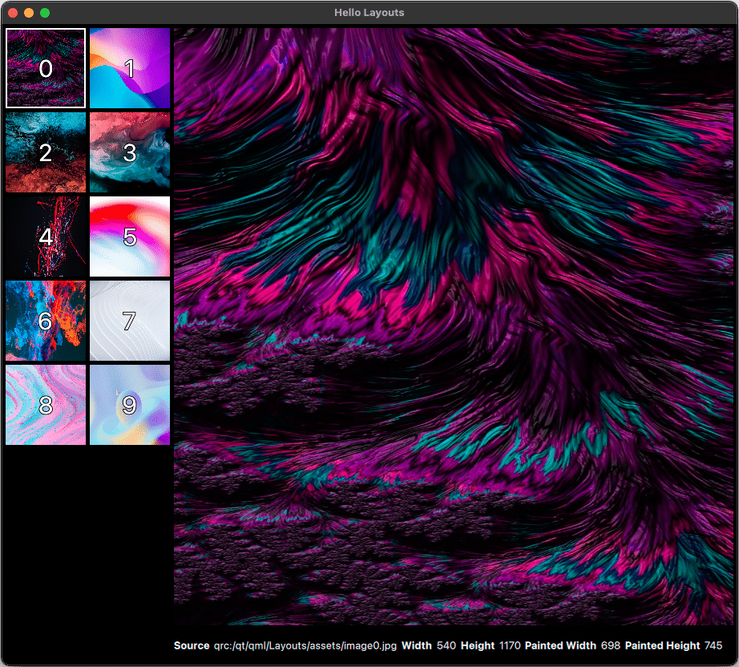</p>

Мы продолжим изучать различные способы создания простого приложения галереи изображений, но на этот раз мы будем использовать **Layouts** для организации интерфейса. Приложение будет отображать набор миниатюр изображений в GridLayout, и при щелчке по миниатюре будет отображаться увеличенное превью вместе с дополнительными подробностями.

Прежде чем углубляться в макеты, давайте рассмотрим тип Flickable QML, который мы будем использовать для создания нашей галереи изображений.

## Перелистывание (Flickable)

[Тип Flickable QML](https://doc.qt.io/qt-6/qml-qtquick-flickable.html) позволяет создавать представление, которое можно «перелистывать» или прокручивать, что делает его идеальным для обработки больших объемов контента, выходящих за пределы видимой области. Flickable позволяет пользователям интерактивно прокручивать контент путем перетаскивания или перелистывания, создавая естественный сенсорный интерфейс, поддерживающий как горизонтальные, так и вертикальные движения.

При использовании компонента Flickable его дочерние элементы размещаются на поверхности, которую можно перетаскивать в одном или обоих направлениях. Это полезно для создания прокручиваемых представлений, таких как галереи изображений, списки или карты, где пользователи могут перелистывать контент без использования традиционных полос прокрутки. Flickable может обрабатывать прокрутку на основе импульса, когда контент продолжает двигаться после того, как пользователь прекращает касаться экрана, имитируя реальный жест перелистывания.

```
Flickable {
    anchors.fill: parent

    contentWidth: image.width
    contentHeight: image.height

    Image {
        id: image
        source: "assets/image0.jpg"
    }
}
```

<p align="center"></p>

В приведенном выше примере показан компонент **Flickable**, который позволяет нам панорамировать изображение, когда оно превышает размер окна. Flickable заполняет родительский элемент, позволяя прокручивать изображение, если его размеры превышают доступное пространство. **contentWidth** и **contentHeight** задаются в соответствии с размерами изображения, определяя общую прокручиваемую область. Пользователь может перетаскивать или «пролистывать», чтобы перемещаться и просматривать различные части изображения, если оно больше видимой области окна. Подводя итог, можно сказать, что **Flickable** здесь обеспечивает интерактивную прокрутку для навигации по элементам, которые могут не полностью помещаться в видимой части интерфейса.

## Быстрые макеты Qt

> Прежде чем продолжить, мы рекомендуем загрузить ресурсы, которые вы будете использовать, по ссылке ниже.
>
> **Project Assets**
> 
> Вы можете загрузить файлы проекта, используя кнопку справа. Активы, используемые в этом разделе, находятся в папке **'00-Assets'** в репозитории [GitHub](https://github.com/qt-learning/QML-Positioners-And-Layouts).

[](https://d3pg1c2bhy6429.cloudfront.net/114478/ADZmE8Pm70dWzl9MslTss9JfQo41QilXJSd312jM/scormcontent/assets/03-Layouts-ShortIntro-Final.mp4?v=1)

<details>
<summary><b>Расшифровка видео</b></summary>

В этом разделе мы рассмотрим, как макеты могут упорядочивать и изменять размер элементов, уделяя особое внимание RowLayout, ColumnLayout и GridLayout. Мы сравним эти макеты с их аналогами Positioner.

Наш проект будет включать создание простого средства просмотра изображений, которое отображает миниатюры, позволяя вам выбирать изображение для более крупного предварительного просмотра и отображать детали изображения ниже.

По мере того, как мы переходим к методам, которые могут влиять на положение и размер, мы должны указать, как мы хотим изменять размер содержимого, если мы ограничиваем размер макета. Мы будем следовать принципу «снаружи внутрь», когда макет сначала ограничивается окном, а затем содержимое подстраивается под него.

Начните с создания нового проекта под названием «Макеты», как мы делали в предыдущих разделах.

Перейдите в «Файл > Новый проект» и выберите «Приложение Qt Quick». Назовите его «Макеты» и используйте те же настройки, что и раньше.

Как и прежде, увеличьте размер окна и измените заголовок на «Hello Layouts».

Чтобы использовать типы Layout в нашем файле QML, мы должны сначала импортировать модуль QtQuick.Layouts.

В этом проекте мы также будем использовать типы ApplicationWindow и Label из Qt Quick Controls, в основном для установки цветовой роли palette.windowText в ApplicationWindow и использования этой цветовой роли всеми нашими Labels, избегая большого количества дублирования кода.

Поэтому мы импортируем Qt Quick Controls с использованием стиля Basic.

Затем измените Window на ApplicationWindow и присвойте ему идентификатор: window, который мы будем использовать позже.

Начните с установки фона на «черный», а роли палитры windowText на «белый».

Мы также добавим свойство currentImageIndex и установим его на 0, которое мы будем использовать позже для сохранения выбранного индекса изображения при щелчке по миниатюре изображения.

Как и в предыдущих разделах, мы скопируем те же самые ресурсы и добавим их в наш проект.

Скопируйте ресурсы в папку Layouts, а затем добавьте их в проект с помощью параметра «Добавить существующий каталог».

Выберите папку ресурсов, и теперь ресурсы будут доступны нам в проекте.

Сначала мы создадим тот же базовый компонент изображения, который мы использовали ранее, но с несколькими изменениями. Начнем с создания компонента и назовем его thumbnailDelegate.

Внутри компонента объявите элемент изображения и присвойте ему идентификатор «thumbnail».

Затем мы добавим обязательное целочисленное свойство с именем index, установив источник изображения с помощью литерала шаблона с заполнителем, содержащим индекс.

Мы также установим asynchronous на «true».

Затем мы визуально укажем, был ли выбран thumbnailDelegate, добавив вокруг него рамку.

Рамка заполнит родительский элемент, будет иметь прозрачный фон и белый цвет рамки.

Ширина рамки будет равна 2, когда currentImageIndex совпадает с индексом миниатюры; в противном случае он будет равен 0.

Как и прежде, чтобы увидеть, какое изображение расположено в каком порядке, добавьте метку внутри изображения.

Метка будет центрирована в родительском элементе, иметь размер шрифта в пикселях 30, контур черного цвета, а ее текст будет отображать индекс миниатюры.

Чтобы сделать миниатюру кликабельной, добавьте MouseArea в качестве дочернего элемента, который заполняет изображение.

Для его обработчика onClicked установите window.currentImageIndex на thumbnail.index.

Типы макетов, такие как Positioners, изменяют свой размер вокруг дочерних элементов на основе их неявного размера и любых прикрепленных свойств макета, таких как preferredHeight или preferredWidth.

Эти свойства обеспечивают больший контроль над позиционированием и размером элементов, предлагая варианты указания минимальной, максимальной ширины и высоты, а также ширины и высоты заполнения.

Выравнивание в макетах по умолчанию выполняется по центру, но на него можно повлиять, используя принципы, аналогичные привязке.

Кроме того, есть свойства полей, которые добавляют дополнительное пространство на определенных краях или на всех краях макета с помощью свойства margins.

GridLayouts позволяют точно позиционировать с помощью коэффициентов строк, столбцов и растяжения.

Мы рассмотрим эти свойства макета более подробно по мере продвижения вперед.

Чтобы завершить миниатюру изображения с прикрепленными свойствами макета, мы установим preferredWidth и preferredHeight на нашей миниатюре изображения.

Это гарантирует, что любой макет, содержащий экземпляры делегата миниатюры, будет знать, как его размер.

Давайте установим preferredWidth и preferredHeight макета на 100.

Теперь, когда мы создали делегата миниатюры, давайте представим макеты для организации нашего контента и добавления визуальной структуры в приложение.

Сначала мы добавим RowLayout, который заполнит окно с отступом 5, что соответствует отступу Layout по умолчанию.

Если не указано иное, все типы Layout имеют отступ по умолчанию 5 пикселей.

Мы будем использовать это значение отступа во всем остальном проекте.

Внутри RowLayout добавьте Flickable с идентификатором "flickable".

Затем внутри Flickable добавьте GridLayout с идентификатором "gridLayout".

GridLayout появится вдоль левого края окна, простираясь сверху донизу.

Flickable позволит нам прокручивать по вертикали, если окно будет слишком маленьким для отображения всех миниатюр изображений, которые мы разместим в GridLayout.

Оставшаяся часть области окна будет занята ColumnLayout.

Это будет включать изображение с идентификатором "previewImage", которое будет отображать большую версию выбранного миниатюрного изображения, заполняя большую часть области окна.

Наконец, мы добавим небольшой RowLayout, содержащий строку из 10 меток, показывающих информацию об изображении.

Давайте возьмем каждый из только что созданных нами элементов и заполним их свойства вместе с любыми прикрепленными свойствами Layout, которые нам нужны, чтобы задать размер и положение элементов, которыми мы хотим управлять с помощью Layout.

Для Flickable нам нужно добавить следующие свойства: установить contentHeight и contentWidth на высоту и ширину gridLayout соответственно.

Мы также хотим установить Layout.fillHeight на true, чтобы Flickable заполнил высоту RowLayout, а Layout.preferredWidth на gridLayout.width, чтобы ширина Flickable всегда соответствовала ширине GridLayout.

Кроме того, мы установим clip на true, чтобы Flickable не отображался в зазоре между ApplicationWindow и полями родительского RowLayout.

GridLayout потребует установки количества столбцов; в этом случае мы установим его на 2.

GridLayout ведет себя во многом как RowLayout или ColumnLayout, когда количество строк или столбцов установлено на 1.

GridLayout рассматривает прикрепленные свойства Layout как применяемые к «ячейке», а не ко всему Layout.

Если вы думаете, что RowLayout имеет высоту только в одну ячейку, а ColumnLayout — ширину только в одну ячейку, это имеет смысл.

GridLayout также может использовать дополнительные прикрепленные свойства Layout.columnSpan и Layout.rowSpan, которые применяются только к GridLayout с более чем одной строкой или столбцом.

В отличие от Grid Positioner, для количества строк или столбцов GridLayout нет значения по умолчанию.

GridLayout также поддерживает перечисления layoutDirection и flow таким же образом, как и тип Grid Positioner — просто используйте префикс "GridLayout" для типов перечисления flow вместо "Grid".

Внутри GridLayout мы добавим наш знакомый Repeater, создав 10 экземпляров thumbnailDelegate.

У thumbnailDelegate уже есть прикрепленные свойства Layout, поэтому они будут учтены GridLayout.

Теперь давайте рассмотрим PreviewImage.

Мы хотим, чтобы previewImage заполнял все доступное пространство, поэтому мы устанавливаем Layout.fillWidth и Layout.fillHeight в значение true.

Чтобы отобразить выбранное изображение, мы будем использовать следующую привязку URL с использованием шаблонного литерала с заполнителем для поиска текущего изображения путем добавления currentImageIndex к строке.

Мы также установим asynchronous на true для производительности.

Для RowLayout с ImageDetails мы хотим зарезервировать немного места в нижней части окна, поэтому установим Layout.minimumHeight на 40.

Наконец, для Labels мы хотим использовать их парами: первый из каждой пары будет «Заголовок», а второй — «Значение».
Для первой метки мы дадим ей идентификатор "sourceTitle" и текст "Source".

Мы также установим шрифт на полужирный.

Для второй метки мы дадим ей идентификатор "sourceValue" и установим текст на исходный URL-адрес изображения предварительного просмотра.

Затем мы можем сделать то же самое для оставшихся четырех пар меток для ширины, высоты, paintedWidth и paintedHeight, задав идентификаторы и свойства текста, используя тот же шаблон.

Давайте теперь посмотрим на готовое приложение, которое должно выглядеть примерно так.

Мы можем выбрать изображение из GridLayout, и мы можем увидеть исходные свойства в нижней части окна, показывающие детали выбранного изображения.

Обратите внимание, как изменение размера окна изменяет размер изображения предварительного просмотра и, следовательно, окрашенные свойства ширины и высоты в деталях.

Также обратите внимание, что GridLayout остается той же ширины, но поскольку его высота меняется, использование Flickable позволяет нам прокручивать GridLayout по вертикали.

Главное, что следует помнить при использовании макетов, — не использовать якоря для элементов, которые являются прямыми потомками макетов.

Всегда следует позволять Layout выполнять свою работу.

Если вы случайно сделаете это, вы получите предупреждение во время выполнения — вы можете попробовать это самостоятельно, чтобы посмотреть, что произойдет, а затем принять осознанное решение не делать этого!

Будьте осторожны с тем, какие элементы управляются Layouts, а какие управляются якорями, и избегайте смешивания этих двух элементов.

Макеты позволяют вам размещать и изменять размер элементов в RowLayout, ColumnLayout или GridLayout без необходимости ссылаться на идентификатор любого соседнего элемента.

LayoutMirroring также работает с типами Layout, как обсуждалось в разделе «Позиционеры».

Прикрепленные свойства макета обеспечивают большой контроль над позиционированием, выравниванием, интервалами и размером элементов под управлением макета.

Кроме того, макеты могут быть вложенными для создания комплексных и динамически изменяющих размер расположений.

Однако есть некоторые недостатки.

Макеты не поддерживают переходы добавления, удаления или перемещения, как это делают позиционеры.

В некоторых случаях макеты могут только делать все возможное, чтобы придерживаться подсказок по размеру, и иногда механизму макета приходится идти на компромиссы, которые вам, возможно, придется учитывать.

При создании сложных макетов может быть сложно понять, как политика размеров элемента фактически проявляется в рендеринге.

Лучший способ понять, как работают макеты, — попробовать их самостоятельно.

Так почему бы не поэкспериментировать с макетами и не посмотреть, какие типы расположений вы можете спроектировать?

</details>

### Резюме: Qt Quick Layouts

**Qt Quick Layouts** позволяет вам размещать элементы в пользовательском интерфейсе вашего приложения, подобно позиционерам элементов. Однако, в отличие от позиционеров, Qt Quick Layouts может размещать и изменять размер элементов в предопределенных расположениях без указания позиции каждого элемента, что делает его полезным для создания интерфейсов с изменяемым размером. Чтобы начать использовать Qt Quick Layouts, вам необходимо импортировать модуль в ваш файл **.qml**.

```
import QtQuick.Layouts
```

Типы макетов, такие как **RowLayout**, **ColumnLayout** и **GridLayout**, позволяют создавать горизонтальные, вертикальные или сеточные расположения. Эти типы предоставляют знакомые свойства для управления **spacing** интервалом, **layoutDirection** направлением макета и **flow** потоком (GridLayout). С помощью **типа QML Layout** дочерние элементы макета имеют доступ к различным прикрепленным свойствам, которые предоставляют специфичную для макета информацию об элементе и возможность влиять на то, как макет будет располагать элементы. Давайте разберем некоторые прикрепленные свойства Layout, чтобы понять, как они питают эти гибкие и изменяемые по размеру макеты.

[Тип QML Layout](https://doc.qt.io/qt-6/qml-qtquick-layouts-layout.html) предоставляет прикрепленные свойства для дочерних элементов макета. С помощью этих прикрепленных свойств отдельные элементы в макете могут предоставлять входные данные о том, как они должны быть размером, выровнены или распределены в доступном пространстве. Эти свойства позволяют макетам динамически адаптироваться к изменениям размера окна или экрана, гарантируя, что интерфейс вашего приложения останется отзывчивым и визуально согласованным на разных устройствах. Давайте вспомним некоторые из прикрепленных свойств, которые мы использовали в нашем приложении галереи:

- **Layout.preferredWidth и Layout.preferredHeight**: эти свойства определяют идеальный размер элемента и могут быть полезны, когда неявный размер элемента не обеспечивает оптимального расположения. Если не задано, макет использует неявный размер элемента.
- **Layout.fillWidth и Layout.fillHeight**: если задано значение true, эти свойства заставляют элемент заполнять все доступное пространство с учетом заданных ограничений. Если задано значение false, элемент имеет фиксированный размер в соответствии с его предпочтительным размером.
- **Layout.alignment**: это свойство управляет выравниванием элемента в выделенном ему пространстве. Вы можете выровнять элементы по вертикали, горизонтали или обоим направлениям с помощью таких флагов, как **Qt.AlignLeft**, **Qt.AlignRight**, **Qt.AlignTop** и **Qt.AlignBottom**.
- **Layout.margins**: определяет интервал вокруг внешней стороны элемента. Сам элемент не оценивает свои поля; это обязанность родителя. Объединение полей с выравниванием выровняет элемент, включая его поля. Например, вертикально центрированный элемент с верхним полем 1 и нижним полем 9 приведет к тому, что эффективное выравнивание элемента в ячейке будет на 4 пикселя выше центра. Чтобы указать поля по отдельности, можно использовать **leftMargin**, **topMargin**, **rightMargin** и **bottomMargin**.

Чтобы изучить другие присоединенные свойства Layout и найти подходящие свойства для вашего варианта использования, обязательно ознакомьтесь с [документацией по типу QML Layout](https://doc.qt.io/qt-6/qml-qtquick-layouts-layout.html).

- ROWLAYOUT
    
    [Тип QML RowLayout](https://doc.qt.io/qt-6/qml-qtquick-layouts-rowlayout.html) размещает свои дочерние элементы горизонтально в одну строку, аналогично **Row Positioner**, но с дополнительным контролем над размерами элементов и выравниванием при использовании присоединенных свойств Layout. Он поддерживает такие свойства, как **spacing** и **layoutDirection**, для управления зазором между элементами и тем, располагаются ли они слева направо или справа налево.

    В примере ниже у нас есть 3 изображения, которые равномерно заполняют пространство по горизонтали.

    ```
    Component {
        id: imageDelegate

        Image {
            required property int index

            source: `assets/image${index}.jpg`
            fillMode: Image.PreserveAspectCrop

            Layout.fillHeight: true
            Layout.fillWidth: true
        }
    }

    RowLayout {
        anchors.fill: parent

        Repeater {
            model: 3
            delegate: imageDelegate
        }
    }
    ```

    <p align="center">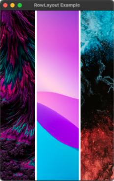</p>

- COLUMNLAYOUT
    
    [Тип QML ColumnLayout](https://doc.qt.io/qt-6/qml-qtquick-layouts-columnlayout.html) работает как **RowLayout**, но размещает элементы вертикально в одном столбце. Он полезен для создания вертикальных списков или макетов форм, где элементы должны располагаться друг над другом. ColumnLayout также содержит те же свойства **spacing** и **layoutDirection** для управления расстоянием между элементами и направлением расположения. Не забудьте снова использовать прикрепленные свойства Layout для изменения размера, выравнивания и полей.

    В примере ниже у нас есть 3 изображения, которые одинаково заполняют пространство по вертикали.

    ```
    Component {
        id: imageDelegate

        Image {
            required property int index

            source: `assets/image${index}.jpg`
            fillMode: Image.PreserveAspectCrop

            Layout.fillHeight: true
            Layout.fillWidth: true
        }
    }

    ColumnLayout {
        anchors.fill: parent

        Repeater {
            model: 3
            delegate: imageDelegate
        }
    }
    ```

    <p align="center">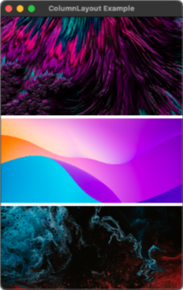</p>

- GRIDLAYOUT
    
    GridLayout размещает элементы в двухмерной сетке с настраиваемыми строками и столбцами. Это особенно полезно для сложных макетов, где элементы должны быть структурированы в обоих направлениях, например, для галерей изображений. GridLayout предлагает такие свойства, как **rowSpacing**, **columnSpacing**, **layoutDirection** и **flow**, для управления пространством и направлением элементов и вашими предпочтениями по заполнению строк или столбцов в первую очередь. Вы также можете указать, сколько **rows** строк или **columns** столбцов имеет сетка.

    В примере ниже у нас есть сетка из 9 изображений с 3 столбцами. Делегат изображения использует прикрепленные свойства Layout, чтобы указать, что они должны заполнять доступное пространство. Однако мы используем условный оператор, чтобы указать, что предпочтительная ширина элементов в центральном столбце немного шире, чем во внешнем. Подумайте, как вы могли бы использовать это в своих проектах, чтобы обеспечить вариативность в своих макетах.

    ```
    Component {
        id: imageDelegate

        Image {
            required property int index

            source: `assets/image${index}.jpg`
            fillMode: Image.PreserveAspectCrop

            Layout.fillHeight: true
            Layout.fillWidth: true
            Layout.preferredWidth: index % 3 === 1 
                                ? 150 : 100
        }
    }

    GridLayout {
        anchors.fill: parent
        columns: 3

        Repeater {
            model: 9
            delegate: imageDelegate
        }
    }
    ```

    <p align="center">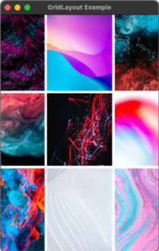</p>

В видео мы создали приложение для просмотра изображений, используя Layouts для управления размещением и размером элементов пользовательского интерфейса. Вот как мы это сделали:

- Шаг 1: Импорт модуля макета

    ```
    import QtQuick
    import QtQuick.Controls.Basic
    import QtQuick.Layouts

    ApplicationWindow {
        id: window
        width: 1280
        height: 800
        visible: true
        title: qsTr("Hello Layouts")

        color: "black"
        palette.windowText: "white"

        property int currentImageIndex: 0
    }
    ```

    После настройки нового проекта и импорта активов мы импортировали модуль **QtQuick.Layouts** в наш файл **Main.qml**. Кроме того, мы импортировали **QtQuick.Controls**, используя стиль **Basic**, чтобы использовать элементы управления, такие как **ApplicationWindow** и **Label**. Мы изменили корневой элемент на **ApplicationWindow**, установили черный цвет фона и установили **palette.windowText** на белый цвет. Наконец, мы добавили новое свойство **currentImageIndex: 0**, которое мы будем использовать позже для хранения индекса текущего выбранного изображения.

- Шаг 2: Изменение делегата миниатюры изображения

    ```
    Component {
        id: thumbnailDelegate

        Image {
            id: thumbnail

            required property int index

            source: Qt.resolvedUrl(`assets/image${index}.jpg`)
            asynchronous: true

            Layout.preferredWidth: 100
            Layout.preferredHeight: 100

            Rectangle {
                anchors.fill: parent
                color: "transparent"
                border {
                    color: "white"
                    width: window.currentImageIndex === thumbnail.index ? 
                                                        2 : 0
                }
            }

            Label {
                anchors.centerIn: parent
                font.pixelSize: 30
                style: Text.Outline
                styleColor: "black"
                text: thumbnail.index
            }

            MouseArea {
                anchors.fill: parent
                onClicked: window.currentImageIndex = thumbnail.index
            }
        }
    }
    ```

    Используя imageDelegate из предыдущего примера, мы создали повторно используемый компонент **thumbnailDelegate**, который можно использовать для отображения миниатюр изображений в макете. Внутри **Component** компонента мы объявили элемент **Image** и задали **source** источник изображения с помощью шаблонного литерала для передачи индекса в URL. Чтобы визуально указать, какая миниатюра была выбрана, мы добавили **border** рамку вокруг изображения, а цвет был условно установлен на белый, когда **currentImageIndex** совпадал с индексом миниатюры, и на прозрачный в противном случае. Мы добавили **MouseArea** вокруг **Image** изображения, и в его обработчике **onClicked** мы установили window.currentImageIndex на **thumbnail.index**, что позволило нам отслеживать выбранное изображение.

- Шаг 3: Изучение свойств, прикрепленных к макету

    ```
    Flickable {
        id: flickable

        contentHeight: gridLayout.height
        contentWidth: gridLayout.width

        Layout.fillHeight: true     
        Layout.preferredWidth: gridLayout.width 
        
        clip: true

        GridLayout {
            id: gridLayout

            columns: 2

            Repeater {
                model: 10
                delegate: thumbnailDelegate
            }
        }
    }
    ```

    Мы изучили **Layout Attached Properties** прикрепленные свойства макета, которые управляют размером и расположением элементов в макетах. Эти свойства включают в себя **preferredWidth**, **preferredHeight**, **minimumWidth**, **maximumWidth** и параметры выравнивания, такие как **fillWidth** и **fillHeight**. Эти свойства позволили нам определить ограничения на размер каждого элемента в макете. Для **thumbnailDelegate** мы установили предпочтительные свойства ширины и высоты, чтобы макет понимал, как изменять размер и расположение миниатюр последовательно. Мы добавили **RowLayout** с Flickable, чтобы разрешить прокрутку миниатюр. **Flickable** содержал **GridLayout**, а flickable был настроен на заполнение высоты RowLayout, а его предпочтительная ширина была установлена ​​на макет сетки.

- Шаг 4: Настройка предварительного просмотра изображения

    ```
    Image {
        id: previewImage

        Layout.fillWidth: true
        Layout.fillHeight: true

        source: Qt.resolvedUrl(`assets/image${window.currentImageIndex}.jpg`)
        asynchronous: true
    }
    ```

    Затем мы добавили **ColumnLayout** справа от **GridLayout**. Этот **ColumnLayout** будет содержать большее **Image** изображение, которое будет служить предварительным просмотром выбранной миниатюры. **previewImage** заполнит большую часть оставшегося пространства окна. В **ColumnLayout** мы настроили **previewImage** для отображения выбранного изображения на основе **currentImageIndex**. Мы установили **Layout.fillWidth** и **Layout.fillHeight** в значение true, чтобы **previewImage** изменил размер для заполнения доступного пространства.

- Шаг 5: Отображение деталей изображения

    ```
    RowLayout {
        id: imageDetails

        Layout.minimumHeight: 40

        Label {
            id: sourceTitle
            text: qsTr("Source")
            font.bold: true
        }
        Label {
            id: sourceValue
            text: previewImage.source
        }
    }
    ```

    Под предварительным просмотром мы добавили еще один небольшой **RowLayout**, содержащий набор меток, которые отображали дополнительные сведения о выбранном изображении. Мы заполнили нижний **RowLayout** метками для отображения информации о выбранном изображении, такой как его источник, ширина, высота, ширина в изображении и высота в изображении. Для каждого фрагмента информации мы создали две метки: одну для заголовка (например, «Источник») и одну для значения (например, фактический URL изображения). Значения обновлялись динамически на основе выбранного изображения.

### Репозиторий проекта: наш прогресс на данный момент

> **Репозиторий проекта**
> 
> Чтобы изучить пример проекта, перейдите в **'03-Layouts'** в репозитории проекта. Вы можете открыть проект, перейдя в CMakeLists.txt в Qt Creator. [GitHub](https://github.com/qt-learning/QML-Positioners-And-Layouts).

Далее мы рассмотрим, как использовать эти концепции и создать адаптивный и масштабируемый пользовательский интерфейс, который можно масштабировать для мобильных устройств, планшетов и настольных компьютеров.

---

# Урок 5: Прокси-элемент макета (LayoutItemProxy)

[Перейти к содержанию](#содержание)

В этом разделе мы рассмотрим тип QML LayoutItemProxy (откроется в новой вкладке), который предоставляет мощное решение для создания адаптивных макетов, которые адаптируются к разным размерам экрана — будь то мобильный телефон, планшет или настольный компьютер. LayoutItemProxy позволяет повторно использовать компоненты пользовательского интерфейса в нескольких макетах, предоставляя нам возможность динамически переключаться между ними в зависимости от размера окна или типа устройства. Мы рассмотрим, как реализовать LayoutItemProxy для управления изменениями макета, и обсудим сопутствующее использование **boolean** булевых выражений для запуска корректировок макета.

<p align="center"></p>

Мы будем развивать приложение галереи изображений из предыдущего раздела, адаптируя его для поддержки адаптивных макетов для настольных компьютеров, планшетов и мобильных устройств. Проект будет использовать **boolean** булевы выражения для переключения между различными макетами в зависимости от ширины окна. Используя **LayoutItemProxy**, мы будем повторно использовать компоненты пользовательского интерфейса, такие как предварительный просмотр изображения, метки и сетку миниатюр в этих макетах. К концу проекта приложение будет плавно адаптироваться к различным размерам экрана, обеспечивая оптимальное представление на всех устройствах.

## Создание адаптивного макета приложения

> Прежде чем продолжить, мы рекомендуем загрузить ресурсы, которые вы будете использовать, по ссылке ниже.
>
> **Project Assets**
> 
> Вы можете загрузить файлы проекта, используя кнопку справа. Активы, используемые в этом разделе, находятся в папке **'00-Assets'** в репозитории [GitHub](https://github.com/qt-learning/QML-Positioners-And-Layouts).

[](https://d3pg1c2bhy6429.cloudfront.net/114478/ADZmE8Pm70dWzl9MslTss9JfQo41QilXJSd312jM/scormcontent/assets/04-LayoutItemProxy-ShortIntro-Final.mp4?v=1)

<details>
<summary><b>Расшифровка видео</b></summary>

В этом разделе мы рассмотрим распространенную ситуацию, когда ваш пользовательский интерфейс необходимо переформатировать для соответствия различным размерам дисплеев, таким как настольный компьютер, планшет и мобильный телефон.

Например, то, что хорошо работает на дисплее настольного компьютера, может не очень хорошо выглядеть на планшете и, скорее всего, потребует значительных корректировок для правильного отображения на мобильном устройстве.

Быстрое решение может включать использование строкового свойства Qt.platform.os для создания различных привязок на основе имен операционных систем.

Однако этот подход быстро становится громоздким и не решает фактическую проблему, которая заключается не в самой платформе, а в размере экрана.

Для последнего приложения в этом курсе мы будем основываться на приложении из предыдущего раздела и покажем, как адаптировать его к разным размерам экрана.

Мы рассмотрим эффективный способ определения и управления несколькими макетами, выбирая наиболее подходящий макет во время выполнения на основе определенных нами критериев.

Критерии, которые мы будем использовать, распространены в дизайне: контрольные точки.

Это определенные границы размеров — обычно основанные на ширине, но иногда и на высоте; В ходе которого мы изменяем макет экрана в соответствии с каждым размером.

Приложение будет имитировать различные размеры дисплея, изменяя размер окна во время выполнения, чтобы активировать различные точки останова, которые мы определяем.

Основной тип QML, который мы здесь продемонстрируем, — это LayoutItemProxy.

Прежде чем начать, вам следует знать несколько вещей.

Во-первых, LayoutItemProxy считается технической предварительной версией с Qt 6.6 и может быть изменен или удален в будущих версиях Qt.

Кроме того, LayoutItemProxy устанавливает родителя своей цели на себя, поэтому имейте это в виду при обращении к родителю целевого элемента.

Также важно внимательно изучить документацию о том, как LayoutItemProxy управляет владением и видимостью.

Создайте новый проект с именем «LayoutItemProxy», используя тот же процесс, которому мы следовали в предыдущем разделе.

Перейдите в «Файл > Новый проект» и выберите «Приложение Qt Quick». Назовите проект «LayoutItemProxy» и используйте те же настройки проекта, что и раньше.

Поскольку этот проект основан на проекте из предыдущего раздела, вы можете скопировать ApplicationWindow вместе со своими свойствами без изменений.

Вы можете использовать свой собственный проект или обратиться к справочному проекту в репозитории git.

Однако мы изменим заголовок окна на «Hello LayoutItemProxy».

Скопируйте ресурсы в папку проекта, как и раньше, а затем добавьте их в проект с помощью параметра «Добавить существующий каталог».

Как упоминалось ранее, мы определим несколько точек останова для этого приложения.

Мы определим два примера точек останова: tabletBreakpoint со значением 1000 пикселей и mobileBreakpoint со значением 600 пикселей.

Вы можете поэкспериментировать с этими значениями позже, чтобы увидеть, что лучше всего подходит для ваших нужд.

Мы также определим несколько простых булевых свойств, которые будут меняться при изменении размера окна, указывая, какой макет нам следует использовать.

Первое свойство — isDesktopLayout, которое будет иметь значение true, когда ширина окна больше tabletBreakpoint.

Второе — isTabletLayout, которое будет иметь значение true, когда ширина окна меньше или равна tabletBreakpoint и больше mobileBreakpoint.

Наконец, isMobileLayout будет иметь значение true, когда ширина окна меньше или равна mobileBreakpoint.

Далее мы можем скопировать делегат миниатюры, который мы создали в разделе Layouts.

Вы можете использовать свой собственный проект или обратиться к папке «codeSnippets» в разделе 04 репозитория git.

Давайте настроим структуру приложения.

Основная цель LayoutItemProxy — позволить вам определить элементы, которыми вы хотите управлять вне любых макетов, а затем заставить каждый Layout использовать LayoutItemProxy для нацеливания на эти элементы, как если бы они находились внутри Layout.

Чтобы продемонстрировать это, мы воссоздадим элементы из предыдущего раздела в этом приложении как дочерние элементы ApplicationWindow.

Затем мы будем использовать LayoutItemProxy в различных макетах для размещения и изменения размера этих элементов по-разному для сценариев рабочего стола, планшета и мобильного устройства.

Сначала скопируйте компонент Flickable из проекта Layout и вставьте его как дочерний элемент ApplicationWindow.

Вы можете удалить любые прикрепленные свойства Layout из Flickable.

Здесь мы внесем небольшое изменение в GridLayout.

Для макета рабочего стола нам нужно 2 столбца, для макета планшета — 1 столбец, а для мобильного — 1 строка.

Значение -1 означает «не задано».

Затем скопируйте previewImage вместе со всеми созданными ранее метками.

До сих пор мы объявили GridLayout для миниатюр с динамическим расположением в их строках и столбцах, предварительным изображением и некоторыми метками.

Далее мы определим три разных макета, которые нам нужны для настольного компьютера, планшета и мобильного устройства, и посмотрим, где LayoutItemProxy подходит для размещения только что созданных нами элементов.

Теперь давайте создадим наш макет рабочего стола.

Для этого мы будем использовать RowLayout, который будет виден только тогда, когда window.isDesktopLayout имеет значение true.

Это означает, что этот Layout и все его дочерние элементы будут видны только при выполнении этого условия.

Мы зададим RowLayout размер с помощью якорей и установим поле со значением 5.

Внутри RowLayout мы добавим наш первый LayoutItemProxy, который будет нацелен на Flickable.

Когда RowLayout виден, LayoutItemProxy попытается взять на себя управление и видимость Flickable, отображая его внутри RowLayout.

Ключевой функцией LayoutItemProxy является пересылка любых прикрепленных свойств Layout целевому элементу.

Это позволяет «перемещать» один и тот же элемент в разных макетах, применяя в каждом случае разные политики изменения размера.

Давайте установим некоторые дополнительные прикрепленные свойства макета, чтобы гарантировать, что Flickable заполняет высоту RowLayout, и установим preferredWidth, чтобы соответствовать ширине GridLayout, которым управляет Flickable.

Далее мы добавляем второй элемент в RowLayout, вложенный ColumnLayout.

Помните, что вложенный Layout всегда будет заполнять свой родительский Layout по умолчанию.

Первым элементом в ColumnLayout будет другой LayoutItemProxy, нацеленный на previewImage.

У previewImage уже установлены Layout.fillWidth на true и Layout.fillHeight на true, поэтому нам не нужно добавлять их здесь.

Наконец, добавьте вложенный RowLayout с Layout.minimumHeight, установленным на 40.

Этот Layout будет содержать 10 компонентов LayoutItemProxy, каждый из которых будет нацелен на одну из меток.

Начните с LayoutItemProxy, нацеленного на «sourceTitle», и повторите процесс для всех остальных меток.

Эти компоненты позволяют нам использовать метки как часть макета рабочего стола, отображая текст под изображением предварительного просмотра.

Давайте запустим приложение и посмотрим, что у нас есть на данный момент.

Обратите внимание, что когда мы уменьшаем окно, достигая указанного размера менее 1000, объявленный нами Layout становится невидимым вместе со всем его содержимым.

Это здорово, потому что теперь мы можем определить другой Layout, который будет видимым, когда это произойдет.

Далее мы можем сделать это, определив макет планшета.

Этот макет будет похож на макет рабочего стола, поэтому мы можем начать с его дублирования, а затем внести несколько изменений.

Чтобы сохранить наш код читаемым, мы можем начать с изменения комментария в RowLayout на «Tablet Layout».

Затем мы можем обновить свойство visible, привязав его к window.isTabletLayout, чтобы гарантировать, что этот макет отображается только при достижении точки останова планшета.

Далее давайте переместим LayoutItemProxy для previewImage из ColumnLayout в родительский RowLayout.

Затем мы можем удалить внутренний RowLayout, окружающий прокси Label, переместить их в ColumnLayout и выровнять ColumnLayout по верху родительского RowLayout, установив Layout.alignment на Qt.AlignTop.

Это означает, что в планшетном макете информация об изображении будет отображаться справа от изображения предварительного просмотра.

Наконец, добавьте небольшое левое поле в 5 для каждого другого LayoutItemProxy, чтобы слегка отступить значения label под их заголовками.

Давайте запустим приложение и посмотрим на результаты.

Обратите внимание, что теперь макет переключается при изменении ширины окна, а GridLayout соответствующим образом регулирует количество столбцов.

Наконец, давайте объявим мобильный макет.

У нас будет один ColumnLayout с previewImage вверху, за которым следует GridLayout, содержащий все метки, и миниатюры, расположенные в ряд внизу.

Начнем с определения нового ColumnLayout, привязав видимость к window.isMobileLayout и привязав Layout для заполнения родителя с отступом 5.

Затем мы можем создать новый экземпляр LayoutItemProxy для previewImage.

Затем добавьте GridLayout с четырьмя столбцами.

Это будет для информации о предварительном изображении.

Мы можем просто скопировать компоненты LayoutItemProxy из макета рабочего стола в GridLayout.

Для sourceValue LayoutItemProxy давайте установим Layout.columnSpan на 3, чтобы текст охватывал несколько столбцов, так как URL значительно длиннее другой информации.

Наконец, скопируйте Flickable LayoutItemProxy и поместите его в ColumnLayout мобильного макета.

Убедитесь, что он заполняет ширину родительского ColumnLayout, и установите его предпочтительную высоту, соответствующую высоте GridLayout.

Наконец, давайте рассмотрим все три макета и протестируем переключение в зависимости от установленных нами контрольных точек.

Сначала макет для настольного компьютера, затем макет для планшета и, наконец, наш новый мобильный макет, где GridLayout располагает элементы горизонтально, а не вертикально, а sourceValue охватывает три столбца.

Тип LayoutItemProxy позволяет повторно использовать элементы в разных макетах без дублирования элементов.

Он позволяет создавать адаптивные макеты, которые очень производительны, поскольку обрабатываются только видимые макеты.

Кроме того, LayoutItemProxy можно использовать без макетов, например, привязывая их к разным элементам.

Возможно сочетание реальных элементов и прокси-элементов, а также вложенные структуры макетов и элементов.

Однако вам необходимо вручную убедиться, что только один из любого набора компонентов LayoutItemProxy, совместно использующих одну и ту же цель, виден в любой момент времени.

Политика родительского элемента LayoutItemProxy может привести к неожиданному поведению, поскольку родительский элемент элемента может измениться во время выполнения.

Наконец, помните, что свойства и поведение LayoutItemProxy могут измениться, поскольку он все еще находится в состоянии Tech Preview, поэтому, пожалуйста, обратитесь к документации за обновлениями.

</details>

### Резюме: Создание адаптивного макета приложения

[Тип QML LayoutItemProxy](https://doc.qt.io/qt-6/qml-qtquick-layouts-layoutitemproxy.html) предназначен для использования в качестве заполнителя для элементов в нескольких макетах. Он позволяет определять элементы пользовательского интерфейса вне любого конкретного макета, а затем использовать прокси для включения их в несколько иерархий макетов в зависимости от размера экрана или отображаемого макета. Это особенно полезно, когда вам нужно повторно использовать один и тот же элемент, например изображение или текстовую метку, в разных макетах без дублирования кода.

Когда LayoutItemProxy виден, он берет на себя управление целевым элементом, регулируя его размер и положение в соответствии с текущим макетом. Он также пересылает любые прикрепленные свойства макета из прокси в целевой элемент, гарантируя, что элемент будет вести себя соответствующим образом в новом макете. Родительский элемент целевого элемента установлен на LayoutItemProxy, что делает важным тщательное управление видимостью, чтобы избежать конфликтов между прокси.

<p align="center"></p>

```
ApplicationWindow {
    id: window
    width: 640
    height: 300
    visible: true
    title: `LayoutItemProxy Example`

    readonly property bool useRowLayout: window.width > 320

    Image {
        id: image1
        source: "assets/image0.jpg"
        fillMode: Image.PreserveAspectCrop
        Layout.fillHeight: true
        Layout.fillWidth: true
    }

    Image {
        id: image2
        source: "assets/image1.jpg"
        fillMode: Image.PreserveAspectCrop
        Layout.fillHeight: true
        Layout.fillWidth: true
    }

    RowLayout {
        visible: window.useRowLayout
        anchors.fill: parent

        LayoutItemProxy { target: image1 }
        LayoutItemProxy { target: image2 }
    }

    ColumnLayout {
        visible: !window.useRowLayout
        anchors.fill: parent

        LayoutItemProxy { target: image1 }
        LayoutItemProxy { target: image2 }
    }
}

```

В приведенном выше примере **LayoutItemProxy** используется для эффективного отображения 2 компонентов **Image** между двумя различными макетами — в зависимости от ширины окна. Вместо того чтобы дублировать компоненты Image, **LayoutItemProxy** используется для вставки изображений как в **RowLayout**, так и в **ColumnLayout**. Это гарантирует, что одни и те же элементы Image будут повторно использоваться в нескольких макетах без создания отдельных экземпляров для каждого макета. LayoutItemProxy по сути выступает в качестве заполнителя в каждом макете, управляя положением и размером целевого изображения на основе активного макета.

В видео мы создали адаптивное приложение галереи изображений с помощью **LayoutItemProxy** для адаптации макета под разные размеры экрана. Вот как мы это сделали:

- Шаг 1: Определение размеров макета

    ```
    readonly property int tabletBreakpoint: 1000
    readonly property int mobileBreakPoint: 600
    readonly property bool isDesktopLayout: window.width > tabletBreakpoint
    readonly property bool isTabletLayout:  window.width <= tabletBreakpoint && 
                                            window.width > mobileBreakPoint
    readonly property bool isMobileLayout:  window.width <= mobileBreakPoint
    ```

    После настройки нового проекта и импорта ресурсов мы использовали булевы выражения для создания адаптивного макета, который адаптируется к разным размерам экрана. Мы определили два ключевых значения: **tabletBreakpoint** на 1000 пикселей и **mobileBreakpoint** на 600 пикселей. Это позволило нам динамически переключать макеты в зависимости от ширины окна. Мы добавили три булевых свойства: **isDesktopLayout**, **isTabletLayout** и **isMobileLayout**. Эти свойства используют операторы сравнения для проверки текущего размера окна по значениям контрольной точки:

    - **isDesktopLayout** имел значение true, когда ширина окна была больше **tabletBreakpoint**.

    - **isTabletLayout** имел значение true, когда ширина окна находилась между **mobileBreakpoint** и **tabletBreakpoint**.

    - **isMobileLayout** имел значение true, когда ширина окна была меньше или равна **mobileBreakpoint**.

- Шаг 2: Повторное использование компонентов

    Мы повторно использовали flickable, метки, изображение предварительного просмотра и делегат миниатюры из предыдущего раздела. Эти элементы остались в основном неизменными, за исключением удаления всех прикрепленных свойств Layout из flickable и размещения их всех в качестве дочерних элементов ApplicationWindow. Затем они будут размещаться по-разному в каждом сценарии макета (настольный компьютер, планшет или мобильный телефон).

- Шаг 3: Создание макета рабочего стола

    <p align="center">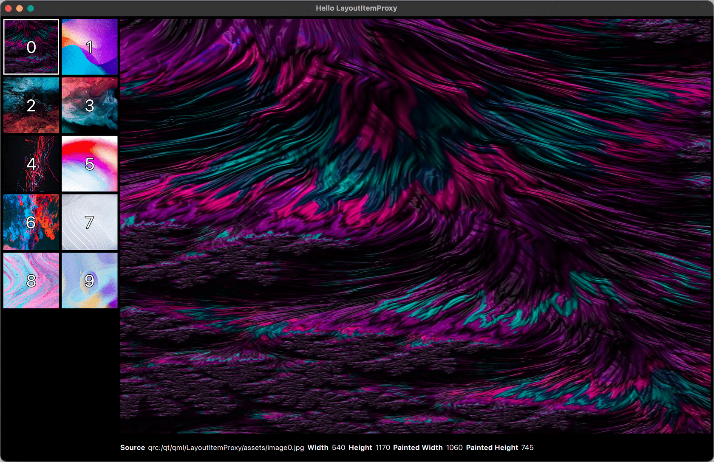</p>

    Для **Desktop Layout** макета рабочего стола мы использовали **RowLayout**, который будет виден только тогда, когда window.isDesktopLayout имеет значение true. Внутри **RowLayout** мы использовали **LayoutItemProxy** для нацеливания на **Flickable**, позволяя отображать его и изменять его размер в макете.

    Мы добавили вложенный **ColumnLayout** внутри **RowLayout** для размещения **previewImage** и деталей изображения (меток). Каждый элемент, такой как **previewImage** и метки, был обернут в **LayoutItemProxy**, что позволило повторно использовать одни и те же элементы в разных макетах.

    Мы установили **Layout.fillWidth** и **Layout.fillHeight** для **previewImage**, чтобы гарантировать, что он заполнит доступное пространство. Для меток мы использовали **RowLayout** с минимальной высотой для отображения деталей изображения под изображением предварительного просмотра.

- Шаг 4: Создание макета планшета

    <p align="center">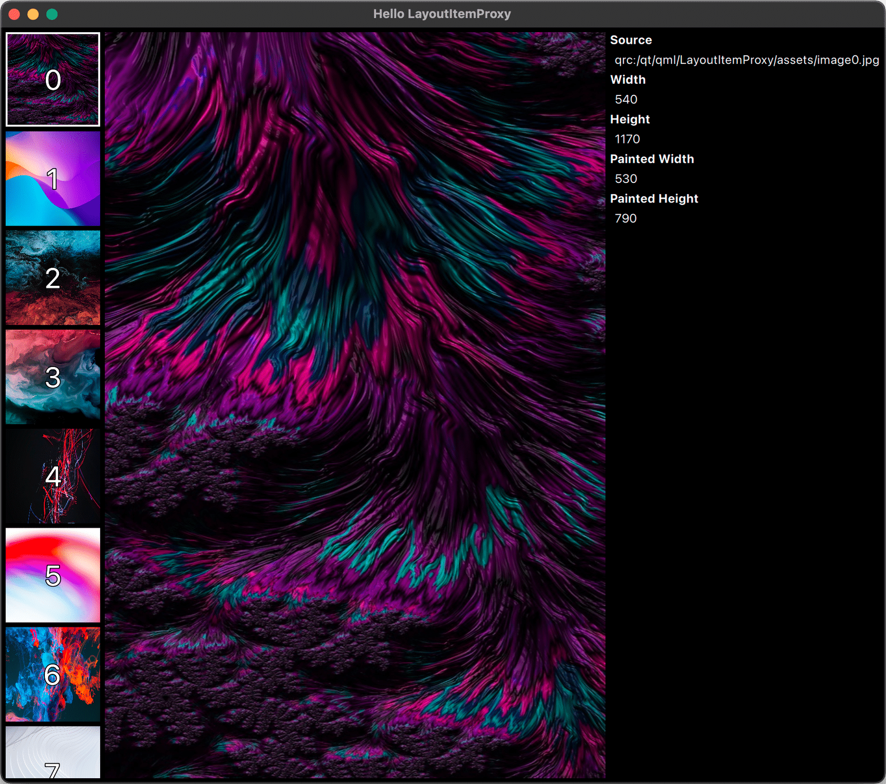</p>

    Мы продублировали **Desktop Layout** макет рабочего стола и изменили его, чтобы создать **Tablet Layout** макет планшета, который будет виден только при значении **window.isTabletLayout** true. В этом макете мы скорректировали расположение, чтобы оно соответствовало более узкому экрану. В частности, мы вывели **previewImage** из **ColumnLayout** и поместили его непосредственно внутри родительского **RowLayout**. Это гарантировало, что детали изображения будут отображаться справа от изображения предварительного просмотра.

    Мы также обновили макет, удалив внутренний **RowLayout**, окружающий метки, и выровняли **ColumnLayout** по верху родительского **RowLayout** с помощью **Layout.alignment: Qt.AlignTop**.

- Шаг 5: Создание мобильного макета

    <p align="center">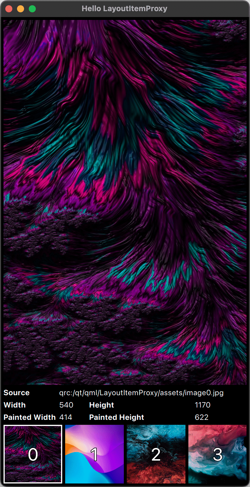</p>

    Наконец, мы создали **Mobile Layout**, который будет виден только тогда, когда window.isMobileLayout имеет значение true. Для размера мобильного экрана мы использовали **ColumnLayout**. **PreviewImage** был помещен вверху, за ним следовал **GridLayout**, содержащий все детали изображения.

    Мы установили **GridLayout** с четырьмя столбцами, что обеспечивает компактный и эффективный макет. Кроме того, мы установили **Layout.columnSpan** для исходного URL-адреса, чтобы он охватывал три столбца, поскольку текст URL-адреса будет значительно длиннее других деталей.

    Мы поместили компонент **Flickable** в нижнюю часть **ColumnLayout** и обеспечили, чтобы он заполнял доступную ширину. Мы также установили **preferredHeight**, чтобы он соответствовал высоте **GridLayout**, чтобы обеспечить связный макет.

### Репозиторий проекта: наш прогресс на данный момент

> **Репозиторий проекта**
>
> Чтобы изучить пример проекта, перейдите к **'04-LayoutItemProxy'** в репозитории проекта. Вы можете открыть проект, перейдя к **CMakeLists.txt** в Qt Creator.
>
> [Ссылка на GitHub](https://github.com/qt-learning/QML-Positioners-And-Layouts)

Теперь посмотрим, чему вы научились!

---

[Перейти к содержанию](#содержание)

[<p align="center"></p>](../README.md "На главную")
