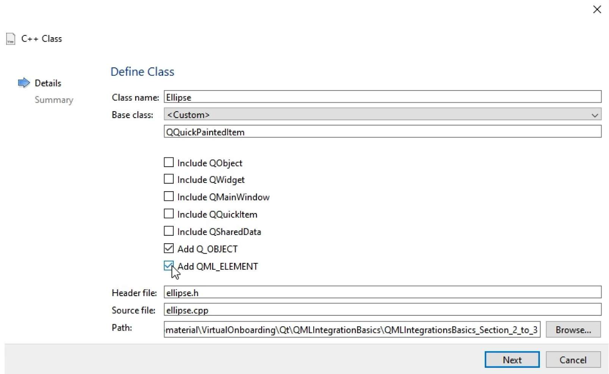
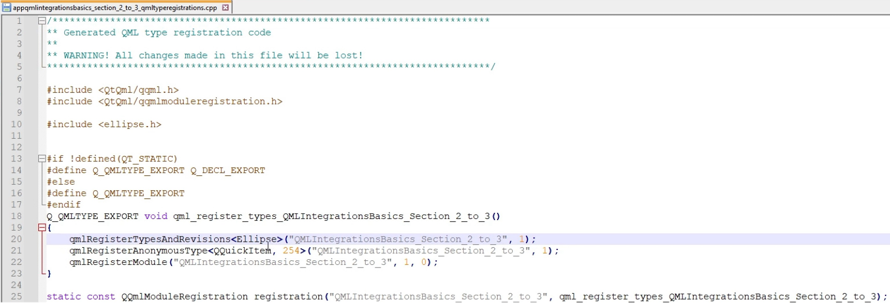
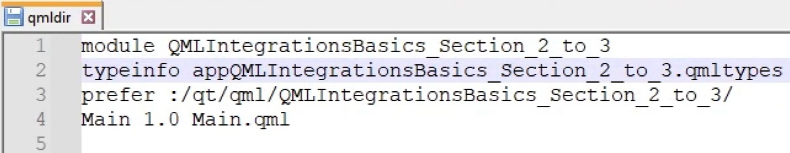
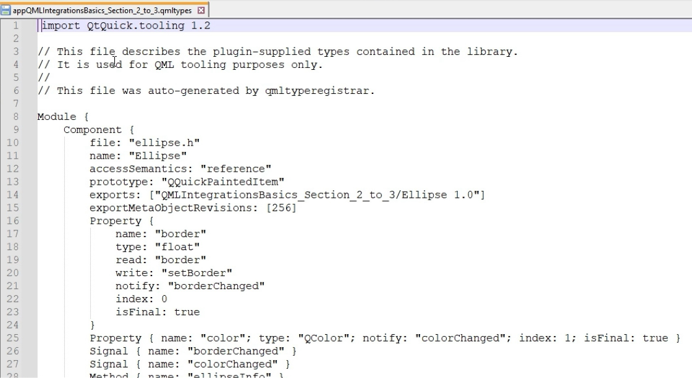
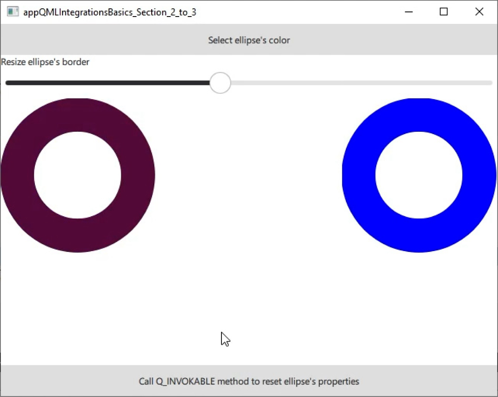

[<p align="center"></p>](../README.md "На главную")

# Основы интеграции QML

## Содержание:

- [Основы интеграции QML](#основы-интеграции-qml)
  - [Содержание:](#содержание)
- [Урок 1: Введение в основы интеграции QML](#урок-1-введение-в-основы-интеграции-qml)
  - [Обзор](#обзор)
  - [Чему я научусь?](#чему-я-научусь)
  - [Обзор интеграции QML](#обзор-интеграции-qml)
- [Урок 2: Создание пользовательских типов QML, определенных классами C++](#урок-2-создание-пользовательских-типов-qml-определенных-классами-c)
  - [Создание пользовательских типов QML, определенных классами C++](#создание-пользовательских-типов-qml-определенных-классами-c)
    - [Резюме: Создание пользовательских типов QML, определенных классами C++](#резюме-создание-пользовательских-типов-qml-определенных-классами-c)
- [Урок 3: Регистрация через QML-модули](#урок-3-регистрация-через-qml-модули)
  - [Регистрация классов C++ через модули QML](#регистрация-классов-c-через-модули-qml)
    - [Резюме: Регистрация классов C++ через модули QML](#резюме-регистрация-классов-c-через-модули-qml)
- [Урок 4: Использование зарегистрированных типов в QML](#урок-4-использование-зарегистрированных-типов-в-qml)
  - [Использование зарегистрированных типов в QML](#использование-зарегистрированных-типов-в-qml)
    - [Резюме: использование зарегистрированных типов в QML](#резюме-использование-зарегистрированных-типов-в-qml)
- [Вопросы](#вопросы)
- [Давайте сделаем краткий обзор того, что вы исследовали!](#давайте-сделаем-краткий-обзор-того-что-вы-исследовали)

---

# Урок 1: Введение в основы интеграции QML

[Перейти к содержанию](#содержание)

[Ссылка на курс](https://academy.qt.io/enrollments/268414778)

## Обзор

🎯 На этом курсе вы получите прочную основу для интеграции C++ с QML для создания приложений Qt. Вы узнаете, как преодолеть разрыв между фронтендом QML и бэкендом C++, что позволит вам использовать сильные стороны обоих языков. К концу этого курса вы будете вооружены навыками создания пользовательских типов QML, регистрации классов C++ в QML и беспрепятственного управления взаимодействием между QML и C++.

🧑‍💻 Этот курс предназначен для людей с некоторыми базовыми знаниями C++ и QML, которые хотят улучшить свои приложения Qt путем интеграции C++ с QML.

👉 Перед началом работы мы рекомендуем быстро освоить курс по модулям QML.

## Чему я научусь?

1. Каковы роли QML и C++ в приложениях Qt?

2. Каковы преимущества объединения QML и C++ в приложениях Qt?

3. Как регистрировать и использовать классы C++, чтобы их можно было использовать в QML?

## Обзор интеграции QML

Типичное приложение [Qt Quick](https://doc.qt.io/qt-6/qmlapplications.html) состоит из двух основных частей:

- Фронт-энд QML, реализующий все операции, связанные с пользовательским интерфейсом.

- Бэк-энд C++ (или Python), реализующий большую часть логики и подключений к внешним ресурсам.

Четкое разделение между фронт-эндом и бэк-эндом выгодно, потому что:

- Это упрощает отладку, поскольку существует четкое разделение обязанностей.

- Это снижает сложность кода фронт-энда. Код QML проще писать, так как он менее многословен, чем C++.

- Это помогает создавать поддерживаемое приложение, поскольку рефакторинг QML проще, чем рефакторинг C++.

- Это может повысить производительность приложения. Выполнение таких задач, как сложные вычисления или обработка данных, в C++ происходит быстрее, чем в QML. Даже если некоторая логика может быть реализована в QML с помощью [JavaScript](https://doc.qt.io/qt-6/qtqml-javascript-expressions.html), рекомендуется, чтобы все или большинство логических операций были написаны в бэкенде C++ приложения.

Кроме того, не все [классы Qt C++](https://doc.qt.io/qt-6/classes.html) имеют эквивалентный [тип QML](https://doc.qt.io/qt-6/qmltypes.html), поэтому использование C++ иногда неизбежно. Например, при использовании Qt API для обработки последовательных портов необходимо использовать C++ API.

Легко представить C++ в QML через создание модулей QML.

В этом курсе мы сосредоточимся на модулях QML, определенных с исходными кодами C++ и QML. Мы будем использовать модули для регистрации классов C++ как типов QML. Компоненты нового типа могут быть созданы из QML, как и любой другой компонент QML. Это первый метод представления C++ в QML. Другие методы доступны и описаны в промежуточных и продвинутых курсах по интеграции QML.

---

# Урок 2: Создание пользовательских типов QML, определенных классами C++

[Перейти к содержанию](#содержание)

Чтобы зарегистрировать класс C++ как новый тип объекта QML, класс должен наследоваться от [QObject](https://doc.qt.io/qt-6/qobject.html) и содержать макрос [Q_OBJECT](https://doc.qt.io/qt-6/qobject.html#Q_OBJECT).

Если это сделано, единственное изменение, необходимое для того, чтобы сделать класс C++ доступным в QML, — это добавить макрос [QML_ELEMENT](https://doc.qt.io/qt-6/qqmlengine.html#QML_ELEMENT) под макросом **Q_OBJECT**. Класс C++ определен как тип объекта QML, поэтому имя класса должно начинаться с заглавной буквы. Если это не так или если тип QML должен иметь другое имя, чем класс C++, можно использовать [QML_NAMED_ELEMENT](https://doc.qt.io/qt-6/qqmlengine.html#QML_NAMED_ELEMENT) вместо **QML_ELEMENT**. Он ведет себя так же, как **QML_ELEMENT**, за исключением того, что имя типа явно указано в качестве аргумента. Это имя будет использоваться при создании экземпляра объекта в QML.

Не все члены или методы представлены в QML по умолчанию. Все сигналы и публичные слоты, определенные в классе C++, доступны в QML, но стандартные методы и члены не раскрываются автоматически.

Чтобы раскрыть публичные методы, не являющиеся слотами, в QML, достаточно вставить макрос [Q_INVOKABLE](https://doc.qt.io/qt-6/qobject.html#Q_INVOKABLE) перед возвращаемым типом этого метода. Этот макрос позволяет вызывать метод через систему метаобъектов.

```
#include <QQmlEngine>
```

Чтобы раскрыть переменную-член, свойство должно быть указано с помощью макроса [Q_PROPERTY](https://doc.qt.io/qt-6/qobject.html#Q_PROPERTY). Свойство должно иметь тип, имя и связанную функцию чтения или связанную переменную-член.

При желании свойство также может быть доступным для записи в QML. В этом случае ему необходим сигнал уведомления, чтобы разрешить привязки свойств QML. Свойство должно иметь тип и заголовок, который будет использоваться в качестве заголовка свойства в QML.

Свойства определяются с помощью набора ссылок на функции и методы, такие как:

<details>
<summary><b>READ (ЧИТАТЬ)</b></summary>

Функция получения для переменной свойства.

</details>

<details>
<summary><b>WRITE (ЗАПИСАТЬ)</b></summary>

Функция установки для переменной свойства. Если **MEMBER** не используется, необходимо использовать **WRITE**, чтобы сделать свойство доступным для записи.

</details>

<details>
<summary><b>NOTIFY (УВЕДОМИТЬ)</b></summary>

Сигнал, который будет отправлен при изменении свойства.

</details>

<details>
<summary><b>MEMBER (ЧЛЕН)</b></summary>

Переменная класса, используемая для хранения свойства.

</details>

Приведенные ниже фрагменты показывают, как определить свойство в C++ и использовать его в QML:

ellipse.h:
```
Q_PROPERTY(float border READ border WRITE setBorder NOTIFY borderChanged FINAL) 
Q_PROPERTY(QColor color MEMBER m_color NOTIFY colorChanged FINAL) 

public: 
    float border() const; 
    void setBorder(float newBorder); 

signals: 
    void colorChanged(); 
    void borderChanged(); 

private: 
    QColor m_color;
    float m_border; 
```

mian.qml:
```
Ellipse { 
    color: "blue" 
    border: slider.value 
} 
```

## Создание пользовательских типов QML, определенных классами C++

> **Репозиторий проекта**
>
> Загрузите файлы проекта из репозитория git с помощью кнопки справа и перейдите к **'QMLIntegrationsBasics_Section_2_to_3'**. Вы можете открыть проект, перейдя к **CMakeLists.txt** в Qt Creator.
>
> [Ссылка на GitHub](https://github.com/qt-learning/QML-Integration-Basics)

[](https://d3pg1c2bhy6429.cloudfront.net/114478/h9-h6RewNYR9yZiyNcHYR-tfhJirizbHSkozKBge/scormcontent/assets/01-Creating-Custom-Types-Final.mp4?v=1)

<details>
<summary><b>Расшифровка видео</b></summary>

В этом видео мы покажем, как создать класс C++, который можно использовать как новый тип QML, и как зарегистрировать его методы и атрибуты в QML. Мы создадим новый тип Ellipse, который будет использоваться для рисования эллипсов. Мы будем использовать тип Ellipse так же, как мы могли бы использовать стандартный тип Rectangle, но определим Ellipse из класса C++.

Чтобы упростить код C++, показанный в этом примере, мы будем использовать QQuickPaintedItem в качестве базового класса нашего класса Ellipse, а не QQuickItem. Важно знать об ограничениях производительности QQuickPaintedItem. В частности, мы будем использовать цель рендеринга по умолчанию и рисовать в изображении с помощью движка растровой отрисовки. Содержимое изображения необходимо впоследствии загрузить в графическую память, что может быть медленным для больших элементов. Но для этого примера, где мы просто демонстрируем принципы предоставления класса QML, это будет нормально.

Мы начнем с приложения QML, которое состоит из пустого окна. Сначала мы создадим наш класс C++, который в конечном итоге будет представлен QML. Итак, мы щелкнем правой кнопкой мыши на «Исходные файлы» и нажмем «Добавить новый…». Отсюда мы выберем «Класс C++» и нажмем «Выбрать».

На следующем экране мы укажем имя класса, назвав его Ellipse. Мы также установим базовый класс как QQuickPaintedItem и подтвердим, что отмечены флажки Добавить Q_OBJECT и Добавить QML_ELEMENT. Q_OBJECT необходим для использования функций QObject, таких как сигналы и слоты. QML_ELEMENT — это макрос, используемый для маркировки класса для регистрации в QML. Оба макроса можно добавить вручную, но Qt Creator автоматизирует процесс.

Наконец, мы попадаем на страницу сводки, на которой будет подведен итог того, что будет создано и где. Здесь ничего не нужно менять, поэтому мы нажмем «Готово».

После этого мы можем начать наполнять наш класс. Итак, мы перейдем к ellipse.h. Первое, что мы можем подтвердить, это то, что макросы Q_OBJECT и QML_ELEMENT написаны так, чтобы наш класс объектов мог быть правильно зарегистрирован в QML.

Мы добавим два свойства в наш класс. Первое будет называться border, которое будет представлять ширину границы эллипса, а второе будет цветом эллипса. Этих двух свойств будет достаточно для нашего примера. QQuickPaintedItem наследуется от QQuickItem, поэтому у него уже есть геометрические свойства, такие как ширина, высота, x и y.

Чтобы определить свойство, которое можно использовать в QML, мы используем макрос Q_PROPERTY. Наше первое свойство будет иметь тип float, оно будет называться border. Оно будет иметь функцию-геттер border, используемую для чтения значения свойства, функцию-сеттер setBorder, используемую для установки значения свойства, и сигнал уведомления borderChanged, который выдается при изменении значения свойства. Этот сигнал уведомления необходим для информирования об изменении свойства и, следовательно, для включения привязки свойств в QML. Мы также отметим свойство как FINAL, сообщив компилятору, что его нельзя переопределить подклассами.

Аналогичным образом мы определим второе свойство типа QColor с именем color. Вместо использования ключевых слов READ и WRITE мы будем использовать MEMBER. Это указывает на переменную-член для сохранения значения свойства. Это свойство также будет иметь сигнал уведомления и будет окончательным.

Затем мы щелкнем правой кнопкой мыши по объявлению свойства border и выберем рефакторинг для генерации отсутствующих членов Q_PROPERTY. Это сгенерирует методы setter и getter, объявление сигнала уведомления и частную переменную m_border. В ellipse.cpp мы можем подтвердить, что setter и getter определены правильно. В частности, мы должны выдать сигнал уведомления, когда в setter устанавливается новое значение border. Мы выполним тот же процесс рефакторинга для свойства color.

Далее мы определим функцию, которую можно вызвать в QML. Она будет использоваться для сброса начальных значений свойств эллипса. В общедоступном разделе ellipse.h мы объявим функцию setProperties. У нее будет два аргумента: float для нового значения border и QColor для нового значения цвета, и она вернет void. Чтобы иметь возможность вызывать эту функцию в QML, мы должны пометить ее как Q_INVOKABLE и добавить макрос перед объявлением метода.

Мы щелкнем правой кнопкой мыши по объявлению функции, выберем refactor и добавим определение в ellipse.cpp. В этой функции мы начнем с вызова сеттера свойства border. Поскольку у нас нет сеттера для цвета, мы просто проверим, отличается ли новый цвет от значения m_color с помощью оператора if. Если это так, мы назначим новое значение цвета m_color и выдадим сигнал уведомления, чтобы сообщить, что значение цвета изменилось.

Другой способ зарегистрировать функции, которые могут быть вызваны в QML, — это пометить их как слоты. Таким образом, эти функции также можно будет подключить к сигналам в QML или C++. Сначала мы объявим публичный слот для получения информации о свойствах эллипса. Мы добавим определение в ellipse.cpp. В этой функции мы просто используем qInfo() для регистрации значений m_color и m_border.

Возвращаясь в ellipse.h, мы определим второй слот с именем onPropertyChanged. Мы используем функцию рефакторинга, чтобы добавить его определение в ellipse.cpp. Цель этого слота — вызвать функцию update() для перерисовки объекта при обновлении свойства. Поэтому нам также нужно будет подключить сигналы уведомления наших свойств к этому слоту. Мы добавим два вызова connect() в конструктор Ellipse. Каждый раз, когда изменяется граница или значение цвета, будет вызываться слот onPropertyChanged.

Наконец, нам нужно определить виртуальную функцию paint(), которая будет вызываться при update(). В ellipse.h мы щелкнем правой кнопкой мыши на QQuickPaintedItem, выберем Refactor и Insert Virtual Function. Мы отметим paint() и нажмем OK. Для этого нам понадобится использовать QPainter, поэтому мы включим класс QPainter в наш заголовочный файл. Мы добавим определение функции в ellipse.cpp. В этой функции мы создадим QPen, цвет которого m_color и ширина m_border. Затем мы установим его в качестве пера для нашего художника и установим сглаживание на true. Наконец, мы нарисуем наш эллипс в прямоугольнике, который будет иметь ширину и высоту эллипса.

Наш класс теперь реализован, поэтому мы можем сохранить его. В следующем видео мы увидим, как зарегистрировать его в QML через модуль QML.

Спасибо за просмотр.

</details>

### Резюме: Создание пользовательских типов QML, определенных классами C++

- Шаг 1: Автоматически сгенерировать отсутствующие элементы Q_PROPERTY

    <p align="center"></p>

    Мы начали с приложения QML, состоящего из пустого окна. Мы создали новый класс C++ с именем **Ellipse**, установив **QQuickPaintedItem** в качестве базового класса и обеспечив включение макросов **Q_OBJECT** и **QML_ELEMENT**. Такая настройка позволяет нашему классу быть правильно зарегистрированным в QML.

- Шаг 2: Добавление свойств

    ```
    Q_PROPERTY(float border READ border WRITE setBorder NOTIFY borderChanged FINAL)
    Q_PROPERTY(QColor color MEMBER m_color NOTIFY colorChanged FINAL)
    ```

    В ellipse.h мы добавили два свойства: **border** (ширина границы эллипса) и **color** (цвет эллипса). Эти свойства были определены с помощью макроса **Q_PROPERTY**, что сделало их доступными в QML. Свойство **border** использовало функции доступа **READ** и **WRITE**, тогда как свойство **color** использовало ключевое слово **MEMBER** для прямой ссылки на переменную-член.

- Шаг 3: Реализация геттера, сеттера и сигналов

    ```
    float border() const;
    void setBorder(float newBorder);

    signals:
        void borderChanged();
        void colorChanged();

    private:
        float m_border;
        QColor m_color;
    ```

    ```
    float Ellipse::border() const
    {
        return m_border;
    }

    void Ellipse::setBorder(float newBorder)
    {
        if (m_border == newBorder)
            return;

        m_border = newBorder;
        emit borderChanged();
    }
    ```

    Мы сгенерировали необходимые геттер, сеттер и сигналы для свойства border и подтвердили их правильное определение в **ellipse.cpp**. Метод сеттера испускал сигнал при установке нового значения.

- Шаг 4: Определение вызываемых функций QML

    ```
    Q_INVOKABLE void setProperties(float newBorder, QColor newColor);
    ```

    ```
    void Ellipse::setProperties(float newBorder, QColor newColor)
    {
        setBorder(newBorder);

        if (m_color != newColor) {
            m_color = newColor;
            emit colorChanged();
        }
    }
    ```

    Мы объявили функцию для сброса начальных значений свойств эллипса, сделав ее вызываемой в QML, обозначив ее как **Q_INVOKABLE**. Эта функция **setProperties()** была определена в **ellipse.cpp**, обновляя свойства и испуская сигналы по мере необходимости.

- Шаг 5: Добавление слотов

    ```
    public slots:
        void ellipseInfo();
        void onPropertyChanged();
    ```

    ```
    void Ellipse::ellipseInfo()
    {
        qInfo() << QString("Ellipse's color: %1 - Ellipse's border: %2")
                .arg(m_color.name())
                .arg(m_border);
    }

    void Ellipse::onPropertyChanged()
    {
        update();
    }
    ```

    Мы объявили публичные слоты для получения информации о свойствах **ellipseInfo()** и обработки изменений свойств **onPropertyChanged()**. В **ellipseInfo()** мы регистрировали значения **m_color** и **m_border** с помощью **qInfo()**. В **onPropertyChanged()** мы вызывали функцию **update()** для перерисовки объекта при обновлении свойства.

- Шаг 6: Подключение сигналов к слотам

    ```
    Ellipse::Ellipse(QQuickItem *parent)
    : QQuickPaintedItem(parent)
    {
        connect(this, &Ellipse::borderChanged, this, &Ellipse::onPropertyChanged);
        connect(this, &Ellipse::colorChanged, this, &Ellipse::onPropertyChanged);
    }
    ```

    В конструкторе **Ellipse** мы подключили сигналы свойств к слоту **onPropertyChanged**. Это гарантировало, что изменения **border** границы или **color** цвета вызовут перерисовку.

- Шаг 7: Реализация функции рисования

    ```
    void Ellipse::paint(QPainter *painter)
    {
        QPen pen(m_color, m_border);
        painter->setPen(pen);
        painter->setRenderHints(QPainter::Antialiasing, true);
        painter->drawEllipse(QRect(m_border / 2, m_border / 2, 
                            width() - m_border, 
                            height() - m_border));
    }
    ```

    Мы определили виртуальную функцию **paint()**, используя **QPainter** для рисования эллипса. Мы настроили **QPen** с **color** цветом эллипса и шириной **border** границы, включили сглаживание и нарисовали эллипс внутри прямоугольника, соответствующего размерам эллипса.

Далее мы рассмотрим, как использовать модули QML для регистрации классов C++.

---

# Урок 3: Регистрация через QML-модули

Рекомендуется инкапсулировать классы C++, зарегистрированные в QML, в модуль [QML](https://doc.qt.io/qt-6/qtqml-modules-topic.html), созданный с помощью функции [qt_add_qml_module()](https://doc.qt.io/qt-6/qt-add-qml-module.html). Это позволяет легко регистрировать классы C++ в QML. Модуль QML состоит из набора версионных типов QML, файлов JavaScript, исходных кодов C++ и ресурсов, инкапсулированных в пространстве имен, также называемом идентификатором модуля (**URI**).

Модули QML и функция **qt_add_qml_module()** более подробно рассматриваются в курсе по модулям QML. Для интеграции QML нам нужно знать, что следует использовать **qt_add_qml_module()**, поскольку в дополнение к созданию модуля он генерирует файл [qmltypes](https://doc.qt.io/qt-6/qtqml-modules-qmldir.html#type-description-files), который информирует инструментарий о классах C++, зарегистрированных в QML.

Файлы C++, определяющие классы, представленные QML, указываются с помощью параметра **SOURCES** макроса **qt_add_qml_module()**. Файлы, определяющие класс, используемый для интеграции с макросом **QML_ELEMENT**, должны быть перечислены как **SOURCES**.

Вызов **qt_add_qml_module()**, который включен в **файл CMakeLists.txt** и будет выглядеть следующим образом:

```
qt_add_qml_module(appQMLIntegrationsBasics_Section4 
    URI QMLIntegrationsBasics_Section4 
    VERSION 1.0 
    QML_FILES 
        Main.qml 
    SOURCES 
        ellipse.h 
        ellipse.cpp 
) 
```

Использование модулей и макросов QML делает процесс регистрации простым и автоматическим. Чтобы использовать зарегистрированные типы модуля, необходимо добавить оператор импорта, содержащий **URI**, определенный в файле **CMakeLists.txt**, в начало документа QML, который использует класс C++.

## Регистрация классов C++ через модули QML

> **Репозиторий проекта**
>
> Загрузите файлы проекта из репозитория git с помощью кнопки справа и перейдите к **'QMLIntegrationsBasics_Section_2_to_3'**. Вы можете открыть проект, перейдя к **CMakeLists.txt** в Qt Creator.
>
> [Ссылка на GitHub](https://github.com/qt-learning/QML-Integration-Basics)

[](https://d3pg1c2bhy6429.cloudfront.net/114478/h9-h6RewNYR9yZiyNcHYR-tfhJirizbHSkozKBge/scormcontent/assets/02-Module-Registration-Final.mp4?v=1)

<details>
<summary><b>Расшифровка видео</b></summary>

В этом видео мы продолжим объяснение интеграции C++ в QML и сосредоточимся на регистрации класса C++, который мы создали ранее в QML с помощью функции CMake.

Когда мы создали класс C++ в предыдущем видео, Qt Creator автоматически добавил некоторый код в CMakeLists.txt. Давайте сейчас рассмотрим этот код.

В CMakeLists.txt нас интересует для регистрации функция qt_add_qml_module(). Это связано с тем, что рекомендуемый способ регистрации классов C++ в QML — включение их в модуль QML. Мы не будем подробно рассматривать эту функцию здесь, поскольку модули QML более подробно описаны в курсе о модулях QML.

Здесь мы сосредоточимся только на той части, которая используется функцией для регистрации в QML. Это делается в параметре SOURCES. После SOURCES мы перечисляем все файлы C++, которые используются в качестве источников для классов, подлежащих регистрации в QML. Здесь у нас есть ellipse.h и ellipse.cpp, которые были добавлены Qt Creator, поэтому нам не нужно ничего больше писать. Нам нужно только понимать, что исходники C++ должны быть перечислены после SOURCES в вызове qt_add_qml_module().

Это запустит процесс регистрации во время сборки. Чтобы продемонстрировать это, давайте запустим CMake и соберем наше приложение сейчас.

Перейдя в корень нашей папки сборки, мы увидим, что мы сгенерировали файл qmltyperegistrations.cpp. Давайте откроем его. Мы видим, что у нас здесь есть вызов функций регистрации. Нам не нужно ничего здесь изменять. Это просто для того, чтобы показать, какие файлы были сгенерированы, и продемонстрировать, как автоматизируется и упрощается регистрация при использовании qt_add_qml_module().

Говоря о модулях, у нас также есть сгенерированные файлы qmldir и qmltypes. Qmldir определяет модули QML и ссылается на qmltypes для класса C++, который должен распознавать QML. Qmltypes является необязательным и используется Qt Creator для распознавания зарегистрированных типов. Если мы откроем его, то увидим наш класс с его методами и свойствами, описанными здесь. Поэтому Qt Creator распознает его и предоставит синтаксические проверки, автодополнения кода и другие полезные функции.

Мы подтвердили, что наш класс C++ зарегистрирован как тип QML, поэтому мы можем перейти к следующей части, которая будет посвящена использованию нового типа в QML. Это будет темой следующего видео.

Спасибо за просмотр.

</details>

### Резюме: Регистрация классов C++ через модули QML

- Шаг 1: Использование qt_add_qml_module()

    ```
    qt_add_qml_module(appQMLIntegrationsBasics_Section_2_to_3
        URI QMLIntegrationsBasics_Section_2_to_3
        VERSION 1.0
        QML_FILES
            Main.qml
        SOURCES
            ellipse.h
            ellipse.cpp
    )
    ```

    Ключевая функция в CMakeLists.txt для регистрации нашего класса C++ в QML — **qt_add_qml_module()**. Эта функция используется для включения классов C++ в модуль QML, что является рекомендуемым методом регистрации. В этом вызове опция **SOURCES** перечисляет все файлы C++, которые используются в качестве источников для классов, регистрируемых в QML. Здесь **ellipse.h** и **ellipse.cpp** были автоматически добавлены Qt Creator, поэтому никаких дополнительных записей не потребовалось.

- Шаг 2: qmltyperegistrations.cpp

    <p align="center"></p>

    После запуска CMake и сборки нашего приложения мы перешли в корень папки сборки и нашли файл **qmltyperegistrations.cpp**. Этот файл был автоматически сгенерирован и содержал вызовы функций регистрации. Нам не нужно было ничего изменять в этом файле, так как он был предназначен исключительно для демонстрации автоматизации процесса регистрации.

- Шаг 3: qmldir

    Другим важным сгенерированным файлом был qmldir. Этот файл определяет модуль QML и его компоненты. По сути, он сообщает движку QML, чего ожидать от модуля:

    <p align="center"></p>

- Шаг 4: Подтверждение регистрации

    <p align="center"></p>

    Файл **qmltypes** очень полезен, поскольку он позволяет Qt Creator распознавать зарегистрированные типы и предоставлять такие функции, как автодополнение кода и синтетические проверки. Мы открыли этот файл и увидели описание нашего класса вместе с его методами и свойствами.

Далее мы рассмотрим использование зарегистрированных типов в QML.

---

# Урок 4: Использование зарегистрированных типов в QML

После регистрации класса C++ с помощью **QML_ELEMENT** и **qt_add_qml_module()** он будет доступен как тип QML. Экземпляры типа могут быть созданы как любой другой компонент QML в любом документе QML, содержащем импорт в модуль.

```
import QtQuick.Controls
import QMLIntegrationsBasics_Section4 

ApplicationWindow { 
    Ellipse {}
}
```

Сигналы, слоты, вызываемые методы и свойства, определенные в классе C++, доступны так же, как и в любом другом компоненте QML.

```
Ellipse { 
  color: "blue" //property 
  border: slider.value //property 

  Component.onCompleted: function() { 
    setProperties(25, “blue”) //Q_INVOKABLE call 
    colorChanged () // signal call 
    ellipseInfo() //slot call 
  }
} 
```

Кроме того, можно создать соединение с сигналами, определенными в классе C++, создав обработчик сигналов, имя которого начинается с заглавной буквы и имеет префикс «**on**».

```
Ellipse { 
    onColorChanged: function() { ellipseInfo() } //signal hander 
} 
```

## Использование зарегистрированных типов в QML

> **Репозиторий проекта**
>
> Загрузите файлы проекта из репозитория git с помощью кнопки справа и перейдите к **'QMLIntegrationsBasics_Section_4'**. Вы можете открыть проект, перейдя к **CMakeLists.txt** в Qt Creator.
>
> [Ссылка на GitHub](https://github.com/qt-learning/QML-Integration-Basics)

[](https://d3pg1c2bhy6429.cloudfront.net/114478/h9-h6RewNYR9yZiyNcHYR-tfhJirizbHSkozKBge/scormcontent/assets/03-Using-Registered-Types-Final.mp4?v=1)

<details>
<summary><b>Расшифровка видео</b></summary>

В этом видео мы покажем, как использовать зарегистрированный класс C++ в качестве типа QML. Начнем с кода, который мы написали в предыдущих видео.

Теперь мы определим наш пользовательский интерфейс и включим в него эллипс, поэтому откроем наш Main.qml.

Сначала мы импортируем модули, которые будем использовать. Мы импортируем Qt Quick. Затем, поскольку мы будем использовать диалоговое окно цвета для выбора цвета нашего эллипса, мы импортируем модуль Qt Quick Dialogs. Мы также будем использовать элементы управления для взаимодействия с пользовательским интерфейсом, поэтому мы импортируем Qt Quick Controls в стиле Basic. Наконец, мы импортируем модуль, содержащий наш тип эллипса, как определено в нашем файле CMakeLists.txt.

Корневым элементом нашего пользовательского интерфейса будет окно приложения. Использование окна приложения позволяет нам определить верхний и нижний колонтитулы для нашего окна. Нижний колонтитул будет кнопкой, используемой для сброса свойств нашего эллипса. После этого мы определим обработчик сигнала onClicked().

Наш заголовок будет столбцом, содержащим несколько элементов управления:

Во-первых, кнопка для открытия диалогового окна цвета.

Затем, метка, информирующая пользователя о назначении ползунка.

И, наконец, ползунок, который будет использоваться для изменения размера границы эллипса. Начальное значение будет 25.

Далее мы определим основную часть нашего пользовательского интерфейса, которая будет эллипсом. Он будет центрирован в окне, а его значение границы будет привязано к значению ползунка. Его начальный цвет будет синим. Мы хотим использовать информацию слота эллипса. Для этого мы определим сигнал onColorChanged. Таким образом, слот ellipseInfo будет вызываться каждый раз, когда испускается сигнал colorChanged.

Мы вернемся к нашей реализации ползунка, чтобы установить его значение from на 0, а его значение to на половину минимального размера эллипса. Мы также вернемся к нашей кнопке в нижнем колонтитуле. При нажатии кнопки мы установим значение ползунка на 25 и используем функцию setProperties ellipse для сброса начальных свойств эллипса. Эту функцию можно вызвать, поскольку она помечена как Q_INVOKABLE в C++.

Чтобы закончить, мы создадим диалоговое окно цвета для выбора нового цвета для эллипса. Первоначальным выбранным цветом диалогового окна будет цвет эллипса. Когда пользователь выберет цвет из диалогового окна, он будет назначен эллипсу. В заголовке мы добавим обработчик сигнала для открытия диалогового окна цвета при нажатии кнопки.

Теперь наш код готов. Давайте соберем и запустим наше приложение. Мы видим, что у нас есть эллипс, нарисованный синим цветом, и ширина границы составляет 25. Мы можем изменить его размер с помощью ползунка. Мы можем выбрать новый цвет для эллипса с помощью диалогового окна цвета. При этом мы можем подтвердить, что информация об эллипсе зарегистрирована. Наконец, мы можем вызвать вызываемый метод и сбросить начальные значения свойств эллипса.

Поскольку эллипс зарегистрирован как QML_ELEMENT, мы можем создать несколько его экземпляров, как и любой другой стандартный объект QML, пока мы импортируем модуль. Например, давайте создадим второй эллипс. Мы сохраним первый эллипс, но привяжем его к левой стороне окна. Затем мы определим второй эллипс, который имеет те же свойства, что и первый, но привязан к правой стороне окна.

Когда мы запускаем наше приложение, мы можем подтвердить, что два эллипса созданы. Мы можем изменить размер границы двух эллипсов, поскольку они привязаны к значению ползунка. Однако изменение цвета в диалоговом окне влияет только на первый эллипс, поскольку мы ссылаемся только на первый эллипс с его идентификатором в реализации ColorDialog.

На этом наши видео о базовой интеграции QML завершаются. Спасибо за просмотр.

</details>

### Резюме: использование зарегистрированных типов в QML

- Шаг 1: Настройка Main.qml

    Сначала мы импортировали необходимые модули:
    
    ```
    import QtQuick
    import QtQuick.Dialogs
    import QtQuick.Controls.Basic
    import QMLIntegrationsBasics_Section4
    ```

    Мы начали с настройки нашего пользовательского интерфейса, чтобы включить эллипс, начиная с файла Main.qml.

- Шаг 2: Определение ApplicationWindow

    Сначала мы импортировали необходимые модули:
    
    ```
    ApplicationWindow {
        width: 640
        height: 480
        visible: true
        
        footer: Button {
            text: qsTr("Call Q_INVOKABLE method to reset ellipse's properties")
            onClicked: function() {
                slider.value = 25
                ellipse.setProperties(slider.value, "blue")
            }
        }

        header: Column {
            width: parent.width
        
            Button {
                width: parent.width
                text: qsTr("Select ellipse's color")
                onClicked: function() { colorDialog.open() }
            }
        
            Label {
                width: parent.width
                text: qsTr("Resize ellipse's border")
            }
        
            Slider {
                id: slider
                width: parent.width
                from: 0
                to: Math.min(ellipse.width, ellipse.height) / 2
                value: 25
            }
        }
    }
    ```

    Мы определили корневой элемент нашего пользовательского интерфейса как **ApplicationWindow**. Использование **ApplicationWindow** позволило нам определить **header** заголовок и **footer** нижний колонтитул. **Footer** нижний колонтитул включал **Button** кнопку для сброса свойств нашего эллипса. В заголовке мы добавили **Column** столбец, содержащий несколько элементов управления: **Button** кнопку для открытия диалогового окна для изменения цвета **Ellipse** эллипса и **Slider** ползунок для управления шириной границы.

- Шаг 3: Определение эллипса

    Сначала мы импортировали необходимые модули:
    
    ```
    Ellipse {
        id: ellipse
        anchors.centerIn: parent
        width: 200
        height: 200
        color: "blue"
        border: slider.value
        onColorChanged: function() { ellipseInfo() }
    }
    ```

    Далее мы определили основную часть нашего пользовательского интерфейса: эллипс. Он был отцентрирован в окне, его значение границы было привязано к значению ползунка, а его начальный **color** цвет был установлен на «**синий**».

- Шаг 4: Реализация диалога цвета

    Сначала мы импортировали необходимые модули:
    
    ```
    ColorDialog {
        id: colorDialog
        selectedColor: ellipse.color
        onAccepted: ellipse.color = selectedColor
    }
    ```

    Мы добавили **ColorDialog** для выбора нового цвета для эллипса. Первоначальный выбранный цвет диалога был установлен на текущий цвет эллипса. Когда пользователь выбирал цвет, он назначался **Ellipse** эллипсу. Диалог был подключен к сигналу clicked() нашего заголовка **Button**.

- Шаг 5: Добавление нескольких экземпляров

    Сначала мы импортировали необходимые модули:
    
    <p align="center"></p>

    Поскольку **Ellipse** был зарегистрирован как **QML_ELEMENT**, мы могли создать несколько его экземпляров. Мы сохранили первый **Ellipse**, привязанный к левой стороне окна, и определили второй **Ellipse**, привязанный к правой стороне. Мы могли изменить размер границы обоих эллипсов с помощью ползунка, но изменение **цвета** в диалоговом окне повлияло только на первый эллипс из-за его конкретной ссылки в реализации **ColorDialog**.

---

# Вопросы

<details>
<summary><b>1. Какой макрос используется для маркировки класса C++ для регистрации в QML?</b></summary>

Ответ: QML_ELEMENT

</details>

<details>
<summary><b>2. Какой макрос следует использовать для предоставления открытого метода, не являющегося слотом, в QML?</b></summary>

Ответ: Q_INVOKABLE

</details>

<details>
<summary><b>3. Какой из следующих методов определения свойства в классе C++ можно использовать в QML?</b></summary>

Ответ: Использование макроса Q_PROPERTY с параметрами READ, WRITE и NOTIFY

</details>

<details>
<summary><b>4. Как можно использовать зарегистрированный тип в документе QML?</b></summary>

Ответ: Добавив оператор импорта с URI модуля в файл QML

</details>

<details>
<summary><b>5. Что следует включить в опцию SOURCES функции qt_add_qml_module() при регистрации классов C++ в QML?</b></summary>

Ответ: Исходные файлы C++, определяющие классы, представленные QML

</details>

<details>
<summary><b>6. Что из перечисленного НЕ требуется для определения свойства в классе C++ для использования в QML?</b></summary>

Ответ: Файл QML

</details>

---

# Давайте сделаем краткий обзор того, что вы исследовали!

- **Заключение**

    В этом курсе мы увидели, как предоставить класс C++ для QML для создания нового типа объекта, который можно создать в QML. Наиболее важными инструментами для выполнения такого рода регистрации являются команда CMake **qt_add_qml_module()** и макросы **QML_ELEMENT**/**QML_NAMED_ELEMENT**.

- **Создание пользовательских типов QML, определенных классами C++**

    Используя макрос **Q_OBJECT**, вы можете разрешить вашим классам C++ использовать метаобъектную систему Qt, что позволяет использовать такие функции, как сигналы и слоты. Добавление макроса **QML_ELEMENT** имеет решающее значение для маркировки вашего класса для регистрации в QML, что делает его доступным в QML. Используя макросы **Q_PROPERTY** и **Q_INVOKABLE**, вы можете предоставить свойства и методы в QML.

- **Регистрация через модули QML**

    Используя функцию **qt_add_qml_module()** в **файле CMakeLists.txt**, вы можете создавать модули QML, которые инкапсулируют ваши классы C++ вместе с файлами QML и JavaScript. Файлы, которые определяют класс, используемый для интеграции с макросом **QML_ELEMENT**, должны быть указаны как **SOURCES**.

- **Использование зарегистрированных типов в QML**
    
    Импортируя модули QML, содержащие ваши пользовательские типы с URI, вы можете создавать экземпляры и управлять этими типами так же, как любым стандартным компонентом QML, использовать свойства, вызываемые методы, сигналы и слоты, определенные в ваших классах C++, что позволяет создавать динамические и интерактивные приложения QML.

---

[Перейти к содержанию](#содержание)

[<p align="center"></p>](../README.md "На главную")